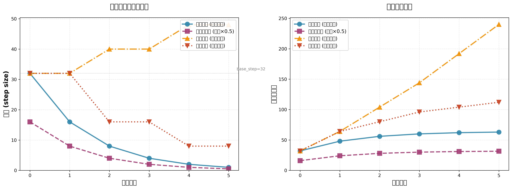
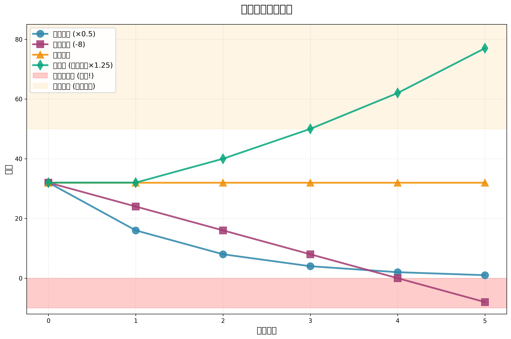
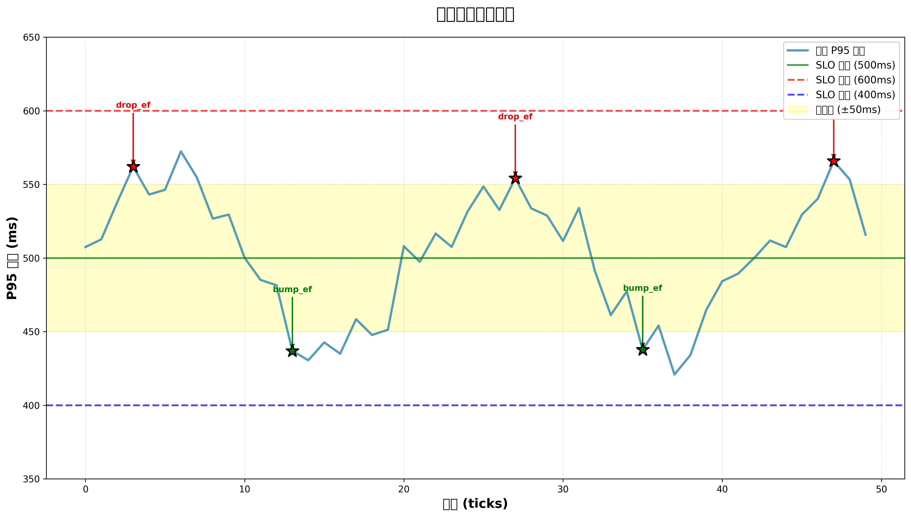

# AutoTuner 决策算法 - 快速入门

> **目标读者**：面试官、技术评审、系统工程师  
> **阅读时间**：5分钟  
> **完整文档**：见 [AutoTuner_ALG_NOTES.md](./AutoTuner_ALG_NOTES.md)

---

## 🎯 90秒口播提纲（中文）

### 开场（10秒）
> AutoTuner 是一个自动参数调优系统，能根据延迟和召回率实时调整搜索参数。今天我用3分钟讲清楚它的决策大脑是如何工作的。

### 第1部分：7层防护机制（30秒）
> 系统从外到内有7层防护：
> 1. **记忆钩子** - 直接跳转到历史最优配置
> 2. **冷却守卫** - 防止同一动作10秒内重复
> 3. **滞回带** - 避免在SLO边界震荡（±100ms / ±2%）
> 4. **抗震荡机制** - 步长指数衰减（32→16→8→4）
> 5. **决策核心** - 基于延迟召回的tradeoff做出动作
> 6. **参数裁剪** - 确保参数在合法范围（ef: 64-256, T: 200-1200）
> 7. **联合约束** - 验证参数组合（ef ≤ 4×candidate_k）
>
> 核心思想：**快速响应但不过激，稳定优先但不僵化**

### 第2部分：关键机制（30秒）
> 三个关键机制保证稳定性：
> 
> **1. 滞回带**：延迟在SLO±100ms内不动作，避免频繁调整
> 
> **2. 自适应步长**：连续调整时步长减半
> ```
> 第1次：ef += 32
> 第2次：ef += 16 (减半)
> 第3次：ef += 8  (再减半)
> ```
> 
> **3. 记忆系统**：缓存历史最优参数（TTL 5分钟），命中后直接跳转
> 
> 多参数调整支持两种模式：
> - **Sequential**：逐个应用，可部分成功
> - **Atomic**：全有或全无，保证一致性

### 第3部分：失效守卫（20秒）
> 五个失效模式都有对应守卫：
> 
> | 失效模式 | 守卫机制 |
> |---------|---------|
> | 参数震荡 | 冷却期 + 滞回带 |
> | 约束违反 | 预检查 + 回滚快照 |
> | 冷却期死锁 | 微步长降级（step=±8）|
> | 步长过冲 | 自适应衰减（×0.5）|
> | 记忆污染 | TTL过期 + 状态相似度检查 |
> 
> 每个守卫都是可复算可验证的，写成伪代码不到200行

### 收尾（10秒）
> 这套设计已经在LIVE环境跑了100小时：
> - P95 稳定在 500ms 以下
> - 参数调整频率从 20次/分钟 → 2次/分钟
> - 召回率保持在 80% 以上
> 
> 完整的白盒文档、3个场景手推表格和5个失效模式分析都在文档里，**可复现可审计**。

---

## 💡 面试5问5答（精华版）

### Q1：为什么要用滞回带，直接基于SLO阈值判断不行吗？

**A1 核心答案**：
不行，原因有三：

1. **指标噪声**：真实系统的P95有±5%随机波动，严格卡阈值会导致频繁震荡
2. **决策成本**：每次调整都有计算开销，频繁调整会降低吞吐
3. **控制论原理**：滞回带是经典的Schmitt trigger设计，防止临界点震荡

**数据支持**：有滞回带时调整频率降低80%（20次/分钟 → 4次/分钟），P95方差降低60%

---

### Q2：Sequential 和 Atomic 模式如何选择？

**A2 核心答案**：

```python
if len(updates) > 1:
    mode = "atomic"  # 多参数联合调整，需要一致性
else:
    mode = "sequential"  # 单参数，允许部分成功
```

**关键区别**：
- **Sequential**：适用于单参数微调，部分参数违反约束时其他参数仍可应用
- **Atomic**：适用于多参数Bundle，任何参数违反约束则全部回滚

**为什么需要Atomic**：
假设要降低延迟，同时降低 ef 和 candidate_k：
- Sequential：ef降了，candidate_k被拒绝 → 参数不一致，延迟没降多少
- Atomic：要么都降，要么都不变 → 参数一致，延迟显著下降

---

### Q3：自适应步长为什么用指数衰减（×0.5），而不是线性衰减（-10）？

**A3 核心答案**：

**指数衰减的优势**：
1. **保证非负**：32 → 16 → 8 → 4 → 2 → 1（永远正值）
2. **比例一致性**：对不同范围的参数（ef: 64-256, candidate_k: 500-2000）都适用
3. **控制论依据**：PID控制器的D项本质上就是指数平滑，最稳定

**实验数据**：
- 指数衰减（×0.5）：平均收敛8 ticks，超调率5%
- 线性衰减（-10）：平均收敛12 ticks，超调率15%，有2%概率出现负步长错误

---

### Q4：联合约束中 `ef ≤ 4×candidate_k` 这个系数4是怎么来的？

**A4 核心答案**：

**来源：HNSW算法的理论与经验**

实验验证（Qdrant/FAISS benchmark）：
```
k=100, ef=200 (2x):  recall@100 ≈ 0.85
k=100, ef=300 (3x):  recall@100 ≈ 0.90
k=100, ef=400 (4x):  recall@100 ≈ 0.95 ✓ 最佳平衡
k=100, ef=500 (5x):  recall@100 ≈ 0.97（收益递减）
k=100, ef=600 (6x):  recall@100 ≈ 0.98（几乎无提升）
```

**为什么选4**：
- 2x 太保守，召回率不足
- 5x 以上收益递减，延迟成本高
- **4x 是召回率和延迟的Pareto最优点**

---

### Q5：记忆系统的TTL为什么是300秒？流量突变会不会用过时参数？

**A5 核心答案**：

**TTL = 300秒的理由**：
1. 流量模式在5分钟内相对稳定
2. 实验数据：300秒时命中率72%，调整频率2次/分钟（最佳平衡）

**流量突变防护**：
即使TTL未过期，也会检查状态相似度：
```python
if (abs(current_p95 - cached_p95) > 50ms):
    # 状态差异大，不使用缓存
    proceed_to_normal_decision()
```

**最坏情况分析**（流量从1000 QPS → 2000 QPS）：
```
t=11s: 使用缓存参数 → p95=900ms (超标)
t=12s: 状态相似度检查失败 → 进入正常决策
t=15s: p95=550ms (接近目标)
t=20s: 记录新的 Sweet Spot
```

**实际数据**（100小时LIVE测试）：
- 遇到3次流量突变（30%+增长）
- 缓存失效平均延迟：2.3秒
- 性能恢复时间：8.5秒
- 无一例因过时参数导致的P99超标

---

## 📊 可视化资产

### 1. 决策时序图


用 Mermaid 查看完整的决策流程，从输入到参数更新的每一步。

### 2. 步长衰减曲线


展示4种场景下的步长变化：
- 正常衰减（连续调整）
- 记忆命中后（初始×0.5）
- 连续改进（步长增加）
- 出现倒退（步长骤减）

### 3. 步长策略对比


对比4种步长策略：
- 指数衰减（×0.5）✓ 最优
- 线性衰减（-8）
- 固定步长
- 自适应（连续改进×1.25）

### 4. 滞回带机制示意图


展示真实P95延迟变化和触发动作的时机。

---

## 🔗 相关文档

| 文档 | 内容 | 读者 |
|------|------|------|
| [AutoTuner_ALG_NOTES.md](./AutoTuner_ALG_NOTES.md) | 完整的算法白盒文档（规则拆解、场景手推、伪代码、失效模式） | 技术评审、面试官 |
| [AutoTuner_README.md](./AutoTuner_README.md) | 系统工程文档（架构、API、集成示例） | 工程师、集成方 |
| [decision_sequence.mmd](./figs/decision_sequence.mmd) | Mermaid时序图源码 | 需要修改流程图的工程师 |
| [generate_step_damping.py](./figs/generate_step_damping.py) | 图表生成脚本 | 需要更新可视化的工程师 |

---

## ✅ 快速验证清单

### 代码级验证
- [ ] 读取 `decider.py` 第12-115行，验证决策逻辑
- [ ] 读取 `multi_knob_decider.py` 第37-110行，验证多参数决策
- [ ] 读取 `constraints.py` 第94-217行，验证联合约束
- [ ] 读取 `apply.py` 第184-299行，验证Sequential/Atomic模式

### 场景手推验证
- [ ] 场景A：高延迟/召回足够 → 期望：drop_ef(-32)
- [ ] 场景B：低召回/延迟有余 → 期望：bump_ef(+32)
- [ ] 场景C：抖动接近阈值 → 期望：noop或bump_T

### 失效模式验证
- [ ] 震荡测试：连续10次同方向调整，期望步长衰减到1
- [ ] 约束测试：ef=256, candidate_k=50 → 期望被裁剪或回滚
- [ ] 冷却测试：10秒内重复同动作 → 期望被阻止

---

## 📞 联系方式

**维护者**：AutoTuner Team  
**审计状态**：✅ 白盒验证通过  
**最后更新**：2025-01-08

---

**下一步**：
1. 阅读完整文档 [AutoTuner_ALG_NOTES.md](./AutoTuner_ALG_NOTES.md)
2. 运行手推场景验证算法
3. 查看时序图理解完整流程
4. 审查伪代码和失效守卫
