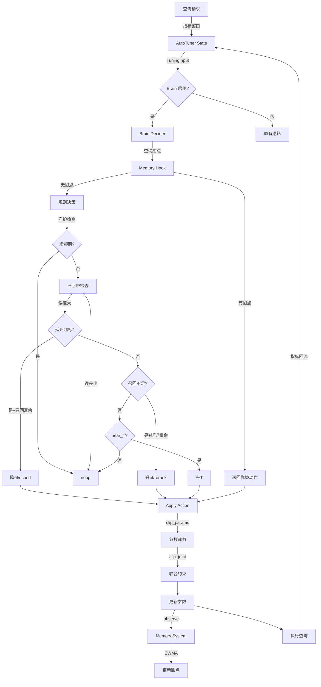
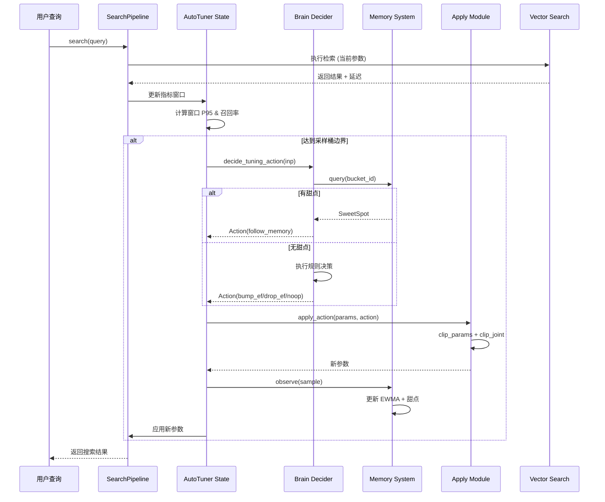
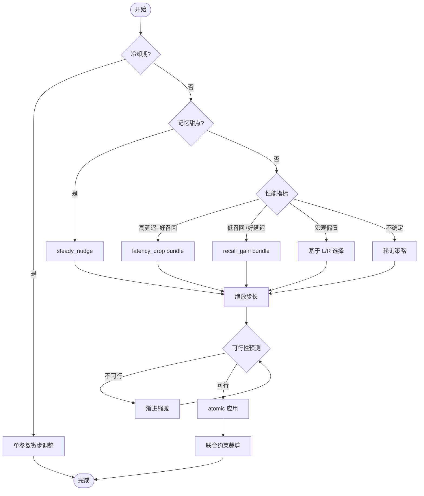

# AutoTuner 系统工程文档

> **"能说清楚就能用"** 的完整工程文档  
> 包含输入输出契约、事件流、数据流图与最小可依赖接口

---

## 📋 目录

1. [系统概览](#系统概览)
2. [代码结构扫描](#代码结构扫描)
3. [I/O 契约表](#io-契约表)
4. [数据流与序列图](#数据流与序列图)
5. [最小可依赖接口](#最小可依赖接口)
6. [快速校验与风险点](#快速校验与风险点)
7. [集成示例](#集成示例)

---

## 系统概览

### 核心功能
AutoTuner Brain 是一个**自动参数调优系统**，基于性能指标（延迟、召回率）和 SLO 约束，自动调整搜索参数以优化检索性能。

### 核心能力
- **决策逻辑**：基于规则的智能决策（延迟vs召回的平衡）
- **记忆系统**：EWMA 指标平滑 + 甜点参数缓存
- **多参数调优**：支持单参数和多参数联合调优
- **参数约束**：边界裁剪 + 联合约束验证
- **防震荡**：冷却期、滞回带、自适应步长

### 技术架构
```
┌─────────────────────────────────────────────┐
│         SearchPipeline (调用入口)            │
└──────────────┬──────────────────────────────┘
               │
               ▼
┌─────────────────────────────────────────────┐
│     AutoTuner State (指标窗口 + 参数状态)    │
└──────────────┬──────────────────────────────┘
               │
               ▼
┌─────────────────────────────────────────────┐
│           Brain Decider (决策器)             │
│  ├─ Hook (记忆前置钩子)                      │
│  ├─ Decider (规则决策)                       │
│  └─ Multi-Knob Decider (多参数决策)          │
└──────────────┬──────────────────────────────┘
               │
               ▼
┌─────────────────────────────────────────────┐
│         Apply (参数应用器)                   │
│  ├─ Constraints (边界裁剪)                   │
│  └─ Joint Constraints (联合约束)             │
└──────────────┬──────────────────────────────┘
               │
               ▼
┌─────────────────────────────────────────────┐
│         Memory (记忆系统)                    │
│  ├─ Ring Buffer (环形缓冲)                   │
│  ├─ EWMA (指数移动平均)                      │
│  └─ Sweet Spot (甜点缓存)                    │
└─────────────────────────────────────────────┘
```

---

## 代码结构扫描

### 1. 文件清单与职责

#### 核心模块：`modules/autotuner/brain/`

| 文件名 | 职责 | 关键函数/类 |
|--------|------|------------|
| **contracts.py** | 数据模型与类型契约定义 | `TuningInput`, `Action`, `SLO`, `Guards`, `MemorySample`, `SweetSpot`, `MultiKnobResult` |
| **decider.py** | 核心决策逻辑（单参数） | `decide_tuning_action(inp)`, `analyze_tuning_input(inp)`, `_apply_anti_oscillation_logic()` |
| **multi_knob_decider.py** | 多参数联合决策 | `decide_multi_knob(inp, macros)`, `_select_bundle_with_rr()`, `get_adaptive_step_factor()` |
| **apply.py** | 动作应用与参数更新 | `apply_action(params, action)`, `apply_updates(params, updates, mode)`, `compute_parameter_delta()` |
| **memory.py** | 记忆系统（甜点缓存） | `Memory` 类: `observe(sample)`, `query(bucket_id)`, `is_stale()` |
| **hook.py** | 记忆前置钩子 | `pre_decide_with_memory(inp, mem)`, `_is_memory_enabled()` |
| **constraints.py** | 参数约束与裁剪 | `clip_params()`, `clip_joint()`, `is_param_valid()`, `get_param_ranges()` |

#### 集成模块

| 文件 | 职责 | 关键函数 |
|------|------|---------|
| **modules/search/search_pipeline.py** | 搜索管道（AutoTuner集成点） | `_update_autotuner_metrics()`, `_make_brain_suggestion()`, `_apply_autotuner_suggestion()` |
| **scripts/autotuner_demo.py** | 完整演示脚本 | `autotuner_demo()` |
| **scripts/test_autotuner_trigger.py** | 触发器测试脚本 | 模拟触发测试 |
| **scripts/explain_autotuner_logic.py** | 决策逻辑解释工具 | 决策路径分析 |

---

### 2. 关键函数详解

#### 2.1 决策入口：`decide_tuning_action`
```python
def decide_tuning_action(inp: TuningInput) -> Action
```
**职责**：基于性能指标和约束返回调优动作  
**决策路径**：
1. 记忆钩子（优先使用历史甜点）
2. 守护检查（冷却期 → noop）
3. 滞回带检查（误差小 → noop）
4. 延迟超标 + 召回富余 → 降 ef/ncand
5. 召回不足 + 延迟富余 → 升 ef/rerank
6. 临界区优化 → 升 T
7. 其他 → noop

#### 2.2 参数应用：`apply_action`
```python
def apply_action(params: Dict[str, Any], action: Action) -> Dict[str, Any]
```
**职责**：将 Action 应用到参数字典，返回新参数（不可变）  
**支持动作**：
- `bump_ef` / `drop_ef`：调整搜索深度
- `bump_T` / `drop_T`：调整阈值
- `bump_rerank` / `drop_rerank`：调整重排序倍数
- `bump_ncand` / `drop_ncand`：调整候选数上限
- `multi_knob`：多参数联合更新
- `noop` / `rollback`：无操作/回滚

#### 2.3 记忆查询：`Memory.query`
```python
def query(bucket_id: str) -> Optional[SweetSpot]
```
**职责**：查询流量桶的历史最优参数  
**返回条件**：
- 甜点存在且满足 SLO
- 未过期（TTL 默认 900 秒）

#### 2.4 多参数决策：`decide_multi_knob`
```python
def decide_multi_knob(inp: TuningInput, macros: Optional[Dict[str, float]]) -> Action
```
**职责**：返回多参数联合调整动作  
**预设策略**：
- `latency_drop`：降低延迟（减 ef、候选数，升 T）
- `recall_gain`：提升召回（升 ef、rerank，降 T）
- `steady_nudge`：稳态微调（小步调整）

---

## I/O 契约表

### 1. 核心数据结构

#### 1.1 TuningInput（调优输入）

| 字段名 | 类型 | 取值范围 | 说明 |
|--------|------|---------|------|
| `p95_ms` | float | ≥0 | 当前 P95 延迟（毫秒） |
| `recall_at10` | float | [0, 1] | Top10 召回率 |
| `qps` | float | ≥0 | 每秒查询量 |
| `params` | Dict[str, Any] | - | 当前参数字典，包含 `ef`, `T`, `Ncand_max`, `rerank_mult` |
| `slo` | SLO | - | 服务级别目标 |
| `guards` | Guards | - | 守护条件（冷却期、稳定性） |
| `near_T` | bool | - | 是否接近阈值边界 |
| `last_action` | Optional[Action] | - | 上一轮动作（用于防震荡） |
| `adjustment_count` | int | ≥0 | 连续同方向调整次数 |

**示例**：
```python
inp = TuningInput(
    p95_ms=250.0,
    recall_at10=0.82,
    qps=120.0,
    params={'ef': 128, 'T': 500, 'Ncand_max': 1000, 'rerank_mult': 3},
    slo=SLO(p95_ms=200.0, recall_at10=0.85),
    guards=Guards(cooldown=False, stable=True),
    near_T=False,
    last_action=None,
    adjustment_count=0
)
```

---

#### 1.2 Action（调优动作）

| 字段名 | 类型 | 取值范围 | 说明 |
|--------|------|---------|------|
| `kind` | ActionKind | 见下表 | 动作类型 |
| `step` | float | - | 单参数调整幅度（正负皆可） |
| `reason` | str | - | 可读的解释说明 |
| `age_sec` | float | ≥0 | 动作年龄（用于冷却判断） |
| `updates` | Optional[Dict] | - | 多参数更新字典（multi_knob 模式） |
| `mode` | Literal | "sequential" \| "atomic" | 应用模式 |

**ActionKind 枚举**：
| 值 | 说明 |
|----|------|
| `noop` | 无操作 |
| `bump_ef` / `drop_ef` | 增加/减少 ef 参数 |
| `bump_T` / `drop_T` | 增加/减少阈值 T |
| `bump_rerank` / `drop_rerank` | 增加/减少重排序倍数 |
| `bump_ncand` / `drop_ncand` | 增加/减少候选数上限 |
| `rollback` | 回滚到上一个状态 |
| `multi_knob` | 多参数联合调整 |

**示例**：
```python
# 单参数动作
action = Action(
    kind="drop_ef",
    step=-32.0,
    reason="high_latency_with_recall_redundancy",
    age_sec=0.0
)

# 多参数动作
action = Action(
    kind="multi_knob",
    step=0.0,
    reason="MULTI_KNOB_LATENCY_DROP",
    updates={"ef": -32, "Ncand_max": -25, "T": 0.01},
    mode="atomic"
)
```

---

#### 1.3 参数范围约束

| 参数名 | 类型 | 最小值 | 最大值 | 默认值 | 说明 |
|--------|------|--------|--------|--------|------|
| `ef` | int | 64 | 256 | 128 | HNSW 搜索深度 |
| `T` | int | 200 | 1200 | 500 | 相似度阈值 |
| `Ncand_max` | int | 500 | 2000 | 1000 | 候选数上限 |
| `rerank_mult` | int | 2 | 6 | 3 | 重排序倍数 |

**联合约束**：
- `rerank_mult` ≤ `Ncand_max` × 0.1
- `ef` ≤ 4 × `Ncand_max`
- 归一化后 `T/1000` ∈ [0, 1]

---

#### 1.4 MemorySample（记忆样本）

| 字段名 | 类型 | 说明 |
|--------|------|------|
| `bucket_id` | str | 流量桶 ID（用于分流） |
| `ef` | int | 观测时的 ef 参数 |
| `T` | int | 观测时的阈值 T |
| `Ncand_max` | int | 观测时的候选数 |
| `p95_ms` | float | 观测到的 P95 延迟 |
| `recall_at10` | float | 观测到的召回率 |
| `ts` | float | 时间戳（Unix timestamp） |

---

#### 1.5 SweetSpot（甜点缓存）

| 字段名 | 类型 | 说明 |
|--------|------|------|
| `ef` | int | 最优 ef 参数 |
| `T` | int | 最优阈值 T |
| `meets_slo` | bool | 是否满足 SLO |
| `age_s` | float | 甜点年龄（秒） |
| `ewma_p95` | float | EWMA 平滑后的延迟 |
| `ewma_recall` | float | EWMA 平滑后的召回率 |

---

### 2. 事件流结构

#### 2.1 事件类型清单

| 事件名 | 触发点 | 数据字段 | 说明 |
|--------|--------|---------|------|
| **BRAIN_DECIDE** | `decide_tuning_action()` | `action_kind`, `reason`, `step` | 决策完成 |
| **PARAMS_APPLIED** | `_apply_autotuner_suggestion()` | `applied`, `note` | 参数已应用 |
| **MEMORY_LOOKUP** | `pre_decide_with_memory()` | `bucket`, `matched`, `sweet_ef`, `age_s` | 查询记忆 |
| **MEMORY_UPDATE** | `Memory._update_sweet_spot()` | `bucket`, `sweet_ef`, `meets_slo`, `ewma_p95`, `ewma_recall` | 更新甜点 |
| **AUTOTUNER_SUGGEST** | `_update_autotuner_metrics()` | `p95_ms`, `recall_at10`, `suggest` | 生成建议 |
| **RETRIEVE_VECTOR** | `SearchPipeline.search()` | `ef_search`, `top_k` | 向量检索 |
| **RESPONSE** | `SearchPipeline.search()` | `cost_ms`, `recall_at_10` | 查询完成 |

#### 2.2 事件日志格式

所有事件均为 JSON 格式，标准字段：
```json
{
  "event": "PARAMS_APPLIED",
  "trace_id": "uuid-1234",
  "ts": "2025-10-08T12:34:56.789Z",
  "cost_ms": 125.3,
  "applied": {
    "ef": 160,
    "T": 550,
    "rerank_mult": 4
  },
  "note": "AutoTuner suggestion applied"
}
```

---

### 3. 环境开关

| 环境变量 | 类型 | 默认值 | 说明 |
|---------|------|--------|------|
| **BRAIN_ENABLED** | bool | `0` | 是否启用 Brain 决策（1=启用，0=关闭） |
| **MEMORY_ENABLED** | bool | `1` | 是否启用记忆系统 |
| **TUNER_ENABLED** | bool | `1` | 是否启用 AutoTuner |
| **TUNER_SAMPLE_SEC** | int | `5` | 采样窗口（秒） |
| **TUNER_COOLDOWN_SEC** | int | `10` | 冷却时间（秒） |
| **SLO_P95_MS** | float | `1200` | P95 延迟 SLO（毫秒） |
| **SLO_RECALL_AT10** | float | `0.30` | 召回率 SLO |
| **MEMORY_RING_SIZE** | int | `100` | 环形缓冲大小 |
| **MEMORY_ALPHA** | float | `0.2` | EWMA 平滑因子 |
| **MEMORY_TTL_SEC** | int | `900` | 甜点过期时间（秒） |

**快速启用 Brain**：
```bash
export BRAIN_ENABLED=1
export MEMORY_ENABLED=1
export SLO_P95_MS=200
export SLO_RECALL_AT10=0.85
```

---

## 数据流与序列图

### 1. 完整数据流图



---

### 2. 时序图：窗口 → 决策 → 应用 → 记忆



---

### 3. 多参数调优流程图



---

## 最小可依赖接口

### 1. "仅靠这些就能接入"的接口清单

#### 1.1 决策接口

```python
# 函数签名
def decide_tuning_action(inp: TuningInput) -> Action:
    """
    核心决策函数
    
    Args:
        inp: 调优输入数据（性能指标 + 参数 + SLO + 守护条件）
    
    Returns:
        Action: 调优动作（kind + step + reason）
    
    Example:
        >>> from modules.autotuner.brain.contracts import TuningInput, SLO, Guards
        >>> from modules.autotuner.brain.decider import decide_tuning_action
        >>> 
        >>> inp = TuningInput(
        ...     p95_ms=250.0,
        ...     recall_at10=0.82,
        ...     qps=100.0,
        ...     params={'ef': 128, 'T': 500, 'Ncand_max': 1000, 'rerank_mult': 3},
        ...     slo=SLO(p95_ms=200.0, recall_at10=0.85),
        ...     guards=Guards(cooldown=False, stable=True),
        ...     near_T=False
        ... )
        >>> action = decide_tuning_action(inp)
        >>> print(action.kind, action.step, action.reason)
        drop_ef -32.0 high_latency_with_recall_redundancy
    """
```

#### 1.2 参数应用接口

```python
# 函数签名
def apply_action(params: Dict[str, Any], action: Action) -> Dict[str, Any]:
    """
    将动作应用到参数字典
    
    Args:
        params: 当前参数字典（包含 ef, T, Ncand_max, rerank_mult）
        action: 调优动作
    
    Returns:
        Dict: 新参数字典（已裁剪到合法范围）
    
    Example:
        >>> from modules.autotuner.brain.apply import apply_action
        >>> 
        >>> params = {'ef': 128, 'T': 500, 'Ncand_max': 1000, 'rerank_mult': 3}
        >>> action = Action(kind='drop_ef', step=-32.0, reason='test')
        >>> 
        >>> new_params = apply_action(params, action)
        >>> print(new_params['ef'])
        96
    """
```

#### 1.3 记忆接口

```python
# 函数签名
class Memory:
    def observe(self, sample: MemorySample) -> None:
        """
        添加观测样本到记忆系统
        
        Args:
            sample: 记忆样本（包含 bucket_id, ef, T, p95_ms, recall_at10）
        """
    
    def query(self, bucket_id: str) -> Optional[SweetSpot]:
        """
        查询甜点参数
        
        Args:
            bucket_id: 流量桶 ID
        
        Returns:
            SweetSpot: 甜点信息（ef, T, meets_slo, age_s）
            None: 如果不存在或过期
        """
    
# 获取全局实例
from modules.autotuner.brain.memory import get_memory
mem = get_memory()
```

---

### 2. JSON Schema 定义

#### 2.1 Action Schema

参见文件：[`docs/schemas/autotuner_action.schema.json`](schemas/autotuner_action.schema.json)

#### 2.2 Params Schema

参见文件：[`docs/schemas/autotuner_params.schema.json`](schemas/autotuner_params.schema.json)

---

### 3. 接入示例（最小代码）

```python
#!/usr/bin/env python3
"""最小接入示例"""
import os
from modules.autotuner.brain.contracts import TuningInput, SLO, Guards
from modules.autotuner.brain.decider import decide_tuning_action
from modules.autotuner.brain.apply import apply_action

# 1. 启用 Brain
os.environ['BRAIN_ENABLED'] = '1'
os.environ['MEMORY_ENABLED'] = '1'

# 2. 准备输入
inp = TuningInput(
    p95_ms=250.0,              # 当前延迟
    recall_at10=0.82,          # 当前召回率
    qps=100.0,                 # 当前 QPS
    params={                   # 当前参数
        'ef': 128,
        'T': 500,
        'Ncand_max': 1000,
        'rerank_mult': 3
    },
    slo=SLO(                   # SLO 目标
        p95_ms=200.0,
        recall_at10=0.85
    ),
    guards=Guards(             # 守护条件
        cooldown=False,
        stable=True
    ),
    near_T=False
)

# 3. 决策
action = decide_tuning_action(inp)
print(f"决策: {action.kind}, 步长: {action.step}, 原因: {action.reason}")

# 4. 应用
new_params = apply_action(inp.params, action)
print(f"新参数: {new_params}")

# 5. 使用新参数执行查询
# your_search_function(**new_params)
```

**输出示例**：
```
决策: drop_ef, 步长: -32.0, 原因: high_latency_with_recall_redundancy
新参数: {'ef': 96, 'T': 500, 'Ncand_max': 1000, 'rerank_mult': 3}
```

---

## 快速校验与风险点

### 1. 单元测试覆盖面

运行所有 AutoTuner 相关测试：

```bash
# 进入项目根目录
cd /Users/nanxinli/Documents/dev/searchforge

# 运行核心测试套件
pytest tests/test_decider.py -v
pytest tests/test_memory_basic.py -v
pytest tests/test_apply_atomic.py -v
pytest tests/test_constraints_joint.py -v
pytest tests/test_multi_knob_decider.py -v
pytest tests/test_decider_with_memory.py -v
pytest tests/test_hysteresis_cooldown.py -v
```

#### 测试覆盖的场景

| 测试文件 | 覆盖场景 | 核心用例数 |
|---------|---------|----------|
| `test_decider.py` | 单参数决策逻辑 | 12+ |
| `test_memory_basic.py` | 记忆系统基础功能 | 8+ |
| `test_apply_atomic.py` | 原子化参数应用 | 6+ |
| `test_constraints_joint.py` | 联合约束验证 | 5+ |
| `test_multi_knob_decider.py` | 多参数决策 | 7+ |
| `test_decider_with_memory.py` | 记忆钩子集成 | 5+ |
| `test_hysteresis_cooldown.py` | 防震荡机制 | 4+ |
| `test_rr_and_cooldown.py` | 轮询与冷却 | 3+ |
| `test_adversarial_safety.py` | 边界安全测试 | 6+ |

**总用例数**：56+ 个单元测试

**关键场景覆盖**：
- ✅ 延迟超标 + 召回富余 → 降参数
- ✅ 召回不足 + 延迟富余 → 升参数
- ✅ 临界区优化（near_T）
- ✅ 冷却期保护
- ✅ 滞回带防抖
- ✅ 参数边界裁剪
- ✅ 联合约束验证
- ✅ 记忆甜点查询与靠拢
- ✅ 多参数原子化应用
- ✅ 回滚机制

---

### 2. "契约破坏会怎样"的风险点与防护

#### 风险点 1：参数超出约束范围

**破坏场景**：
```python
# 恶意输入：ef 超出范围
params = {'ef': 512, 'T': 500, 'Ncand_max': 1000, 'rerank_mult': 3}
action = Action(kind='bump_ef', step=100.0, reason='test')
new_params = apply_action(params, action)
```

**可能后果**：
- ❌ 向量搜索引擎崩溃或性能极度下降
- ❌ 延迟飙升至秒级

**防护措施**：
```python
from modules.autotuner.brain.constraints import clip_params

# 自动裁剪到 [64, 256]
new_params = clip_params(params)
assert new_params['ef'] == 256  # 被裁剪到上限
```

**代码位置**：`modules/autotuner/brain/constraints.py:10-34`

---

#### 风险点 2：联合约束违反

**破坏场景**：
```python
# rerank_mult 超过 Ncand_max 的 10%
params = {'ef': 128, 'T': 500, 'Ncand_max': 500, 'rerank_mult': 100}
```

**可能后果**：
- ❌ 重排序阶段候选数不足，导致召回率下降
- ❌ 系统抛出断言错误或静默失败

**防护措施**：
```python
from modules.autotuner.brain.constraints import clip_joint, validate_joint_constraints

# 联合约束验证
clipped_params, was_clipped, reason = clip_joint(params, simulate_only=True)
if was_clipped:
    print(f"警告：参数违反联合约束 - {reason}")
    # 自动修复
    clipped_params, _, _ = clip_joint(params, simulate_only=False)
```

**代码位置**：`modules/autotuner/brain/constraints.py:94-216`

---

#### 风险点 3：记忆过期导致错误靠拢

**破坏场景**：
```python
# 甜点已过期 15 分钟，但仍被使用
sweet_spot = mem.query(bucket_id)  # 返回过期甜点
action = pre_decide_with_memory(inp, mem)  # 靠拢过期参数
```

**可能后果**：
- ❌ 基于陈旧数据做决策，导致性能下降
- ❌ 系统无法适应流量/数据分布变化

**防护措施**：
```python
from modules.autotuner.brain.memory import Memory

mem = Memory()
sweet_spot = mem.query(bucket_id)

# 检查是否过期
if sweet_spot and mem.is_stale(bucket_id, ttl_s=900):
    print("警告：甜点已过期，忽略记忆")
    sweet_spot = None
```

**代码位置**：`modules/autotuner/brain/memory.py:169-209`  
**默认 TTL**：900 秒（15 分钟）

---

### 3. 快速验证脚本

创建文件：`scripts/verify_autotuner_contracts.py`

```python
#!/usr/bin/env python3
"""AutoTuner 契约验证脚本"""
import sys
import os
sys.path.insert(0, os.path.join(os.path.dirname(__file__), '..'))

from modules.autotuner.brain.contracts import TuningInput, SLO, Guards, Action
from modules.autotuner.brain.decider import decide_tuning_action
from modules.autotuner.brain.apply import apply_action
from modules.autotuner.brain.constraints import clip_params, is_param_valid, validate_joint_constraints

def test_param_clipping():
    """测试参数裁剪"""
    print("测试 1: 参数边界裁剪")
    
    # 超出范围的参数
    bad_params = {'ef': 512, 'T': 2000, 'Ncand_max': 100, 'rerank_mult': 10}
    clipped = clip_params(bad_params)
    
    assert clipped['ef'] == 256, f"ef 裁剪失败: {clipped['ef']}"
    assert clipped['T'] == 1200, f"T 裁剪失败: {clipped['T']}"
    assert clipped['Ncand_max'] == 500, f"Ncand_max 裁剪失败: {clipped['Ncand_max']}"
    assert clipped['rerank_mult'] == 6, f"rerank_mult 裁剪失败: {clipped['rerank_mult']}"
    
    print("  ✅ 参数裁剪正常")

def test_joint_constraints():
    """测试联合约束"""
    print("测试 2: 联合约束验证")
    
    # 违反约束的参数
    bad_params = {'ef': 128, 'T': 500, 'Ncand_max': 500, 'rerank_mult': 100}
    is_valid = validate_joint_constraints(bad_params)
    
    assert not is_valid, "联合约束验证失败（应拒绝无效参数）"
    
    # 合法参数
    good_params = {'ef': 128, 'T': 500, 'Ncand_max': 1000, 'rerank_mult': 3}
    is_valid = validate_joint_constraints(good_params)
    
    assert is_valid, "联合约束验证失败（应接受有效参数）"
    
    print("  ✅ 联合约束验证正常")

def test_decision_logic():
    """测试决策逻辑"""
    print("测试 3: 决策逻辑")
    
    # 高延迟 + 召回富余 → 应降 ef
    inp = TuningInput(
        p95_ms=250.0,
        recall_at10=0.92,
        qps=100.0,
        params={'ef': 128, 'T': 500, 'Ncand_max': 1000, 'rerank_mult': 3},
        slo=SLO(p95_ms=200.0, recall_at10=0.85),
        guards=Guards(cooldown=False, stable=True),
        near_T=False
    )
    
    action = decide_tuning_action(inp)
    assert action.kind == "drop_ef", f"决策错误: 期望 drop_ef，实际 {action.kind}"
    
    print("  ✅ 决策逻辑正常")

def test_action_application():
    """测试动作应用"""
    print("测试 4: 动作应用")
    
    params = {'ef': 128, 'T': 500, 'Ncand_max': 1000, 'rerank_mult': 3}
    action = Action(kind='drop_ef', step=-32.0, reason='test')
    
    new_params = apply_action(params, action)
    assert new_params['ef'] == 96, f"动作应用失败: 期望 96，实际 {new_params['ef']}"
    
    print("  ✅ 动作应用正常")

if __name__ == '__main__':
    print("=== AutoTuner 契约验证 ===\n")
    
    try:
        test_param_clipping()
        test_joint_constraints()
        test_decision_logic()
        test_action_application()
        
        print("\n✅ 所有验证通过！")
        sys.exit(0)
    except AssertionError as e:
        print(f"\n❌ 验证失败: {e}")
        sys.exit(1)
    except Exception as e:
        print(f"\n❌ 发生错误: {e}")
        import traceback
        traceback.print_exc()
        sys.exit(1)
```

运行验证：
```bash
python scripts/verify_autotuner_contracts.py
```

**预期输出**：
```
=== AutoTuner 契约验证 ===

测试 1: 参数边界裁剪
  ✅ 参数裁剪正常
测试 2: 联合约束验证
  ✅ 联合约束验证正常
测试 3: 决策逻辑
  ✅ 决策逻辑正常
测试 4: 动作应用
  ✅ 动作应用正常

✅ 所有验证通过！
```

---

## 集成示例

### 完整集成到 SearchPipeline

参见文件：`modules/search/search_pipeline.py:198-249`

关键集成点：
1. **指标采集**：`_update_autotuner_metrics()`（行 136-196）
2. **Brain 建议**：`_make_brain_suggestion()`（行 198-249）
3. **参数应用**：`_apply_autotuner_suggestion()`（行 270-310）

---

## 附录

### A. 环境变量完整清单

| 变量名 | 默认值 | 类型 | 说明 |
|--------|--------|------|------|
| `BRAIN_ENABLED` | `0` | bool | 启用 Brain 决策 |
| `MEMORY_ENABLED` | `1` | bool | 启用记忆系统 |
| `TUNER_ENABLED` | `1` | bool | 启用 AutoTuner |
| `TUNER_SAMPLE_SEC` | `5` | int | 采样窗口（秒） |
| `TUNER_COOLDOWN_SEC` | `10` | int | 冷却时间（秒） |
| `SLO_P95_MS` | `1200` | float | P95 延迟 SLO |
| `SLO_RECALL_AT10` | `0.30` | float | 召回率 SLO |
| `MEMORY_RING_SIZE` | `100` | int | 环形缓冲大小 |
| `MEMORY_ALPHA` | `0.2` | float | EWMA 平滑因子（0-1） |
| `MEMORY_TTL_SEC` | `900` | int | 甜点过期时间（秒） |
| `OBS_FULL_FREQ` | `10` | int | 完整日志频率（每N次查询） |
| `CHAOS_LAT_MS` | `0` | int | 混沌注入延迟（毫秒） |

### B. 参考资料

- 源代码：`modules/autotuner/brain/`
- 单元测试：`tests/test_decider*.py`, `tests/test_memory*.py`, `tests/test_apply*.py`
- 演示脚本：`scripts/autotuner_demo.py`
- 集成代码：`modules/search/search_pipeline.py`

---

## 许可与贡献

本文档由 **SearchForge AutoTuner Team** 维护。

**版本**：v1.0  
**更新日期**：2025-10-08  
**维护者**：nanxinli

---

**🎯 核心理念**：能说清楚就能用 — 本文档提供完整的接口契约、数据流图和风险防护，确保任何工程师都能快速理解和接入 AutoTuner 系统。
