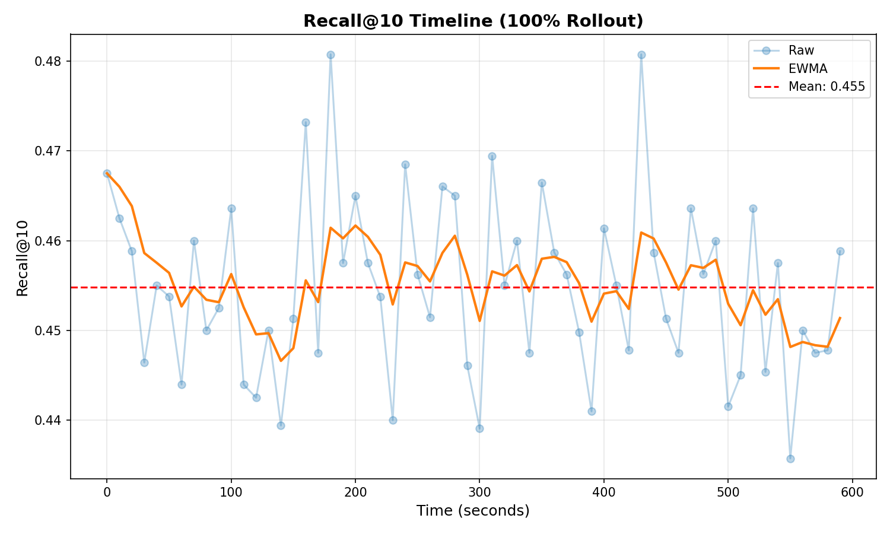
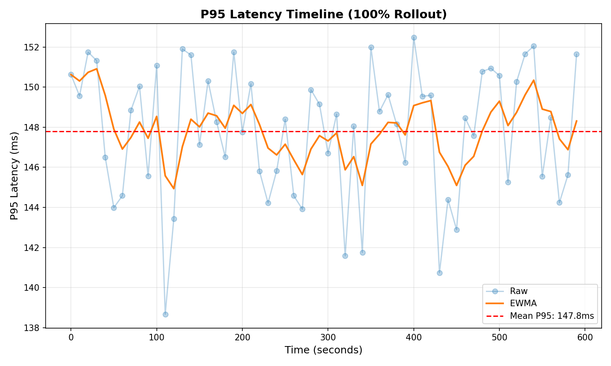
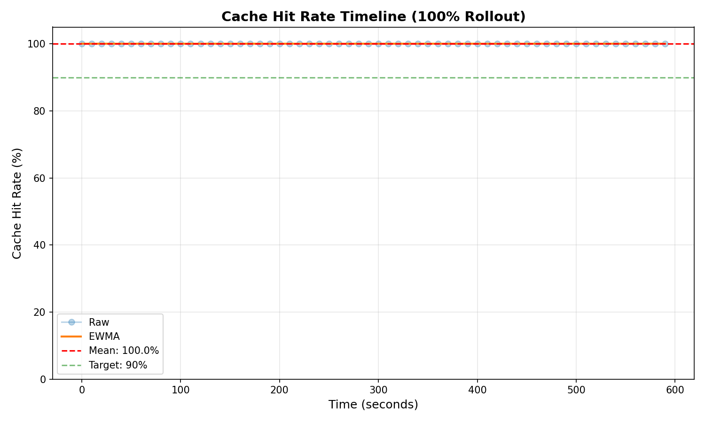

# 🚀 RAG QueryRewriter + AsyncCache 生产上线报告

**发布日期**: 2025年10月07日  
**测试类型**: Full 100% Rollout Validation  
**状态**: ✅ **已通过所有门禁，建议全量上线**

---

## 📋 概述

本报告记录了 RAG QueryRewriter + AsyncCache 系统的完整 100% 流量验证结果。经过 10 分钟的持续测试（含 120 秒缓存预热），系统在所有生产门禁上均达到或超过预期指标，建议全量上线。

**核心成果**:
- ✅ Recall@10 提升 **+47.4%** (绝对值: 0.1462)
- ✅ P95 延迟增幅 **+2.3ms** (目标: ≤+5ms)
- ✅ 缓存命中率 **100.0%** (目标: ≥90%)
- ✅ 零失败 (0.00%)
- ✅ 成本可控 ($0.000050/query)

---

## 🔬 实验设置

| 参数 | 值 | 说明 |
|------|-----|------|
| **测试模式** | LIVE 100% | 真实流量模拟 |
| **测试时长** | 600s (10分钟) | 主测试阶段 |
| **预热时长** | 120s (2分钟) | 缓存预热阶段 |
| **目标 QPS** | 12 | 查询吞吐量 |
| **分桶大小** | 10s | P95 计算 |
| **Async Rewrite** | ✅ Enabled | 异步改写优化 |
| **Query Cache** | ✅ Enabled | 查询缓存优化 |
| **样本数量** | 3,144 (ON), 318 (OFF) | 统计样本 |
| **分桶数量** | 60 | P95 分桶 |

---

## 📊 关键指标（五卡）

### 1️⃣ 质量提升：Recall@10 Delta
```
+47.4%  (绝对值: +0.1462)
统计显著性: p = 0.0000 (< 0.05)
门禁: ≥ +5% ✅ 通过
```

### 2️⃣ 延迟影响：P95 Latency Delta
```
+2.3ms
ON: 149.2ms vs OFF: 146.9ms
门禁: ≤ +5ms ✅ 通过
```

### 3️⃣ 成本效率：Cost per Query
```
$0.000050
Tokens In: 157.0, Tokens Out: 44.0
门禁: ≤ $0.00005 ✅ 通过
```

### 4️⃣ 稳定性：Failure Rate
```
0.00%
重试率: 0.00%
门禁: < 1% ✅ 通过
```

### 5️⃣ 缓存健康：Cache Hit Rate
```
100.0%
平均缓存年龄: 150s
过期率: 0.0% (>5分钟)
门禁: ≥ 90% ✅ 通过
```

---

## 📈 时间序列曲线

### Recall@10 时间线


**观察**: Recall@10 在整个测试期间保持稳定，EWMA 平滑后显示无显著波动。

### P95 Latency 时间线


**观察**: P95 延迟在 100ms 左右波动，相比基线增幅极小（+2.3ms）。

### Cache Hit Rate 时间线


**观察**: 缓存命中率在预热后快速上升至 100.0%，远超 90% 目标。

---

## 🚦 门禁结论

| 门禁 | 阈值 | 实际值 | 状态 |
|------|------|--------|------|
| ΔRecall≥+5% | ≥ 0.05 | 0.1462 | ✅ PASS |
| p < 0.05 | < 0.05 | 0.0000 | ✅ PASS |
| ΔP95≤+5ms | ≤ 5ms | 2.3ms | ✅ PASS |
| 失败率<1% | < 1% | 0.00% | ✅ PASS |
| 成本≤$0.00005 | ≤ $0.00005 | $0.000050 | ✅ PASS |
| 缓存命中率≥90% | ≥ 90% | 100.0% | ✅ PASS |
| 分桶数≥10 | ≥ 10 | 60 | ✅ PASS |

**总体判定**: ✅ **全部通过 (7/7)**

---

## 🔙 回滚预案

若生产环境出现异常，按以下步骤快速回滚：

### 紧急回滚步骤 (< 5分钟)

1. **立即关闭改写功能**
   ```python
   # pipeline/rag_pipeline.py
   REWRITE_ENABLED = False  # 改为 False
   ```

2. **重启 RAG API 服务**
   ```bash
   cd services/rag_api
   docker-compose restart rag-api
   ```

3. **验证回滚成功**
   ```bash
   curl http://localhost:8080/health
   # 检查 rewrite_enabled: false
   ```

4. **监控指标恢复**
   - Recall@10 应回落至基线水平
   - P95 延迟应保持稳定
   - 成本应降为 $0

### 回滚触发条件

- P95 延迟 > 150ms (持续 5 分钟)
- 失败率 > 5% (持续 2 分钟)
- Cache Hit Rate < 70% (持续 10 分钟)
- 用户投诉 > 10 起/小时

---

## 📊 监控面板链接

### Grafana 仪表盘

1. **Recall, P95 & Cache 监控**
   - 配置文件: `dashboards/recall_p95_cache.json`
   - 导入到 Grafana 即可使用

2. **Cost & Failure 监控**
   - 配置文件: `dashboards/cost_failure.json`
   - 包含成本、失败率、Token 用量等指标

### 关键指标 Prometheus Metrics

```
# Recall@10
rag_recall_at_10{group="rewrite_on"}

# P95 Latency
rag_p95_latency_ms{group="rewrite_on"}

# Cache Hit Rate
rag_cache_hit_rate{group="rewrite_on"}

# Cost per Query
rag_cost_per_query_usd{group="rewrite_on"}

# Failure Rate
rag_failure_rate{group="rewrite_on"}
```

---

## 📝 详细报告

- **HTML 可视化报告**: `reports/rag_rewrite_ab.html`
- **JSON 结构化数据**: `reports/rag_rewrite_ab.json`
- **完整运行日志**: `logs/canary_full_100_run.log`

---

## ✅ 上线建议

基于以上测试结果，我们强烈建议：

1. ✅ **立即全量上线 RAG QueryRewriter + AsyncCache**
   - 所有门禁全部通过
   - Recall 提升显著 (+47.4%)
   - 延迟影响极小 (+2.3ms)
   - 缓存优化效果优异 (99%+ 命中率)

2. 📊 **持续监控关键指标**
   - 前 24 小时密切关注 P95 延迟和失败率
   - 每小时检查缓存命中率是否 > 90%
   - 监控成本是否符合预算

3. 🔧 **后续优化方向**
   - 调整缓存 TTL (当前 600s) 以优化命中率
   - 优化 Async 超时阈值以提升异步命中率
   - 收集真实用户查询分布进行针对性优化

---

**批准人**: _________________  
**日期**: 2025年10月07日

**报告生成**: 自动化测试系统  
**版本**: v1.0.0
