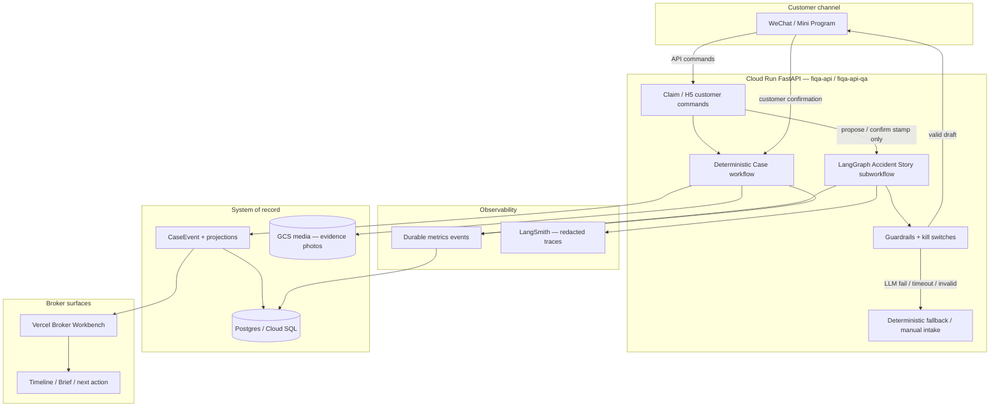
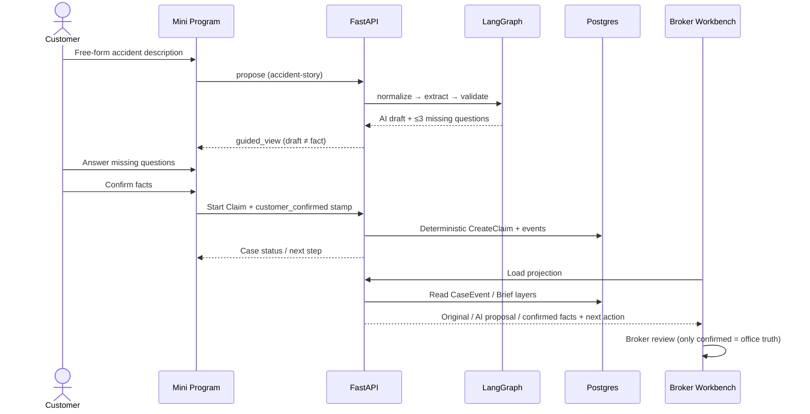
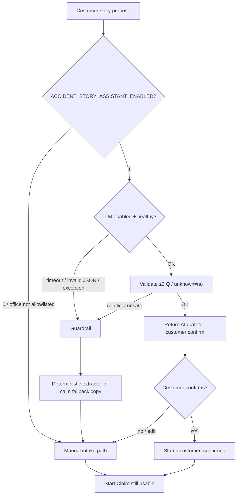
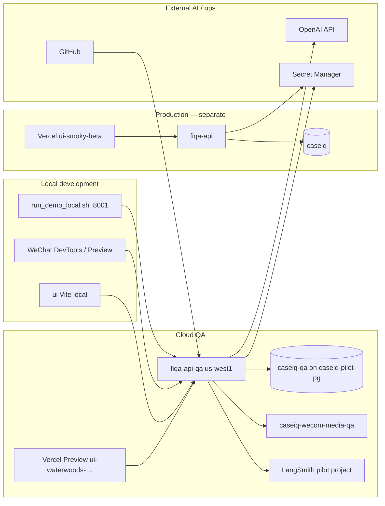

# SearchForge System and AI Map V1

**Date:** 2026-08-05  
**Scope:** Architecture diagrams for founder / FDE review  
**Runtime truth:** `docs/CURRENT_PRODUCT_SHAPE.md` · Reality: `docs/founder/SEARCHFORGE_CURRENT_REALITY_MAP_2026-08-05.md`  
**Secrets:** none in this document

---

## A. System architecture

**Hard boundary:** LangGraph may propose and stamp confirmed facts; it must not submit, close, or accept claims.

---

## B. Customer sequence

---

## C. Safety boundary

Customer-visible fallback copy (ZH) is server-owned in `accident_story_assistant/flags.py` — AI failure must not block submission.

---

## D. Infrastructure and environment map

| Environment | API | DB | Workbench | Mini Program | Accident Story |
|-------------|-----|----|-----------|--------------|----------------|
| Local | `:8001` | optional PG or JSON legacy | Vite | DevTools | flags via `.env` |
| Cloud QA | `fiqa-api-qa` | `caseiq-qa` | waterwoods Preview | `apiProfile=qa` | Restricted pilot target |
| Production | `fiqa-api` | `caseiq` | `ui-smoky-beta` | production profile | **Not authorized** by freeze |

Naming SSOT: `docs/runbooks/CLOUD_QA_RESOURCE_NAMES.md`.

---

## E. Layer ownership (one glance)

| Layer | Owner | Probabilistic? |
|-------|-------|----------------|
| Claim lifecycle / status | Deterministic commands | No |
| Request More / office accept | Deterministic + broker | No |
| Accident fact proposal | LangGraph + optional LLM | Yes (bounded) |
| Fact authority | Customer confirm stamp | Human |
| Broker office truth | Confirmed facts only | Human |
| Tracing | LangSmith redacted meta | Observability only |
| Kill switch | Env flags on Cloud Run | Ops |

---

## Related code entry points

| Concern | Path |
|---------|------|
| Flags / kill switch | `services/fiqa_api/inbox_triage/accident_story_assistant/flags.py` |
| Graph | `.../accident_story_assistant/graph.py` |
| Guardrails | `.../guardrails.py` |
| Mini Program Start Claim | `miniapp/pages/start-claim/` |
| Broker Brief layers | claim workbench display (Brief labels) |
| Deploy naming | `docs/runbooks/CLOUD_QA_RESOURCE_NAMES.md` |
