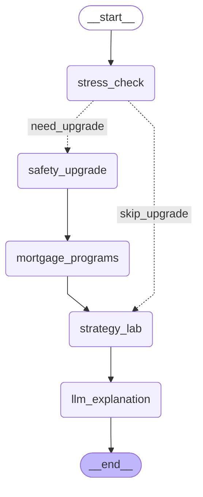

# Single Home Graph - LangGraph 可视化

这个文件包含 single_home_graph 的 Mermaid 图表。你可以在以下地方查看：

1. **GitHub**: 直接在 GitHub 上查看这个 .md 文件（GitHub 支持 Mermaid）
2. **VS Code**: 安装 "Markdown Preview Mermaid Support" 插件后预览
3. **在线工具**: 访问 https://mermaid.live/ 粘贴下面的代码

## Graph Structure

## 节点说明

- **stress_check**: 执行核心压力检查
- **safety_upgrade**: 如果需要升级（tight/high_risk），搜索更安全的房屋选项
- **mortgage_programs**: 查找相关的抵押贷款援助项目
- **strategy_lab**: 运行策略实验室分析（what-if 场景）
- **llm_explanation**: 生成 LLM 解释

## 流程说明

1. **Entry** → `stress_check` (总是第一个执行)
2. **Router** → 根据 `stress_band` 决定：
   - `need_upgrade`: 执行安全升级流程
   - `skip_upgrade`: 跳过安全升级
3. **安全升级路径**: `stress_check` → `safety_upgrade` → `mortgage_programs` → `strategy_lab` → `llm_explanation`
4. **直接路径**: `stress_check` → `strategy_lab` → `llm_explanation`
