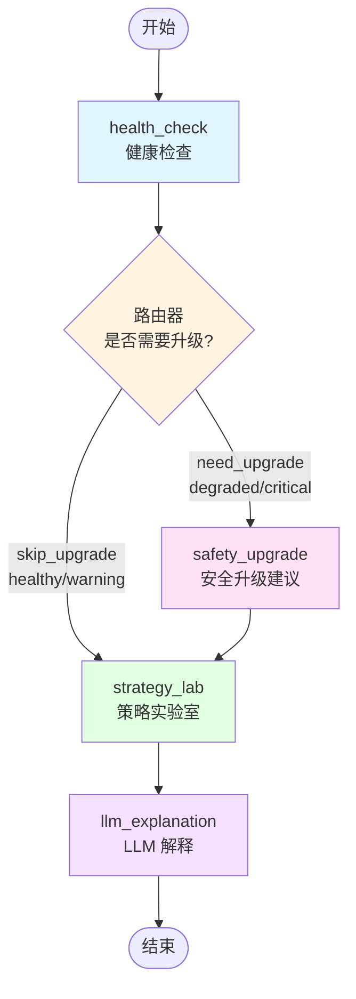

# System Health Graph - LangGraph 可视化

这个文件包含 system_health_graph 的 Mermaid 图表。

## Graph Structure



## 节点说明

- **health_check**: 执行系统健康检查，计算健康带、分数、风险标志等
- **safety_upgrade**: 如果健康带是 degraded/critical，生成安全配置建议
- **strategy_lab**: 运行策略实验室分析，生成 what-if 场景
- **llm_explanation**: 生成 SRE 友好的叙述和建议

## 执行流程

1. **Entry** → `health_check` (总是第一个执行)
2. **Router** → 根据 `health_band` 决定：
   - `need_upgrade` (degraded/critical): 执行安全升级建议
   - `skip_upgrade` (healthy/warning): 跳过安全升级，直接进入策略实验室
3. **安全升级路径**: 
   ```
   health_check → safety_upgrade → strategy_lab → llm_explanation
   ```
4. **直接路径**: 
   ```
   health_check → strategy_lab → llm_explanation
   ```

## 在 LangSmith 中查看

在 LangSmith UI 中：
1. 打开你的项目 (searchforge-ops)
2. 点击一个 `system_health_graph_run` trace
3. 在详情页查看节点的层级结构和执行顺序

## 查看这个图表

### 方式 1: GitHub（推荐）
- 直接在 GitHub 上查看这个文件，GitHub 会自动渲染 Mermaid 图表

### 方式 2: 在线 Mermaid Live Editor
1. 访问 https://mermaid.live/
2. 复制上面的 Mermaid 代码
3. 粘贴到编辑器中
4. 点击 "Download PNG" 或 "Download SVG" 保存为图片

### 方式 3: VS Code
1. 安装插件：`Markdown Preview Mermaid Support`
2. 打开这个文件
3. 按 `Cmd+Shift+V` (Mac) 或 `Ctrl+Shift+V` (Windows/Linux) 预览
