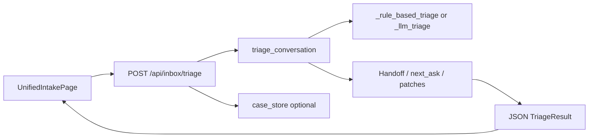

# Flow Architecture Blueprint — Unified Intake (Chen Kui)

**Sprint:** Flow Architecture Summary + Roadmap  
**Audience:** Founder / product / eng  
**Scope:** Document how the *current* Unified Intake works end-to-end — not a redesign.

---

## 1. Product slice

**SearchForge → Chen Kui Insurance Unified Entry** is a broker-facing intake that:

- Accepts customer-style messages (multi-turn).
- Classifies and structures them (category, urgency, broker next step, client prep, reply draft).
- Runs a **lightweight workflow state** (collection vs handoff, add-car slots, follow-up type).
- Persists **demo-safe cases** (JSON) and supports **append** with **case-boundary** hints.

---

## 2. Architectural stance (current)

| Layer | Role |
|-------|------|
| **Orchestration brain** | `triage.py` — merges turns, routes LLM vs rules, applies handoff / next-ask / structured fields / edge-case reply patches. |
| **Config surface** | Industry + client JSON loaded by `config_loader.py` (markers, templates, handoff phrases, add-car prompts, UI copy allowlist). |
| **HTTP + glue** | `routes/inbox_triage.py` — request models, soft-route hints, reroute copy, case/session I/O, Rules Center publish for add-car prompts. |
| **Persistence** | `case_store.py` — cases, messages, attachments, status; workflow keys echoed from triage. |
| **UI** | `UnifiedIntakePage.tsx` + `inboxTriage.ts` + `clientConfig.ts` — conversation UX, toasts, transaction framing, post-handoff panels. |
| **Safety net** | Shell guardrail + Python runners (scenarios, simulations, batteries) under `scripts/`. |

**Principle:** The “flow engine” is **procedural Python inside `triage_conversation`**, not a separate workflow framework. Config externalizes *some* wording and markers; most branching logic remains in code.

---

## 3. Core request path (simplified)

---

## 4. What is explicitly *out of scope* for this sprint

- New product features, engine rewrite, LangGraph-style replacement.
- OCR, carrier APIs, multi-tenant.
- Broad UI redesign.

---

## 5. Key files (anchor list)

| Concern | Primary file(s) |
|---------|------------------|
| Flow orchestration | `services/fiqa_api/inbox_triage/triage.py` |
| Config load / merge | `services/fiqa_api/inbox_triage/config_loader.py` |
| Routes / soft-route | `services/fiqa_api/routes/inbox_triage.py` |
| Case JSON | `services/fiqa_api/inbox_triage/case_store.py` |
| Add-car prompts (editable) | `configs/industries/insurance/add_car_rules.json` |
| Handoff customer lines | `configs/clients/chen_kui/handoff_phrases.json` |
| Portal copy | `configs/clients/chen_kui/ui_copy.json` |
| Intent markers | `configs/industries/insurance/markers.json` |
| UI | `ui/src/pages/UnifiedIntakePage.tsx`, `ui/src/api/inboxTriage.ts`, `ui/src/api/clientConfig.ts` |
| Regression | `scripts/guardrail_inbox_triage.sh` + related `scripts/run_*.py` |

---

## 6. Design intent (why it looks like this)

- **Speed:** Fast path avoids LLM on simple turns when enabled.
- **Trial hardening:** Many sprint-named branches in `triage_conversation` encode commercial behaviors (handoff timing, corrections, materials-sent, doc clarification).
- **White-label lite:** Client id selects handoff phrases and UI copy; industry pack holds shared insurance assets.

This blueprint is the single-page “what exists” reference; deeper maps live in sibling docs in this folder.
