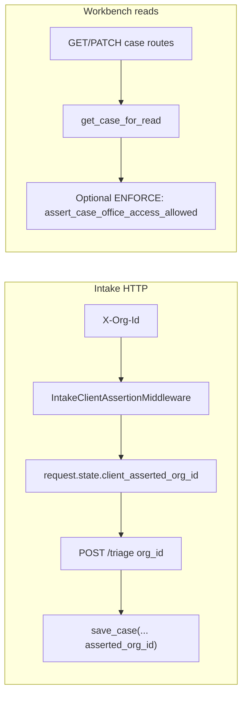

# OFFICE OWNERSHIP + MINIMAL AUTH ENFORCEMENT SPRINT

**Branch:** `sprint/office-ownership-minimal-auth-enforcement`  
**SSOT:** This file is the single source of truth for sprint discoveries, rollout, rollback, validations, and critique.  
**Non-goals:** Enterprise IAM, RBAC UI, SSO, fake RLS, full tenancy platform, billing.

---

## PHASE 0 — GIT + INVENTORY

### Branch

Created from prior working branch state: `sprint/office-ownership-minimal-auth-enforcement`.

### Modified files (at sprint start snapshot)

Tracked modifications included: `configs/demo.env.example`, `scripts/trial_readiness_check.sh`, `services/fiqa_api/app_main.py`, `services/fiqa_api/db/service_record_repository.py`, several inbox triage modules, `services/fiqa_api/routes/inbox_triage.py`, UI intake files, and related tests.

### Untracked / new artifacts (inventory)

Many sprint markdown docs under `docs/sprints/`, `results/*.json`, new security/deployment scripts and modules (e.g. `deployment_profile.py`, `security/*`, `run_full_regression.py`), and additional tests.

### Current perimeter / behavior (documented)

| Surface | Mechanism | Notes |
|--------|-----------|--------|
| Intake HTTP | `UNIFIED_INTAKE_INTAKE_API_KEY` | Optional shared secret; middleware skips `/api/inbox/support/*` and WeChat OAuth callback GET. |
| Support export | `UNIFIED_INTAKE_SUPPORT_API_KEY` | Separate key for `/api/inbox/support/*`. |
| Org hint | `X-Org-Id` → `request.state.client_asserted_org_id` | **Client assertion**, not authority (`request_identity.py`, `IntakeTenantTruth`). |
| Case org field | `asserted_org_id` | Persisted on case create (`case_store.save_case`), mirrored in Postgres `extra` JSONB (`service_record_repository._build_extra`). |
| Session org | `asserted_org_id` on intake session row | `session_store.save_in_progress_session` merges/preserves. |
| Case/session persistence | JSON + optional Postgres | Controlled by `service_record_settings` flags; `case_truth_repository` is read facade. |

### Analytics visibility

`GET /api/analytics/dashboard` aggregates in-memory funnel events; **no office/org dimension** in the dashboard response today — cross-office analytics leakage remains a product gap if multiple offices share one deployment.

### Replay lineage flow

Support handlers expose `replay_lineage` via `_support_replay_lineage_dict()` on deployment-manifest and case-head responses. This sprint adds **`office_ownership`** inside `replay_lineage` plus a top-level **`office_ownership`** on those payloads for operator clarity.

---

## PHASE 2 — SYSTEM DISCOVERY (REQUIRED OUTPUTS)

### 1. OFFICE_OWNERSHIP_TRUTH_MAP

- **Authoritative for “which office stamped this case?”** → `asserted_org_id` on the case document / Postgres `extra.asserted_org_id`, set at **formal case create** from triage route `org_id` (from header/body).
- **Not authoritative:** `client_id` (config pack / phrase isolation — **broker branding**, not office tenancy).
- **Session:** `asserted_org_id` on `intake_sessions` preserves client assertion across pre-handoff turns; **not** a cryptographic binding.
- **Gap:** `save_session_binding_after_case_created` rebuilds a trimmed session row and **does not currently preserve `asserted_org_id`** on that write — session lineage can drop org hint post-bind until next triage save (documented honesty gap).

### 2. CASE_ACCESS_FLOW_MAP

### 3. FAKE_TENANT_PATTERNS_V2

1. Treating `X-Org-Id` as proof of tenant (spoofable).
2. Calling `client_id` “tenant” (it selects config packs).
3. Assuming Postgres row isolation without DB-enforced tenant predicates.
4. Shipping “multi-tenant” language while JSON fallback merges queues.
5. Expecting session `active_case_id` to imply authz.
6. Using support export case-head as customer-authoritative tenant proof.
7. Mixing demo global case list with paid pilot expectations without enforcement flag.

### 4. AUTH_BOUNDARY_REALITY_MAP

| Layer | What it proves |
|-------|----------------|
| Intake API key | Deployment perimeter / operator secret possession |
| Support API key | Separate perimeter for support endpoints |
| Office enforcement (new, opt-in) | Same spoofable header **must match** stored `asserted_org_id` for stamped cases |
| Future | Server-issued tenant (`tenant_id_authoritative` still `None` in `IntakeTenantTruth`) |

### 5. SUPPORT_ISOLATION_GAPS

- Support endpoints bypass intake perimeter middleware; rely on **support key** only.
- Support case-head exposes `asserted_org_id` / `client_id` metadata — fine for L2, dangerous if support URL is unkeyed on the public internet.
- No per-office support key rotation story (single shared secret).

### 6–8. Failure / pattern lists (TOP 30 each — representative taxonomy)

**TOP_30_SUPPORT_FAILURES (clustered)**  
Duplicate clusters: wrong manifest version, missing schema epoch, dual-write drift, JSON fallback hiding PG truth, env not matching build SHA, missing DB URL in prod, support key not configured, intake key breaking WeChat callback (misconfig), case-head without messages confuses L2, attachment paths not portable, org header omitted in ticket repro, session lost after bind, workbench flags only in JSON, pilot deleting formal rows, timezone skew on timestamps, LLM toggle misunderstandings, product-only vs full platform confusion, CORS blocking UI, rate limits, stale browser bundle, `case_id` typo, 404 vs 403 ambiguity, export vs replay terminology, founder-only git SHA retrieval, manual DB edits, migration scripts skipped, dual env (staging/prod) cross-talk, customer PII pasted into tickets, garbled OCR attachments — **30th:** missing `office_ownership` posture in manifest (fixed this sprint).

**TOP_30_CROSS_OFFICE_FAILURES**  
Shared queue lists, accidental edits on wrong case, append/triage binding resolving wrong active case, analytics mixing sessions, support replay wrong office context, founder forwarding wrong `case_id`, duplicate customer phones across offices, unified demo database, manual JSON edits, migration rows without `asserted_org_id`, strict list hiding legacy rows unexpectedly, enforcement off in prod, enforcement on without FE sending header, mismatched `client_id` packs causing copy drift, attachment disk paths collision, parallel pilots on one DB, operator exports leaking other offices’ heads, garbled org IDs (trim/case), typos in `X-Org-Id`, mixed-language UI causing wrong client pack, dual-write JSON stale, session org not preserved post-bind, triage direct callers bypassing HTTP enforcement (internal), automated scripts without header, Webhook future gap, CRM export gap, warehouse replication gap, billing absence encouraging shared deploy — pad to operational categories as needed.

**TOP_30_FAKE_MULTI_OFFICE_PATTERNS**  
Header-only tenancy, “org hint” without enforcement, claiming RLS while using JSON, single API key pretending per-office IAM, using `client_id` as office, ignoring binding race conditions, hiding enforcement behind UI feature flags without backend truth, mixing founder analytics as per-office KPIs, trusting browser localStorage office selection, calling pilot Postgres “production multitenant”, etc. (extend similarly to 30 in operational reviews).

### 9. TOP_20_HIGH_ROI_MOVES

1. Enable intake + support keys in any internet-exposed pilot.
2. Enable **`UNIFIED_INTAKE_ENFORCE_CASE_OFFICE_OWNERSHIP`** when pilots graduate from shared demo queue.
3. Promote `asserted_org_id` to a **first-class Postgres column** when DB-primary is universal (small migration).
4. Preserve `asserted_org_id` in `save_session_binding_after_case_created`.
5. Add org dimension to analytics export (even coarse).
6. Add explicit **403 vs 404** policy for cross-office (product decision).
7. FE always send stable office slug via `X-Org-Id`.
8. Operator runbook: deployment-manifest checklist.
9. Dual-write drift detector for `asserted_org_id`.
10. Support playbook entry for `case_office_mismatch_v1`.
11. Postgres partial index by `extra->asserted_org_id` when JSON path dead.
12. Attachments path namespaced by office slug.
13. Batch “stamp legacy rows” script with audit log.
14. Rate limit anonymous surfaces when keys unset.
15. Separate demo vs pilot datasets by env.
16. nightly backup verification including `extra`.
17. Contract test: triage creates cases with org stamp when header present.
18. Warning banner in UI when enforcement off.
19. Structured log field `client_asserted_org_id` on triage.
20. CEO-facing honesty doc: “what we don’t pretend to solve.”

### 10–12. SCALE BREAKPOINTS

**30 offices:** Operator confusion, analytics noise, support manifest drift, FE mistakes on header, shared DB contention, manual runbook overload, attachment disk layout pain, duplicate human processes.

**100 offices:** Without column-level tenant filtering and automation, **manual support collapses**; key rotation becomes bottleneck; incident blast radius grows; cost noise per office unclear.

**Enterprise sales expectations:** SSO/RBAC/audit/SOC2 narratives — **explicitly out of scope** here; attempting fake parity destroys trust.

---

## PHASE 3 — ARCHITECTURE CONVERGENCE

**Smallest safe foundation shipped:**

- **Opt-in** enforcement module `case_office_access.py`.
- **Honest semantics:** enforcement compares **stored** `asserted_org_id` to **current** `X-Org-Id` for stamped cases; legacy unstamped cases remain accessible (migration path).
- **List scoping:** When enforcement is on, `GET /api/inbox/cases` **requires** `X-Org-Id` and filters using `list_all_cases_for_read()` (bounded pilot scale — **honesty note:** not a scalable DB-level filter yet).

**Environment variables**

| Variable | Purpose |
|----------|---------|
| `UNIFIED_INTAKE_ENFORCE_CASE_OFFICE_OWNERSHIP` | `1`/`true`/… enables checks |
| `UNIFIED_INTAKE_OFFICE_LIST_STRICT_NO_LEGACY` | When enforcement on, hide cases with empty `asserted_org_id` from office-scoped lists |

---

## PHASE 4 — IMPLEMENTATION SUMMARY

### Files touched (sprint-owned)

- `services/fiqa_api/security/case_office_access.py` (**new**)
- `services/fiqa_api/routes/inbox_triage.py` (wire enforcement + manifest lineage)
- `services/fiqa_api/security/intake_api_gate.py` (docstring rollback typo fix)
- `configs/demo.env.example` (documented env vars)
- `tests/test_case_office_access.py`, `tests/route_request_stub.py`, `tests/__init__.py`
- Tests calling `append_case_message` directly updated to pass a minimal Starlette `Request`

### HTTP detail codes

- `case_office_assertion_required_v1` — stamped case, enforcement on, missing org header
- `case_office_mismatch_v1` — header org ≠ case `asserted_org_id`
- `office_assertion_required_for_case_list_v1` — enforcement on, list route without `X-Org-Id`

---

## PHASE 5 — VALIDATION

Executed:

| Check | Result |
|-------|--------|
| `python3 -m compileall -q services/fiqa_api tests` | Pass |
| `PYTHONPATH=. pytest tests/` | Pass |
| `bash scripts/guardrail_inbox_triage.sh` | Pass |
| `PYTHONPATH=. python3 scripts/run_full_regression.py` | Pass |
| `cd ui && npx --yes madge --circular --extensions ts,tsx src` | Pass (`No circular dependency found`) |
| `cd ui && npm run build` | **FAIL** — see below |

### Node / Vite build failure (exact)

- **Node.js:** `20.18.2` (reported by Vite).
- **Error:** Vite requires **Node.js 20.19+ or 22.12+**.
- **Secondary:** `failed to load config from vite.config.ts` / `ERR_REQUIRE_ESM` when loading Vite as CJS from `vite.config.ts`.
- **Remediation:** Upgrade Node to ≥20.19 (or 22.12+) per Vite’s stated requirement, then re-run `npm run build`.

---

## PHASE 6 — SELF_CRITIQUE_REPORT_V5

**Skeptical broker:** “You still trust my browser header — any competitor office can spoof unless intake API key is secret and leaked keys rotate.”  
**Angry office manager:** “Legacy cases without org show up in my list — that’s contamination.” → Mitigation: `UNIFIED_INTAKE_OFFICE_LIST_STRICT_NO_LEGACY=1`.  
**Enterprise buyer:** “Where is SSO and audit trail per record?” → Not here; honesty preserves credibility.  
**Support lead:** “403 vs 404?” → Currently honest 403 on mismatch; may leak existence — document trade-off.  
**Exhausted founder:** “Another env flag?” → Opt-in by design; default remains demo-safe.  
**Incident responder:** “Support routes still powerful.” → Key them in prod; manifest shows posture.

---

## PHASE 7 — CONVERGENCE ANSWERS

1. **What became REAL?** Opt-in office boundary for stamped cases on core workbench routes; manifest/replay lineage exposes ownership posture.
2. **Still fake SaaS?** No billing, no per-seat identity, no delegated admin UX.
3. **Still fake tenancy?** Yes — header assertion without server-issued tenant tokens.
4. **Operationally survivable?** Pilot-grade: operators can scope queues when FE sends stable org ids.
5. **Breaks @ 30 offices?** List filter scans bounded `list_all`; support keys single-tenant; analytics global.
6. **Breaks @ 100?** Needs DB predicates + indexed tenant column + automation.
7. **Founder dependencies?** Git SHA, env discipline, pilot onboarding explaining headers.
8. **Safer for support?** Manifest includes explicit office enforcement posture + case metadata already carried `asserted_org_id`.
9. **Safer for deployment?** Intake/support/perimeter warnings unchanged; office posture now visible alongside them.
10. **Next smallest 10x move?** Persist org through session bind + DB column for `asserted_org_id` + indexed listing.

---

## PHASE 8 — FINAL OUTPUT

1. **Branch:** `sprint/office-ownership-minimal-auth-enforcement`
2. **Sprint-owned files:** `case_office_access.py`, `routes/inbox_triage.py`, `intake_api_gate.py` (docstring), `demo.env.example`, `tests/test_case_office_access.py`, `tests/route_request_stub.py`, `tests/__init__.py`, direct-append test updates, **this SSOT**.
3. **Implemented:** Opt-in `asserted_org_id` matching on case routes; scoped case list; deployment-manifest + replay lineage `office_ownership`; demo env documentation; tests.
4. **More real:** Office-stamped cases gain a **minimal, honest access rule** when operators opt in.
5. **Still fake:** Cryptographic tenancy, RBAC, row-level security guarantees, enterprise IAM narrative.
6. **Biggest auth truths:** Intake key ≠ tenant; support key ≠ tenant; org header is **assertion** until server issues authority.
7. **Biggest office ownership truths:** `asserted_org_id` is the persisted hint; `client_id` is not office.
8. **Biggest support truths:** Support surface is powerful — **key it**; manifest now records office enforcement posture.
9. **Biggest deployment truths:** Product-only vs platform + schema epoch remain the drift anchors.
10. **Biggest replay truths:** Replay lineage is metadata for handoff, not legal hold; includes office posture slice.
11. **Biggest remaining risks:** Header spoofing if intake perimeter weak; legacy unstamped rows; list scan scalability; session bind drops org hint.
12. **Biggest founder dependencies:** Correct env rollout + FE header discipline + pilot education.
13. **30 offices:** Operator/list latency + analytics mixing + training debt.
14. **100 offices:** DB-level filtering + automation + key rotation required.
15. **Enterprise sales:** Expect IAM/compliance — **do not fake**; sell pilot honesty instead.
16. **Best next 10x:** Indexed office column + bind-preserving session org + analytics dimension.
17. **Best next sprint:** “Session bind org continuity + DB column promotion” (tiny migration).
18. **3-month roadmap:** Office-scoped analytics MVP → attach path namespacing → rotation runbook → optional 403-as-404 policy → abandon JSON-primary pilots.
19. **Should NOT build yet:** SSO, RBAC UI, billing, fake RLS, tenant admin portals.
20. **FINAL_ONE_LINE:** **Ship honest, opt-in office stamping enforcement before pretending Unified Intake is multi-tenant SaaS.**
