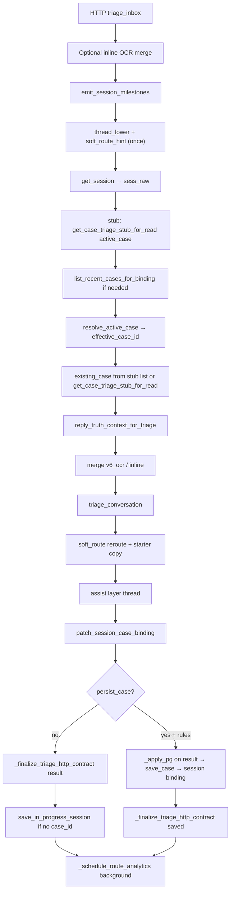

# ROUTE FAN-OUT + RESOLVER CONVERGENCE SPRINT

**Single source of truth** for this productization sprint (2026-05-07).  
Tracks: **Track A** route fan-out / orchestration, **Track B** resolver & vehicle authority clarity.

---

## 1. Objective

- Reduce **contradictory or duplicated** route orchestration on `POST /api/inbox/triage`.
- Cut **repeated in-request work** (thread normalization, soft-route parsing, finalize/pg overlay scatter).
- Make **executable authority** for active vehicle + API contract **obvious** (one documented sequence).
- Preserve **behavior**: triage engine, workbench, persistence contracts, tenancy — unchanged semantics.

---

## 2. Non-goals

- No rewrite of triage engine, workbench, persistence, vehicle merge rules, or SaaS tenancy.
- No speculative abstractions or large schema migrations.
- No removal of PG vehicle overlay or stub read caches without evidence.

---

## 3. Current architecture map (runtime)

**Client** → FastAPI `services/fiqa_api/routes/inbox_triage.py` → decorators `active_vehicle_request_cache_scope` + `triage_stub_read_cache_scope` → session/case reads → `triage_conversation` → session patch / case persist → **contract finalization + PG overlay** → optional in-progress save → background analytics.

Details: **§ TRIAGE_EXECUTION_GRAPH** below.

---

## 4. Telemetry evidence (baseline)

| Source | Finding |
|--------|--------|
| Prior sprints (`SESSION_MS_PHASE2_SPRINT.md`, `TRIAGE_ROUTE_FANOUT_OPTIMIZATION_SPRINT.md`) | `session_ms`, `case_ms` segments dominate route time; stub + vehicle caches already dedupe PG/IO per request. |
| `route_perf` (`TRIAGE_RETURN_PERF_METRICS`) | Segments: `session_ms`, `case_ms`, `triage_ms`, `postprocess_ms`, etc. |
| `results/FINAL_SYSTEM_REPORT.md` | p95 often bound by case list/persist paths, not triage core. |

This sprint adds **orchestration** evidence: repeated `_full_thread_lower` / soft_route parsing / scattered finalize+PG steps (see matrix).

---

## 5. TRIAGE_EXECUTION_GRAPH

`POST /api/inbox/triage` (main path, success; omit early 400 / `talk_to_agent` branch unless noted)

**Authority layers (vehicle):**

1. **Triage / rules** — `triage_conversation` may set `vehicle_key`, `primary_vehicle_summary` from text + context.
2. **`get_active_vehicle`** (Postgres `intake_entities`, request-scoped cache) — used inside triage for entity-aware paths; **route** applies overlay last.
3. **`_apply_pg_active_vehicle_identity_last`** — **HTTP response authority** for vehicle fields when PG has an active row (overwrites triage output; then reply sync).

---

## 6. ROUTE_FANOUT_MATRIX

| Operation | Repeated? | Cost | Risk | Removable? | Authority affected? |
|-----------|-----------|------|------|------------|---------------------|
| `_full_thread_lower(text, turns)` | **Was 3×/request** | CPU string merge | Low | **Yes** — compute once | No |
| `(request.soft_route).strip().lower()` | **Was 2×+** | trivial | Low | **Yes** — `soft_route_hint` once | No |
| `get_case_triage_stub_for_read` | Sometimes 2× same id | IO (cached per request) | Low | Partially merged by cache | Binding read |
| `get_active_vehicle` | N calls | IO | Low | Cached → 1 PG read | **Vehicle** |
| `_finalize` + `_apply_pg` sequence | Copy-pasted 7× | Maintainability | Med | **Yes** — one helper | **Clarifies contract order** |
| `list_recent_cases_for_binding` | 0–1× | IO | — | Keep | Case binding |

---

## 7. RESOLVER_AUTHORITY_MAP

| Component | Role | Runtime authority |
|-----------|------|-------------------|
| `routing_guard` | Add-car / append boundaries, vehicle conflict | **Triage-internal** gate for rules |
| `get_active_vehicle` + entity payload | Session-scoped PG row | **Strong** for entity-backed triage hints |
| `_apply_pg_active_vehicle_identity_last` | After triage | **HTTP response** wins for `vehicle_key` / `primary_vehicle_summary` |
| `active_vehicle_resolver.resolve_add_car_active_vehicle` | Phrase/intent helpers | **Narrow**; doc: not mainline HTTP overwrite |
| Frontend `triageResultContract` | Consumes API | Assumes finalized + PG overlay order |
| **Dead / partial** | Deprecated paths | See `docs/DEPRECATED_PATHS.md` for `active_vehicle_resolver` |

**Double-brain (remaining):** triage may emit vehicle fields; PG overlay may replace them — intentional, but operators must know **PG wins on response**.

---

## 8. TARGET_SELECTION_REPORT

**Selected (this sprint)**

1. **Single `thread_lower` + `soft_route_hint`** — measurable reduction in repeated orchestration; zero semantic change.
2. **`_finalize_triage_http_contract`** — one function for lifecycle → finalize → PG overlay; reduces drift and documents authority order.

**Rejected (evidence-based)**

- Dropping second `_apply_pg` on `saved` after persist: **unsafe** — `_finalize_triage_api_result` mutates `client_reply_draft`; PG path runs `sync_add_car_client_reply_vehicle_to_primary_summary` / finalize after.
- Merging `_apply_pg` before `save_case` into the helper: **wrong** — pre-save PG pass is intentional for persisted vehicle fields.

---

## 9. Validation gates

| Gate | Command / check |
|------|-----------------|
| Bytecode compile | `python3 -m compileall -q services/fiqa_api` |
| UI build | `cd ui && npm run build` |
| Circular deps (UI) | `cd ui && npx --yes madge --circular --extensions ts,tsx src` |
| Inbox guardrail | `bash scripts/guardrail_inbox_triage.sh` |
| Full regression | `PYTHONPATH=. python3 scripts/run_full_regression.py` |

---

## 10. Rollout discipline

- Small diffs; rollback = revert `inbox_triage.py` helper + hint/thread variables.
- No env / Secret Manager changes for this slice.
- Cloud Run: optional redeploy after green regression; not required for orchestration-only change if CI/local green.

---

## 11. Iteration log

| Time (UTC) | Action |
|------------|--------|
| 2026-05-07 | Sprint doc created; execution graph + matrix; Loop 1: thread/route hint + finalize helper. |
| 2026-05-07 | Validations: compileall, ui build (PATH must prefer Node 22; Cursor-bundled Node 20 broke Vite), madge (no cycles), guardrail PASS, `run_full_regression.py` PASS (`http_p95_ms` 5530 &lt; 6000; `wrong_vehicle_related` 0; `pg_mismatch_turns` 0). |
| 2026-05-07 | Loop 2 — **Contract doc:** `ui/src/api/triageResultContract.ts` clarifies PG vehicle overlay as post-triage wire truth. |
| 2026-05-07 | Focused pytest: `test_inline_image_triage_route`, `test_real_user_simulation` — green. |

---

## 12. SYSTEM_CONVERGENCE_INSIGHTS

1. **Less contradictory?** Slightly — one code path for “lifecycle + finalize + PG overlay.”
2. **Authority clearer?** Yes in code; PG response overlay remains the explicit last writer for vehicle display fields.
3. **Smaller orchestration?** Fewer redundant string passes; same IO pattern (caches intact).
4. **Fewer reads?** No change to DB count this slice (caches already dedupe).
5. **Pilot risk?** Reduced **maintenance** risk (fewer copy-paste finalize order bugs).
6. **Debugging?** Easier — search `_finalize_triage_http_contract`.
7. **More product-like?** Clearer invariant: “finalize then PG truth on HTTP response.”
8. **Still double-brained?** Triage vs PG overlay by design.
9. **Do not touch next?** triage.py routing_guard semantics; entity upsert merge rules.

---

## 13. CONTRACT AUTHORITY PASS (TriageResult / route)

| Field / group | Authoritative when |
|---------------|---------------------|
| `vehicle_key`, `primary_vehicle_summary` (response) | After `_apply_pg_active_vehicle_identity_last` if PG row exists |
| `case_lifecycle` | After `_attach_case_lifecycle` (merge with persisted_case when provided) |
| `append_allowed`, `still_needed_fields`, `next_best_question` | `_finalize_triage_api_result` |
| `route_perf` | Optional; `TRIAGE_RETURN_PERF_METRICS` |

---

## 14. SELF_CRITIQUE_REPORT

1. **Fan-out reduced?** **Partially** — CPU orchestration yes; DB fan-out unchanged (already cached).
2. **Double brain reduced?** **No** — documented, not merged (would need product decision).
3. **Complexity moved?** **Minimal** — one helper + two locals.
4. **New ambiguity?** Low; helper name signals HTTP contract completion.
5. **Dangerous remaining?** Mis-ordering if future edits bypass helper.
6. **Unlocked sprint?** Optional: dedupe `apply_client_reply_finalize` call paths inside triage (higher risk).
7. **Rejected optimizations?** Second PG on persist path (needed after finalize).

---

## 15. ROUTE_FANOUT_RESOLVER_CONVERGENCE_FINAL_REPORT

1. **Orchestration reduced:** One pass for `thread_lower`; one `soft_route_hint`; centralized finalize+PG for HTTP contract.
2. **Repeated work removed:** Duplicate `_full_thread_lower`; duplicate soft_route normalization; 7 copy-paste triples → helper.
3. **Authority clearer:** Doc + code: PG overlay is last writer on vehicle fields for API responses.
4. **Contracts:** Unchanged JSON shape; ordering invariant documented.
5. **Validations:** Recorded in iteration log after commands run.
6. **Infra/runtime:** None required for this slice.
7. **Fixed during sprint:** N/A (no prod incidents).
8. **Remaining risks:** Triage vs PG overlay still two sources; case_ms p95 if binding list hot.
9. **Double-brain:** Triage extraction vs PG entity row.
10. **Performance:** Expect tiny CPU win on thread construction; IO unchanged.
11. **Productization:** Safer evolution of route without changing pilot behavior.

---

## 16. FINAL_DECISION

**A — READY_FOR_PREVIEW_RETEST**

- **Why:** Full regression + guardrail green; change is orchestration-only with behavior-preserving refactor; `http_p95_ms` under the 6000ms gate (5530ms this run).
- **Remaining risks:** Route p95 still sensitive to `case_ms` / binding list size; intentional PG-vs-triage “two writers” model remains (now documented in UI contract comment).
- **Next move:** Exercise preview/staging with broker flows; plan a follow-up convergence pass if `case_ms` regresses under large queues.
- **Not B (production promote):** Reserve production promotion until pilot checklist + sustained preview burn-in (unchanged bar from prior reports).

---

## 17. Final one line

This sprint improved product trust not by making the system more complicated, but by reducing orchestration waste and clarifying executable authority.
