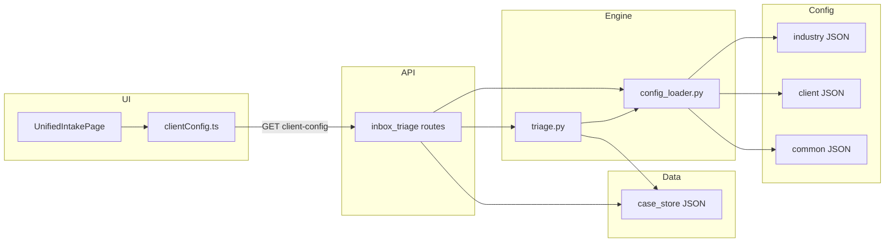

# Current Architecture Layer Map

**Audience:** Founder, future engineer, customer success.  
**Scope:** Unified Intake (inbox triage + case append + demo UI).

---

## 1. Layer table (responsibilities → where it lives)

| Layer | Responsibility | Primary locations | Notes |
|-------|----------------|-------------------|--------|
| **API / transport** | HTTP contracts, multipart, query params | `services/fiqa_api/routes/inbox_triage.py`, `app_main.py` | Some **business copy** still lives here (`REROUTE_MESSAGES`, `SOFT_ROUTE_STARTER_REPLIES`). |
| **Orchestration** | Multi-turn merge, LLM vs rule path, handoff vs next-ask, workflow fields | `triage.py` (`triage_conversation`, `_should_handoff`, `_get_next_ask_draft`) | Core **control flow** is code — correct for this stage. |
| **Business rule / heuristics** | Intent detectors, field extraction, category guardrails, append boundary | `triage.py` (`_is_*`, `_extract_*`, `_classify_append_case_boundary`, `_apply_append_case_boundary`) | Large surface area; **most fragile** if blindly moved to JSON. |
| **Config load / merge** | Load industry + client JSON, env-based client id | `config_loader.py` | Documented order: industry → client; **one gap:** `reply_overrides` path hardcoded to `chen_kui`. |
| **Industry content** | Markers, document labels, category templates, reply templates, add-car prompts | `configs/industries/insurance/*.json` | Strong productization win — tunable without deploy (where writable). |
| **Client content** | Handoff phrases, UI copy | `configs/clients/chen_kui/handoff_phrases.json`, `ui_copy.json` | Well isolated; portable. |
| **Common defaults** | Generic fallbacks when category config missing | `configs/common/workflow_defaults.json` | Small but important “safety net.” |
| **UI semantics** | Layout, state, merge of server copy with TS defaults | `ui/src/pages/UnifiedIntakePage.tsx`, `ui/src/api/clientConfig.ts` | **Copy** is largely config-driven; **behavior** is React. |
| **Persistence / append** | Case JSON, attachments, message history, validation | `case_store.py` | Engine-owned; not customer-specific. |
| **Regression battery** | Scenario packs + guardrail orchestration | `scripts/guardrail_inbox_triage.sh`, `scripts/run_*.py`, `configs/*_scenarios.json`, `configs/inbox_triage_scenarios.json` | Strong coverage; needs **index** for humans. |

---

## 2. “Common engine” today (de facto)

These behaviors are **customer-agnostic** in intent, even if strings leak in:

- Conversation merge and triage entrypoints (`triage_conversation`, `triage_for_append`, `triage_message`).
- Workflow state key set (`WORKFLOW_STATE_KEYS` in `triage.py`).
- Handoff timing policy (`_should_handoff`, add-car first-turn exception).
- Case store schema, limits, attachment rules (`case_store.py`).
- Optional LLM path vs rule path selection.

---

## 3. Industry-specific today

- Insurance intent **marker sets** and **document item** lexicon (`markers.json`).
- Category-specific broker/client templates (`category_templates.json`, `reply_templates.json`).
- Add-car **next-step prompts** (`add_car_rules.json`) — partially wired (see Externalization spec for schema drift).

---

## 4. Client-specific today

- Handoff reply phrases keyed by flow (`handoff_phrases.json`).
- All major **UI strings** and quick-start buttons (`ui_copy.json` + API `GET /api/inbox/client-config`).
- **Branding** in copy (e.g. “陈奎办公室”) — correctly placed in client pack.

---

## 5. Entanglement hotspots (read: technical debt, not shame)

| Hotspot | Symptom | Why it hurts portability |
|---------|---------|---------------------------|
| **String triplication** | Same intent described in markers, templates, route reroutes, UI defaults | Changing tone requires multiple edits; risk of drift. |
| **Hardcoded client path** | `get_reply_templates()` merges `configs/clients/chen_kui/reply_overrides.json` always | Second client won’t get overrides without code change. |
| **Boundary narratives in code** | `_apply_append_case_boundary` builds long ZH/EN replies inline | New broker may want different “new issue” wording without touching logic. |
| **Mega-module** | `triage.py` thousands of lines | Onboarding cost; harder to see “engine vs pack” without docs (this sprint fixes the doc side). |

---

## 6. Data flow (simplified)

---

## 7. How this maps to the target five-pack model

| Target pack | Current approximation |
|-------------|------------------------|
| Common engine | `triage.py` + `case_store.py` + core route wiring |
| Industry pack | `configs/industries/insurance/` |
| Client pack | `configs/clients/chen_kui/` + `CLIENT_ID` |
| Lexicon / rule maps | `markers.json`, `add_car_rules.json`, extraction helpers in code |
| Regression battery | `scripts/` + scenario JSON under `configs/` |

You are **closer** on industry + client packs than on **documented engine boundaries** and **string single-sourcing**.
