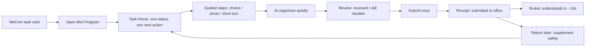
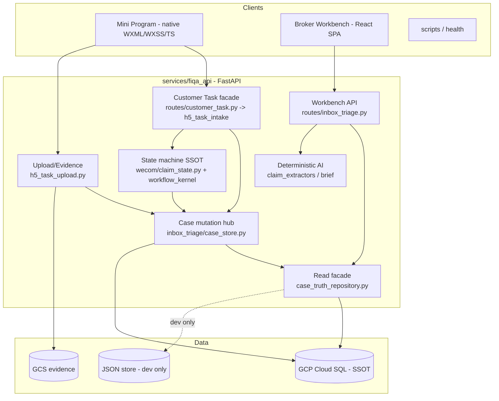
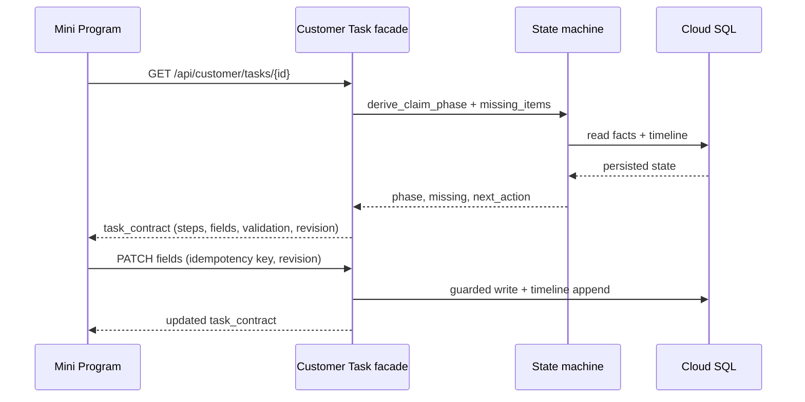
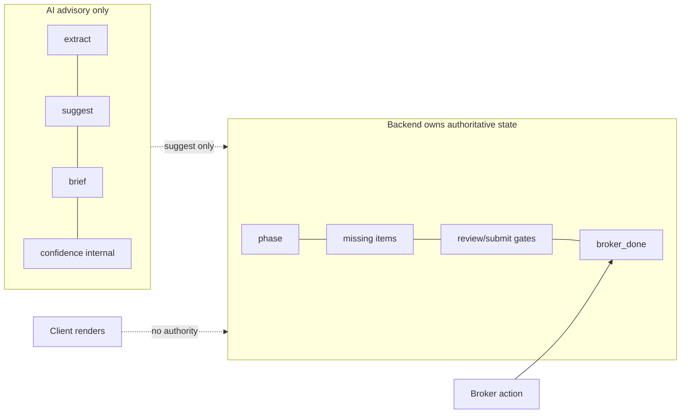
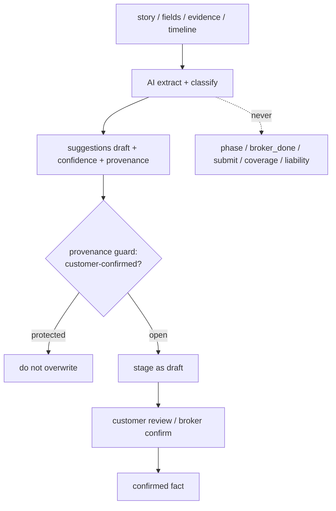
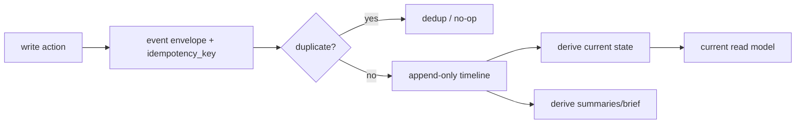
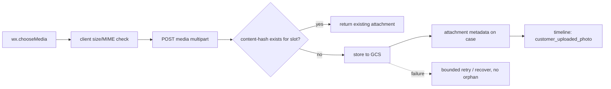
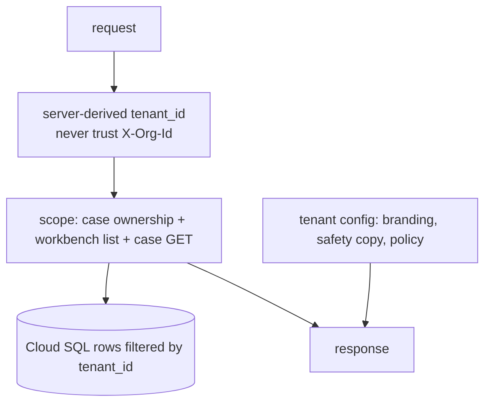
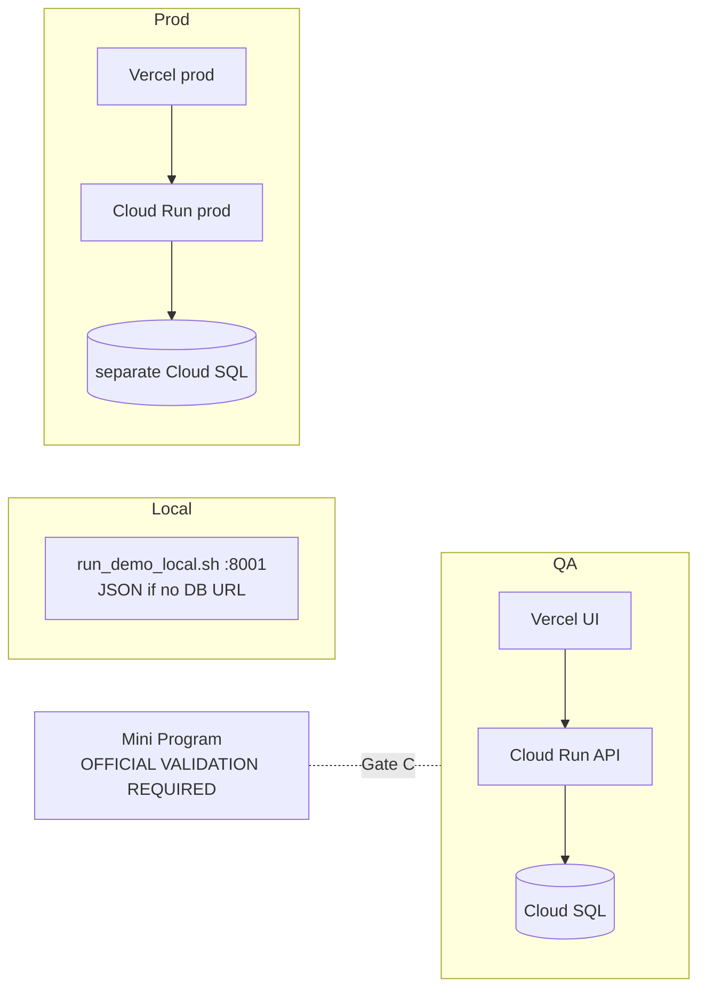
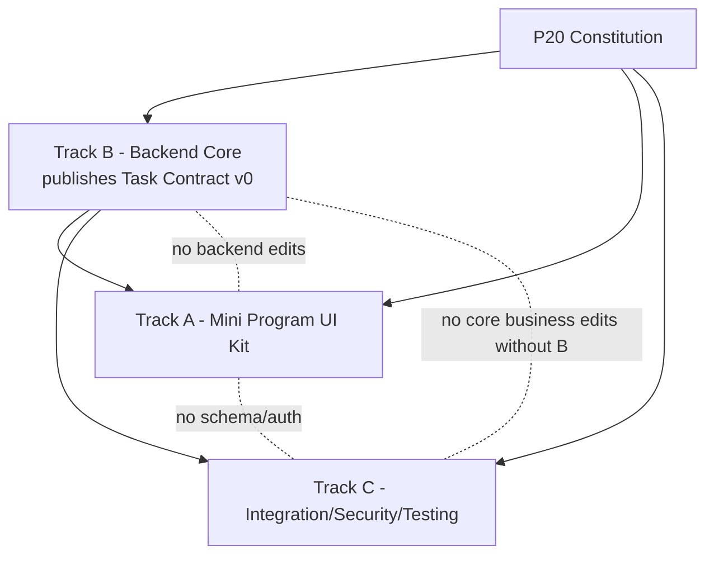

# P20 — Production Constitution & Master Design

> **Insurance Task Platform — highest-level product and engineering SSOT.**
> This document reconciles all prior P16 / P18 / P19 product, architecture, workflow, UX, AI, trust, and production-readiness documents with the P20 repository audit (`docs/design/p20_production_skeleton_repository_audit_2026_07_12.md`). Where older documents conflict, **this document resolves the conflict**. Older documents remain valid as evidence, historical record, or specialized module references.

---

## 1. Document Authority

| Field | Value |
|-------|-------|
| **Title** | P20 Production Constitution & Master Design |
| **Version** | `1.0.0` |
| **Status** | **RATIFIED — Founder approved production architecture baseline** |
| **Owner** | Founder (Andy). Drafting agent: Cursor P20-1 reconciliation. |
| **Date** | 2026-07-12 |
| **Branch at authorship** | `sprint/p16-trust-layer` — HEAD `c64c5d3` |
| **Durability target** | 1–2 years without a foundation rewrite |
| **Scope of authority** | Product identity, product principles, UX contract, Customer Task Contract, workflow ownership, event/timeline, evidence, AI boundary, multi-tenant, security/trust, reliability, data, API, observability, testing, deployment, scale, framework-vs-feature rules, milestone gates, implementation blueprint, and Cursor Agent governance for the **Insurance Task Platform** and its first vertical, **Claim Intake**. |

### 1.0 Ratification record

| Field | Value |
|-------|-------|
| **Ratification date** | 2026-07-12 |
| **Approver** | Founder Andy |
| **Review** | ChatGPT architecture review completed |
| **Scope** | Production Skeleton architecture and governance |
| **Note** | Implementation remains subject to milestone gates (§22) and module-level testing (§17). |

### 1.1 What this document governs

- The **product definition** of the Insurance Task Platform and its Claim Intake vertical.
- The **non-negotiable product principles** that all features must obey.
- The **durable engineering boundaries** (contracts, state ownership, tenant identity, AI limits, idempotency, audit) that may only change through explicit versioned amendment.
- The **governance rules** every future Cursor Agent must follow.

### 1.2 What this document does NOT govern

- Line-level implementation of any feature (belongs to module SSOTs and track prompts).
- Visual pixel design (belongs to the UX Kit and design assets).
- Historical decisions already recorded elsewhere — those remain in their own documents as evidence.
- WeChat/WeCom **official capability feasibility** — those remain **OFFICIAL VALIDATION REQUIRED** items (Gate C), never asserted as fact here.
- Operational run state (deploy status, live credentials) — that remains in `docs/CURRENT_PRODUCT_SHAPE.md` and runbooks.

### 1.3 Supersession rules

1. **This document wins cross-document conflicts** on product principle, architecture boundary, and governance.
2. `docs/CURRENT_PRODUCT_SHAPE.md` remains authoritative for **runtime/deploy truth** (ports, env flags, persistence posture). Where this Constitution and `CURRENT_PRODUCT_SHAPE.md` appear to conflict on *runtime state*, `CURRENT_PRODUCT_SHAPE.md` wins; where they conflict on *product principle*, this Constitution wins.
3. The `docs/design/p20_production_skeleton_repository_audit_2026_07_12.md` is authoritative for **current code reality** (what exists, risks, reuse %). This Constitution is authoritative for **what should be true**.
4. Older documents are **not** deleted or rewritten. They are classified in `docs/design/p20_ssot_migration_map_2026_07_12.md`.
5. Nothing here is literally immutable. "Frozen" means *changed only through explicit version bump + architecture review* (§21, §24).

### 1.4 Amendment process

1. Propose the change with rationale and repository evidence.
2. Classify it: does it touch a **Frozen boundary** (§21) or an **Extensible area** (§21)?
3. Frozen boundary → requires Founder approval + version bump of this document + a migration note.
4. Extensible area → may proceed through a normal track prompt referencing this Constitution.
5. Record the decision in the Decision Log (§29).

### 1.5 Reconciliation posture (important)

This is a **product and engineering constitution, not a feature specification.** It preserves validated principles, upgrades prototype-era rules to production-grade rules, and explicitly supersedes outdated H5-first, dual-input, Neon, and demo-only assumptions. It does **not** demand building every future capability now.

---

## 2. Product Identity

### 2.1 What the product is

**Insurance Task Platform.** A server-driven, task-oriented platform that lets an insurance broker office collect complex insurance information from its customers as a sequence of small, structured, recoverable tasks — then present each case to the broker as an understandable, sourced, auditable record.

- **First vertical workflow:** `Claim Intake` (auto accident first-notice information collection) for **North American Chinese-language insurance broker offices**.
- **Primary customer (buyer/operator):** the insurance broker office (pilot: Chen Kui / 陈总 office).
- **End user:** the policyholder / customer who reports an accident.
- **Operator:** broker staff (e.g. 吴小姐) who review and confirm cases.
- **System operator:** Founder / engineering (deploy, smoke, recover, audit).

### 2.2 What the product is NOT

The product is **not**: an insurance carrier system; a formal carrier claim-submission system; a coverage decision engine; a liability/fault decision engine; a quote/rating engine; a CRM replacement; an AI chat demo; a generic form builder.

### 2.3 Product value

| Stakeholder | Value |
|-------------|-------|
| **Customer** | "I only need to complete the next small step." Nothing lost in chat; always knows status; can return safely; submits once. |
| **Broker** | "I can understand this case in about 10 seconds." Structured, sourced, deduplicated; no scrolling 50 chat messages; broker owns the final decision. |
| **Office** | Less repeat asking, fewer missing materials, less review time, higher throughput — commercial time saved. |
| **Platform** | One codebase, tenant configuration; scales from one office to tens of tenants without a foundation rewrite. |

### 2.4 Customer promise

> Your accident information is collected once, safely, step by step. You always know what is done and what is next. Your confirmed facts are not silently changed. Submitting reaches your broker office — this is not a formal report to an insurance carrier.

### 2.5 Broker promise

> Every case arrives structured, sourced, and current. You understand it in ~10 seconds, you request more when needed, and **you** decide when it is done. The system advises; it never decides coverage, liability, or completion for you.

### 2.6 Non-goals (frozen)

Carrier filing/adjudication, coverage/fault/quote decisions, payment/disbursement, CRM/AMS replacement, AI-as-main-UI, generic no-code form builder, self-serve billing (Stripe), public multi-tenant admin portal *now*, OCR/ASR/voice/video *now*, Add-Car/Policy/Renewal product surfaces *now*.

---

## 3. North Star Experience

### 3.1 Canonical North Star

```text
Customer receives one task
  → opens one Mini Program surface
  → sees one current status
  → completes structured steps (buttons / selection / photo / short text)
  → provides free text or photos only when necessary
  → AI organizes quietly in the background
  → customer reviews
  → submits once
  → broker understands the case in ~10 seconds
  → customer can return later safely and supplement
```

### 3.2 Success feelings

| Actor | Feeling |
|-------|---------|
| Customer | Simple · structured · calm · obvious · recoverable · fast · trustworthy — even though the insurance workflow is complex. |
| Broker | Confident · fast · in control — "I understand this and I decide." |

### 3.3 Usability principles (extracted, not copied)

Inspired by task-driven operational apps (one-task-at-a-time driver apps such as Spark Driver), high-throughput ordering interfaces, guided-interview tax software, and WeChat Mini Program interaction expectations. **We extract reusable patterns; we copy no company's UI.**

- One current task; one current status; one next action.
- One primary CTA per screen; secondary actions demoted.
- Binary/selection steps preferred over free typing; each step is unambiguously done / not done.
- Verify-before-submit; submit-once; tap-once-know-it-worked.
- Resume exactly where left off; never lose input.
- Conversational recovery + human broker gate + durable case memory = the differentiation thesis (this is our moat, not a weakness).

### 3.4 Forbidden customer-visible concepts

`staging`, `inbox`, `draft fact`, `provenance`, `confidence`, `workflow lane`, `split`/`merge`, `service_lane`, `guided_workflow_state`, raw `claim_phase` names, `h5t1`, `token`, `external_userid`, `openid`, `case_id` as a user concept, `tenant_id`.

---

## 4. Product Constitution (Frozen Product Rules)

These are the **non-negotiable product principles**. They are reconciled from P16 (`P16_CUSTOMER_FIRST_CONSTITUTION.md`, `P16Z18_AI_BOUNDARY.md`, `NORTH_STAR_V1.md`), P18 (`p18_9_conservative_ai_red_team_risk_review.md` §15, `CASE_CONTRACT_V1.md`), and P19 (`p19h3h_master_design_summary` §1b–1d, `p19m0_unified_claim_mini_program_architecture_v1`). Each rule: **rule · rationale · allowed · prohibited · review question.**

> Numbering matches the 28 non-negotiable principles in the P20-1 mission brief. Principles that were *implicit* in P16 (named later in P19) are inherited here as first-class rules.

### 4.1 Customer Task First
- **Rule:** The customer experiences one current task, not a system of cases/lanes.
- **Rationale:** Customers are not case managers (P16 Rule 7/8; P19 §1d).
- **Allowed:** One current task thread; one landing surface.
- **Prohibited:** Customer-visible case pickers, lane switchers, multi-open incident lists.
- **Review question:** Does the customer ever have to choose between internal cases?

### 4.2 Structured Input First
- **Rule:** Structured buttons/selection/photo/scan/confirm are the primary intake; free text is secondary.
- **Rationale:** Fewer misroutes, less guessing, higher broker trust (P19 §1b).
- **Allowed:** Radio/choice steps, photo slots, short confirmations; one free-text story step.
- **Prohibited:** Chat-driven step prompts as the main path; LLM guessing "what step are we on."
- **Review question:** Is free typing required where a selection would do?

### 4.3 One Current Task · 4.4 One Current Status · 4.5 One Next Action
- **Rule:** Every screen surfaces exactly one task, one derived status, one obvious next action.
- **Rationale:** Spark-style clarity; kills "where am I?" (P19E-3 root cause; P19 North Star).
- **Prohibited:** Multiple competing statuses; ambiguous "done/not done."
- **Review question:** Can the customer state the next action in one sentence without help?

### 4.6 One Review · 4.7 One Submit
- **Rule:** A single pre-submit review; a single formal submit that is the broker handoff.
- **Rationale:** Verify-before-file; submit is ceremony and trust boundary.
- **Prohibited:** Multiple submit paths; chat "submit"; implying carrier filing.
- **Review question:** Is there exactly one formal submit, and is it idempotent?

### 4.8 One Primary CTA Per Page
- **Rule:** Each page has one primary CTA; other actions are secondary/overflow.
- **Rationale:** `CONTRACT_SIMPLICITY_AMENDMENTS.md` S11; Spark one-action.
- **Prohibited:** Two co-equal primary buttons.
- **Review question:** Which single button is primary on this page?

### 4.9 Append-first, Split-later
- **Rule:** Ordinary inbound content appends to the current task/timeline; AI/broker/backoffice split/merge/classify later.
- **Rationale:** Reduces customer cognitive load; backend owns exceptions (P19 §1d; `CASE_CONTRACT_V1` boundary rules).
- **Allowed:** Auto-append with provenance label; broker split.
- **Prohibited:** Customer-facing "is this a new accident?" for passive signals; silent cross-topic field merges.
- **Review question:** Does this force the customer to manage case boundaries?

### 4.10 Backend Owns Workflow State
- **Rule:** Phase, missing items, gates, and transitions are computed and persisted server-side (`wecom/claim_state.py`, `workflow_kernel.py`).
- **Rationale:** Deterministic, testable, channel-agnostic truth.
- **Prohibited:** Client-invented phases; client authoritative completion.
- **Review question:** Could a malicious/stale client change authoritative state?

### 4.11 AI Assists; Workflow Decides
- **Rule:** AI extracts/classifies/suggests/summarizes; the state machine and humans decide.
- **Rationale:** Auditability and trust (P18 §15; §10 of this doc).
- **Prohibited:** AI advancing phase, setting `broker_done`, submitting, deciding coverage/liability.
- **Review question:** Does any AI output directly mutate authoritative workflow state?

### 4.12 State and Timeline (distinct, mutually supporting)
- **Rule:** The **backend state machine maintains the authoritative current workflow projection**. Persisted facts and state transitions support that projection. The **append-only timeline is the historical audit** of what happened. Summaries and Broker Briefs are derived.
- **Rationale:** Reconstruct "customer said X → AI extracted Y → broker confirmed Z" (P18 four-layer model), while serving current state efficiently.
- **Allowed:** Validate or reconstruct current state from persisted facts/events where appropriate.
- **Prohibited:** Treating the timeline alone as the current-state store; treating current state as if it existed independently of the historical audit; requiring a full replay of the entire event history for every request; mutating past events.
- **Review question:** Can we replay how a fact came to be, without depending on full-history replay for normal reads?

### 4.13 Evidence Is Durable
- **Rule:** Uploaded evidence and its metadata are durable, associated to case/task/tenant, and never silently lost.
- **Prohibited:** Fire-and-forget uploads; orphaned GCS objects with no DB record on retry.
- **Review question:** If upload retries or the DB write fails, is evidence recoverable and de-duplicated?

### 4.14 Customer-confirmed Facts Cannot Be Silently Overwritten
- **Rule:** A field with provenance `customer_confirmed` / `h5_form` (→ `customer_task`) must not be overwritten by AI/WeCom extraction without an explicit, logged rule.
- **Rationale:** Trust contract; P20 audit R4.
- **Prohibited:** Silent clobber via supplement/regex merge.
- **Review question:** Is the write guarded by provenance?

### 4.15 Server-driven; Client-rendered
- **Rule:** The server emits the task descriptor (steps, fields, validation, next action, labels); the client renders it.
- **Rationale:** Adding a field or task that reuses an already-supported component type and contract version usually needs **no** client release; this kills UI hardcoding (P20 audit §5). Adding a **new component type, scan/media capability, navigation pattern, or breaking contract behavior may still require a Mini Program release** — this is not a promise of a generic form engine (§6.5).
- **Prohibited:** Field/step/route logic hardcoded per client page; overpromising a fully dynamic generic form/schema engine.
- **Review question:** Does this reuse an existing component type/contract version (usually no release), or introduce a new component type/capability (may require a release)?

### 4.16 Framework Before Features
- **Rule:** Build the smallest durable skeleton (contract, UI kit, tenant seam, reliability) before piling on features.
- **Review question:** Does this feature ride on the skeleton or fork it?

### 4.17 Reuse, Extract, Generalize — Do Not Rewrite
- **Rule:** Wire and extract what exists; do not rebuild services/platforms (P16 `NEVER_BUILD`; P20 audit ~82% reuse).
- **Prohibited:** New service/portal/engine when an existing seam works.
- **Review question:** Am I rebuilding something Z17/P19 already proved?

### 4.18 One Codebase; Tenant Configuration
- **Rule:** One Mini Program, **one codebase and one coherent product-logic platform**, many tenants via **tenant-configured behavior**. Deployment topology may evolve as scale and operational needs justify; do not introduce new services now.
- **Prohibited:** Per-tenant code forks; standing up new services prematurely.
- **Review question:** Does this require a per-tenant code fork, or a new service that tenant configuration could avoid?

### 4.19 Production-first; Pilot-sized Implementation
- **Rule:** Follow durable production boundaries, but implement only pilot-sized scope now.
- **Rationale:** Production-ready ≠ every future feature; ≠ launched production operations.
- **Review question:** Am I confusing "durable boundary" with "build everything now"?

### 4.20 Scale Without Foundation Rewrite
- **Rule:** Design so growth to hundreds–thousands of users and tens of tenants is config + capacity, not re-architecture.
- **Review question:** What breaks at 10× that a boundary now would prevent?

### 4.21 Complex Business; Simple Customer Frontend
- **Rule:** The customer frontend stays simple even as backend business logic grows.
- **Review question:** Did backend complexity leak into the customer UI?

### 4.22 Fewer Text Fields; More Selection, Photo, Scan, Confirmation
- **Review question:** Can this text field become a choice, photo, or confirmation?

### 4.23 Failure Must Be Recoverable · 4.24 No Infinite Retry · 4.25 No Silent Failure · 4.26 No Duplicate Logical Submission
- **Rule:** Every failure has an actionable recovery; retries are bounded; failures are surfaced; logical submissions are idempotent.
- **Rationale:** P19 smooth-UX locks; P20 audit R5/R11/R12.
- **Review question:** Does every error path have a bounded, visible, recoverable outcome and idempotency key?

### 4.27 Customer Never Manages Internal Cases, Lanes, Splits, or AI Confidence
- **Review question:** Is any internal concept leaking to the customer?

### 4.28 Unverified WeChat Capabilities Must Never Be Stated as Facts
- **Rule:** Every WeChat/WeCom capability is labeled **CONFIRMED**, **ASSUMED FOR PROTOTYPE**, or **OFFICIAL VALIDATION REQUIRED** (P19M Lock 2).
- **Prohibited:** Writing unverified capability as a business dependency or fact.
- **Review question:** Is every platform capability claim labeled?

---

## 5. UX Constitution

### 5.1 Standard page anatomy

```text
[ Title ]                     ← what this task is (customer language)
[ Current status ]            ← derived, simplified label
[ Progress ]                  ← n / total completed (no fake bars)
[ Current task / question ]   ← one thing to do now
[ Required information ]      ← received ✓ / still needed ○
[ PRIMARY ACTION ]            ← exactly one
[ secondary action ]          ← optional, demoted
[ help / retry ]              ← recovery + contact broker
[ safety footer ]             ← tenant disclaimer (not a carrier report)
```

### 5.2 Shared states (every task surface must handle)

`initial` · `loading` · `saving` · `saved` · `uploading` · `retryable_error` · `blocking_error` · `empty` · `completed` · `submitted` · `broker_follow_up` · `expired/archived`.

### 5.3 Interaction rules

| Interaction | Rule |
|-------------|------|
| Buttons | Disabled + spinner during in-flight; never leave the user guessing. |
| Selection / yes-no | Preferred over text; single-tap advances or reveals next. |
| Photo | Native capture; slot-labeled; thumbnail preview; content-hash dedup. |
| Scan | Future; behind adapter; not a prototype dependency. |
| Short text | Inline validation; minimal length rules from server. |
| Long text | Single "story" step; AI organizes silently; editable at review. |
| Confirmation | Confirmation over re-entry; confirming is cheaper than retyping. |
| Review | Read-only summary of received / still-needed / photos; edit links. |
| Receipt | Clear "submitted to office" + next steps + supplement CTA. |
| Resume | Returns to same task/case; submitted state persists. |

### 5.4 Mini Program Task UI Kit (target)

Server-driven, contract-rendered components. Build the smallest durable set; do not implement all at once.

`TaskShell` · `TaskStatusCard` · `TaskProgress` · `TaskField` · `TaskChoice` · `TaskPhoto` · `TaskCTA` · `TaskLoading` · `TaskError` · `TaskReview` · `TaskReceipt`.

Plus a shared **page behavior** (`taskPage` mixin: token-guard, load, error wrap, save-and-return) — this directly retires the per-page duplication in P20 audit §5.

**Ownership:** The Task UI Kit is product-specific and stays ours. WeChat native components first; TDesign may be selectively used for stable commodity UI; **no whole-app framework rewrite** (no Taro/React/Vue/uni-app).

---

## 6. Customer Task Contract

The **stable, server-driven client contract**. The Mini Program renders it; it must not depend forever on scattered legacy H5 implementation details. Emit it additively from the intake API (`intake_info_for_token`) → later behind `/api/customer/tasks/*`.

### 6.1 Task and case identity (conceptually separate)

- **`task_id` and `case_id` are conceptually separate identifiers.** `task_id` is the opaque handle the customer surface uses; `case_id` is an internal record identity the customer never sees or manages.
- **Current Claim Intake mapping:** one active customer task **may** map 1:1 to one internal case. This convenience mapping is *implementation-current*, **not a permanent identity invariant** — Agents must not assume or encode `task_id == case_id` as durable truth.
- **Future:** a single internal case may contain **multiple tasks**, and (see §6.6) a customer may in future see more than one customer-safe task — without ever exposing internal case identity, lanes, splits, or merges.
- **Customer boundary:** customers never see or manage internal case identity. `case_id` and `tenant_id` are bound to the task **on the backend only**.

### 6.2 Customer-safe payload

The customer-facing Mini Program receives **only** the customer-safe projection below. It **must not** directly expose `tenant_id`, internal `case_id`, raw internal `phase`, provenance internals, confidence, lanes, or split/merge details.

```jsonc
{
  "contract_version": "1",
  "task_id": "task_a1cf5dfea5c6",       // opaque customer handle; NOT the internal case_id
  "task_type": "claim_intake",
  "task_status": "collecting",          // customer-safe projection of internal phase
  "title": "我的事故资料",
  "instruction": "请补充事故时间和车损照片",
  "progress": { "completed": 3, "total": 6 },
  "sections": [
    {
      "key": "story",
      "label": "事故经过",
      "component_type": "long_text",
      "required": true,
      "status": "received"
    },
    {
      "key": "injury",
      "label": "受伤情况",
      "component_type": "choice",
      "required": true,
      "choices": [ {"value":"no","label":"没有受伤"}, {"value":"yes","label":"有人受伤"} ],
      "validation": { "required": true },
      "status": "received"
    }
  ],
  "fields": { "anyone_injured": "no", "accident_datetime": "2026-07-08T10:00:00" }, // customer's own confirmed data only
  "missing_items": [ {"key":"customer_damage_photo","label":"车损照片"} ],
  "evidence_requirements": [
    {"slot":"customer_damage_photo","label":"车损照片","min":1,"received":0}
  ],
  "next_action": { "type":"go_to_section", "target":"photos", "label":"继续填写" },
  "review_ready": false,
  "submit_ready": false,
  "revision": 7,                        // optimistic-concurrency token (customer-safe)
  "timestamps": { "updated_at": "2026-07-12T06:11:15Z" },
  "capabilities": { "voice": false, "scan": false },
  "branding": { "office_name": "陈总办公室", "safety_copy": "此记录用于办公室整理事故信息，不代表已向保险公司正式报案" },
  "error": null                          // safe customer-facing error state when set
}
```

The customer-safe payload may carry: opaque `task_id`, customer-safe `task_status`, `title`, `instruction`, `progress`, `sections`, `fields` (the customer's own data), `missing_items`, `evidence_requirements`, `next_action`, `review_ready` / `submit_ready`, `revision`, `timestamps`, `capabilities`, `branding`, and a safe `error` state.

### 6.3 Internal / server-side binding (never sent to the customer)

The backend internally binds each task to its case and tenant and tracks internal workflow detail. This context lives in request/server-side scope and internal read models — **never** in the customer payload.

```jsonc
// server-side only — NOT emitted to the Mini Program
{
  "task_id": "task_a1cf5dfea5c6",
  "case_id": "case_a1cf5dfea5c6",       // internal record identity
  "tenant_id": "chen_kui",              // server-derived; never trusted from client
  "phase": "other_party_complete",      // raw internal state-machine phase
  "provenance": { /* per-field source/history */ },
  "confidence": { /* AI internal */ },
  "lanes": { /* routing/split/merge internals */ }
}
```

### 6.4 Field classification

| Class | Examples | Rule |
|-------|----------|------|
| **Authoritative** | `task_status`, `submit_ready`, `revision` (customer-safe) | Server-owned; derived from state machine. |
| **Derived** | `progress`, `missing_items`, `next_action`, `title`, `instruction` | Computed; never client-authored. |
| **Customer-confirmed facts** | fields with provenance `customer_task`/`h5_form` | Protected (§4.14). |
| **AI suggestions** | draft extractions | Never auto-promoted; shown at review only; never expose confidence. |
| **Broker-controlled** | `broker_done`, needs-more-info | Set only by authenticated broker action. |
| **Internal-only (never emitted to customer)** | `tenant_id`, internal `case_id`, raw `phase`, lanes, provenance internals, confidence, split/merge | Bound server-side only (§6.3); excluded from customer payload. |

### 6.5 Server-driven scope (precise, not absolute)

- Adding a field or task that uses an **already-supported component type and contract version** will **usually not** require a Mini Program release.
- Adding a **new component type, scan capability, media capability, navigation pattern, or breaking contract behavior** may require a Mini Program release.
- This is **not** a promise of a fully dynamic, generic form engine (see §6.6).

### 6.6 Rules

- Do **not** expose AI confidence, internal lanes, provenance internals, liability, coverage, split/merge internals, `tenant_id`, internal `case_id`, or raw `phase` to the customer.
- Do **not** build a generic form/schema engine now — emit a concrete task descriptor with fixed component types.
- **Multiple customer tasks (future, do not implement now):** the current Claim pilot presents **one active accident task**. Customers do not manage internal cases, lanes, splits, or merges. In a future legitimate situation with multiple active customer tasks, the platform may show a **simple customer-safe task list** — this must not expose internal case-management complexity.
- `contract_version` gates breaking changes; additive fields do not bump it.

---

## 7. Workflow Constitution

### 7.1 Ownership

Backend owns state. Phase and missing items are **derived** by `derive_claim_phase()` / `get_claim_missing_items()` over persisted facts + timeline; the workflow kernel (`workflow_kernel.py`, `workflow_definitions.py`) is the slot/gate SSOT.

### 7.2 Lifecycle (Claim vertical)

`claim_started → accident_basics_in_progress → accident_basics_complete → photos_in_progress → photos_complete → other_party_* → summary_ready → (missing | review_ready) → intake_ready_for_broker → broker_review → (broker_needs_more_info) → broker_done → archived/expired`.

- **Review gate:** all required fields + required evidence present.
- **Submit gate:** `review_ready` and not already submitted; idempotent via `submit_intent_id`. (Audit R12: submit gate must not be weaker than kernel required slots — document intent or align.)
- **broker_review / broker_done:** broker-only, idempotent, end-card + timeline (`mark_claim_broker_done`).
- **Manual takeover:** high-risk (injury etc.) → manual handle path.
- **Dead transition:** wire or remove `transition_to_broker_needs_more_info()` (audit).

### 7.3 Long-running cases

Dormant cases **live in the database and do not consume CPU**. No always-on process per case. Reminders/timeouts are scheduled, not spun.

### 7.4 Configurable business limits (tenant policy + system defaults)

Task window, reminder count, retry count, inactivity timeout, broker escalation, archive policy. **Avoid a single hard-coded 14-day limit** — use tenant-configurable policy with system defaults.

---

## 8. Event and Timeline Constitution

### 8.1 Distinct event kinds (do not conflate)

`domain event` (business fact) · `timeline event` (customer/broker-visible audit) · `audit event` (security/compliance) · `operational log` (engineering) · `analytics event` (`mp_*`).

### 8.2 Event envelope

`event_id` · `event_type` · `case_id` · `task_id` · `tenant_id` · `actor_type` · `actor_id` · `source` (`source_channel: customer_task`) · `correlation_id` · `idempotency_key` · `occurred_at` · `payload_version` · `payload` (safe, redacted).

### 8.3 Rules

- **Append-only**; past events are never mutated.
- **Duplicate protection:** dedup by `idempotency_key` (e.g. `customer_submitted_intake` by `submit_intent_id` — audit fix).
- **Ordering:** per-case ordering by sequence; cross-case ordering not assumed.
- **State vs history:** the state machine maintains the authoritative current workflow projection over persisted facts and transitions; the timeline is the append-only historical audit. Current state may be validated or reconstructed from facts/events where appropriate, but the system is **not** required to replay the entire event history for every request. The timeline is **not** the sole current-state store, and current state does **not** exist independently of the historical audit.
- **Redaction/retention:** no PII in payloads beyond necessity; retention per tenant/data policy.
- **Derived summaries** (briefs) are recomputable, never authoritative.

> **Backend state machine owns the current projection; timeline is the historical audit that supports and can reconstruct it.**

---

## 9. Evidence Constitution

### 9.1 Evidence identity & metadata

`evidence_id` · file metadata (filename, `content_type`, `size`) · `storage_ref` (GCS path) · `checksum` (content SHA-256) · `uploader` (actor) · case/task association · `tenant_id` · `slot`/`type` · timestamps · provenance · review status · deletion/retention policy.

### 9.2 Upload requirements

Size limit (5MB customer / 10MB workbench, ≤10 attachments — existing) · MIME validation · timeout · bounded retries · **content-hash dedup per slot** (`{case}:{slot}:{sha256}`) · partial-failure recovery (no orphaned GCS on DB failure) · customer feedback per slot · virus/malware scan **readiness** · signed-URL **readiness** · privacy protections (cross-border media disclosure — Gate C item).

**Harden:** unify workbench attachments onto GCS (audit — currently local disk).

---

## 10. AI Constitution

### 10.1 Inputs

Story · structured fields · evidence metadata · OCR/ASR outputs (only if introduced later, behind adapters) · timeline · broker instructions · tenant rules.

### 10.2 Outputs

Extracted facts · suggestions · normalized values · missing candidates · contradictions · summary · broker brief · next-step recommendation · confidence · provenance. **Confidence/provenance are internal — never shown to the customer.**

### 10.3 Boundaries

| AI **may** | AI **may NOT** |
|------------|----------------|
| extract, classify, prefill, detect missing info, detect contradictions, summarize, recommend next step, produce broker brief, attach confidence/provenance | determine authoritative workflow phase; submit a claim; set `broker_done`; decide liability; decide coverage; silently overwrite customer-confirmed facts; formally report to a carrier |

### 10.4 Trust rules

- **Suggestion vs confirmed fact:** suggestions are draft; promotion requires structured or broker/customer confirmation.
- **Conflict handling:** surface `conflict_flags[]` + prior value to broker; never silent overwrite (§4.14).
- **Model/prompt versioning:** track `model_version`, `prompt_version` on AI outputs.
- **Fallback/timeout/cost:** deterministic fallback (Claim path is currently deterministic, no LLM — keep auditable); timeout → keep raw input; per-tenant cost controls; human review for high-risk.
- **Forbidden phrasing** (P18 §15): 「已经加好了」「可以开车了」「能便宜 $X」「建议报/不报」「停保应该没关系」「系统已自动处理完毕」.

> **AI never owns critical workflow state.** Enforce provenance-guarded merge at the write layer *before* any LLM extraction is added to the Claim path.

---

## 11. Multi-Tenant Constitution

### 11.1 Model

One Mini Program codebase · **one coherent product-logic platform** · many tenants via **tenant-configured behavior**. Deployment topology (how many services/instances) **may evolve as scale and operational needs justify** — but do **not** introduce new services now. `client_id` plumbing + `configs/clients/<id>/` packs are the existing seam; introduce `tenant_id` (default = `client_id`).

### 11.2 Requirements

`tenant_id` **server-derived** (never trusted from a spoofable client header like `X-Org-Id`) · case ownership by tenant · broker membership · customer-to-tenant relationship · data isolation · query scoping (workbench list + case GET scoped to resolved tenant) · API authorization · Workbench scoping · branding · task configuration · reminder policy · integration secrets · feature flags · audit · test-data isolation.

### 11.3 Staged timing

| Stage | Requirement |
|-------|-------------|
| **Before family demo** | Tenant abstraction may be minimal (single hardcoded Chen config). |
| **Before Chen Kui pilot** | Authoritative single-tenant binding + **Workbench auth** required (no anonymous broker API). |
| **Before second broker** | **Tenant isolation + scoped querying mandatory** (audit R3 blocker). `tenant_id` cannot be postponed past the second broker. |
| **Before broader production** | Tenant configuration + operational controls mature. |

**Do not build a full tenant admin UI now.**

---

## 12. Security and Trust Constitution

### 12.1 Baseline

- **No anonymous Workbench APIs** — authorization on every broker endpoint (audit R1 blocker; `UNIFIED_INTAKE_INTAKE_API_KEY`).
- Signed customer task links · token expiry (24h/72h TTL today) · token rotation · secret management (Secret Manager in prod; plaintext only in gitignored local files) · rate limiting (exists; enable by default) · upload constraints · least privilege · PII-safe logging · encrypted transport (HTTPS only) · encrypted storage · environment separation · test-data labeling.
- **No production secret in local files committed to Git; no customer data in Git.**
- Auditability of every state-changing action.

### 12.2 Staged Workbench authentication maturity

Broker/Workbench authentication matures in stages. Each stage is a *temporary control*, not the final architecture.

| Stage | Workbench auth requirement |
|-------|----------------------------|
| **Family demo** | Local-only access may be accepted (no remote broker exposure). |
| **Chen Kui internal pilot** | An API key **or** a minimal authenticated session may be used as a **temporary** pilot control. |
| **Real production** | Require authenticated **user identity**, **role**, **tenant membership**, **session/JWT or equivalent authorization**, **scoped queries**, **audit**, and **revocation**. |

> **`UNIFIED_INTAKE_INTAKE_API_KEY` is not the permanent Broker identity architecture.** It is an interim pilot control only; real production requires per-user authenticated identity with role and tenant membership as above.

### 12.3 Staged security separation

| Before internal pilot | Before WeChat submission | Before real production customers |
|-----------------------|--------------------------|----------------------------------|
| Workbench auth on (interim key/session); token links; no secrets in Git | Privacy/PII disclosure; production identity (wx session + openid binding — OFFICIAL VALIDATION REQUIRED); category/entity compliance | Full authenticated user identity + role + tenant membership; full tenant isolation; rate limit default on; audit-grade logging; secret rotation; revocation |

---

## 13. Reliability Constitution

Idempotency (submit/upload/field dedup keys — exist) · optimistic concurrency (add `revision`/`updated_at` check on append — audit R5) · transaction boundaries (single-transaction or PG advisory-lock submit) · stale-client protection (revision check) · retries with exponential backoff · timeouts (30s/60s exist) · circuit-breaking readiness · dead-letter/manual recovery · resume · cached safe fallback · duplicate upload handling (content hash) · duplicate submit handling (`submit_intent_id`) · **exactly-once business effect vs at-least-once delivery** · DB connection pooling (audit: currently connect/close per call) · Cloud Run scaling · Cloud SQL connection limits · backup and recovery.

> **Do not overpromise distributed exactly-once processing.** Guarantee *exactly-once business effect* via idempotency keys over *at-least-once* delivery.

---

## 14. Data Constitution

### 14.1 Frozen data truths

- **GCP Cloud SQL** (`caseiq` on `caseiq-pilot-pg`) is the **only active database SSOT**.
- **JSON store is test/dev-only** (`RUN_DEMO_LOCAL_DB=json`; forbidden when `ENV=prod` or PG-primary writes on).
- **Legacy Neon is decommissioned**: audited, backed up (`~/secure_backups/...`), credentials disabled, project deleted, stripped at startup (`strip_neon_database_urls_from_env`), blocked in deploy, retained only as break-glass read-only audit tooling. **Do not reintroduce Neon.**

### 14.2 Data domains

Customer facts · workflow state · evidence metadata · timeline · AI suggestions · broker decisions · provenance · retention · archive · soft deletion · test data (tagged `demo_name` / `workbench_test`, reset deletes only tagged rows).

Tables (existing): `service_records` (+ `extra` JSONB), `record_messages`, `structured_record_data`, `state_history`, `office_actions`, `intake_sessions`, `intake_entities`, WeCom queue tables.

### 14.3 Production risks requiring **future** schema/persistence change (do NOT perform now)

- **R2:** persist `h5_intake_state` (+ `known_fact_provenance`) into PG `extra` allowlist (currently dropped on PG-primary reload) — **BLOCKER before real production**.
- Optimistic-concurrency version column; `state_history` dedup/bounding.
- Any migration requires explicit Founder approval + a gated plan.

---

## 15. API Constitution

### 15.1 Layers

Customer Task API (`/api/customer/tasks/*` facade over H5 handlers) · Upload/Evidence API · Broker Workbench API (`/api/inbox/*`) · Internal AI API · Admin/config API (**deferred**) · integration adapters.

### 15.2 Standards

Versioning · authentication · authorization · error envelope (customer-safe message + internal diagnostic code) · correlation ID · idempotency key · revision · pagination · rate limiting · retry semantics.

### 15.3 The facade is the stable client contract

The Customer Task facade is the durable client interface. **The Mini Program must not depend directly on scattered legacy H5 implementation details forever.** Prototype may call H5 paths directly via an adapter; production migrates to neutral `/api/customer/tasks/*` names (delegating to existing handlers — no business-logic rewrite).

---

## 16. Observability Constitution

### 16.1 Minimum production telemetry

request ID · correlation ID · tenant ID · case ID · task ID · actor · latency · API result · upload result · state transition · AI latency/cost/model · submit outcome · retry count · error class · Workbench visibility.

### 16.2 Before real production

DB connectivity probe in `/readyz` (audit R6) · logs enriched with `case_id` + `tenant_id` · dashboards for submit funnel, upload success, latency, error class · alerts on auth-posture regression and persistence posture. **Never log sensitive content or tokens.**

---

## 17. Testing Constitution

### 17.1 Required layers

pure unit · state machine · Task Contract · API contract · idempotency · concurrency/double-submit · persistence (PG parity: submit → PG write → workbench readback) · tenant isolation · authorization · upload failure · retry/timeout · resume · AI boundary · Workbench readback · Mini Program logic · DevTools manual acceptance · real-device · pilot scenario.

### 17.2 Gate mapping (must pass before)

| Gate | Must pass |
|------|-----------|
| **Family demo** | Existing 181 focused tests green; DevTools journey. |
| **Chen Kui pilot** | + 5-test hardening module: workbench list scoped to tenant; token cannot load other case; duplicate/concurrent submit idempotent; workbench GET requires broker token when configured; submit → PG readback (proves R2). |
| **WeChat submission** | + real-device; privacy/compliance manual checklist (feasibility items, never auto-PASS). |
| **Real customer production** | + tenant isolation, concurrency, auth, observability suites. |

**Never mark unverified manual items as PASS.**

---

## 18. Deployment and Environment Constitution

Local dev (`run_demo_local.sh`, port 8001; JSON only without DB URL) · isolated automated tests (temp JSON) · QA/pilot (Cloud Run + Cloud SQL) · production (separate Cloud Run + separate Cloud SQL instance) · secrets (Secret Manager) · static frontend (Vercel for H5/workbench) · Mini Program configuration · HTTPS domain · WeChat request/upload/download domains · rollback · migration · feature flags.

**Paid-pilot hard requirements** (from `CURRENT_PRODUCT_SHAPE.md`): `PRODUCT_ONLY=1`, PG-primary reads+writes, no JSON writes/fallback, intake+support API keys, no `DEMO_MODE` on prod.

> **Do not claim WeChat publication feasibility as confirmed.** It remains a Gate C feasibility item.

---

## 19. Scale Constitution

Design for: hundreds–thousands of customers · several–dozens of broker tenants · bursty photo uploads · long-lived but mostly dormant cases · configurable reminders · AI background processing · Workbench operations.

- **Dormant cases live in the DB and do not continuously consume CPU.**
- Likely bottlenecks: DB connections, uploads, queries, AI calls, operational complexity — **not** raw compute.
- A workflow execution engine (Temporal/Camunda) **may** be introduced *later* as execution infrastructure **only when operational complexity justifies it** — never now. Business Task Schema and Case truth remain ours regardless.

**Do not promise explosive growth. Design so that if growth happens, no foundation rewrite is required.**

---

## 20. Framework versus Feature Rules

A new request is one of: a new **task**, a new **field**, a new **evidence requirement**, a **tenant configuration**, a **workflow rule**, a **reusable component**, or a genuinely new **platform capability**. Classify before building.

Every new feature must answer:

1. Can this use the existing **Task Contract**?
2. Can this use the existing **UI Kit**?
3. Can this use the existing **state machine**?
4. Can this use the existing **Evidence and Timeline** contracts?
5. Does it introduce a new framework unnecessarily?
6. Does it weaken tenant isolation?
7. Does it violate AI boundaries?
8. Can it recover from interruption?

If a request is a new field/task/config, it should be **data/config**, not new code paths.

---

## 21. What Is Frozen versus Extensible

### 21.1 Frozen (change only via explicit versioning + architecture review)

Product principles (§4) · customer task mental model · backend state authority · Task Contract versioning · event envelope · evidence identity · tenant identity · AI boundary · idempotency rules · audit requirements.

### 21.2 Extensible (normal track work)

Task types · fields · tenant branding · reminders · evidence slots · AI prompts/models · broker brief format · integration adapters · UI presentation details.

> Nothing is literally "never change." **Frozen** = changed only through explicit versioning and architecture review, not casually rewritten by feature Agents.

---

## 22. Milestone Readiness Gates

| Gate | Product | Security | Reliability | Testing | Compliance | Acceptable deferrals | Blockers |
|------|---------|----------|-------------|---------|------------|----------------------|----------|
| **A — Family Demo** | Full Claim loop on DevTools; Task Home→Submit→Receipt→Resume | Local posture; token launch | Idempotent submit; timeouts | 181 focused green + DevTools journey | none | voice/OCR/tenant admin/multi-tenant | Mint fresh token; run demo |
| **B — Chen Kui Internal Pilot** | Single real broker; workbench readback | **Workbench auth on (R1)**; signed links | **R2 persistence**; DB readiness probe (R6); provenance-guard (R4 partial) | 5-test hardening module | tenant single-binding | full isolation; concurrency hardening | R1, R2, R6, tests |
| **C — WeChat Submission** | Native launch identity | wx session + openid binding; privacy/PII disclosure | — | real-device | **overseas entity, 类目, WeCom→MP card, US-user access — OFFICIAL VALIDATION REQUIRED** | white-label branding limits | feasibility (not code) blockers |
| **D — Real Customer Production** | Multi-task / 2nd broker | Full auth + rotation + rate-limit default | **R3 tenant isolation**; **R5 concurrency**; pooling; transactional submit | tenant isolation + concurrency + auth suites; backup/retention runbook | per-tenant secrets/config | — | R3, R5 |

---

## 23. P20 Implementation Blueprint (14-day, skeleton-first)

**Days 1–5 build the Production Skeleton foundations** (interfaces before consumers). Three **exclusive** tracks; **Track B publishes stable contracts before A and C depend on them.** The single interface SSOT is `docs/design/p20_task_contract_v0.md` (to be created by Track B).

### Track A — Mini Program Task UI Framework
- **Owns:** `miniapp/behaviors/**`, `miniapp/components/**`, `miniapp/pages/**`, `miniapp/types/task.ts`, `miniapp/app.wxss`, `miniapp/package.json` (new).
- **Must NOT own:** any `services/**`, `routes/**`, backend tests, DB schema, broker auth.
- **Goals:** Task UI Kit (behavior + components), contract-driven pages, MP test runner.
- **Depends on:** Track B Task Contract shape (blocking until ~Day 2).
- **STOP gates:** contract shape frozen before consuming; Lock 1 ("feels native, not an H5 re-skin?"); no new task types.
- **Deliverables/acceptance:** DevTools full journey unchanged; MP logic tests green; per-page lifecycle duplication removed.

### Track B — Workflow and Backend Core
- **Owns:** `inbox_triage/h5_task_intake.py`, `h5_task_upload.py`, `case_store.py`, `wecom/claim_state.py`, `db/service_record_repository.py`, new `routes/customer_task.py`, `workflow_definitions.py`.
- **Must NOT own:** `miniapp/**`, `ui/**` (workbench), unrelated verticals; DevTools UI behavior beyond API contract.
- **Phase 1 goals (this skeleton slice — owns ONLY these four):**
  1. **Customer Task Contract v0** (additive emission; the interface SSOT for A and C).
  2. **R2** Postgres persistence completeness for intake state/provenance (persist `h5_intake_state` + `known_fact_provenance`; no loss on PG-primary reload).
  3. **R4** provenance-guarded merge (customer-confirmed facts not silently overwritten).
  4. Required **regression** and **PG-parity** tests.
- **Deferred to a later approved slice (do NOT overload the 3–5 day skeleton sprint):** optimistic concurrency; connection pooling; transactional submit redesign; broad event/evidence dedup redesign. These remain important production hardening (see §13, §22 Gate D) but are only pulled forward if evidence shows they are immediate blockers.
- **Depends on:** none (foundation).
- **STOP gates:** no schema migration without Founder approval; additive response fields only; PG-parity test green before facade; if a deferred hardening item appears to be an immediate blocker, STOP and report rather than expanding scope.
- **Deliverables/acceptance:** existing 181 tests green; PG parity test green (proves R2); provenance-guard test green (R4); Task Contract v0 published for A and C.

### Track C — Integration, Security, Testing, Operations
- **Owns:** `tests/**` (new hardening module), `services/fiqa_api/health/**`, `security/**` (auth/tenant scoping enforcement), `app_main.py` middleware, `scripts/**` smoke, docs.
- **Must NOT own / redesign:** core `inbox_triage/*` business logic (coordinate with B), `miniapp/pages/**`, Task Contract, UI components, state machine.
- **Goals:** **R1** workbench auth (staging config, not silently in prod); **R3** minimal tenant scoping; DB readiness probe; observability; 5-test hardening suite; E2E; doc corrections (mark P19M-2A's Neon/`--cloudrun-parity` routing conclusions stale — keep its E2E/idempotency/Workbench evidence as historical/valid).
- **Depends on:** Track B for R2/R3 seams.
- **STOP gates:** no behavior change to passing tests without B sign-off; auth enforced via config, not silent.
- **Deliverables/acceptance:** hardening suite green; readiness probe live; auth + tenant scoping demonstrated.

**STOP after Day 5** — skeleton, not feature work. No voice/OCR/Add-Car/tenant-admin.

### Sequencing (Track B skeleton first; hardening later)

| Slice | Window | Track B content |
|-------|--------|-----------------|
| **Phase 1 (skeleton)** | Days 1–5 | Task Contract v0 · R2 PG persistence completeness · R4 provenance-guarded merge · regression + PG-parity tests. |
| **Later approved slice** | Post-skeleton, separately approved | Optimistic concurrency · connection pooling · transactional submit redesign · broad event/evidence dedup redesign (pull forward only if evidence shows an immediate blocker). |

Track A and Track C still depend on Track B's **Phase 1 Task Contract v0** publishing before they consume it. The deferred hardening items do not block Phase 1 skeleton delivery and map to Gate D (§22) rather than Gate B.

---

## 24. Cursor Agent Governance

Mandatory rules for **all** future Cursor prompts on this platform:

1. **Read this P20 Constitution first**, then the relevant module SSOT.
2. **Inspect before editing** (repo reality: `git status`, read target files).
3. No hidden scope expansion; no unrelated refactor; no feature invention.
4. **No schema migration without Founder approval**; no deploy/push unless explicitly requested; no token/secret commit.
5. **Classify findings** (KEEP / HARDEN / EXTRACT / DEFER / BLOCKER).
6. Add regression tests; provide evidence; use **STOP gates**.
7. **Respect file ownership** (Track A/B/C boundaries). Track ownership is a **concurrency safety rule**, not an excuse to ignore a necessary cross-layer interface change. An Agent must **not silently cross ownership boundaries**. When a necessary change spans tracks, **STOP and report**: (a) why the cross-track change is necessary, (b) the exact files, (c) the owner coordination required, (d) the proposed sequence — and proceed only after explicit coordination/approval. Multiple Agents must **not** edit overlapping files concurrently.
8. Update the handoff summary; **never mark manual items PASS**.
9. Preserve unrelated working-tree changes; never reset/stash/clean/discard.

### 24.1 Recommended model categories (not permanent names — availability changes)

| Task category | Category guidance |
|---------------|-------------------|
| Architecture / whole-repo audit / constitution | Strongest long-context reasoning model, high thinking. |
| Backend / workflow core | Strong reasoning + code model. |
| Implementation (UI kit, pages) | Capable coding model. |
| Tests / bug fixes | Fast capable coding model. |
| Fast simple edits | Fast model. |

> Do not hardcode a specific model name as permanent truth.

---

## 25. Design Review Checklist (summary)

Every P20 feature must answer the reusable checklist. The full standalone version is `docs/design/p20_design_review_checklist_2026_07_12.md`. Summary: Customer Task First? · Structured Input First? · One Primary CTA? · Backend owns state? · AI advisory? · Timeline/evidence preserved? · Tenant-scoped? · Idempotent? · Resume-safe? · Retry-bounded? · Error actionable? · Task Contract reused? · UI Kit reused? · No new unnecessary framework? · Test coverage added? · Observability added? · Security reviewed? · Manual acceptance identified?

---

## 26. Companion Documents

| Document | Role |
|----------|------|
| `docs/design/p20_ssot_migration_map_2026_07_12.md` | Per-document P16/P18/P19 → P20 authority and supersession map. |
| `docs/design/p20_design_review_checklist_2026_07_12.md` | Reusable feature review checklist. |
| `docs/prompts/p20_cursor_master_prompt_2026_07_12.md` | Reusable master prompt preamble for all Agents. |
| `docs/prompts/p20_daily_task_prompt_template_2026_07_12.md` | Daily task prompt template. |
| `docs/design/p20_production_skeleton_repository_audit_2026_07_12.md` | Code-reality audit (input to this Constitution). |
| `docs/design/p20_task_contract_v0.md` | **To be created by Track B** — interface SSOT. |

---

## 27. Architecture Diagrams

> Diagrams reflect **actual repository reality** (per P20 audit). They do not invent deployed services.

### 27.1 Customer experience



### 27.2 Logical platform architecture



### 27.3 Customer Task Contract flow



### 27.4 State / workflow ownership



### 27.5 AI advisory flow



### 27.6 Event / timeline flow



### 27.7 Evidence flow



### 27.8 Tenant isolation boundary



### 27.9 Deployment environments



### 27.10 Cursor parallel development governance



---

## 28. Self-Review (Phase 6 quality gate)

| Check | Result |
|-------|--------|
| Does P20 contradict validated P19 behavior? | **No.** Inherits the validated prototype loop (§3, §7) and the P19M architecture; does not change acceptance criteria. |
| Does it accidentally restore H5 as primary? | **No.** H5 is explicitly fallback/QA/reference (§4.15, §15, migration map). |
| Does it over-generalize into a form builder? | **No.** §6.5–§6.6 forbid a generic schema engine; concrete task descriptor only; server-driven scope is precise (new component types may need a release). |
| Does it make AI authoritative? | **No.** §4.11, §10 forbid AI owning phase/broker_done/submit/coverage/liability. |
| Does it promise multi-tenant capability before implementation? | **No.** §11 stages tenant work; `tenant_id` is a *boundary designed now*, isolation mandatory only by 2nd broker. |
| Does it confuse event history with current state? | **No.** §4.12/§8 separate the backend state machine's authoritative current projection (over persisted facts + transitions) from the append-only timeline (historical audit), without requiring full-history replay per request or making either independent of the other. |
| Does it demand a broad rewrite? | **No.** ~82% reuse; targeted hardening + extraction (§23). |
| Does it introduce unnecessary frameworks? | **No.** §5.4, §19 forbid heavy frameworks / premature workflow engine. |
| Does it make production claims unsupported by tests? | **No.** §17, §22 tie every gate to tests; manual items never auto-PASS. |
| Does it separate demo / pilot / publication / production? | **Yes.** Four gates in §22. |
| Does it preserve the ability to ship quickly? | **Yes.** Pilot-sized implementation (§4.19); skeleton-first 5-day plan. |
| Does it reduce future rewrite risk? | **Yes.** Frozen boundaries (§21) + server-driven contract (§6). |
| Understandable to Founder Andy? | **Yes.** Plain-language promises + tables. |
| Precise enough for Cursor Agents? | **Yes.** File ownership, STOP gates, contract shape, checklist. |
| Are stable boundaries versioned rather than declared immutable forever? | **Yes.** §1.4, §21. |

---

## 29. Decision Log (P20)

| # | Decision | Date |
|---|----------|------|
| P20-D1 | This document is the highest-level product+engineering SSOT for the Insurance Task Platform. | 2026-07-12 |
| P20-D2 | Native WeChat Mini Program is the sole formal customer task surface; H5 = fallback/QA/reference; WeCom = entry/notify/reminder/comms. | 2026-07-12 |
| P20-D3 | Cloud SQL is the only active DB SSOT; Neon stays decommissioned; JSON test-only. | 2026-07-12 |
| P20-D4 | No broad rewrite; ~82% reuse; targeted hardening + extraction via 3 exclusive tracks; Track B publishes contract first. | 2026-07-12 |
| P20-D5 | AI is advisory-only; workflow and humans decide; provenance-guarded merge required before any LLM on Claim path. | 2026-07-12 |
| P20-D6 | `tenant_id` boundary designed now, server-derived; full isolation mandatory before 2nd broker; no tenant admin UI now. | 2026-07-12 |
| P20-D7 | Four readiness gates (Family Demo / Chen Kui Pilot / WeChat Submission / Real Production); WeChat publication remains OFFICIAL VALIDATION REQUIRED. | 2026-07-12 |
| P20-D8 | No product code, schema migration, deploy, publish, or commit during this reconciliation. | 2026-07-12 |

---

*P20 Production Constitution — RATIFIED (Founder approved 2026-07-12; ChatGPT architecture review completed). No product code changed. No schema migration. No deploy. No publish. This is the highest-level product+engineering SSOT for the Insurance Task Platform; implementation remains subject to milestone gates (§22) and module-level testing (§17).*
