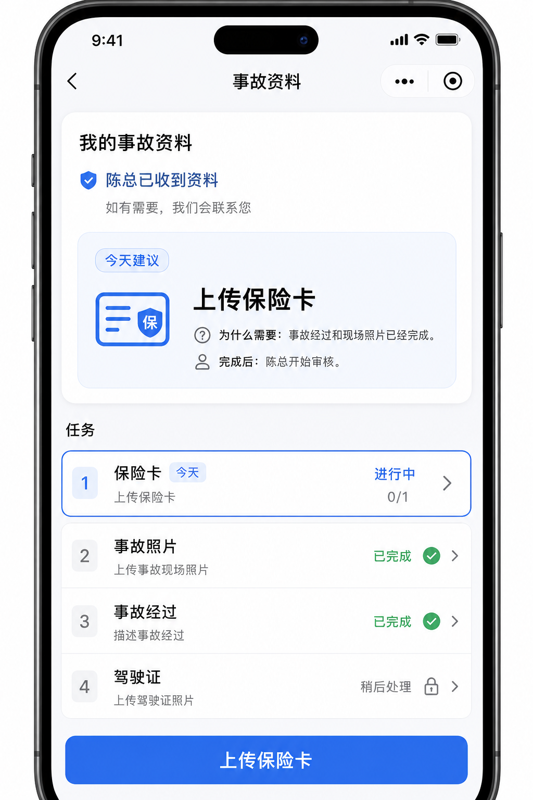

# P26A — Constitution-first Customer Task Home (skeleton)

**Date:** 2026-07-17  
**Loop:** 1 / 1  
**Status:** STOP after Task Home skeleton (PASS for tonight’s scope)  
**North Star:** Customer opens one page and immediately knows “What should I do next?”

---

## 1. Architecture summary

No architecture redesign. Additive Constitution read-model only:

```text
Customer Task (H5 / Mini Program)
        ↓
Constitution Projection  ←── NEW: customer.tasks[]
        ↓
Slice1 (workflow authority unchanged)
        ↓
Timeline / Evidence / Brief (inputs only)
        ↓
Customer Task Home (shared task-card UI)
        ↓
Broker Next Action (unchanged)
```

### Rules enforced

| Rule | How |
|------|-----|
| All visible tasks from Constitution | `customer.tasks` projected server-side; client never invents a checklist |
| One shared Task Card | `miniapp/components/task-card/*` |
| Shared state model | `pending` / `in_progress` / `completed` / `waiting_broker` / `blocked` |
| Shared progress model | `{ completed, total }` + completion mark |
| Insurance fully working | `route=request_item` → existing Slice1 `/pages/request-item` |
| Photos = existing upload only | `route=photos` → `/pages/photos` |
| Story = entry + future placeholder | `route=story` → `/pages/story` (no voice/AI) |
| Driver License = unfinished only | Card omitted when no open DL path |
| Broker projection unchanged | Same queue / next_action / priority helpers |

### Camry Golden (before upload)

| Card | State | Today | Actionable |
|------|-------|-------|------------|
| 保险卡 | `in_progress` | yes | yes → request_item |
| 事故照片 | `completed` | no | no |
| 事故经过 | `completed` | no | no |
| 驾驶证 | `blocked` | no | no |

After insurance submit: insurance → `waiting_broker`; driver license omitted.

---

## 2. Files changed

### Backend

- `services/fiqa_api/inbox_triage/constitution_projection.py` — `customer.tasks` derivation
- `tests/test_constitution_projection_skeleton.py` — schema includes `tasks`
- `tests/test_constitution_projection_customer_tasks.py` — Camry task-card contract

### Mini Program

- `miniapp/components/task-card/*` — shared Task Card component
- `miniapp/utils/resolveCustomerTaskCards.ts` — Constitution → UI cards
- `miniapp/utils/resolveCustomerConstitution.ts` — task card types
- `miniapp/types/task.ts` — additive `tasks` on customer projection
- `miniapp/pages/task-home/task-home.{ts,wxml,wxss,json}` — Constitution-first home
- `miniapp/tests/resolveCustomerTaskCards.test.ts`

### Types (additive)

- `ui/src/api/inboxTriage.ts`
- `ui/src/api/h5ClaimIntake.ts`

### Evidence

- `docs/evidence/p26a_constitution_first_task_home_2026_07_17.md` (this file)
- `docs/evidence/p26a_task_home_camry_before.png`
- `docs/evidence/p26a_task_home_skeleton_preview.html` (static layout fixture)

---

## 3. Screenshots

Camry before-upload Task Home skeleton (Constitution Focus + four cards; CTA = Today):



Static HTML fixture (same composition): `p26a_task_home_skeleton_preview.html`

> Physical WeChat Preview still required for Founder Form/Nav QA on device.

---

## 4. Verification

| Check | Result |
|-------|--------|
| Constitution projection tests (skeleton/customer/broker/api + P26A tasks) | PASS |
| Camry golden QA reset (`tests/test_camry_golden_qa_reset.py`) | PASS |
| Mini Program Build Gate (`npm run build:gate`) | PASS |
| Miniapp Constitution / task-card unit tests | PASS |
| Insurance Card path | Still `request_item` (Slice1) when actionable |
| Broker next_action before upload | unchanged: disabled / 暂无动作 |
| Broker next_action after upload | unchanged: enabled / 审核保险卡 |
| No hard-coded client task list | Resolver returns `[]` without server `tasks` |

### Explicitly not done tonight

- Voice transcription  
- AI story generation  
- GEICO multi-angle guided photos  
- New upload service / new workflow engine  

---

## 5. Remaining work

### P26B — Voice Story

- Keep `accident_story` card; replace text-only entry with voice capture → transcript draft  
- Customer confirms text before save (AI non-authority)  
- Read-after-write into same `known_facts.accident_description`  
- No second story workflow

### P26C — GEICO Guided Photos

- Keep `accident_photos` card; port guided slots / outlines onto production `/pages/photos`  
- Per-slot instruction + retake + progress gate  
- No damage-AI as claim truth  
- Constitution progress continues to read evidence slots

---

## Production Loop worksheet

- **One objective:** Constitution-first Task Home skeleton with shared Task Cards  
- **Out of scope:** Voice, AI story, GEICO guidance, new upload/workflow  
- **Commit authorized:** NO (not requested)  
- **QA deploy authorized:** NO  
- **STOP:** Yes — do not start P26B/P26C automatically  
