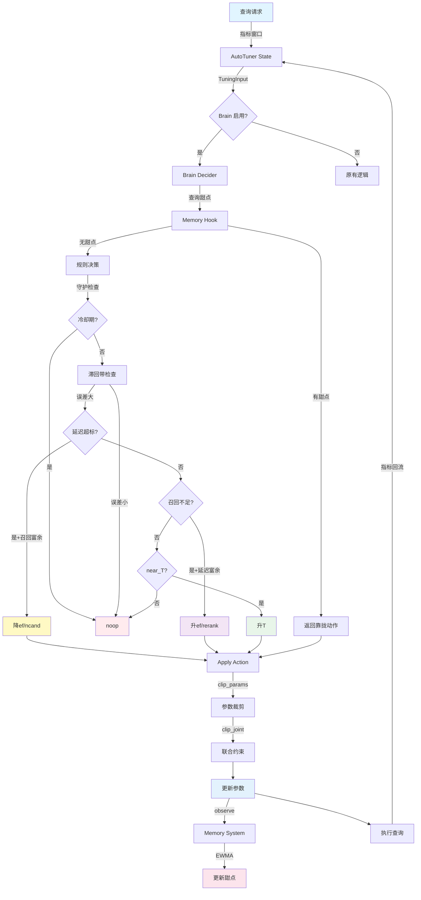
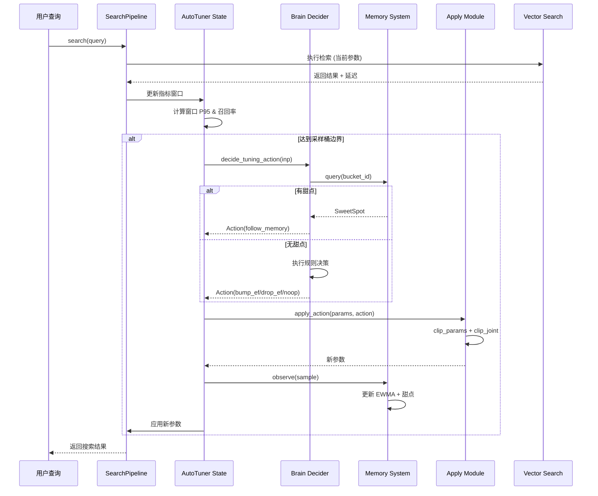
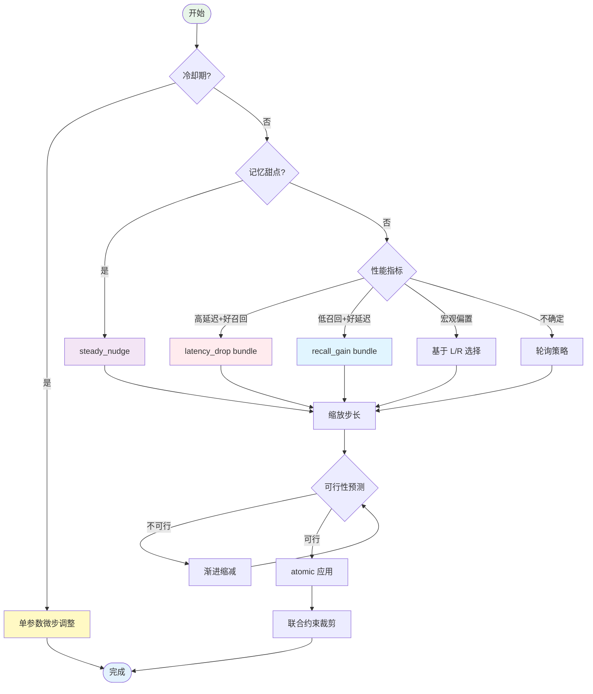
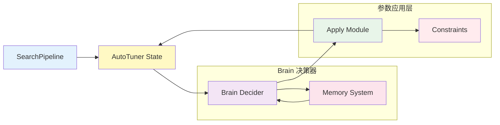

# AutoTuner 数据流图 - Mermaid 源码

本文件包含 AutoTuner 系统的 Mermaid 图表源码，可用于生成 PNG 图片。

## 使用方式

### 方式 1：在线渲染
访问 [Mermaid Live Editor](https://mermaid.live/) 粘贴以下代码生成图片。

### 方式 2：命令行渲染
```bash
# 安装 mermaid-cli
npm install -g @mermaid-js/mermaid-cli

# 渲染图片
mmdc -i autotuner_flow_mermaid.md -o autotuner_flow.png -w 1920 -H 1080
```

---

## 图表 1：完整数据流图



---

## 图表 2：时序图（窗口→决策→应用→记忆）



---

## 图表 3：多参数调优流程图



---

## 图表 4：系统架构图（简化版）



---

## 导出命令

```bash
# 导出所有图表
mmdc -i autotuner_flow_mermaid.md -o ../figs/autotuner_flow.png -w 1920 -H 1080
```

**注意**：如果无法安装 mermaid-cli，可以使用在线工具：
1. 访问 https://mermaid.live/
2. 粘贴上述代码
3. 点击"Download PNG"按钮

---

## 图表说明

### 完整数据流图
展示从查询请求到参数更新的完整流程，包括：
- Brain 启用判断
- 记忆钩子优先查询
- 规则决策逻辑（守护、滞回带、性能指标）
- 参数裁剪与联合约束
- 记忆系统更新

### 时序图
展示关键组件之间的交互时序：
- 用户查询触发
- 指标窗口累积
- 采样桶边界触发决策
- 记忆查询与决策
- 参数应用与记忆更新

### 多参数调优流程图
展示多参数联合决策的完整流程：
- 冷却期微步调整
- 记忆甜点稳态微调
- 性能指标驱动的预设策略
- 可行性预测与渐进缩减
- 原子化应用与约束裁剪

### 系统架构图
简化版的系统组件关系图，展示主要模块之间的依赖关系。
