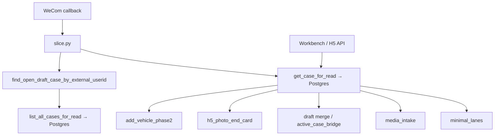

# P19E-1.5 — Production Case Read Path Audit

**Date:** 2026-07-06  
**Branch:** `sprint/p16-trust-layer`  
**Status:** Hardened (no deploy in this sprint)

---

## Production truth

| Layer | Source of truth |
|-------|-----------------|
| **Cloud Run production** | **Cloud SQL Postgres** (`caseiq` @ private VPC) |
| Local dev / unit tests | JSON file (`UNIFIED_INTAKE_CASES_PATH`) when `UNIFIED_INTAKE_JSON_CASE_WRITES=1` |
| Legacy Neon | **Not** QA truth — informational only in demo gate |

All production routing, case lookup, phase decisions, Workbench reads, and WeCom reply routing **must** hydrate through the Postgres-backed read facade:

- `get_case_for_read(case_id)` — single-case hydration (Postgres-first)
- `list_all_cases_for_read()` — binding / scan lists (Postgres-first)
- `service_record_repository.load_full_case_from_postgres` — low-level PG load (used inside facade)

**Do not** use `case_store.get_case_by_id()` in production routing. That function reads **only** the local JSON file and returns `None` on Cloud Run where cases live in Postgres.

---

## Root cause (P19E-1 live smoke)

1. WeCom text → `find_open_draft_case_by_external_userid` → Postgres `list_all_cases_for_read` → **found `case_id`** ✅  
2. `slice.py` / Phase 2 then called **`get_case_by_id`** → JSON-only → **`None`** on Cloud Run ❌  
3. `stale_draft_binding_cleared_v1` → binding dropped → generic greeting menu  
4. Phase 2 handler never ran

Same class of bug as P19D-4B End Card (`wecom_open_kf_id` read miss).

---

## Audit classification

### A. Production routing — **fixed to Postgres facade**

| Module | Function / path | Before | After |
|--------|-----------------|--------|-------|
| `wecom/slice.py` | open bound case hydrate, H5 start, phase 2 gate | `get_case_by_id` (P19E-1 debug) | `get_case_for_read` |
| `wecom/add_vehicle_phase2.py` | phase 2 resolve, ingest, refresh | mixed | `get_case_for_read` + `list_all_cases_for_read` |
| `wecom/active_case_bridge.py` | `ingest_wecom_text_to_draft_case`, `confirm_case_by_broker` | `get_case_by_id` | `get_case_for_read` |
| `wecom/media_intake.py` | duplicate lane, guardrail lane, reply lane | `get_case_by_id` | `get_case_for_read` |
| `wecom/minimal_lanes.py` | open same-lane validation | `get_case_by_id` | `get_case_for_read` |
| `wecom/h5_photo_end_card.py` | End Card channel binding | already `get_case_for_read` | unchanged |
| `inbox_triage/h5_task_upload.py` | H5 upload/skip/GET | already `get_case_for_read` | unchanged |
| `routes/inbox_triage.py` | Workbench case API | already `get_case_for_read` | unchanged |

### B. API read path — already correct

Workbench list/detail, H5 task token validation, and `case_truth_repository` consumers were already on the facade before P19E-1.5.

### C. Test-only / local — retained

| Location | Why kept |
|----------|----------|
| `tests/test_*.py` | JSON fixture stores for fast unit tests; assertions after `save_case` |
| `case_store._load_case_for_mutation` | Delegates to `get_case_for_read` for writes |
| `case_truth_repository.json_get_case_by_id` | Internal JSON fallback inside facade when PG miss |

### D. Legacy — documented, not deleted

| Symbol | Role |
|--------|------|
| `case_store.get_case_by_id` | **JSON file only** — dev scripts, tests, explicit local tooling |
| `case_store.list_all_cases` | JSON list — not used in WeCom production path |

Docstring on `get_case_by_id` updated to warn against production routing use.

---

## Production read path (after fix)

**Rule:** If a helper returns only `case_id`, the next step **must** call `get_case_for_read(case_id)` before any phase / state / reply decision.

---

## Future development guardrail

> **Any new routing, state machine, or phase decision must not call `get_case_by_id`.**  
> Use `get_case_for_read`, `list_all_cases_for_read`, or repository-backed hydration.

Enforced by:

- `tests/test_p19e15_postgres_read_facade_hardening.py` — AST scan of WeCom production modules
- Monkeypatch tests simulating Cloud Run (`get_case_by_id` → `None`, Postgres facade → case)

---

## Out of scope (this sprint)

- OCR / LLM / vision extraction  
- Schema migration  
- Cloud SQL / VPC / Secret / callback changes  
- Deploy (STOP after commit)
