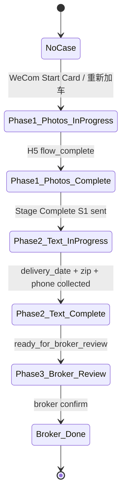
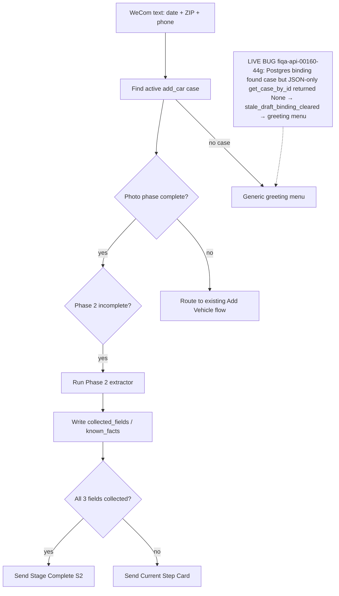
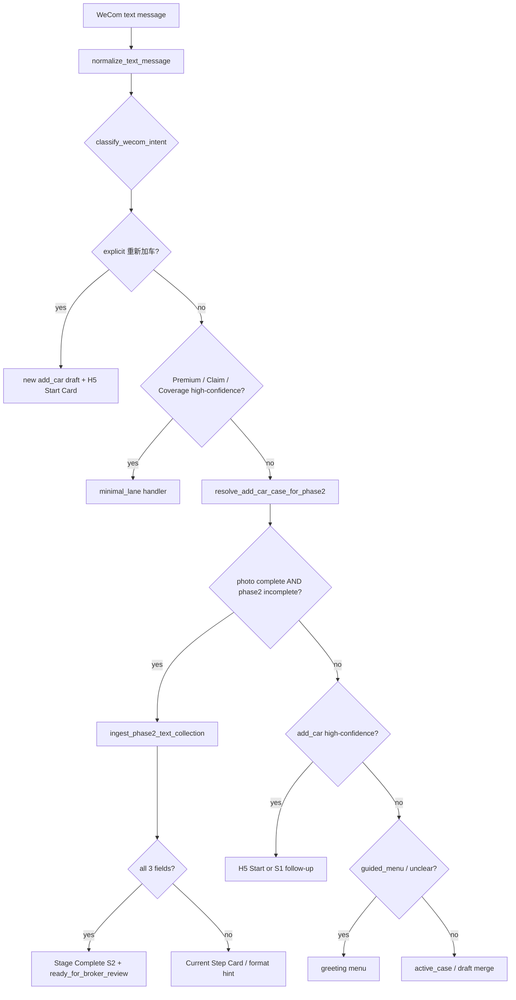

# P19E-1 — Add Vehicle Case State Machine & Event Pipeline

**Date:** 2026-07-06  
**Related:** `p19e0_spark_style_binary_step_model_recon.md`, `p19e1_add_vehicle_text_field_collection_loop`

---

## 1. Case State Machine



| State | `add_vehicle_phase` | `guided_workflow_state` |
|-------|---------------------|-------------------------|
| Phase 1 in progress | `phase_1_photos_in_progress` | — |
| Phase 1 complete | `phase_1_photos_complete` | — |
| Phase 2 in progress | `phase_2_text_in_progress` | `collecting_text_fields` |
| Phase 2 complete | `phase_3_broker_review` | `ready_for_broker_review` |
| Broker done | `phase_3_broker_done` | — |

---

## 2. Event Pipeline (with live bug annotation)

**System model:** case state machine + event pipeline. P19E-1 goal = wire WeCom text into Phase 2 after H5 photos complete.



**Fixed path (post `9cb7e5f`):** `get_case_for_read` + `find_phase2_eligible_add_car_case` — binding id resolves to Cloud SQL row → Phase 2 handler runs.

### Detailed routing (post-fix)



**Routing priority (P19E-1):**

1. Start Card click intents  
2. Premium / Claim / Coverage minimal lanes  
3. **Phase 2 text collection** (photo complete, text incomplete)  
4. Draft merge / add_car H5 Start  
5. Generic greeting / unclear menu  

---

## 3. Case Resolution (Cloud SQL)

| Step | Function | Read path |
|------|----------|-----------|
| Channel binding lookup | `find_open_draft_case_by_external_userid` | `list_all_cases_for_read()` → Postgres |
| Load case by id | `get_case_for_read(case_id)` | Postgres-first |
| Phase 2 fallback scan | `find_phase2_eligible_add_car_case` | Newest open add_car + photos complete |

**P19E-1 debug fix:** `slice.py` must **not** use JSON-only `get_case_by_id` on Cloud Run — that caused `stale_draft_binding_cleared` and greeting menu takeover.

---

## 4. Field Extraction (Phase 2)

| Field | Extractor | Example |
|-------|-----------|---------|
| `delivery_date` | `extract_delivery_date_from_text` | `7月10号提车` → `7月10日` |
| `zip` | `extract_zip_from_text` | `zip. 92705` → `92705` |
| `phone` | `extract_phone_from_text` | `电话2031234567` → `2031234567` |

Stored in: `collected_fields`, `known_facts`, `customer_phone` (phone).

---

## 5. WeCom Reply Cards

| Trigger | Card |
|---------|------|
| H5 `flow_complete` | Stage Complete **S1** |
| Partial Phase 2 text | Current Step Card |
| Zero fields parsed | Format hint (not greeting menu) |
| All 3 Phase 2 fields | Stage Complete **S2** |
| Broker Confirm (B0) | Done Card (true end) |

---

## 6. Live Smoke Failure (2026-07-07) — Root Cause

**Symptom:** After S1, Andy sent `7月10号提车，zip. 92705。电话2031234567` → greeting menu.

**Log evidence (`case_e341aa97b8c8`):**

```
stale_draft_binding_cleared_v1 → case_id found but get_case_by_id returned None
intent_v1 → unclear / guided_menu_required: true
reply → 您好，请选择您要办理的事项
```

**Root cause:** Postgres binding lookup succeeded; JSON-only `get_case_by_id` missed Cloud SQL row → Phase 2 handler skipped.

**Fix:** `get_case_for_read` + `find_phase2_eligible_add_car_case` fallback.
