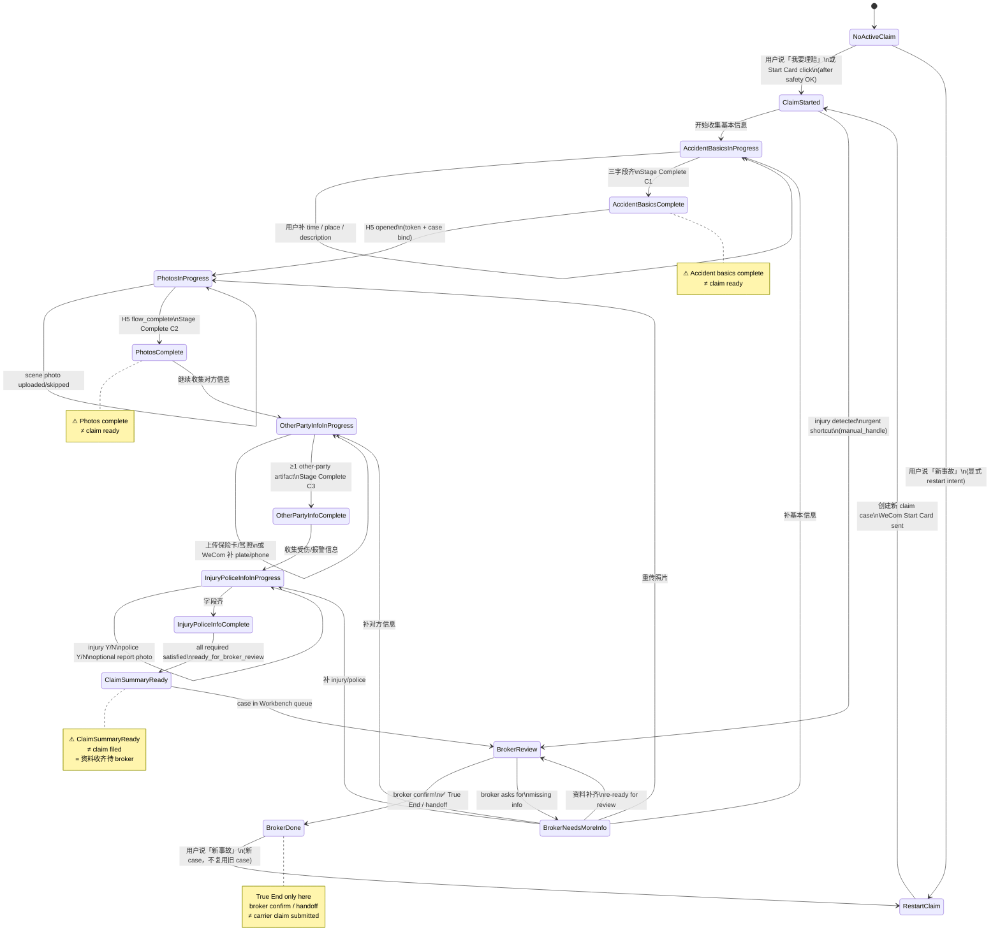
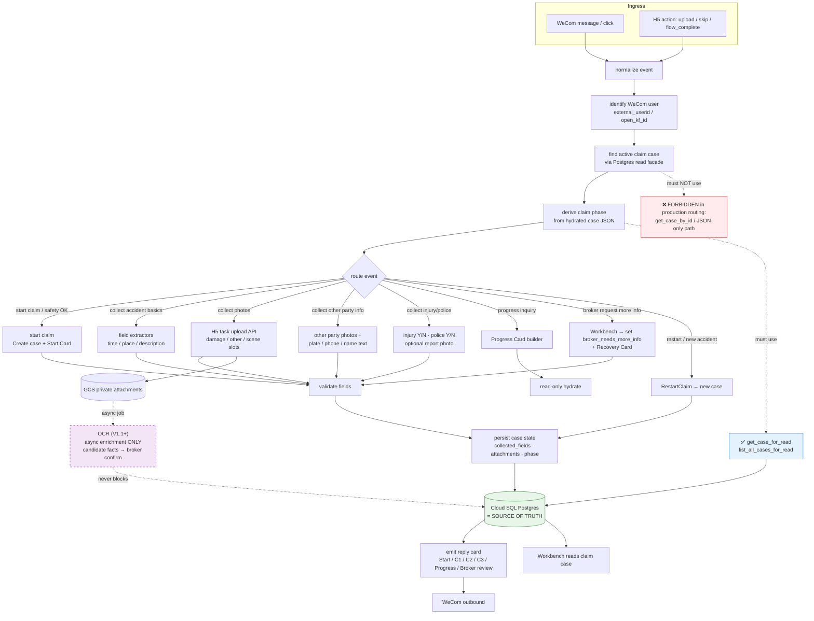
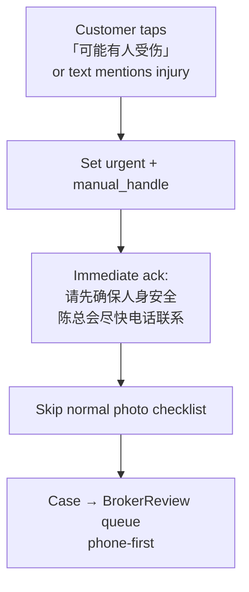
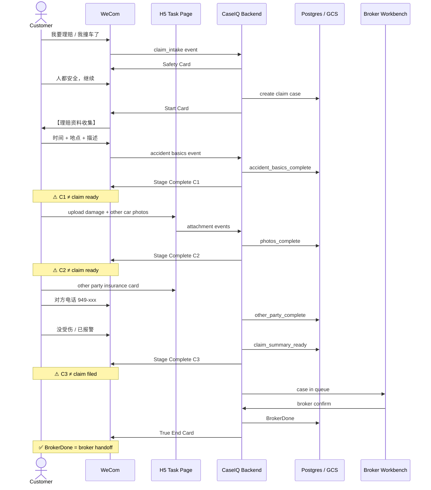
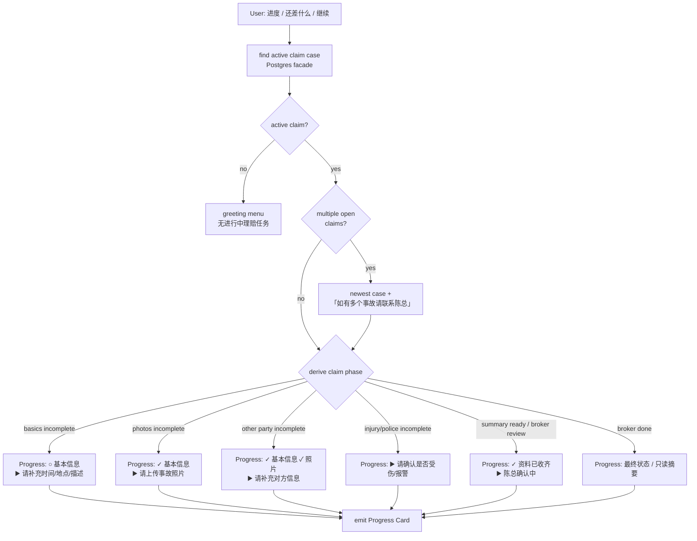
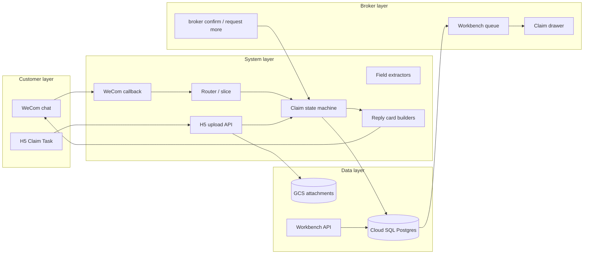

# P19H-0 — Claim Case Builder State Machine + Event Pipeline Recon

**Date:** 2026-07-07  
**Type:** Product / architecture recon — **documentation only**  
**Audience:** Andy, Chen Kui (CKS), product, engineering, future Cursor agents  
**Prerequisite:** Add Vehicle lane live ✅ — WeCom Start Card → H5 photos → Phase 2 text → Progress Card → Workbench review  
**Related:** `p19e_workflow_case_state_machine_event_pipeline_mermaid.md` · `p19e1_add_vehicle_case_state_machine_event_pipeline.md` · `p19e0_spark_style_binary_step_model_recon.md` · `p19_guided_workflow_start_end_card_recon.md` · `p19e3_channel_strategy_wecom_h5_miniprogram_recon.md` · `p19g2_one_page_proposal_demo_script.md`

**This loop:** No code. No deploy. No OCR. No H5. No schema migration. No WeCom routing changes. Recon doc only.

---

## 1. Executive Summary

Add Vehicle 已证明 **Insurance Case Builder** 架构可行：WeCom / H5 / Workbench 都只是 **channel**；真正核心是 **case state machine + event pipeline + Postgres source of truth**。

Andy 判断：**Claim（理赔资料收集）** 可能比 Add Vehicle 更能打动陈总，因为理赔更紧急、更复杂、更容易漏资料、更需要分步收集与 broker 人工确认。

| Question | Answer |
|----------|--------|
| **Claim lane 应该怎么做才像 Spark Driver？** | 4 个 customer-facing phase + broker gate；每步 binary done/not done；Progress Card 永远回答「你在哪一步 / 还差什么」 |
| **Claim MVP 做多大？** | 8 个 required 字段 + 5 个 optional；4 个 H5 照片 slot（required 2 + optional 2）；无 OCR；无 carrier 对接 |
| **是否值得作为下一 build target？** | **Yes** — 但 **先完成本 recon + state machine 设计，再写代码** |
| **OCR 放哪？** | **V1.1**，async enrichment only；MVP 不阻塞客户流程 |
| **本轮代码变更？** | **无** |

**Spark Driver 类比一句话：**

> 客户永远只看到一个「当前任务」；系统永远知道 case 在哪一 phase；Stage Complete ≠ claim filed；只有 **BrokerDone** 才是 broker 接手后的真正交接点。

---

## 2. Why Claim Case Builder Matters

### 2.1 陈总日常痛点（理赔场景）

| 痛点 | 日常表现 |
|------|----------|
| **紧急 + 情绪化** | 客户撞车后第一时间发微信，信息碎片化、顺序混乱 |
| **资料种类多** | 车损、对方车牌、保险卡、驾照、现场、警方报告 — 容易漏 |
| **责任 / coverage 敏感** | 客户问「谁的责任」「要不要报保险」— 线上不能说 |
| **多事故 / 多车** | 同一客户可能同时有旧 claim 和新事故 |
| **已报 vs 未报** | 客户可能已在 carrier 报过，只是来补资料 |
| **injury / 法律风险** | 有人受伤时必须 broker escalation，不能走普通 photo checklist |

### 2.2 Insurance Case Builder 在理赔上的价值

| 价值 | 说明 |
|------|--------|
| **分步收集，减少漏项** | H5 checklist + WeCom Progress Card 明确「还差什么」 |
| **证据进 case，不散落 bubble** | 照片绑定 slot + Postgres metadata；陈总打开 Workbench 30 秒进入状态 |
| **broker 人工 gate** | 系统只整理资料，不替陈总决定责任 / coverage / 是否正式报案 |
| **可恢复** | 客户中途退出，Progress Card / H5 token 可从 Postgres resume |
| **同一架构复用** | 与 Add Vehicle 共享 event pipeline、Postgres facade、Workbench drawer |

### 2.3 与「聊天机器人」的本质区别

```text
Chatbot:  客户说话 → LLM 回复 → 信息留在 thread
Case Builder: 客户事件 → state machine 路由 → Postgres 持久化 → card 引导下一步 → Workbench 可读
```

---

## 3. Claim vs Add Vehicle Comparison

| Dimension | Add Vehicle | Claim Case Builder |
|-----------|-------------|-------------------|
| **Urgency** | 中 — 提车前后几天 | **高** — 事故后数小时内 |
| **Emotional load** | 低 | **高** — 安全、责任、费用焦虑 |
| **Phase count** | 3 customer + broker | **4 customer + broker** |
| **Required photos** | 3 fixed slots (VIN/reg/insurance) | **4+ slots**，部分 optional |
| **Text fields** | 3 (date, ZIP, phone) | **5+** (time, place, description, injury, police) |
| **Safety gate** | 无 | **有** — injury → urgent / manual_handle |
| **Wrong-branch risk** | 低 — intent 较明确 | **高** — 咨询 vs 正式 intake vs coverage |
| **Legal red lines** | 不自动改保单 | **+** 不判责任、不承诺 coverage、不说 claim filed |
| **Broker demo impact** | 证明系统能跑 | **更能体现「整理杂乱事故信息」价值** |
| **Existing code** | Full guided workflow | **Minimal lane only** — `claim_intake` one-shot reply + media ack |

**Architecture reuse (same for both):**

```text
WeCom / H5 / Workbench = channels
Postgres = source of truth
Event: normalize → identify user → find active case → derive phase → route → validate → persist → emit card
Legacy JSON read path = FORBIDDEN in production routing
```

---

## 4. Claim Customer Journey

### 4.1 Happy path (MVP)

```text
客户: 「我要理赔」/ 「我撞车了」
  ↓
Safety check (WeCom Start Card)
  ↓ 人都安全，继续
【理赔资料收集】Start Card → 开始
  ↓
Step 1 — 事故基本信息 (WeCom 文字 或 H5 表单)
  time · place · 一句话描述
  ↓ Stage Complete C1
Step 2 — 事故照片 (H5 为主)
  自己车损伤 · 对方车/车牌 · optional 现场
  ↓ Stage Complete C2  ⚠ Photos complete ≠ claim ready
Step 3 — 对方信息 (H5 照片 + WeCom 文字补)
  对方保险卡 · 驾照 · 车牌 · 电话/姓名（能拿多少算多少）
  ↓ Stage Complete C3
Step 4 — 受伤 / 报警 (WeCom 按钮 + 可选 police report 照片)
  ↓ ClaimSummaryReady
  ↓ broker queue
【理赔资料进度】▶️ 陈总人工确认中
  ↓
BrokerDone → True End Card
  ⚠ BrokerDone = 陈总确认收齐并接手；≠ claim 已在 carrier 正式提交
```

### 4.2 Spark-style binary step rules (carry forward from P19E-0)

| Rule | Claim application |
|------|-------------------|
| 每步 = done / not done | 每个 phase 有明确 completion predicate |
| Stage Complete ≠ terminal | C1/C2/C3 都是 phase transition，不是「理赔完成」 |
| 用户只看到一个当前动作 | Progress Card / Current Step Card 只突出 **下一项** |
| Never mix done + still needed same scope | 「照片已收到 ✅」不与「还差对方保险卡」同句 — 分 phase 说 |

### 4.3 客户随时可问

| 客户说 | 系统行为 |
|--------|----------|
| 进度 / 还差什么 / 我现在到哪了 | Progress Card（Postgres hydrate 后 emit） |
| 重新理赔 / 新事故 | `RestartClaim` — 新 case，不复用 BrokerDone case |
| 加车 / 续保（中途） | Secondary topic deferred — 一 flow 一次 |

---

## 5. Claim Broker Journey

### 5.1 Workbench queue entry

Case 进入 broker review 当且仅当：

```text
claim_phase = claim_summary_ready
guided_workflow_state = ready_for_broker_review
```

Queue row 示例：**张先生 · Claim · WeCom · 🟡 待确认**

### 5.2 Case drawer — broker 看到什么

| Section | Content |
|---------|---------|
| **Header** | Customer label · lane=claim · created_at · urgent flag |
| **Accident basics** | time · place · one-line description |
| **Photos** | damage · other car/plate · scene (optional) — GCS preview |
| **Other party** | insurance card · license · plate · phone/name (partial OK) |
| **Injury / police** | injured Y/N · police called Y/N · police report photo if any |
| **Optional** | tow shop · witness · existing claim # |
| **Checklist** | Required ✓/○ · Optional ✓/○ |
| **OCR drafts (V1.1+)** | candidate facts — broker confirm only |
| **Actions** | Confirm · Request more info · Mark manual handle · Escalate (injury) |

### 5.3 Broker actions → state transitions

| Action | Next state | Customer sees |
|--------|------------|---------------|
| **Confirm** (资料够用了) | `BrokerDone` | True End Card — 陈总已收到，会跟进 |
| **Request more info** | `BrokerNeedsMoreInfo` | Recovery Card — 请补充 {missing} |
| **Mark manual handle** | stays in review + urgent flag | 「陈总会电话联系您」 |
| **Escalate injury** | urgent + phone-first | 不走普通 checklist；immediate broker ack |

### 5.4 什么时候需要陈总追问？

| Trigger | Broker action |
|---------|---------------|
| Required field missing after customer said done | Request more info → specific slot |
| Blurry / wrong photo | Ask for clearer photo |
| Injury = yes | Phone-first; do not rely on chat checklist |
| Customer asks fault / coverage | **Never auto-reply** — broker handles offline |
| OCR candidate conflicts with customer text | Broker picks official fact |

---

## 6. Claim Required Information

### 6.1 MVP Required (8 items)

| # | Field | Key | Channel preference | Validation |
|---|-------|-----|-------------------|------------|
| 1 | 事故时间 | `accident_datetime` | WeCom 文字 or H5 | 日期 parse；允许「刚才 / 今天上午」→ broker confirm |
| 2 | 事故地点 | `accident_location` | WeCom 文字 or H5 | 非空；cross street / city OK |
| 3 | 客户车辆损伤照片 | `customer_damage_photo` | **H5** | ≥1 attachment in slot |
| 4 | 对方车辆照片或车牌 | `other_party_vehicle_photo` | **H5** | photo OR plate text in `other_party_plate` |
| 5 | 对方保险卡 / 驾照 / 联系方式 | `other_party_info` | H5 照片 + WeCom 文字 | **Partial OK** — completeness score, not all-or-nothing |
| 6 | 是否有人受伤 | `anyone_injured` | WeCom 按钮 Y/N | `yes` → urgent flag |
| 7 | 是否报警 / 是否有 police report | `police_involved` | WeCom 按钮 + optional photo | boolean + optional attachment |
| 8 | 一句话描述 | `accident_description` | WeCom 文字 or H5 | 非空，≤500 chars |

### 6.2 MVP Optional (5 items)

| # | Field | Key | Notes |
|---|-------|-----|-------|
| 1 | 现场照片 | `scene_photo` | 路况、全景 |
| 2 | Police report 照片 | `police_report_photo` | 若 `police_involved=yes` 时 prompt |
| 3 | Tow / repair shop info | `tow_repair_info` | 文字 |
| 4 | Witness info | `witness_info` | 文字 |
| 5 | 已有 claim number | `existing_claim_number` | 客户已在 carrier 报过 |

### 6.3 Required vs Optional — product rule

```text
Required missing → cannot reach ClaimSummaryReady
Optional missing → CAN reach ClaimSummaryReady with broker review note「optional items pending」
Other party info → special rule: at least ONE of (insurance card photo, license photo, plate photo/text, phone/name)
```

---

## 7. Claim Photo / Document Slots

### 7.1 H5 slot definitions (MVP)

| Slot ID | Label (ZH) | Required | Skip allowed |
|---------|------------|----------|--------------|
| `customer_damage_photo` | 您的车损伤照片 | **Yes** | No |
| `other_party_vehicle_photo` | 对方车辆 / 车牌 | **Yes** | No (plate text fallback via WeCom) |
| `scene_photo` | 事故现场（可选） | No | Yes |
| `other_party_insurance_card` | 对方保险卡 | No* | Yes |
| `other_party_license` | 对方驾照 | No* | Yes |
| `police_report_photo` | 警方报告（可选） | No | Yes |

\*At least one other-party artifact required across slots + text fields.

### 7.2 Slot completion semantics

| State | Meaning |
|-------|---------|
| `empty` | No upload yet |
| `received` | GCS blob + Postgres attachment ref |
| `skipped` | Customer explicitly skipped optional slot |
| `needs_retake` | Broker flagged blurry/wrong — customer re-upload |

### 7.3 客户发错图怎么办？

| Scenario | Guardrail |
|----------|-----------|
| Wrong doc type in slot (e.g. selfie in damage slot) | H5: slot-level confirm step; broker can `needs_retake` |
| Photo before lane selected | Unassigned media ack → lane disambiguation menu |
| Photo during wrong phase | Bind to case but **do not advance phase**; Progress Card shows correct next step |
| Bulk album dump | Claim batch rule (≤5 per batch, confirm same accident) — reuse P19D-1 guardrail |

---

## 8. Claim State Machine

### 8.1 State diagram



### 8.2 State → persistence mapping (proposed)

| State | `service_lane` | `claim_phase` (proposed) | `guided_workflow_state` |
|-------|----------------|--------------------------|-------------------------|
| Claim started | `claim` | `claim_started` | — |
| Accident basics in progress | `claim` | `accident_basics_in_progress` | `collecting_text_fields` |
| Accident basics complete | `claim` | `accident_basics_complete` | — |
| Photos in progress | `claim` | `photos_in_progress` | — |
| Photos complete | `claim` | `photos_complete` | — |
| Other party in progress | `claim` | `other_party_in_progress` | — |
| Other party complete | `claim` | `other_party_complete` | — |
| Injury/police in progress | `claim` | `injury_police_in_progress` | — |
| Injury/police complete | `claim` | `injury_police_complete` | — |
| Summary ready | `claim` | `claim_summary_ready` | `ready_for_broker_review` |
| Broker review | `claim` | `claim_summary_ready` | `ready_for_broker_review` |
| Broker needs more | `claim` | *(resume prior phase)* | `broker_needs_more_info` |
| Broker done | `claim` | `broker_done` | — |

> **Schema note:** This recon proposes field names only. **No schema migration in P19H-0.** Implementation sprint should extend existing JSONB `collected_fields` / `known_facts` pattern used by Add Vehicle.

### 8.3 Phase completion predicates (binary)

| Phase | Done when |
|-------|-----------|
| Accident basics | `accident_datetime` AND `accident_location` AND `accident_description` |
| Photos | `customer_damage_photo` received AND (`other_party_vehicle_photo` received OR `other_party_plate` text) |
| Other party | ≥1 of: insurance card photo, license photo, plate (photo/text), phone, name |
| Injury/police | `anyone_injured` set AND `police_involved` set |
| Summary ready | All required (§6.1) satisfied |

---

## 9. Claim Event Pipeline

### 9.1 Flow diagram



### 9.2 Routing priority (proposed — mirrors Add Vehicle)

1. **Safety / injury urgent** — immediate manual_handle, skip normal checklist  
2. **Restart / new accident** intent  
3. **Active claim case phase handlers** — accident basics → photos → other party → injury/police  
4. **Progress inquiry** — when open `claim` case exists  
5. **Explicit claim start** — `claim_intake` high-confidence → Start Card  
6. **Premium / Add Vehicle / Coverage** — existing minimal lanes  
7. **Generic greeting / unclear** menu  

### 9.3 Key pipeline invariants

| Invariant | Detail |
|-----------|--------|
| Postgres = source of truth | Every routing decision hydrates from `get_case_for_read` |
| Legacy JSON forbidden | `get_case_by_id` caused Add Vehicle Phase 2 greeting menu bug — same rule for Claim |
| OCR not in hot path | Customer flow never waits on OCR; failures invisible to customer |
| OCR = async enrichment | V1.1: plate / insurance card / license → `ocr_drafts[]` with confidence |
| Channels are dumb | WeCom/H5 emit events; they do not own phase logic |

---

## 10. WeCom Cards / Progress Cards

### 10.1 Start Card (after safety OK)

```text
【理赔资料收集】

请先告诉我们事故基本情况：
1. 事故时间
2. 事故地点
3. 简单描述发生了什么

然后我们会继续收集照片和对方信息。

[开始理赔资料收集]
[稍后 / 联系经纪人]

我们只收集照片和事实，不能判断责任或是否该报案。
陈总会人工查看并确认。
```

**Safety pre-card** (existing recon from P19 guided workflow):

```text
很抱歉听到您发生事故。请先确认大家是否安全。

[人都安全，继续]
[可能有人受伤 → 紧急联系]
[联系经纪人]
```

### 10.2 Stage Complete cards

| Card | Trigger | Copy essence |
|------|---------|--------------|
| **C1** | Accident basics complete | 「事故基本信息已收到 ✅」→ 下一步：上传事故照片 |
| **C2** | Photos complete | 「事故照片已收到 ✅」→ 下一步：补充对方信息 |
| **C3** | Other party + injury/police complete | 「资料基本收齐 ✅」→ 已转陈总人工确认 |

**C1 example:**

```text
【理赔资料 · 第 1 步完成】

✅ 事故基本信息已收到：
· 时间：{accident_datetime}
· 地点：{accident_location}

▶️ 下一步：请上传事故照片
○ 您的车损伤
○ 对方车辆 / 车牌

[上传事故照片]
```

### 10.3 Progress Card example

```text
【理赔资料进度】

✅ 事故基本信息已收到
▶️ 还差事故照片 / 对方信息

请继续上传：
○ 车辆损伤照片
○ 对方车牌 / 保险卡
○ 现场照片（可选）

[继续上传]
[联系经纪人]

目前不代表 claim 已正式提交。
```

**Mid-flow Progress Card variants:**

| Phase | ✓ done | ▶️ current | ○ still needed |
|-------|--------|------------|----------------|
| After C1 | 基本信息 | 事故照片 | 对方信息 · 受伤/报警 |
| After C2 | 基本信息 · 照片 | 对方信息 | 受伤/报警 |
| After C3 | 全部 required | 陈总确认中 | — (customer waits) |
| BrokerNeedsMoreInfo | partial | 请补 {missing} | — |

### 10.4 Broker review card

```text
【理赔资料进度】

✅ 基本信息已收到
✅ 照片资料已收到
✅ 对方信息已收到
▶️ 陈总人工确认中

目前不代表 claim 已正式提交。
陈总确认后会继续跟进。
```

### 10.5 True End Card (BrokerDone)

```text
【理赔资料】

陈总已确认收到您的理赔资料。
我们会通过电话或微信跟进后续步骤。

我们不能判断事故责任，也不能替您决定是否向保险公司正式报案。
如有紧急情况，请直接联系陈总。
```

---

## 11. H5 Task Flow Concept

### 11.1 Five-step wizard (MVP)

| Step | Title | Fields / slots | Best channel |
|------|-------|----------------|--------------|
| **1** | 事故基本信息 | date/time · location · short description | **WeCom 文字优先**；H5 表单作 fallback（长描述、粘贴地图链接） |
| **2** | 事故照片 | customer damage · scene (opt) · other car | **H5 必须** — 相机 UX、slot guardrail、逐张 confirm |
| **3** | 对方信息 | insurance card · license · plate · phone/name | **H5 照片** + **WeCom 文字** 补 phone/name/plate |
| **4** | 受伤 / 报警 | injured? · police? · report photo | **WeCom 按钮优先**（Y/N 二元）；H5 仅 police report 上传 |
| **5** | 确认提交 | Review summary · submit to broker | **H5 review 页** — 只读 summary + confirm；或 WeCom Progress Card |

### 11.2 Channel assignment rationale

| Content type | WeCom | H5 | Why |
|--------------|-------|-----|-----|
| Short text (time, place) | ✅ | ○ | Chat-native; customer already in WeCom after accident |
| Y/N buttons (injury, police) | ✅ | ○ | Binary tap; no form needed |
| Multi-photo guided capture | ○ | ✅ | Slot guardrails; one-photo-at-a-time; skip/retake |
| Document photos (insurance card) | ○ | ✅ | Crop guide; reduce wrong-slot binding |
| Long description | ✅ | ○ | Voice-to-text friendly in WeChat |
| Review / submit | ○ | ✅ | Single confirm screen reduces accidental submit |
| Progress / status | ✅ | ○ | Customer asks in chat; no need to open H5 |

### 11.3 H5 flow token (conceptual)

```text
flow: claim_photo_flow
lane: claim
slots: [customer_damage_photo, other_party_vehicle_photo, scene_photo]
optional_slots: [scene_photo]
post_complete: emit C2 + route to OtherPartyInfoInProgress
```

Separate H5 sub-flow for other party docs (Step 3) — can be same token with phase-gated slot list.

---

## 12. Workbench Review Concept

### 12.1 Queue filters

| Filter | Values |
|--------|--------|
| Lane | Claim |
| Status | Collecting · Ready for review · Needs more info · Done |
| Urgent | Injury flagged · Manual handle |

### 12.2 Drawer layout (Claim-specific)

```text
┌─────────────────────────────────────────┐
│ 张先生 · Claim · WeCom · 🟡 待确认        │
│ Created: 2026-07-07 14:32 · Urgent: No  │
├─────────────────────────────────────────┤
│ ACCIDENT BASICS                         │
│  Time: 今天上午约10点                      │
│  Place: Irvine Blvd & Culver              │
│  Desc: 对方变道刮蹭我左前门                  │
├─────────────────────────────────────────┤
│ PHOTOS                          [preview]│
│  ✓ 车损  ✓ 对方车牌  ○ 现场               │
├─────────────────────────────────────────┤
│ OTHER PARTY                     [preview]│
│  ✓ 保险卡  ○ 驾照  · 电话: (pending)       │
├─────────────────────────────────────────┤
│ INJURY / POLICE                          │
│  受伤: 否 · 报警: 是 · ○ 警方报告          │
├─────────────────────────────────────────┤
│ CHECKLIST                                │
│  Required 7/8 · Optional 1/5             │
├─────────────────────────────────────────┤
│ [确认收齐] [请客户补充] [标记紧急] [电话联系]  │
└─────────────────────────────────────────┘
```

### 12.3 Broker confirm checklist (before Confirm click)

- [ ] Accident time/place plausible  
- [ ] Damage photos sufficient for carrier FNOL prep  
- [ ] Other party info — at least one contact path  
- [ ] Injury/police answered — if injury yes, phone follow-up done  
- [ ] Customer not expecting「已帮你报案」  

---

## 13. OCR Opportunities and Guardrails

### 13.1 What OCR could extract (V1.1+)

| Document | Candidate fields | Confidence use |
|----------|------------------|----------------|
| 车牌 photo | plate number, state | Pre-fill `other_party_plate`; broker confirm |
| 驾照 | name, DL#, address | Pre-fill other party identity |
| 保险卡 | carrier, policy #, effective dates | Pre-fill other party insurance |
| Police report | report #, date, officers | Pre-fill police fields |
| Repair estimate | shop name, $ amount | Optional enrichment |
| Claim letter | claim #, carrier ref | Detect「already filed」 |

### 13.2 OCR architecture principles

```text
Customer upload → GCS + Postgres attachment (sync, hot path)
                → async OCR job (queue / Cloud Task)
                → ocr_drafts[] on case JSON
                → Workbench shows「AI 草稿 — 待确认」
                → broker Confirm → promoted to known_facts

OCR failure → silent; case flow unchanged
OCR slow → customer never waits
OCR wrong → broker rejects draft; manual entry wins
```

### 13.3 MVP: no OCR

MVP relies on broker reading photos in Workbench drawer. OCR is **V1.1** after Claim state machine is stable.

---

## 14. Failure Modes / Wrong Branch Risks

### 14.1 Claim-specific wrong branches

| # | Scenario | Risk | Guardrail |
|---|----------|------|-----------|
| 1 | 客户问「出事故了怎么办」 | 咨询 ≠ 正式 intake | Intent classifier: `claim_question` vs `claim_intake`; question → FAQ-style safe reply + optional Start Card |
| 2 | 客户问 coverage / 能不能赔 | 不是 claim lane | Route to coverage / generic; never promise |
| 3 | 客户发事故照片但没选 lane | Unassigned media | `_MEDIA_ACK_UNASSIGNED` disambiguation menu |
| 4 | 客户有多个事故 | Wrong case binding | Newest open claim case; multi-case tail「如有多起事故请联系陈总」 |
| 5 | 客户问责任判断 | Legal / carrier domain | Never auto-reply fault; defer to broker |
| 6 | 受伤 / 法律风险 | Liability + urgency | Injury button → urgent + manual_handle; skip photo checklist |
| 7 | 客户已在 carrier 报过 | Duplicate FNOL confusion | Optional `existing_claim_number`; copy says「资料整理 ≠ 正式提交」 |
| 8 | 客户不想报保险，只要建议 | Advice ≠ intake | Safe reply: cannot advise whether to file; offer broker call |
| 9 | 加车中途说理赔 | Lane switch | Secondary topic deferred (reuse Add Vehicle pattern) |
| 10 | Phase 2 text → greeting menu | Postgres read bug | **Must use** `get_case_for_read` — same as Add Vehicle P19E-1 fix |

### 14.2 Guardrail copy invariants (ADR-003)

| Never say | Always say |
|-----------|------------|
| 我帮您报案了 | 资料已转陈总人工处理 |
| 这是对方的责任 | 我们不能判断责任 |
| 您的保险可以赔 | 陈总会帮您核实 |
| 理赔已完成 | 资料收齐，等待/已完成 broker 确认 |
| 已联系保险公司 | 陈总会跟进后续步骤 |

### 14.3 Injury escalation flow



---

## 15. MVP Scope

### 15.1 In scope — Claim MVP

| Item | Detail |
|------|--------|
| **Lane** | `claim` guided workflow (upgrade from minimal `claim_intake` reply) |
| **Safety Start Card** | 3-button safety gate |
| **4 customer phases** | Basics → Photos → Other party → Injury/police |
| **H5** | Photo flow (Step 2) + other party doc flow (Step 3) |
| **WeCom** | Text collection (basics), Y/N buttons (injury/police), Progress Card |
| **Stage Complete** | C1 / C2 / C3 cards |
| **Workbench** | Claim case in queue + drawer with checklist |
| **Broker actions** | Confirm · Request more info · Manual handle |
| **Postgres** | State machine via existing JSONB pattern |
| **Guardrails** | No fault / no coverage / no claim filed language |

### 15.2 Out of scope — Claim MVP

| Item | Phase |
|------|-------|
| OCR | V1.1 |
| Carrier FNOL API | V2+ |
| Auto liability determination | Never |
| Mini program | Post-pilot |
| Multi-language beyond current bilingual pattern | V1.1 |
| Tow shop / witness (optional fields) | Collect if sent; no dedicated UX |
| Police report OCR | V1.1 |

### 15.3 MVP build sequence (recommended)

```text
P19H-1  State machine + Postgres phase fields (no H5)
P19H-2  WeCom Start Card + basics text collection + C1
P19H-3  H5 claim photo flow + C2
P19H-4  Other party + injury/police + C3 + ClaimSummaryReady
P19H-5  Progress Card + broker review loop
P19H-6  Workbench Claim drawer polish
```

---

## 16. V1.1 / V2 Scope

### 16.1 V1.1

| Feature | Value |
|---------|-------|
| Async OCR | Plate, insurance card, license → broker drafts |
| Claim Progress Card parity with Add Vehicle polish | P19G-3 copy standards |
| Optional field dedicated UX | Witness, tow shop |
| Multi-accident disambiguation | 「您有进行中事故 A，这是新事故 B 吗？」 |
| Secondary topic defer polish | Claim ↔ Add Vehicle mid-flow |

### 16.2 V2

| Feature | Value |
|---------|-------|
| Carrier claim status lookup | If API available |
| Police report structured parse | Report # extraction |
| Mini program claim task home | Channel expansion per P19E-3 |
| Analytics | Time-to-ready, missing field rates |
| Template outbound | Broker「请补 XX」one-click WeCom message |

---

## 17. Mermaid Diagrams

### 17.1 Customer sequence (Claim happy path)



### 17.2 Progress Card decision tree



### 17.3 Channel architecture (Claim)



---

## 18. Final Recommendation

### 18.1 Key product questions answered

| # | Question | Answer |
|---|----------|--------|
| 1 | 客户现在在哪一步？ | Postgres `claim_phase` → Progress Card / H5 step indicator |
| 2 | 客户应该上传什么？ | Current Step Card 只显示 **当前 phase** 的 slot/field |
| 3 | 哪些资料必须有？ | §6.1 — 8 required items |
| 4 | 哪些资料可选？ | §6.2 — 5 optional items |
| 5 | 客户发错图怎么办？ | Slot guardrail + broker `needs_retake`; don't advance phase on wrong slot |
| 6 | 客户只知道「出事故了」？ | Safety Card first → Start Card → guided basics; don't dump full checklist |
| 7 | 什么时候进入 broker review？ | `ClaimSummaryReady` — all required satisfied |
| 8 | 什么时候需要陈总追问？ | Missing required after customer thinks done; injury; fault/coverage questions |
| 9 | 什么时候才是真正 claim case ready？ | **`ClaimSummaryReady`** = customer-side ready; **`BrokerDone`** = broker confirmed handoff |

### 18.2 MVP recommendation (8 decisions)

| # | Decision | Recommendation |
|---|----------|----------------|
| 1 | Claim Case Builder 是否值得作为下一个重点？ | **Yes** — 架构已验证，Claim 更能展示 Case Builder 价值 |
| 2 | 是否比 Add Vehicle 更能打动陈总？ | **Yes for demo narrative** — 紧急、复杂、漏资料痛点更直观；Add Vehicle 仍是 pilot SOW 第一期 |
| 3 | MVP 应该做多大？ | **4 phases + 8 required fields + H5 photo flow** — 不做 OCR，不做 carrier |
| 4 | 是否应该先只做 recon，不写代码？ | **Yes — P19H-0 就是这一步**；state machine 先画清楚再 P19H-1 实现 |
| 5 | OCR 是否应该放到 Claim V1.1？ | **Yes** — async only; MVP broker reads photos |
| 6 | 是否应该先画 state machine，再写代码？ | **Yes** — 本 doc §8–9 即 implementation spec |
| 7 | 如何避免进入错误分支？ | Intent tiers (question vs intake); safety gate; lane disambiguation on unassigned media; no auto fault/coverage |
| 8 | Claim demo 应该怎么给陈总展示？ | **15 min demo Story B** — 撞车 → 安全确认 → 分步收资料 → Workbench 整理好的 case → 陈总 Confirm；强调「不是帮您报案，是帮您收齐资料」 |

### 18.3 Claim demo script (for Chen Kui — 5 min segment)

```text
1. [WeCom] 客户：「陈总，我刚才撞车了」
   → Safety Card → 人都安全，继续

2. [WeCom] Start Card → 客户补充时间/地点/描述
   → C1：基本信息收到

3. [H5] 客户上传车损 + 对方车牌
   → C2：照片收到

4. [WeCom + H5] 对方保险卡 + 没受伤/已报警
   → C3：资料收齐，陈总确认中

5. [Workbench] 陈总打开 case drawer
   → 30 秒看到全部资料 + checklist
   → 点「确认收齐」
   → 客户收到 True End Card

旁白：「这不是自动帮您报案，是把微信里散乱的事故信息整理成您可以直接处理的 case。」
```

### 18.4 Relationship to paid pilot

| Phase | Scope |
|-------|-------|
| **Pilot SOW (now)** | Add Vehicle only — per P19G-1/P19G-2 |
| **Pilot extension / Phase 2** | Claim Case Builder MVP — upsell narrative ready |
| **Demo to close pilot** | Show Add Vehicle live + Claim recon / mock drawer |

---

## STOP Report

| # | Item | Value |
|---|------|-------|
| 1 | **Document path** | `docs/p19h0_claim_case_builder_state_machine_recon.md` |
| 2 | **Claim lane value judgment** | **High** — 比 Add Vehicle 更能体现 Insurance Case Builder 价值；架构可复用 |
| 3 | **MVP recommended scope** | 4 customer phases · 8 required · 5 optional · H5 photo flow · WeCom text/buttons · Workbench review · no OCR |
| 4 | **Required fields** | accident_datetime · accident_location · customer_damage_photo · other_party_vehicle/plate · other_party_info (≥1) · anyone_injured · police_involved · accident_description |
| 5 | **Optional fields** | scene_photo · police_report_photo · tow_repair_info · witness_info · existing_claim_number |
| 6 | **State machine summary** | 13 states + RestartClaim; only `BrokerDone` = true end; C1/C2/C3/SummaryReady all ≠ claim filed |
| 7 | **Event pipeline summary** | normalize → identify → Postgres facade → derive phase → route → validate → persist → emit card → Workbench read |
| 8 | **OCR recommendation** | **V1.1 async enrichment only** — not in MVP hot path |
| 9 | **Wrong-branch guardrails** | Intent tiers · safety gate · no fault/coverage/filed language · injury escalation · unassigned media disambiguation |
| 10 | **Claim should be next build target?** | **Yes, after P19H-0** — implement P19H-1 through P19H-6 in order |
| 11 | **Code changed?** | **No** |
| 12 | **Deploy happened?** | **No** |
| 13 | **STOP** | ✅ |

---

## For future Cursor agents

1. **Start here** when implementing Claim lane — mirror Add Vehicle patterns in `p19e_workflow_case_state_machine_event_pipeline_mermaid.md`.
2. **Never** route on `get_case_by_id` in production — use Postgres facade only.
3. **Distinguish** C1/C2/C3 (phase done) from True End (`BrokerDone`).
4. **ClaimSummaryReady ≠ claim filed** — copy must always say broker will follow up.
5. **Injury path** bypasses normal checklist — urgent + phone-first.
6. **OCR** — if added, async only; broker confirm required.
7. **Schema** — extend JSONB fields first; dedicated migration only when scale demands.

**STOP**
