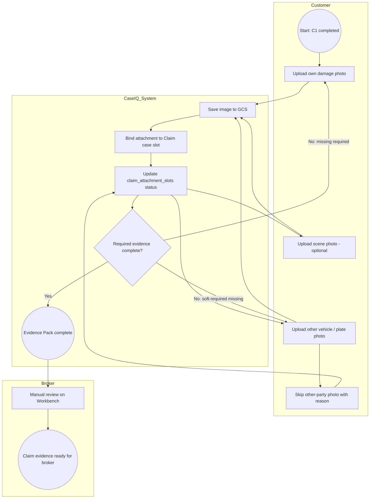

# P19H-3b — Claim Evidence Pack Recon / Design Contract

**Date:** 2026-07-08  
**Branch:** `sprint/p16-trust-layer`  
**Type:** Recon / design contract only — **no production code, no deploy, no schema migration**  
**Prerequisite:** P19H-3a deployed (`29b57fe`, `fiqa-api-00170-lgk`) · Claim Workbench visibility verified (`case_b8d15b3ca59a`)  
**Related:** `evidence/p19h3a_claim_workbench_visibility_2026_07_09.md` · `evidence/p19h2_simplified_claim_wecom_start_basics_c1_2026_07_08.md` · `p19d16_pure_wecom_chat_vs_h5_guided_flow_recon.md` · `p19e3_channel_strategy_wecom_h5_miniprogram_recon.md` · `p19j0_lightweight_workflow_observability_recon.md`

---

## 1. Executive Summary

After P19H-3a, guided Claim cases (`service_lane=claim`) are visible on Workbench with Accident Basics after C1. The **next product gap** is structured accident photo collection — the **Claim Evidence Pack** — without OCR, carrier filing, or full drawer.

| Question | Recommendation |
|----------|----------------|
| Build H5 guided Claim photo upload first? | **YES** — reuse P19D-4A Add Vehicle H5 chain; clearest slot assignment |
| Support direct WeCom images now? | **NO for MVP** — defer to V1.1; `media_intake` does not bind `claim` lane today |
| Defer OCR / AI damage detection? | **YES** — explicitly out of scope |
| Next coding sprint? | **P19H-3c** — H5 Claim Evidence Pack (backend token + upload + WeCom Start Card + Workbench checklist) |

**Verdict:** **GO** on H5-first Claim Evidence Pack MVP using existing `case_attachments` + `claim_attachment_slots` JSONB patterns. No schema migration.

---

## 2. Current State

### 2.1 Shipped (P19H-2' → P19H-3a)

| Layer | Status | Notes |
|-------|--------|-------|
| WeCom Claim start + safety gate | ✅ | `claim_basics.py` |
| Accident basics (3 fields) | ✅ | Deterministic extraction |
| C1 stage-complete card | ✅ | Lists next photo steps; **no H5 link yet** |
| Claim interrupt / lane switch | ✅ | P19H-2.1 |
| Workbench Claim visibility | ✅ | P19H-3a — badge, list summary, minimal Accident Basics drawer |
| Routing decision logs | ✅ | P19J-1a |
| Scenario simulator | ✅ | P19J-1c |

**Production case verified:** `case_b8d15b3ca59a` — `workflow_phase=accident_basics_complete`, Workbench smoke PASS.

### 2.2 Not shipped

| Gap | Impact |
|-----|--------|
| H5 Claim photo flow | Customer cannot complete evidence pack in guided way |
| WeCom Start Card → H5 link after C1 | C1 copy says "照片上传入口下一步会接入" |
| Workbench evidence checklist | Broker sees basics only, not photo slot status |
| Claim lane in H5 token minting | `h5_task_token.py` supports only `lane=add_car` |
| Claim lane in WeCom media binding | `media_intake.resolve_media_case_binding()` ignores `service_lane=claim` |

### 2.3 Existing infrastructure we can reuse

| Component | Location | Add Vehicle | Claim-ready? |
|-----------|----------|-------------|--------------|
| H5 upload API | `routes/h5_task_upload.py` | ✅ | Extend lane/slots |
| H5 upload handler | `inbox_triage/h5_task_upload.py` | ✅ | Extend `_SLOT_COPY`, flow |
| H5 token (v1/v2) | `inbox_triage/h5_task_token.py` | ✅ `add_car` only | Add `claim` lane + flow |
| H5 link minting | `inbox_triage/h5_task_link.py` | ✅ | Add `mint_h5_claim_evidence_pack_link()` |
| H5 UI page | `ui/src/pages/H5SingleSlotUploadPage.tsx` | ✅ | Lane-agnostic; reads task API |
| GCS path builder | `build_h5_media_object_path()` | ✅ | Same pattern `h5/{case_id}/{slot}/...` |
| Attachment append | `append_h5_gcs_attachment_metadata()` | ✅ | Works for any case |
| Skip state | `h5_photo_flow_state.skipped_slots` | ✅ add_car | Mirror or share for claim |
| Workbench preview | `CaseAttachmentsPanel.tsx` | ✅ | Already shows `h5_task` source |
| Claim slot status helpers | `claim_state.py` | N/A | **Already defined** — `claim_attachment_slots`, `get_claim_attachment_slot_status()` |
| Kernel definition | `CLAIM_SIMPLIFIED_DEFINITION` | N/A | `evidence_pack` phase + slots exist |

### 2.4 C1 copy today (post-basics)

From `build_claim_stage_complete_c1_reply()`:

- Lists: 车损照片 · 对方车辆/车牌 · 现场照片（可选）
- `_CLAIM_PHOTO_NEXT_STEP_NOTE`: "照片上传入口下一步会接入；现在可先把事故照片发到微信里，陈总会人工查看。"
- **No broken H5 URL** (correct — link not wired yet)

### 2.5 Kernel next step after C1

`get_claim_simplified_current_step()` → `action: collect_evidence_pack`, `phase: evidence_pack`.

---

## 3. Product Goal

After Claim C1 (accident basics complete), collect **three photo evidence slots** and bind them to the Claim case so the broker can review structured intake — not free-form chat photos.

| # | Slot (canonical key) | Customer label | Required |
|---|----------------------|----------------|----------|
| 1 | `customer_damage_photo` | 自己车损照片 | **Required** |
| 2 | `other_party_vehicle_photo` | 对方车辆 / 车牌照片 | **Soft required** (skippable with reason) |
| 3 | `scene_photo` | 现场照片 | **Optional** |

**Out of scope this sprint:** OCR, AI damage assessment, fraud detection, carrier filing, liability/coverage decisions, full Claim drawer, workflow engine.

---

## 4. BPMN View

### 4.1 Pools / lanes

| Pool | Actor |
|------|-------|
| Customer | WeCom user |
| CaseIQ System | Backend + H5 + GCS |
| Broker / Office | Chen Kui Workbench |

### 4.2 Process flow



### 4.3 Phase alignment (simplified kernel)

```text
accident_basics_complete  →  evidence_pack (photos)  →  risk_confirmation  →  intake_ready_for_broker
         ▲ C1 done today              ▲ P19H-3c target              ▲ later sprint
```

---

## 5. DMN / Rules View

| Rule ID | Condition | Decision | Customer / system action |
|---------|-----------|----------|--------------------------|
| R1 `injury_safety_first` | `anyone_injured=yes` OR injury markers in message | **Block normal evidence CTA** | Safety/manual path; broker phone-first (already shipped P19H-2') |
| R2 `damage_photo_required` | `customer_damage_photo` status ∉ {received} | `evidence_complete=false` | Must collect before pack complete |
| R3 `other_party_soft_required` | `other_party_vehicle_photo` missing AND no skip_reason | `evidence_complete=false` | Ask once; offer skip reasons |
| R4 `other_party_skip_ok` | skip_reason ∈ allowed set | Treat slot as satisfied for gate | Log reason; broker reviews |
| R5 `scene_optional` | `scene_photo` missing | **OK** | Optional; never blocks gate |
| R6 `evidence_gate_pass` | R2 satisfied AND (R3 satisfied OR R4) | `evidence_pack_complete=true` | Advance phase; send completion card (later) |
| R7 `broker_ready` | R6 + risk_confirmation (later) | `intake_ready_for_broker` | Not in P19H-3c |
| R8 `never_filed` | Always | Forbidden copy | Never "claim filed" / "已报案" |
| R9 `never_fault` | Always | Forbidden copy | Never decide fault or coverage |

### 5.1 Allowed skip reasons (`other_party_vehicle_photo`)

| `skip_reason` | Label (ZH) | When |
|---------------|------------|------|
| `no_other_party` | 没有对方车辆 / 单方事故 | Single-vehicle incident |
| `not_available` | 当时无法拍摄 | Could not photograph at scene |
| `hit_and_run` | 对方逃逸 | Hit-and-run |
| `customer_not_safe_to_collect` | 当时不安全未能拍摄 | Safety at scene |

### 5.2 DMN decision table (evidence complete)

| injury? | customer_damage | other_party | scene | → evidence_complete |
|---------|-----------------|-------------|-------|-------------------|
| yes | * | * | * | **manual_handle** (not auto-complete) |
| no | missing | * | * | **false** |
| no | received | missing, no skip | * | **false** |
| no | received | received OR skipped | missing | **true** |
| no | received | received OR skipped | received | **true** (preferred) |

---

## 6. Evidence Slot Contract

Canonical keys align with `claim_state.py` / `CLAIM_SIMPLIFIED_DEFINITION` (do **not** introduce parallel names like `other_vehicle_or_plate_photo`).

### 6.1 Slot definitions

#### `customer_damage_photo`

| Field | Value |
|-------|-------|
| `slot_key` | `customer_damage_photo` |
| `label` | 自己车损照片 |
| `broker_display_label` | Customer damage · 车损照片 |
| `required_level` | `required` |
| `accepted_media_types` | `image/jpeg`, `image/png`, `image/heic`, `image/heif` |
| `max_files` | 2 (MVP: 1 required minimum; allow 2nd angle optional same slot) |
| `status` | `missing` \| `received` \| `needs_retake` |
| `customer_copy` | 请拍摄您车辆的损伤部位（远景 + 近景更清晰） |
| `safety_notes` | Do not ask customer to step into traffic |
| `examples` | Full vehicle view; close-up of damage area |

#### `other_party_vehicle_photo`

| Field | Value |
|-------|-------|
| `slot_key` | `other_party_vehicle_photo` |
| `composite_key` | `other_party_vehicle_or_plate` (kernel gate) |
| `label` | 对方车辆 / 车牌照片 |
| `broker_display_label` | Other vehicle / plate · 对方车辆或车牌 |
| `required_level` | `soft_required` |
| `accepted_media_types` | same as above |
| `max_files` | 2 |
| `status` | `missing` \| `received` \| `skipped` \| `needs_retake` |
| `skip_reason` | optional enum (see §5.1) |
| `customer_copy` | 如有对方车辆，请拍车辆或车牌照片。如无法拍摄，可选择说明原因。 |
| `safety_notes` | If hit-and-run or unsafe, skip — do not chase |
| `examples` | Other car side view; license plate close-up |

#### `scene_photo`

| Field | Value |
|-------|-------|
| `slot_key` | `scene_photo` |
| `label` | 现场照片 |
| `broker_display_label` | Scene · 现场照片（可选） |
| `required_level` | `optional` |
| `accepted_media_types` | same as above |
| `max_files` | 2 |
| `status` | `missing` \| `received` \| `skipped` |
| `customer_copy` | 如有需要，可补充事故现场环境照片（可选） |
| `safety_notes` | Optional; never blocks completion |
| `examples` | Intersection overview; road context |

### 6.2 Deferred slots (document only)

| Slot | Phase |
|------|-------|
| `police_report_photo` | `risk_confirmation` |
| `repair_estimate_photo` | post-MVP |
| `insurance_card_photo` | post-MVP |

### 6.3 Status vocabulary

Map to existing `ClaimSlotStatus` in `claim_state.py`:

| Contract status | `claim_attachment_slots[slot].status` |
|-----------------|--------------------------------------|
| missing | `empty` (or absent) |
| received | `received` |
| skipped | `skipped` |
| needs_retake | `needs_retake` |

Inference rule (already implemented): if `case_attachments[]` has `slot_assignment` + `source=h5_task`, status → `received` unless explicit override in `claim_attachment_slots`.

---

## 7. Channel Strategy: WeCom Image vs H5 Guided Upload

### 7.1 Option A — WeCom native image messages

| Pros | Cons |
|------|------|
| Natural UX — customer already in WeChat | **Slot classification ambiguous** — which photo is which? |
| No context switch | `media_intake` **does not bind `claim` lane** today |
| Fast for demo | Competes with Add Vehicle if both active |
| | P19D-1 guardrail quarantines unknown slots |
| | Broker cleanup load high (P19D-16: ~15–25% Spark-like on photos) |

### 7.2 Option B — H5 guided upload (Add Vehicle pattern)

| Pros | Cons |
|------|------|
| **Clear slot assignment** — one step at a time | Extra tap (WeCom → browser) |
| Reuses proven P19D-4A chain | Needs Start Card + signed token |
| `binding_confidence: high`, `document_type_confidence: user_selected_step` | Slightly more implementation |
| Workbench already renders `source=h5_task` | |
| Matches `CLAIM_SIMPLIFIED_DEFINITION.evidence_pack` | |

### 7.3 Recommendation

| Channel | MVP (P19H-3c) | V1.1 |
|---------|-----------------|------|
| **H5 guided upload** | **Primary** — WeCom text card + view button after C1 | Resume link on progress card |
| **WeCom direct images** | **Not primary** — keep generic media ack only | Slot-aware binding when single open `claim` case + `photos_in_progress` |
| **Chat guardrail** | Safety net (quarantine unassigned) | Same |

**Trigger pattern (mirror Add Vehicle):**

```text
C1 complete → WeCom msgmenu Start Card
  Head: 【理赔资料 · 下一步】
  Button: 上传事故照片 → signed H5 flow URL
  Tail: 这只是资料收集，不代表正式报案
```

**Verified against Add Vehicle:** `mint_h5_add_vehicle_photo_flow_link()` + `H5SingleSlotUploadPage` + `ingest_h5_slot_upload()` — extend, do not fork.

---

## 8. Data Model Recommendation

### 8.1 No schema migration

Store everything in existing case JSONB (Postgres `case_extra`), same as Add Vehicle H5.

### 8.2 Primary storage (reuse existing fields)

| Field | Purpose |
|-------|---------|
| `case_attachments[]` | Binary metadata + GCS URI per upload (SoT for files) |
| `claim_attachment_slots` | Per-slot status, skip_reason, needs_retake_reason, uploaded_at |
| `h5_photo_flow_state` OR `claim_evidence_pack_state` | Flow-level skip list + completion timestamps |

**Prefer `claim_attachment_slots`** over inventing `claim_evidence_pack` — already read by `claim_state.py`. Optional thin alias:

```json
"claim_evidence_pack": {
  "flow": "claim_evidence_pack_v1",
  "evidence_complete": false,
  "slots": { /* mirror of claim_attachment_slots for API convenience */ }
}
```

Implementation may add `claim_evidence_pack` as a **computed view** in workbench enrichment only — not a second SoT.

### 8.3 Per-slot shape (`claim_attachment_slots`)

```json
{
  "customer_damage_photo": {
    "status": "received",
    "attachment_ids": ["att_abc123"],
    "uploaded_at": "2026-07-08T18:00:00Z",
    "source_channel": "h5_task",
    "skip_reason": null,
    "needs_retake_reason": null
  },
  "other_party_vehicle_photo": {
    "status": "skipped",
    "attachment_ids": [],
    "skip_reason": "no_other_party",
    "source_channel": "h5_task"
  },
  "scene_photo": {
    "status": "empty",
    "attachment_ids": []
  }
}
```

### 8.4 Attachment record shape (existing `append_h5_gcs_attachment_metadata`)

```json
{
  "attachment_id": "att_…",
  "source": "h5_task",
  "flow": "claim_evidence_pack",
  "slot_assignment": "customer_damage_photo",
  "document_type": "customer_damage_photo",
  "document_type_confidence": "user_selected_step",
  "storage_uri": "gs://…/h5/case_xxx/customer_damage_photo/2026/07/h5_….jpg",
  "binding_confidence": "high",
  "intake_status": "promoted",
  "guardrail_status": "accepted",
  "eligible_for_ocr": false,
  "ocr_status": "not_started"
}
```

Set `eligible_for_ocr: false` for Claim evidence MVP — no OCR promise.

### 8.5 Compatibility notes

- `claim_state._attachments_by_slot()` already accepts `source ∈ {h5_task, wecom, claim_h5}`.
- Kernel composite `other_party_vehicle_or_plate` satisfied when `other_party_vehicle_photo` received or skipped (existing adapter).
- Do **not** share `h5_photo_flow_state` with Add Vehicle on the same case — Claim cases won't have add_car lane; separate `claim_evidence_pack_state` if flow state needed.

---

## 9. Workbench Display Plan

### 9.1 MVP (P19H-3c) — display only

Add **Claim Evidence Checklist** card below Accident Basics in Claim drawer (`DocumentIntakeInboxPage.tsx`).

```
Claim Evidence Checklist
✅ 自己车损照片          · received · H5 · 10:32 AM · [thumbnail]
○ 对方车辆 / 车牌照片    · missing
— 现场照片（可选）       · skipped / missing
```

| Element | Source |
|---------|--------|
| Checklist status | `claim_attachment_slots` via new API field `claim_evidence_summary` |
| Thumbnail | Existing `CaseAttachmentsPanel` / preview API |
| Slot label | `claim_state._SLOT_LABELS_ZH` |
| Source | `attachment.source` |
| Time | `attachment.received_at` |

### 9.2 API enrichment (backend)

Extend `enrich_claim_for_workbench()`:

```json
{
  "claim_evidence_summary": {
    "evidence_complete": false,
    "workflow_phase": "photos_in_progress",
    "slots": [
      {
        "slot_key": "customer_damage_photo",
        "label": "自己车损照片",
        "status": "received",
        "required_level": "required",
        "attachment_id": "att_…",
        "preview_available": true,
        "uploaded_at": "…",
        "source_channel": "h5_task"
      }
    ]
  }
}
```

### 9.3 Deferred broker actions

- Mark needs retake
- Mark acceptable
- Add broker note

Not in P19H-3c MVP.

### 9.4 List column

Optional one-line: `Evidence: 1/2 required` — defer if drawer checklist sufficient for pilot.

---

## 10. Customer Copy

### 10.1 After C1 — WeCom Start Card (target P19H-3c)

```
【理赔资料 · 下一步】

请上传事故照片：

1. 您的车损照片
2. 对方车辆 / 车牌照片
3. 现场照片（可选）

这些只是资料收集。
不代表 claim 已正式提交。
陈总会人工确认后再跟进。

[上传事故照片]  ← H5 view button
```

### 10.2 H5 page titles (per slot)

| Step | Title | Instruction |
|------|-------|-------------|
| 1 | 理赔资料 · 车损照片 | 请拍摄您车辆损伤部位（尽量包含损伤区域） |
| 2 | 理赔资料 · 对方车辆 | 请拍摄对方车辆或车牌。如无法拍摄，可点击跳过并选择原因。 |
| 3 | 理赔资料 · 现场照片 | 可选：拍摄事故现场环境照片 |

### 10.3 Flow complete message (WeCom)

```
【理赔资料 · 照片已收到 ✅】

事故照片已保存，陈总会人工查看。

下一步：我们会再确认是否有人受伤、是否报警。
这不代表已经正式报案。
```

(Risk confirmation = separate sprint.)

### 10.4 Interim (until H5 wired)

Keep current `_CLAIM_PHOTO_NEXT_STEP_NOTE` — no broken links.

---

## 11. Safety / Compliance Guardrails

| Guardrail | Implementation |
|-----------|----------------|
| No claim filed language | Reuse `CLAIM_FORBIDDEN_AUTOMATION_CLAIMS` in all new copy |
| No fault / coverage | No DMN rules promise liability or coverage |
| Injury first | `injury_yes` → manual_handle; do not push photo H5 as urgent |
| PII / plate privacy | Workbench auth-gated; no plate OCR; broker-only preview |
| Broker confirmation | `broker_confirmed: false` on all customer uploads |
| OCR | `eligible_for_ocr: false` on Claim evidence attachments |
| AI damage | Not mentioned to customer |
| Data retention | Same as existing case / GCS policy |

---

## 12. Risks and Edge Cases

| Risk | Simplest safe handling |
|------|------------------------|
| Random photo, no active Claim | WeCom guardrail → unassigned intake case (existing) |
| Photo during active Add Vehicle + Claim | Prefer active **claim** case when `claim_phase=photos_in_progress`; log routing decision |
| Multiple open workflows | H5 token binds `case_id` — explicit; WeCom images stay quarantined until V1.1 |
| Wrong photo type | H5 prevents — customer selects step; retake = broker later |
| Duplicate photo same slot | Replace or append with max_files; MVP: allow 1 per slot, idempotent on `h5_upload_id` |
| Large images | Existing 5 MB limit (`H5_MAX_UPLOAD_BYTES`) |
| Preview performance | Reuse staggered lazy load in `CaseAttachmentsPanel` (P19F-1) |
| License plate PII | No OCR; internal Workbench only |
| No other party | Skip reason `no_other_party` on H5 step 2 |
| Hit and run | Skip reason `hit_and_run` |
| Injury present | Block auto evidence-complete; manual path |
| Broker wants retake | `needs_retake` status in `claim_attachment_slots` (display sprint P19H-3d) |

---

## 13. Recommended MVP Implementation Plan

### P19H-3c — Claim Evidence Pack (coding sprint)

| Step | Deliverable | Files (indicative) |
|------|-------------|-------------------|
| **3c-1** | H5 token + flow for `lane=claim` | `h5_task_token.py`, `h5_task_link.py`, `h5_task_upload.py` |
| **3c-2** | Claim slot copy + skip for `other_party_vehicle_photo` | `h5_task_upload.py`, `case_store.py` (`record_claim_evidence_skip`) |
| **3c-3** | Update slot status on upload | `claim_basics.py` or `claim_evidence.py` helper patching `claim_attachment_slots` |
| **3c-4** | WeCom C1 → H5 Start Card | `reply.py`, `claim_basics.py` (mirror `_build_add_car_h5_start_menu`) |
| **3c-5** | Phase transition `accident_basics_complete` → `photos_in_progress` | `claim_state.py` / `claim_basics.py` |
| **3c-6** | Workbench `claim_evidence_summary` + checklist UI | `claim_workbench_display.py`, `claimWorkbenchDisplay.ts`, `DocumentIntakeInboxPage.tsx` |
| **3c-7** | Tests | `test_p19h3c_claim_evidence_pack.py`, extend scenario simulator |
| **3c-8** | Deploy + phone smoke | Evidence pack checklist on `case_b8d15b3ca59a` or fresh Claim |

### P19H-3d (defer) — Broker retake + evidence complete card

### P19H-3e (defer) — Risk confirmation (injury/police buttons)

### P19H-3f (defer) — WeCom direct image slot binding (V1.1)

**Dependency order:** backend H5 → WeCom card → Workbench checklist → deploy.

**Estimated size:** ~Same as P19D-4A slice (medium sprint) — mostly extending existing H5 infra.

---

## 14. What Not To Build Now

| Item | Reason |
|------|--------|
| Schema migration | JSONB sufficient |
| OCR / VIN-style extraction on damage photos | Explicitly out of scope |
| AI damage / fraud detection | Out of scope |
| Carrier filing API | Out of scope |
| Full Claim drawer | Minimal checklist only |
| Workflow engine (Camunda/Temporal) | P19J-0 rejected |
| WeCom-native slot classification | Defer V1.1 |
| `other_party_info` text collection | After evidence pack |
| Mini program | P19E-3 defer |

---

## 15. Acceptance Criteria for P19H-3c Implementation

- [ ] After C1, customer receives WeCom card with working **上传事故照片** H5 link (no 403/404)
- [ ] H5 flow collects 3 slots in order; step 2 skippable with reason enum
- [ ] Images stored in GCS under `h5/{case_id}/{slot}/…`
- [ ] `case_attachments` records with `source=h5_task`, `slot_assignment` set
- [ ] `claim_attachment_slots` updated on upload/skip
- [ ] `derive_claim_phase()` moves to `photos_in_progress` when first photo activity
- [ ] `evidence_complete` true when required + soft-required rules pass
- [ ] Workbench Claim drawer shows Evidence Checklist with ✅/○/—
- [ ] Received slots show thumbnail + preview (reuse attachment panel)
- [ ] Add Vehicle H5 flow regression PASS
- [ ] No forbidden filing language in customer copy
- [ ] No schema migration
- [ ] Scenario simulator covers C1 → H5 evidence path

---

## 16. Final Recommendation

| Question | Answer |
|----------|--------|
| **H5 guided Claim photo upload first?** | **YES** — extend P19D-4A; highest clarity, lowest broker cleanup |
| **Direct WeCom images now?** | **NO** — V1.1 fallback; media binding lacks `claim` lane |
| **OCR/AI damage deferred?** | **YES** — set `eligible_for_ocr: false`; no customer promise |
| **Next coding sprint?** | **P19H-3c** — H5 Claim Evidence Pack + WeCom Start Card + Workbench checklist |

**Data contract:** `claim_attachment_slots` + `case_attachments` (existing); canonical slot keys from `claim_state.py`.

**Channel:** WeCom Start Card triggers H5; chat images remain guardrail-only.

**STOP** — P19H-3b recon complete. Ready for P19H-3c implementation approval.
