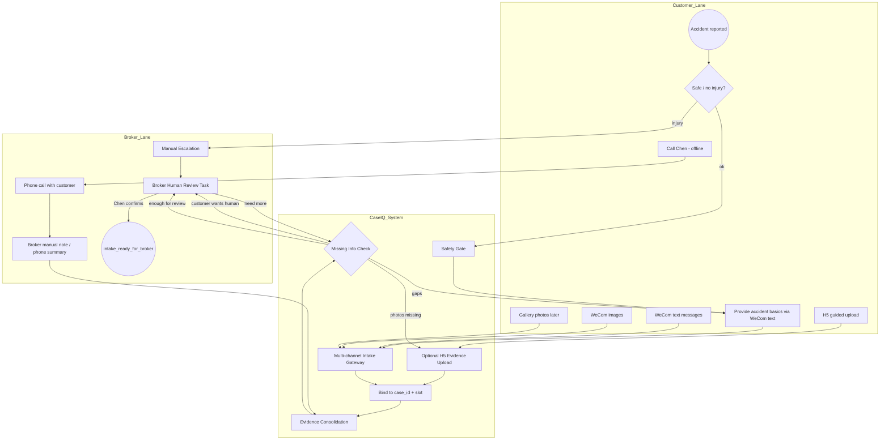

# P19H-3c-R1 — Claim Multi-Channel Intake Best Practice Recon

**Date:** 2026-07-08  
**Branch:** `sprint/p16-trust-layer`  
**Type:** Recon / product design judgment only — **no production code, no deploy, no schema migration**  
**Prerequisite:** P19H-3c-2 deployed (`c4c8b1e`, `fiqa-api-00171-hbx`) · H5 Claim Evidence Pack foundation + C1 button live  
**Related:** `p19h3b_claim_evidence_pack_recon.md` · `evidence/p19h3c2_claim_c1_h5_button_2026_07_09.md` · `p19d16_pure_wecom_chat_vs_h5_guided_flow_recon.md` · `p19j0_lightweight_workflow_observability_recon.md`

---

## 1. Executive Summary

P19H-3c shipped a **linear H5-first** Claim evidence path: WeCom basics → C1 → **上传事故照片** H5 button → guided 3-slot photo flow. That works technically, but **real accident intake is not Add Vehicle**. Customers are stressed, may call Chen directly, may send gallery photos in chat, and should not be forced through a single browser wizard.

| Question | Recommendation |
|----------|----------------|
| Change current workflow? | **Partially** — keep safety gate + basics + H5; **reframe** as multi-channel case builder, not linear form |
| H5 role? | **Yes, but optional guided helper** — not the only path |
| Voice/audio now? | **Manual broker note first** — defer ASR |
| Phone calls? | Broker-entered **phone summary** on Workbench → `claim_timeline` event |
| Next coding sprint? | **P19H-3c-3 Workbench Evidence Checklist** |
| Product positioning? | **Option 3: Broker Claim Service Copilot** |

**Verdict:** **GO** on revised multi-channel Claim intake design. **HOLD** on H5-as-only-path copy and routing. **STOP** — no code in this sprint.

---

## 2. Why Claim Is Different From Add Vehicle

| Dimension | Add Vehicle | Claim / Accident |
|-----------|-------------|------------------|
| Customer emotional state | Routine admin task | Stressed, scared, possibly injured |
| Urgency | Days/weeks | Minutes to hours |
| Preferred channel | WeChat text + H5 photos OK | Phone, voice, chat images, H5 — **any** |
| Photo timing | Usually deliberate (garage, driveway) | May be at scene, may be **hours later from gallery** |
| Broker role | Review docs, submit to carrier | **Calm customer**, advise next steps, file with carrier |
| Automation ceiling | High for structured docs | **Low** — broker must confirm; no fault/coverage/filing |
| Wrong UX cost | Retry upload | Customer abandons, calls competitor, files wrong |

Add Vehicle is a **document collection workflow**. Claim is a **service event** where the system helps Chen organize chaos — not replace him.

P19H-3b correctly chose H5-first for **slot clarity** (same rationale as P19D-4A). P19H-3c-R1 concludes that was the right **engineering** step but the wrong **product north star** if we stop there.

---

## 3. Current Product State

### 3.1 Shipped (production)

| Layer | Status | Notes |
|-------|--------|-------|
| WeCom Claim start + safety gate | ✅ | `claim_basics.py` — injury → `manual_handle` |
| Accident basics (3 fields) | ✅ | Deterministic extraction, partial collection |
| C1 stage-complete + H5 button | ✅ | P19H-3c-2 — `上传事故照片` msgmenu |
| Claim interrupt / lane switch | ✅ | P19H-2.1 — Claim over Add Vehicle |
| Workbench Claim visibility | ✅ | P19H-3a — Accident Basics card only |
| H5 Claim Evidence Pack | ✅ | P19H-3c-1/2 — `lane=claim`, 3 slots |
| Routing decision log | ✅ | P19J-1a |
| Scenario simulator | ✅ | P19J-1c — 6 scenarios |

**Live path today:**

```text
我要理赔 → 开始理赔 → time/location/description → C1
  → 【请点击下面按钮上传事故照片】→ H5 理赔资料 · 车损照片
```

### 3.2 Gaps vs multi-channel goal

| Gap | Impact |
|-----|--------|
| C1 copy pushes H5 as **primary** next step | Customers who send chat photos feel ignored |
| `media_intake` does **not** prefer `service_lane=claim` | WeCom images → quarantine or wrong lane |
| No Workbench evidence checklist | Chen sees basics only, not photo slot status |
| No broker phone-summary / note entry | Phone channel invisible on case timeline |
| No unified `claim_timeline` | Multi-channel events not surfaced as one story |
| `claim_attachment_slots` mutation deferred | Status inferred from attachments only |
| Voice/audio | Not handled — acceptable for MVP |

### 3.3 Reusable infrastructure

| Component | Claim-ready? |
|-----------|--------------|
| `claim_state.py` — slots, phases, kernel | ✅ |
| `claim_attachment_slots` + `get_claim_attachment_slot_status()` | ✅ (read); write partial |
| H5 `claim_evidence_pack` flow | ✅ |
| `append_follow_up_message()` | ✅ — can log broker notes |
| `case_attachments[]` multi-source | ✅ — `h5_task`, `wecom` accepted in slot inference |
| Workbench enrichment hook | ✅ — extend `enrich_claim_for_workbench()` |

---

## 4. Industry / Best Practice Observations

### 4.1 What large carriers do in digital FNOL

**Not our target**, but useful patterns to **borrow** vs **ignore**:

| Carrier pattern | What they do | Borrow for broker MVP? |
|-----------------|--------------|------------------------|
| Safety first | Injury check before details | ✅ Already shipped |
| Progressive disclosure | 15–20 core fields first, rest later | ✅ Basics → evidence → risk |
| Omnichannel normalize | Phone, app, web, chat → **one claim record** | ✅ **Core insight** |
| Guided photo capture | Step-by-step damage photos | ✅ Via H5 helper |
| Real-time coverage / fault | Auto-adjudication | ❌ Out of scope |
| Straight-through processing | Low-severity auto-pay | ❌ Out of scope |
| AI damage estimation | Photo → repair estimate | ❌ Out of scope |
| 24/7 voice AI intake | ASR + NLU FNOL | ❌ Defer — broker note instead |

**What carriers collect first (typical order):**

1. Are you safe? Anyone injured?
2. When / where did it happen?
3. Brief description
4. Photos (damage, other party, scene)
5. Police report? Other party info?
6. Policy verification (they have systems — we don't)

**Safety / injury handling:** Block normal flow; route to human or emergency guidance. We already do this via `message_mentions_injury()` → `manual_handle`.

**Photos:** Carriers use **guided mobile flows** but also accept email/app uploads days later. They rarely **block** the claim record on completing a wizard.

**Automation vs human:** Carriers target 60–80% STP on simple auto claims. **Brokers invert this:** ~90% human review, system does prep work.

### 4.2 Key FNOL lesson for us

> Modern FNOL does not force one channel. It standardizes **what gets captured** regardless of channel.  
> — MDS Software / industry FNOL modernization pattern

Our equivalent: one `case_id`, one `claim_attachment_slots` contract, many intake channels.

---

## 5. Broker Reality in Southern California

### 5.1 What usually happens when a customer has an accident

1. **Customer calls or WeChats Chen first** — not the carrier app.
2. Chen asks: *Are you OK? What happened? Where?*
3. Customer may send photos in WeChat **while talking** or **later from home**.
4. Chen explains: report to carrier, what docs help, what not to say, rental/tow if applicable.
5. Chen files FNOL with carrier or coaches customer through carrier app.
6. Chen follows up on adjuster assignment, supplement docs.

### 5.2 Why customers call the broker (not just use H5)

| Reason | System implication |
|--------|-------------------|
| Emotional need — want a person | Offer **联系陈总** always; never feel "stuck with a bot" |
| Language / cultural comfort (华裔客户) | Bilingual WeCom + human backup |
| Unsure whether to file | Safe Q&A path — no coverage promise |
| Don't know what photos matter | System shows checklist; H5 is optional helper |
| Already on phone with Chen | Phone summary must land on same case |

### 5.3 What broker needs quickly

| Priority | Field / artifact |
|----------|------------------|
| P0 | Safety / injury status |
| P0 | When, where, what happened |
| P1 | Customer damage photos (any channel) |
| P1 | Other party vehicle / plate (or skip reason) |
| P2 | Scene photos |
| P2 | Police involved? |
| P3 | Other party contact / insurance |
| P3 | Police report, tow, repair shop |

### 5.4 What must NOT be automated

- Fault / liability determination
- Coverage confirmation or denial
- "Claim filed" / "已报案" language
- Carrier submission
- Injury triage beyond "call 911 / contact Chen"
- Pushing customer to complete H5 before Chen can help

### 5.5 System vs broker decision boundary

| System collects | Broker decides |
|-----------------|----------------|
| Structured facts from any channel | Whether to file with carrier |
| Photo evidence into slots | If photos are sufficient |
| Missing-info checklist | What to ask on follow-up call |
| Timeline of all intake events | Coverage / fault / next legal step |
| Safe calming copy | When to escalate |

---

## 6. Recommended Product Positioning

### Options evaluated

| Option | Fit | Verdict |
|--------|-----|---------|
| 1. Automated Claim Intake Bot | Implies bot replaces broker | ❌ Wrong for Chen's value prop |
| 2. Claim Evidence Pack Collector | Too narrow — ignores phone/voice/service | ❌ Too doc-centric |
| 3. **Broker Claim Service Copilot** | System preps; Chen confirms and serves | ✅ **Best fit** |
| 4. Multi-channel Claim Case Builder | Accurate technically | ✅ Good subtitle; less GTM warmth |

### Final positioning

**Broker Claim Service Copilot** — CaseIQ helps Chen's office turn messy accident contact (WeChat, phone, photos, H5) into an organized Claim case with clear gaps and evidence, so Chen can calm the customer and act faster with fewer misses.

Shorter internal name: **Multi-channel Claim Case Builder** (engineering). Customer-facing: never "AI claims adjuster."

---

## 7. Revised Claim Workflow

### 7.1 Principles (non-negotiable)

1. **Calm first** — safety gate before collection pressure.
2. **Any channel → one timeline** — text, images, H5, broker note bind to `case_id`.
3. **H5 is a helper** — offered, not required.
4. **System organizes; broker decides** — checklist + missing info, not auto-close.
5. **Workbench = Chen's next action** — not a file dump.

### 7.2 Revised customer journey

```text
[Trigger] 我要理赔 / 我撞车了 / phone to Chen
    │
    ▼
[Safety Gate] 人是否安全？受伤 → manual_handle + 联系陈总
    │
    ▼
[Accident Basics] time · location · description (WeCom text)
    │
    ▼
[C1 Acknowledgment] 基本信息已收到 ✅
    │
    ├── Option A: 上传事故照片 (H5 guided helper)
    ├── Option B: 直接发照片到微信 (WeCom images → slot bind when possible)
    ├── Option C: 联系陈总 (human path — no penalty)
    └── Option D: 晚点再传 (system allows; broker follows up)
    │
    ▼
[Evidence Consolidation] System merges all channels → slot status
    │
    ▼
[Missing Info Check] What's still needed? (DMN rules)
    │
    ▼
[Broker Human Review] Chen: enough / need more / call customer
    │
    ▼
[intake_ready_for_broker] Handoff — still not "claim filed"
```

### 7.3 Copy shift (C1 and after)

**Today (P19H-3c-2):**

> 请点击下面按钮上传事故照片。

**Revised (target):**

> 事故基本信息已收到 ✅  
> 接下来可以：  
> · 点击按钮分步上传照片（推荐，更清晰）  
> · 或直接把事故照片发到微信，陈总会整理  
> · 也可以先联系陈总  
> 这只是资料收集，不代表正式报案。

H5 button remains; it is **not** the only CTA.

---

## 8. BPMN View

### 8.1 Pools

| Pool | Actor |
|------|-------|
| Customer | WeCom user — text, images, H5, optional voice |
| CaseIQ System | Routing, consolidation, checklist, safe copy |
| Broker / Office | Chen — phone, Workbench review, manual notes |

### 8.2 Multi-channel process



### 8.3 Phase alignment (unchanged kernel)

```text
claim_started
  → accident_basics_in_progress → accident_basics_complete
  → photos_in_progress (any channel activity)
  → evidence_pack_complete (DMN gate)
  → risk_confirmation (later)
  → intake_ready_for_broker
  → broker_review → broker_done | manual_handle
```

---

## 9. DMN / Rules View

### 9.1 Decision table

| Rule ID | Condition | Decision | Action |
|---------|-----------|----------|--------|
| R1 `injury_safety_first` | `anyone_injured=yes` OR injury markers | **manual_handle** | Safety reply; no photo pressure |
| R2 `customer_wants_call` | 「联系陈总」/ lane-switch option 3 | **broker_task** | Ack + Workbench flag `broker_contact_requested` |
| R3 `damage_photo_required` | `customer_damage_photo` ∉ {received} | `evidence_incomplete` | Ask OR allow later; never block basics ack |
| R4 `other_party_soft` | other_party missing AND no skip_reason | `evidence_incomplete` | Offer skip reasons |
| R5 `other_party_skip_ok` | skip_reason ∈ allowed set | slot satisfied | Log reason |
| R6 `scene_optional` | scene_photo missing | **OK** | Never blocks |
| R7 `h5_not_required_if_wecom` | WeCom image bound to slot | slot = received | Skip H5 nag for that slot |
| R8 `gallery_photo_ok` | Photo lacks EXIF / old timestamp | **accept** | Broker reviews; no auto-reject |
| R9 `broker_enough` | Chen marks `evidence_sufficient` | advance phase | Overrides missing optional slots |
| R10 `broker_not_enough` | Chen marks `needs_retake` / `needs_more` | broker task | Customer follow-up |
| R11 `never_filed` | always | forbidden | No「已报案」「claim filed」 |
| R12 `never_fault_coverage` | always | forbidden | No fault / coverage promise |

### 9.2 Evidence complete gate (simplified)

| injury? | customer_damage | other_party | → evidence_complete |
|---------|-----------------|-------------|---------------------|
| yes | * | * | **manual_handle** (broker-led) |
| no | missing | * | **false** (soft ask; allow defer) |
| no | received | missing, no skip | **false** |
| no | received | received OR skipped | **true** |
| broker marks sufficient | * | * | **true** (human override) |

### 9.3 Multi-case / lane rules (existing + claim)

| Active workflows | Incoming | Rule |
|------------------|----------|------|
| add_car + claim intent | 我要理赔 | lane_switch_prompt (P19H-2.1) |
| claim + add_car image | WeCom photo | Prefer **claim** if `photos_in_progress` |
| claim only | WeCom photo | Bind to claim slots (P19H-3d) |
| no claim | WeCom photo | quarantine / media intake |

---

## 10. Multi-Channel Intake Design

### 10.1 Channel evaluation

| Channel | Customer friction | Data quality | Binding confidence | Slot clarity | Best use case | MVP priority |
|---------|-------------------|--------------|-------------------|--------------|---------------|--------------|
| **1. WeCom text** | Low | Medium (free text) | High (active case) | High for basics | Accident description, answers | **P0** ✅ shipped |
| **2. WeCom voice/audio** | Low for customer | Low without ASR | Low | None | Emotional explanation | **P3** — defer ASR |
| **3. WeCom images** | Very low | Medium (ambiguous slot) | Medium | **Low** without prompt | Stressed customer sends damage pic | **P1** — P19H-3d |
| **4. H5 guided upload** | Medium (browser hop) | **High** | **High** | **High** | Customer ready to do structured upload | **P0** ✅ shipped as helper |
| **5. Phone summary (broker)** | N/A (broker) | High (broker structured) | **High** | High | Customer called Chen | **P1** — P19H-3c-R2 |
| **6. Workbench broker notes** | N/A | High | **High** | N/A | Post-call actions, retake requests | **P1** — P19H-3c-R2 |

### 10.2 Avoiding state chaos

**Single source of truth per case:**

| Layer | Field | Role |
|-------|-------|------|
| Identity | `case_id` + `service_lane=claim` | One claim case per incident |
| Facts | `known_facts` | Text fields |
| Evidence | `case_attachments[]` | All files (any `source`) |
| Slot status | `claim_attachment_slots` | Per-slot received/skipped/needs_retake |
| Timeline | `claim_timeline[]` (proposed) | Ordered events from all channels |
| Phase | `derive_claim_phase()` | Derived — never manually forked per channel |

**Timeline event shape (proposed, JSONB append):**

```json
{
  "event_id": "evt_…",
  "ts": "2026-07-08T18:00:00Z",
  "channel": "wecom_text | wecom_image | h5_task | broker_note | phone_summary",
  "actor": "customer | broker | system",
  "summary": "Customer sent 2 photos via WeChat",
  "slot_keys": ["customer_damage_photo"],
  "attachment_ids": ["att_…"],
  "wecom_msg_id": "wm…",
  "broker_user": "chen"
}
```

**Routing invariant:** All channels resolve **active claim case** by `wecom_external_userid` + `service_lane=claim` + open status — same as basics flow. H5 uses signed `case_id` in token. Broker notes use Workbench `case_id` directly.

**No parallel state machines per channel** — channels are **inputs** to one kernel snapshot (`evaluate_claim_simplified_snapshot()`).

---

## 11. H5 Role Reframing

### 11.1 Options

| Option | Description | Verdict |
|--------|-------------|---------|
| A. Required main workflow | Must complete H5 to proceed | ❌ Current C1 copy leans here — change |
| B. Optional guided upload helper | Button + link when useful | ✅ **Primary recommendation** |
| C. Broker-sent follow-up after call | Chen sends link from Workbench | ✅ Phase 2 — high value |
| D. All of the above by context | | ✅ **Final** |

### 11.2 Context matrix

| Context | H5 role |
|---------|---------|
| Customer calm, ready to upload | C1 button — guided 3-step |
| Customer sent WeCom photos | Acknowledge; **don't insist** on H5 |
| Customer called Chen | Chen sends H5 link later if needed (C) |
| Injury / manual_handle | **No H5 push** |
| Missing one slot only | Deep-link to single slot (future) |

### 11.3 Recommendation

**Keep H5. Change the story.** H5 is the **clearest** path for slot assignment (P19D-16: ~75% photo clarity vs ~15–25% chat). For Claim, clarity still matters — but **availability of alternatives** matters more than for Add Vehicle.

---

## 12. Voice / Audio Strategy

### 12.1 Do we need voice now?

**No** for MVP. Business value is real; implementation cost is high.

### 12.2 WeCom voice message transcription?

| Approach | Pros | Cons | Verdict |
|----------|------|------|---------|
| Auto ASR (WeChat/Tencent/Whisper) | Hands-free for customer | Integration, accuracy, cost, privacy | **Defer** |
| Broker listens + Workbench summary | High quality, calming | Broker time | ✅ **MVP** |
| Ignore voice messages | Zero work | Customer feels unheard | ❌ |

### 12.3 Simplest high-value path

1. WeCom voice message → generic ack: *「语音已收到，陈总会听完后回复您。」*
2. Chen listens on phone / WeCom.
3. Chen enters **phone summary** or **broker note** on Workbench (P19H-3c-R2).
4. Summary appends to `claim_timeline` + extracts basics if possible (manual fields).

**No ASR in pilot.** Revisit when case volume > ~20 claims/month and broker time becomes bottleneck.

---

## 13. Workbench / Broker Experience

### 13.1 Today

- Claim row visible with Accident Basics (time, location, description).
- No evidence checklist, no timeline, no broker actions.

### 13.2 Target: "What Chen needs to know next"

**Claim drawer sections (priority order):**

```
┌─────────────────────────────────────────┐
│ ⚠️ Safety / Manual flags                 │
│ Injury mentioned · Broker contact req   │
├─────────────────────────────────────────┤
│ Accident Basics (existing)              │
│ Time · Location · Description           │
├─────────────────────────────────────────┤
│ Evidence Checklist (P19H-3c-3)          │
│ ✅ 车损照片 · WeCom · 10:32 [thumb]     │
│ ○ 对方车辆/车牌 · missing               │
│ — 现场照片 · optional                   │
├─────────────────────────────────────────┤
│ Next broker action (computed)           │
│ "Need: other party photo or skip reason"│
├─────────────────────────────────────────┤
│ Timeline (later)                        │
│ 10:30 WeCom · basics received           │
│ 10:32 WeCom · 2 images                  │
│ 10:45 Broker · phone summary            │
├─────────────────────────────────────────┤
│ Broker actions (later)                  │
│ [Add phone summary] [Mark sufficient]   │
│ [Request retake] [Send H5 link]         │
└─────────────────────────────────────────┘
```

### 13.3 Phone call representation

| Field | Storage |
|-------|---------|
| `channel` | `phone_summary` |
| `actor` | `broker` |
| `summary_text` | Free text — what Chen learned on call |
| `structured_optional` | injury, police, other_party hints |
| `duration_minutes` | Optional |
| `customer_reached` | bool |

Append via `claim_timeline[]` — same case, no new case row.

---

## 14. Data Model / Timeline Recommendation

### 14.1 No schema migration

Continue JSONB on `case_extra` (Postgres), same as Add Vehicle H5.

### 14.2 Existing fields (keep)

| Field | Purpose |
|-------|---------|
| `known_facts` | Text basics + injury/police later |
| `case_attachments[]` | All media — `source`: `h5_task`, `wecom`, `broker_upload` |
| `claim_attachment_slots` | Slot status + skip_reason + source_channel |
| `workflow_phase` / derived phase | Kernel-aligned |

### 14.3 New fields (proposed, JSONB only)

| Field | Purpose |
|-------|---------|
| `claim_timeline[]` | Ordered multi-channel events (ring buffer, max 50) |
| `broker_flags` | `{ contact_requested, evidence_sufficient, needs_call }` |
| `claim_evidence_summary` | Computed view for API (like Add Vehicle progress) |

### 14.4 Attachment record (multi-channel)

```json
{
  "attachment_id": "att_…",
  "source": "wecom",
  "slot_assignment": "customer_damage_photo",
  "binding_confidence": "medium",
  "document_type_confidence": "broker_assigned | customer_context | user_selected_step",
  "storage_uri": "gs://…",
  "received_at": "…",
  "eligible_for_ocr": false
}
```

WeCom direct binding (P19H-3d) may start with `binding_confidence: medium` and `slot_assignment: unassigned` until broker confirms — acceptable for Claim (unlike Add Vehicle VIN).

---

## 15. Safety / Compliance Guardrails

| Guardrail | Status / action |
|-----------|-----------------|
| No claim filed language | Keep `CLAIM_FORBIDDEN_AUTOMATION_CLAIMS` on all new copy |
| No fault / coverage | Safe Q&A path only |
| Injury first | Block photo H5 nag; manual path |
| Broker confirmation | `broker_confirmed: false` on all customer uploads |
| PII / plates | Workbench auth-gated; no OCR |
| Gallery / old photos | Accept — broker judges relevance |
| Calm copy | Never pressure "complete all steps now" post-accident |
| Multi-workflow | Claim interrupt over Add Vehicle (shipped) |

---

## 16. What To Build Now

| Sprint | Deliverable | Why now |
|--------|-------------|---------|
| **P19H-3c-3** | Workbench Evidence Checklist + `claim_evidence_summary` API | Chen sees gaps from **any** channel |
| **P19H-3c-R2** | Broker phone summary + manual note → `claim_timeline` | Phone channel visible |
| **P19H-3d** | WeCom direct image binding for active claim | Highest customer friction fix |
| Copy tweak | C1 multi-option copy (H5 + WeChat + 联系陈总) | Small change, big UX signal |
| **P19H-3c-2+** | Persist `claim_attachment_slots` on H5 upload/skip | Checklist accuracy |

---

## 17. What To Defer

| Item | Reason |
|------|--------|
| ASR / voice transcription | Cost, accuracy; broker note sufficient for pilot |
| OCR / AI damage | Explicitly out of scope |
| Carrier filing API | Broker action outside system |
| Workflow engine | P19J-0 rejected |
| Full Claim drawer / retake UI | After checklist + timeline |
| Mini program | P19E-3 defer |
| Customer-visible workflow diagram | Internal tool first |
| `workflow_events` PG table | JSONB timeline enough for pilot |
| Auto slot classification on WeCom images | Start with single-open-claim + broker confirm |

---

## 18. Risks

| Risk | Mitigation |
|------|------------|
| Multi-channel → ambiguous slot assignment | H5 for clarity; broker confirm for WeCom; timeline audit |
| State chaos (two workflows) | Single `case_id`; kernel snapshot; routing logs |
| Over-automation perception | Position as copilot; 联系陈总 always visible |
| H5-only copy alienates stressed users | Revise C1 to multi-option (§7.3) |
| WeCom images flood wrong slot | P19H-3d: prompt "which photo is this?" only when ambiguous |
| Broker doesn't use Workbench | Checklist must be faster than WeChat scroll |
| P19H-3b H5-first doc drift | This recon supersedes §7.3 of p19h3b for **positioning** only; slot contract unchanged |

---

## 19. Recommended Next Implementation Sequence

```text
1. P19H-3c-3  Workbench Evidence Checklist (display + API)
2. Copy patch  C1 multi-channel options (small WeCom change)
3. P19H-3c-2+ Persist claim_attachment_slots on upload/skip
4. P19H-3c-R2 Broker phone summary / manual note
5. P19H-3d     WeCom direct image binding (active claim)
6. P19H-3e     Risk confirmation (injury/police buttons)
7. Later       ASR, Workbench "Send H5 link", broker mark sufficient
```

**Dependency rationale:** Checklist first — without it, multi-channel intake has no broker-visible benefit. WeCom binding second — needs slot persistence. Broker notes parallel-friendly.

---

## 20. Final Recommendation

### Should we change current workflow?

**Partially.**

- **Keep:** Safety gate, accident basics, C1 ack, H5 flow, Workbench visibility, interrupt policy.
- **Change:** Product framing and C1 copy — from "click button to upload" to "organize via any channel; Chen is central."
- **Add:** Timeline, checklist, broker notes, WeCom image binding.

### Should H5 remain?

**Yes — as optional guided upload helper**, not the only path. Also usable as broker-sent follow-up link (phase 2).

### Should we support voice now?

**Manual broker note first.** Defer ASR to post-pilot.

### What should be next coding sprint?

**P19H-3c-3 Workbench Evidence Checklist**

### What is the revised Claim North Star?

**Help Chen turn chaotic post-accident contact across WeChat, phone, and H5 into one organized Claim case with clear evidence and gaps — so he can serve the customer faster without missing anything.**

---

## Appendix A — Expected Conclusion Format

| Question | Answer |
|----------|--------|
| Should we change current workflow? | **Partially** |
| Should H5 remain? | **Yes, optional guided helper — not only path** |
| Voice/audio? | **Manual broker note first** |
| Phone calls? | **Broker phone summary on Workbench → claim_timeline** |
| Next coding sprint? | **P19H-3c-3 Workbench Evidence Checklist** |
| Revised Claim North Star? | See §20 |

---

## Appendix B — Acceptance Criteria

| # | Criterion | Status |
|---|-----------|--------|
| 1 | Whether current Claim workflow needs adjustment | ✅ §7, §20 — Partially |
| 2 | How H5 should be positioned | ✅ §11 — Optional helper |
| 3 | Whether voice/audio needed now | ✅ §12 — Manual broker note first |
| 4 | How phone calls represented | ✅ §10, §13.3 — phone_summary on timeline |
| 5 | Multi-channel without state chaos | ✅ §10.2 — case_id + timeline + kernel |
| 6 | Broker/human service central | ✅ §5, §6, §13 |
| 7 | Next implementation step | ✅ §19 — P19H-3c-3 |
| 8 | What not to build now | ✅ §17 |
| 9 | BPMN-style flow | ✅ §8 |
| 10 | DMN-style rules | ✅ §9 |
| 11 | No production code changed | ✅ |
| 12 | No deploy | ✅ |
| 13 | STOP | ✅ |

---

*P19H-3c-R1 recon complete. Ready for P19H-3c-3 implementation approval.*
