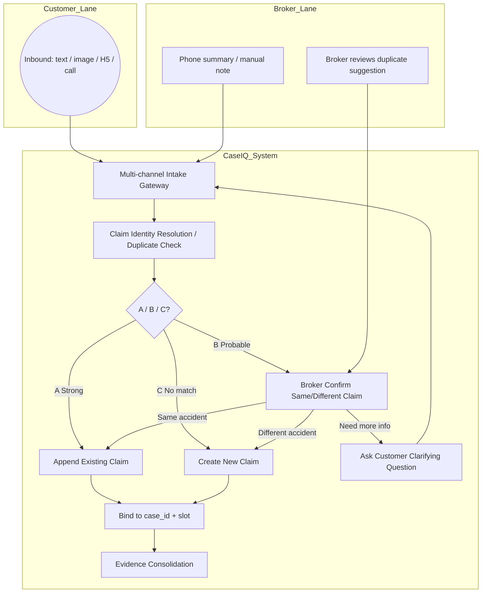

# P19H-3c-R2 — Claim Identity Resolution / Duplicate Prevention Recon

**Date:** 2026-07-08  
**Branch:** `sprint/p16-trust-layer`  
**Type:** Recon / product-technical design judgment only — **no production code, no deploy, no schema migration**  
**Prerequisite:** P19H-3c-R1 multi-channel intake recon · P19H-3c-2 H5 C1 button deployed · P19H-3a Workbench Claim visibility  
**Related:** `p19h3c_r1_claim_multichannel_intake_best_practice_recon.md` · `p19h3b_claim_evidence_pack_recon.md` · `evidence/p19h3c2_claim_c1_h5_button_2026_07_09.md` · `p19j0_lightweight_workflow_observability_recon.md`

---

## 1. Executive Summary

Multi-channel Claim intake (WeCom text, WeCom images, H5, phone summary, Workbench notes) only works if every inbound event lands on **one** `case_id` per accident. Today the system partially prevents duplicates for **WeCom text basics** but has **no unified identity resolver** across channels — the highest-risk gap before P19H-3d WeCom direct image binding.

| Question | Recommendation |
|----------|----------------|
| Core risk | Same accident → 2–3 Claim cases; false merge corrupts evidence |
| MVP approach | **Rules + score + broker confirm** — no ML, no vector DB, no workflow engine |
| Auto-append when? | **Strong binding only** (H5 signed `case_id`, same WeCom user + single open claim) |
| Medium confidence? | **Workbench duplicate suggestion** — never auto-merge |
| False merge vs duplicate? | **False merge is worse** — prefer duplicate case + broker repair |
| Implement before WeCom image binding? | **Partial** — minimal strong-binding resolver first; full broker UX can follow checklist |
| Next coding sprint | **P19H-3c-R3 Claim Identity Resolver Foundation** |
| Revised BPMN node | **Claim Identity Resolution / Duplicate Check** |

**Verdict:** **GO** on lightweight Claim identity resolution. **HOLD** on auto-merge, ML duplicate models, and merging two existing cases without broker confirmation. **STOP** — no code in this sprint.

---

## 2. Why Identity Resolution Matters for Multi-channel Claim

P19H-3c-R1 reframed Claim from a linear H5 form to a **Broker Claim Service Copilot** — one organized case per accident, many intake channels. That only holds if identity resolution is explicit.

**Typical duplicate scenario (Southern California broker office):**

```text
10:05  Customer WeChat: 「我要理赔」           → Case A created (basics incomplete)
10:12  Customer taps H5 button from C1        → should append Case A (signed case_id)
10:18  Customer sends 2 photos in WeChat      → today: quarantine OR wrong lane (P19H-3d gap)
10:30  Customer calls Chen                    → Chen enters phone summary on Workbench
10:35  Chen manually summarizes in Workbench  → must bind same case_id
```

Without identity resolution:

- Case A + Case B both `service_lane=claim` for same `wecom_external_userid`
- WeCom images land in `wecom_media_intake` quarantine
- Workbench shows fragmented evidence; Chen scrolls WeChat instead
- **False merge** mixes two accidents' photos into one carrier filing packet

**North star invariant:** One accident → one `case_id` → one `claim_timeline[]` → one evidence checklist.

---

## 3. Current System Behavior / Risk

### 3.1 What exists today (code-backed)

| Mechanism | Location | Behavior | Gap |
|-----------|----------|----------|-----|
| Active claim lookup (text) | `find_active_claim_case_for_basics()` | Newest open `service_lane=claim` for `wecom_external_userid`; excludes `broker_done` / `broker_confirmed_at` | Returns **one** case silently if multiple exist; no accident-date match |
| Explicit new accident | `is_explicit_claim_restart()` | Markers `新事故`, `重新理赔` bypass active case → create new | **Only** on WeCom text path |
| Duplicate WeCom msg | `find_case_by_wecom_msg_id()` | Same `msg_id` → replay C1 / basics prompt, no new case | Message-level only, not cross-channel |
| H5 token binding | `h5_task_token.py` | HMAC-signed `case_id` + `lane=claim` + flow slots | **Strong** — append to token case |
| H5 upload handler | `h5_task_upload.py` | Validates token `case_id` matches case | Does not create new claim case |
| Media intake binding | `resolve_media_case_binding()` | Prefers `add_car`; claim falls through generic single-case rule | **Claim lane not first-class**; multiple open → unassigned quarantine |
| Lane switch (Add Vehicle) | P19H-2.1 | Claim interrupt over active add_car | Does not address claim-vs-claim |
| Workbench display | `claim_workbench_display.py` | Accident basics only | No duplicate flags |

### 3.2 Active claim selection logic (today)

```352:374:services/fiqa_api/wecom/claim_basics.py
def find_active_claim_case_for_basics(external_userid: str) -> dict[str, Any] | None:
    """Newest open guided claim case for this WeCom user (not broker_done)."""
    ...
    matches.sort(key=_case_sort_key, reverse=True)
    return matches[0]
```

**Implications:**

- If two open claim cases exist → **newest wins** for text append; no broker alert
- No time window — a 30-day-old open claim still absorbs new「我要理赔」unless user says `新事故`
- `broker_done` excluded; `manual_handle` and `broker_review` still count as active
- No cross-check of `accident_datetime` / `accident_location`

### 3.3 Media intake gap (blocks P19H-3d)

```107:149:services/fiqa_api/wecom/media_intake.py
def resolve_media_case_binding(external_userid: str) -> MediaBindingDecision:
    """
    Minimal safe binding (P19A):
    1. Active add_car draft/case — high
    2. Single open Premium/Claim/Coverage case — medium/high
    ...
    4. Multiple or none — unassigned
    """
```

Claim is **not** explicitly prioritized. With Add Vehicle + Claim both open → unassigned. With two Claim cases → unassigned → new `wecom_media_intake` quarantine case possible.

### 3.4 Risk matrix

| Scenario | Current outcome | Severity |
|----------|-----------------|----------|
| Text「我要理赔」×2 same day | Appends to same open claim | ✅ OK if single open claim |
| Text「我要理赔」with 2 open claims | Newest absorbs; other orphaned | 🔴 High |
| H5 upload from C1 button | Appends via signed `case_id` | ✅ Strong |
| WeCom image during active claim | Quarantine or wrong lane | 🔴 High (P19H-3d blocked) |
| Phone summary (not built) | No standard path | 🟡 Medium |
| Customer says `新事故` | Creates new case | ✅ OK |
| Closed claim + new message | May create new OR append to old depending on phase | 🟡 Medium |
| Spouse uses same WeChat | Same `external_userid` — conflates customers | 🟡 Medium (broker confirm) |
| H5 link forwarded | Token binds original `case_id` | 🟡 Medium (audit + broker) |

---

## 4. Industry / Best Practice Observations

### 4.1 What large carriers do (borrow vs ignore)

| Carrier / industry pattern | What they do | Borrow for Chen MVP? |
|----------------------------|--------------|----------------------|
| **Idempotency keys** | `policyId + lossTimestamp + channel + sourceMessageId` — reject duplicate FNOL creates | ✅ **Message-level dedup** (`msg_id`, H5 nonce) — already partial |
| **Entity resolution** | Normalize names, VIN, addresses; graph matching across datasets | ❌ Too heavy — we have `wecom_external_userid` + basics fields |
| **Multi-channel normalize** | Phone, app, web, chat → **one claim record** | ✅ **Core insight** — one `case_id` per incident |
| **Duplicate scoring** | Rules + fuzzy match + ML ensemble | ⚠️ **Rules + simple score only** — no ML |
| **Auto-merge** | Rare at FNOL; usually link/suggest duplicate | ✅ **Never auto-merge two existing claims** |
| **Medium confidence** | Route to adjuster queue with explanation | ✅ **Workbench broker confirm** |
| **Straight-through processing** | Low-severity auto-adjudication | ❌ Out of scope |
| **Fraud / duplicate AI agents** | NLP + graph across historical claims | ❌ Out of scope |

### 4.2 Identifiers carriers compare

Typical enterprise duplicate check dimensions (ranked by strength):

1. **Claim number / correlation ID** (if already assigned)
2. **Policy number + loss date + loss location**
3. **VIN / vehicle plate**
4. **Named insured identity** (SSN hash, DOB, phone)
5. **FNOL channel message ID** (idempotency)
6. **Free-text description similarity** (NLP — we skip)
7. **Photo hash / perceptual similarity** (we skip)

### 4.3 MVP version for a small broker agency

Chen's office does **not** need Senzing-style entity resolution. Sufficient MVP:

1. **Strong keys:** `wecom_external_userid`, signed H5 `case_id`, Workbench-selected `case_id`
2. **Soft keys:** `accident_datetime`, `accident_location`, vehicle hints in `known_facts`
3. **Human keys:** Chen says "same accident" or "new accident"
4. **Safe default:** Create new case when ambiguous; flag probable duplicate on Workbench
5. **Repair path:** Broker merges (future) or closes duplicate — never silent auto-merge

> **Industry lesson distilled:** Carriers invest in duplicate prevention at **FNOL intake** because false payment is expensive. Brokers invest because **false merge corrupts the service relationship** — customer trusts Chen with one accident story.

---

## 5. Lightweight MVP Strategy

### 5.1 Three-level decision (A / B / C)

| Level | Name | Confidence | Action |
|-------|------|------------|--------|
| **A** | Strong match | ≥ 90 score | **Append** to existing claim automatically |
| **B** | Probable match | 50–89 score | **Workbench duplicate suggestion** — do not append until broker confirms |
| **C** | No match | < 50 score | **Create new** claim case (or hold in quarantine if no claim intent) |

### 5.2 Design principles (from prompt + code reality)

1. Prefer append to existing open claim **only when identity is strong**
2. Prefer broker confirmation when confidence is medium
3. **False merge is worse than duplicate case**
4. H5 signed `case_id` is strongest binding
5. Same WeCom user + recent single open claim is strong enough for most MVP cases
6. Do not create new Claim from every image/message
7. Do not auto-merge two existing claims
8. Human-in-the-loop required for ambiguous duplicates
9. System must explain **why** it thinks two inputs match
10. Lightweight: rules + score + Workbench flag — not ML

### 5.3 Time windows

| Window | Use |
|--------|-----|
| **72 hours** | Default "recent open claim" for same-user auto-append (text/images) |
| **14 days** | Probable-duplicate candidate search window (show on Workbench) |
| **No limit** | H5 signed `case_id` — token TTL (24h) is binding window, not accident window |
| **Closed claim** | Never auto-append; broker confirm or create new |

### 5.4 Open vs closed statuses

**Counts as active (eligible for auto-append A):**

- `claim_started` through `intake_ready_for_broker`
- `broker_review`, `broker_needs_more_info`, `manual_handle`
- `case_status != closed` AND `derive_claim_phase() != broker_done`
- NOT `broker_confirmed_at` set (terminal handoff)

**Closed / terminal (require broker confirm before append):**

- `broker_done`
- `case_status == closed`
- `workbench_archived == true`

### 5.5 Multiple candidates

| Candidates | Action |
|------------|--------|
| 0 open claims | Create new (if claim intent) OR quarantine (if image-only) |
| 1 open claim + strong signals | Append (A) |
| 1 open claim + weak / conflicting signals | Probable (B) — broker confirm |
| 2+ open claims | **Always B** — broker confirm; never pick newest silently |
| 2+ with one H5-signed match | Append to H5 case only; flag others as probable duplicates |

### 5.6 Sparse information

| Input | Behavior |
|-------|----------|
| Generic「我要理赔」only | Create draft claim **only after** safety gate; if open claim <72h → append (A) unless `新事故` |
| Image only, no text | Do **not** create claim case; bind to single open claim (A) OR quarantine (B/C) |
| Image + active add_car only | Lane-switch / claim interrupt (existing P19H-2.1) — not new claim |
| Phone summary without case pick | If 1 open claim → append; else broker picks case on Workbench |

---

## 6. Claim Matching Signals

### 6.1 Signal strength table

| Signal | Strength | Score weight | Notes |
|--------|----------|--------------|-------|
| H5 signed `case_id` in token | **Strong** | +100 (cap) | Cryptographic binding |
| Workbench broker-selected `case_id` | **Strong** | +100 | Explicit human binding |
| Same `wecom_external_userid` | **Strong** | +40 | Identity anchor for WeCom channel |
| Single open claim <72h | **Strong** | +30 | Combined with user id → A tier |
| Same `msg_id` already ingested | **Strong** | Idempotent replay | No new append |
| Same `customer_phone` / policy holder | **Strong** | +35 | When phone channel wired |
| Same vehicle / VIN / plate in `known_facts` | **Strong** | +25 | If extracted |
| Accident datetime within ±24h | **Medium** | +20 | Fuzzy datetime parse |
| Same city / street in location | **Medium** | +15 | String overlap |
| Similar description (keyword overlap) | **Medium** | +10 | No NLP — token overlap only |
| Same other-party plate mentioned | **Medium** | +20 | If present in text |
| Broker manually links on Workbench | **Strong** | +100 | Audit trail required |
| Same generic「我要理赔」 | **Weak** | +5 | Insufficient alone |
| Same customer, no date/location | **Weak** | +10 | Needs time window |
| Same vehicle, months apart | **Weak** | −20 | Suggests different accident |
| Same location, different day | **Weak** | +5 | Ambiguous |

### 6.2 Same-claim indicators (composite)

**Likely same accident when 2+ of:**

- Same WeCom user
- Open claim within 72h
- Accident date within 24h (if known)
- Location city match (if known)
- Customer did NOT say `新事故` / `另一次事故`
- Same H5 token `case_id`

### 6.3 Different-accident indicators

| Signal | Action |
|--------|--------|
| Customer says `新事故`, `另一次事故`, `重新理赔` | **Create new** (C) |
| Accident dates >7 days apart | **Different** (C) unless broker overrides |
| Different vehicle AND different date | **Different** (C) |
| Existing claim `broker_done` / closed | **Create new** or broker confirm |
| Chen manually creates new claim on Workbench | **Create new** (C) |
| Different `wecom_external_userid` | **Different** (C) unless same phone strong match |
| Same customer, two accidents same week | **B** — broker confirm (common real case) |

---

## 7. Same-Claim vs New-Claim Rules

### 7.1 Decision summary

```text
INCOMING EVENT
    │
    ├─ Has signed H5 case_id? ──────────────────────────► APPEND (A)
    │
    ├─ Has Workbench case_id (broker action)? ──────────► APPEND (A)
    │
    ├─ Same msg_id already seen? ─────────────────────────► REPLAY (idempotent)
    │
    ├─ Customer said 新事故 / 另一次事故? ────────────────► CREATE NEW (C)
    │
    ├─ Target claim broker_done / closed? ────────────────► BROKER CONFIRM (B) or CREATE NEW
    │
    ├─ Same WeCom user + exactly 1 open claim <72h? ──────► APPEND (A)
    │
    ├─ Same WeCom user + 1 open claim + date/location match? ► APPEND (A) or PROBABLE (B)
    │
    ├─ Same WeCom user + 2+ open claims? ─────────────────► BROKER CONFIRM (B)
    │
    ├─ Score 50–89 (probable)? ───────────────────────────► BROKER CONFIRM (B)
    │
    └─ Else ──────────────────────────────────────────────► CREATE NEW (C)
```

### 7.2 Injury override

If `message_mentions_injury()` on inbound text during active claim → **append to active claim** AND escalate `manual_handle` (existing behavior). Do not create parallel injury case.

---

## 8. Channel-by-Channel Resolution

| Channel | How finds `case_id` | Confidence | Append existing | Create new | Ask broker | Ask customer |
|---------|---------------------|------------|-----------------|------------|------------|--------------|
| **1. WeCom text** | `find_active_claim_case_for_basics()` + restart markers | High if 1 open <72h | Yes (A) | If no open or `新事故` | If 2+ open (B) | Missing basics prompt (existing) |
| **2. WeCom images** | Identity resolver: user + open claims + add_car interrupt | Medium default | If 1 open claim (A) | **Never** from image alone | If 0 or 2+ claims (B) | Optional: "这是上次事故的照片吗？" only if B |
| **3. H5 upload** | Signed token `case_id` | **High** | Always | Never | Only if case closed | Token error → contact Chen |
| **4. Phone summary** | Broker picks case on Workbench OR auto if 1 open | **High** (broker) | Yes | If broker selects new | If ambiguous list | N/A |
| **5. Workbench manual edit** | Explicit `case_id` in UI | **High** | Always | Broker button「新事故」 | N/A | N/A |
| **6. WeCom voice (future)** | Same as image — ack only, no case create | Low | If 1 open claim (A) | Never from audio alone | If ambiguous (B) | "陈总会听完回复" (R1) |

### 8.1 WeCom text (detail)

**Today:** `ingest_claim_basics_message()` creates or appends via `find_active_claim_case_for_basics()`.

**Target (P19H-3c-R3):**

- Replace silent newest-wins with `resolve_claim_identity()` returning `{decision, case_id, score, reasons}`
- If 2+ open claims → do not append; create **probable duplicate flag** on Workbench; reply acknowledges without merging
- Emit `wecom_routing_decision_v1` field `identity_resolution`

### 8.2 WeCom images (detail — prerequisite for P19H-3d)

**Before binding slots:**

1. Run identity resolver (not raw `resolve_media_case_binding`)
2. If A → bind to claim `case_id`, append `claim_timeline` event
3. If B → store in quarantine with `duplicate_candidates[]`; Workbench shows suggestion
4. If C → quarantine only; **no new claim case from image**

Slot assignment can remain `unassigned` / `medium` until broker confirms (R1 §14.4).

### 8.3 H5 upload (detail)

No change needed for identity — token is authoritative.

Edge cases:

- Case closed after token minted → upload succeeds but flags `broker_confirm_required`
- Token forwarded to different person → audit on `user_ref` mismatch (log only for MVP)

### 8.4 Phone / broker note (detail)

New Workbench action (future sprint):「添加电话摘要」

- Requires `case_id` selection when multiple open
- Appends `claim_timeline[]` event with `channel: phone_summary`
- Never creates claim case from broker note alone without customer-linked case

---

## 9. BPMN Update

### 9.1 Insertion point

After **Multi-channel Intake Gateway**, before **Bind to case_id + slot**:



### 9.2 Lanes

| Lane | Nodes |
|------|-------|
| **Customer** | Inbound messages, H5 upload, optional clarifying question reply |
| **CaseIQ System** | Gateway, identity resolution, append/create, bind, consolidation |
| **Broker / Office** | Duplicate confirmation, phone summary, manual case selection |

---

## 10. DMN Decision Table

| Rule ID | Condition | Decision | Action |
|---------|-----------|----------|--------|
| **ID-01** | H5 token has valid `case_id` + `lane=claim` | **A: Append** | Upload/text binds to token case |
| **ID-02** | Same `msg_id` already ingested | **Replay** | Idempotent response; no new case |
| **ID-03** | Workbench action specifies `case_id` | **A: Append** | Broker explicit bind |
| **ID-04** | Customer text contains `新事故` / `另一次事故` / `重新理赔` | **C: Create new** | Bypass active claim |
| **ID-05** | Same WeCom user + exactly 1 open claim + age <72h + not closed | **A: Append** | Default text/image path |
| **ID-06** | Same user + 1 open + accident date within 24h | **A: Append** | Strengthen ID-05 |
| **ID-07** | Same user + 1 open + location city match + date within 72h | **B: Probable** | Workbench flag; optional auto-append if score ≥90 |
| **ID-08** | Same user + 2+ open claims | **B: Broker confirm** | Never silent newest-wins |
| **ID-09** | Injury mentioned + any open claim | **A: Append** + escalate | `manual_handle` (existing) |
| **ID-10** | Target claim `broker_done` or `closed` | **B: Broker confirm** | Suggest new case or reopen |
| **ID-11** | Image only + 0 open claims | **C: Quarantine** | No new claim from image |
| **ID-12** | Image only + 1 open claim <72h | **A: Append** | Bind attachment; slot TBD |
| **ID-13** | Image only + 2+ open claims | **B: Broker confirm** | Quarantine + candidates |
| **ID-14** | Active add_car + claim image (no claim case) | **Lane switch** | P19H-2.1 interrupt — not identity |
| **ID-15** | Score 50–89, no hard rule | **B: Probable** | `duplicate_candidates[]` on Workbench |
| **ID-16** | Score <50, claim start intent | **C: Create new** | New guided claim case |
| **ID-17** | Generic claim intent + no identity | **C: Create draft** | After safety gate only |
| **ID-18** | Broker marks「合并到此理赔」 | **A: Append** | Audit `identity_resolution_decision` |
| **ID-19** | Broker marks「这是新事故」 | **C: Create new** | Clear probable flag |
| **ID-20** | H5 link on closed case | **B: Broker confirm** | Accept upload but flag |

---

## 11. Duplicate Match Score

### 11.1 Scoring model (MVP)

Simple additive score, capped 0–100:

```text
score = 0
+ 100 if h5_signed_case_id_match
+ 100 if workbench_explicit_case_id
+ 40  if same_wecom_external_userid
+ 30  if single_open_claim_within_72h
+ 25  if same_vehicle_vin_or_plate
+ 20  if accident_datetime_within_24h
+ 15  if accident_location_city_match
+ 10  if description_keyword_overlap
+ 20  if same_other_party_plate
− 30  if customer_said_new_accident
− 40  if target_claim_closed_or_broker_done
− 20  if accident_dates_more_than_7d_apart
− 50  if multiple_open_claims (force B tier)
cap 0..100
```

### 11.2 Thresholds

| Score | Tier | Action |
|-------|------|--------|
| ≥ 90 | **A** Strong | Auto-append |
| 50–89 | **B** Probable | Workbench suggestion; no auto-append |
| < 50 | **C** No match | Create new OR quarantine |

### 11.3 Reason chips (for Workbench)

Generate human-readable reasons from fired rules:

- `same_customer` · `same_h5_token` · `open_claim_36h` · `same_city` · `datetime_2h_apart` · `multiple_open_claims` · `customer_said_new_accident` · `claim_closed`

---

## 12. Data Model Recommendation

### 12.1 No schema migration (JSONB on `case_extra`)

| Field | Type | Purpose |
|-------|------|---------|
| `claim_identity` | object | `{ wecom_external_userid, customer_phone, policy_ref?, vehicle_hint? }` — snapshot at case create |
| `claim_timeline[]` | array | Multi-channel events (R1) — include `identity_resolution` events |
| `duplicate_candidates[]` | array | `{ case_id, score, reasons[], flagged_at, channel, resolved? }` |
| `broker_flags` | object | `{ duplicate_review_pending, confirmed_same_case_id?, confirmed_different? }` |
| `case_relation` | object | `{ parent_case_id?, related_case_ids[], relation_type: "probable_duplicate" \| "confirmed_same" \| "split_from" }` |
| `identity_resolution_decision` | object | Last decision: `{ tier, score, rule_ids[], case_id, channel, ts, actor }` |

### 12.2 Per-attachment metadata (existing `case_attachments[]`)

```json
{
  "attachment_id": "att_…",
  "source": "wecom",
  "identity_binding": {
    "tier": "A",
    "score": 95,
    "rule_ids": ["ID-05", "ID-12"],
    "resolved_case_id": "case_…",
    "duplicate_review_required": false
  }
}
```

### 12.3 New DB columns?

**Not now.** JSONB sufficient for pilot volume (<50 claims/month). Revisit indexed `wecom_external_userid` query if scan latency hurts — already have case list reads.

---

## 13. Workbench Broker Confirmation UX

### 13.1 MVP surface (lightweight)

When **B tier** fires, show banner on affected case(s):

```
┌─────────────────────────────────────────────────────────────┐
│ ⚠️ 可能是同一个事故 · 待确认                                  │
│ 新客户消息可能属于已有理赔案，请确认是否合并。                    │
├─────────────────────────────────────────────────────────────┤
│ 候选案件 A  case_abc123  ·  36小时前  ·  _score 78          │
│   [same_customer] [open_claim_36h] [same_city]              │
│ 候选案件 B  case_def456  ·  2天前    ·  _score 45          │
├─────────────────────────────────────────────────────────────┤
│ [合并到此理赔]  [这是新事故]  [先保留待确认]                     │
└─────────────────────────────────────────────────────────────┘
```

### 13.2 Button behaviors

| Button | Effect |
|--------|--------|
| **合并到此理赔** | Move quarantined attachments / timeline events to selected case; set `case_relation.confirmed_same`; audit trail |
| **这是新事故** | Clear flag; create new case if needed; mark relation `split_from` |
| **先保留待确认** | Leave quarantine; snooze 24h; case stays flagged |

### 13.3 Audit trail (required)

```json
{
  "event": "broker_identity_confirmation",
  "actor": "chen",
  "ts": "2026-07-08T18:00:00Z",
  "decision": "confirmed_same",
  "target_case_id": "case_abc123",
  "source_case_id": "case_def456",
  "reasons": ["same_customer", "same_city"],
  "score_at_flag": 78
}
```

### 13.4 MVP scope cut

- **Ship:** Flag + reason chips + single-case confirm (merge attachments only)
- **Defer:** Full case merge (combine `known_facts`, renumber timeline), bulk dedup dashboard

---

## 14. Safety / Compliance / Audit Guardrails

| Guardrail | Rule |
|-----------|------|
| No auto-merge two existing claims | Broker button required |
| No carrier filing language | Unchanged |
| Explainable decisions | Every A/B/C logs `rule_ids` + `score` |
| Idempotent ingestion | `msg_id`, H5 nonce |
| Closed claim append | Broker confirm only |
| PII | Workbench auth-gated; identity fields in JSONB only |
| Routing observability | Extend `wecom_routing_decision_v1` with `identity_tier`, `identity_score`, `candidate_case_ids` |
| Repair path | Duplicate case → broker closes orphan; false merge → broker split (manual, future) |

---

## 15. Failure Modes and Safe Defaults

| Failure mode | Why it hurts | Safe default |
|--------------|--------------|--------------|
| **False merge** | Mixed evidence, wrong carrier filing, customer trust loss | **Never auto-merge at B tier**; false merge > duplicate |
| **Duplicate case** | Chen sees two rows; annoying but repairable | Acceptable; Workbench flag helps merge |
| **Two accidents same week** | Same customer, valid separate claims | **B tier** — ask broker; do not auto-append |
| **Spouse/family same WeChat** | Wrong customer identity | Low volume; broker confirm if basics conflict |
| **Add Vehicle + Claim active** | Image/text routing confusion | Claim interrupt (shipped); identity resolver respects lane |
| **H5 link forwarded** | Wrong person uploads | Token binds case; log `user_ref`; broker reviews |
| **Phone summary after close** | Reopens old narrative | **B tier** — suggest new case |
| **Newest-wins (today)** | Silent wrong append | **Remove** — replace with scored resolver |
| **Image creates claim case** | Empty claims from random photos | **Never** — quarantine only |

**Default posture:** When uncertain → **create new or quarantine** + **flag broker** — never silent append to wrong case.

---

## 16. What To Build Now

| Sprint | Deliverable |
|--------|-------------|
| **P19H-3c-R3** | `resolve_claim_identity()` pure function + unit tests; wire into `claim_basics.py`; extend routing log |
| **P19H-3c-R3** | Fix `find_active_claim_case_for_basics` multi-case → B tier not newest-wins |
| **P19H-3c-R3** | JSONB writes: `identity_resolution_decision`, `duplicate_candidates` |
| **P19H-3c-3** | Workbench Evidence Checklist (parallel-friendly — helps Chen see duplicates) |
| **P19H-3d** | WeCom image binding — **blocked until R3 strong-path exists** |

---

## 17. What To Defer

| Item | Reason |
|------|------|
| ML duplicate model | Out of scope |
| Vector / embedding similarity | Out of scope |
| Image similarity / perceptual hash | Out of scope |
| OCR for plate/VIN matching | Out of scope |
| Auto-merge two full cases | Broker confirm only |
| Full case merge UI (facts consolidation) | After attachment merge works |
| Customer-facing「是同一事故吗？」chat flow | Broker-first; optional later |
| Dedicated `claim_identity` DB table | JSONB enough |
| Entity resolution platform | Enterprise overkill |

---

## 18. Recommended Implementation Sequence

```text
1. P19H-3c-R3  Claim Identity Resolver Foundation (pure fn + claim_basics wire + JSONB)
2. P19H-3c-3   Workbench Evidence Checklist (visibility for multi-channel)
3. P19H-3c-R3b Workbench duplicate suggestion banner (B tier UX)
4. P19H-3d     WeCom direct image binding (uses resolver)
5. P19H-3c-R2+ Broker phone summary → claim_timeline (R1)
6. Copy patch  C1 multi-channel options
```

**Dependency rationale:** Identity resolver prevents duplicate chaos **before** images flow into claims. Checklist gives Chen immediate value. WeCom binding without resolver repeats today's quarantine/wrong-lane risk.

---

## 19. Final Recommendation

### Should we implement identity resolution before WeCom direct image binding?

**Partial.**

- **Yes** for minimal strong-binding resolver (H5 token, single open claim <72h, multi-case → broker flag) — **required before P19H-3d**
- **No** for full Workbench duplicate UX — can ship in R3b parallel to checklist

### What is the MVP identity rule?

**Bind inbound Claim events to the single open claim for the same WeCom user within 72 hours unless the customer explicitly indicates a new accident or multiple open claims require broker confirmation.**

### What is the duplicate prevention rule?

**Never create a second Claim case when identity tier A fires; never auto-append when tier B fires — surface probable duplicates on Workbench with scored reasons instead.**

### Should system auto-merge?

**Only strong binding** (H5 signed `case_id`, broker explicit selection, same user + exactly one open claim <72h).

### What should happen on medium confidence?

**Broker confirmation** on Workbench before append.

### What should happen if H5 token has case_id?

**Append directly** to that case (tier A).

### What should happen if same WeCom user has open claim <72h?

**Append unless user explicitly says new accident** (`新事故` / `另一次事故` / `重新理赔`) or 2+ open claims trigger broker confirm.

### What should happen if multiple candidate claims?

**Broker confirmation** — never silent newest-wins.

### What is the next coding sprint?

**P19H-3c-R3 Claim Identity Resolver Foundation**

### Revised BPMN node name?

**Claim Identity Resolution / Duplicate Check**

---

## Appendix A — Expected Conclusion Format

| Question | Answer |
|----------|--------|
| Identity resolution before WeCom image binding? | **Partial** — strong-binding resolver yes; full UX can parallel checklist |
| MVP identity rule | Same WeCom user + single open claim <72h → append unless `新事故` |
| Duplicate prevention rule | Tier A append; tier B Workbench flag; never auto-merge two cases |
| Auto-merge? | **Only strong binding** |
| Medium confidence? | **Broker confirmation** |
| H5 token has case_id? | **Append directly** |
| Same user + open claim <72h? | **Append unless new accident explicit** |
| Multiple candidates? | **Broker confirmation** |
| Next coding sprint? | **P19H-3c-R3 Claim Identity Resolver Foundation** |
| Revised BPMN node? | **Claim Identity Resolution / Duplicate Check** |

---

## Appendix B — Acceptance Criteria

| # | Criterion | Status |
|---|-----------|--------|
| 1 | How to avoid duplicate Claim cases in multi-channel intake | ✅ §5, §7 |
| 2 | How to identify same accident across channels | ✅ §6, §8 |
| 3 | Strong / medium / weak matching signals | ✅ §6.1 |
| 4 | Channel-by-channel case resolution | ✅ §8 |
| 5 | Lightweight rules without ML / heavy engine | ✅ §5, §11 |
| 6 | BPMN update included | ✅ §9 |
| 7 | DMN decision table included | ✅ §10 |
| 8 | Workbench confirmation UX included | ✅ §13 |
| 9 | Data model recommendation included | ✅ §12 |
| 10 | Safe defaults included | ✅ §15 |
| 11 | Next implementation step selected | ✅ §18, §19 |
| 12 | No production code changed | ✅ |
| 13 | No deploy | ✅ |
| 14 | STOP | ✅ |

---

*P19H-3c-R2 recon complete. Ready for P19H-3c-R3 implementation approval.*
