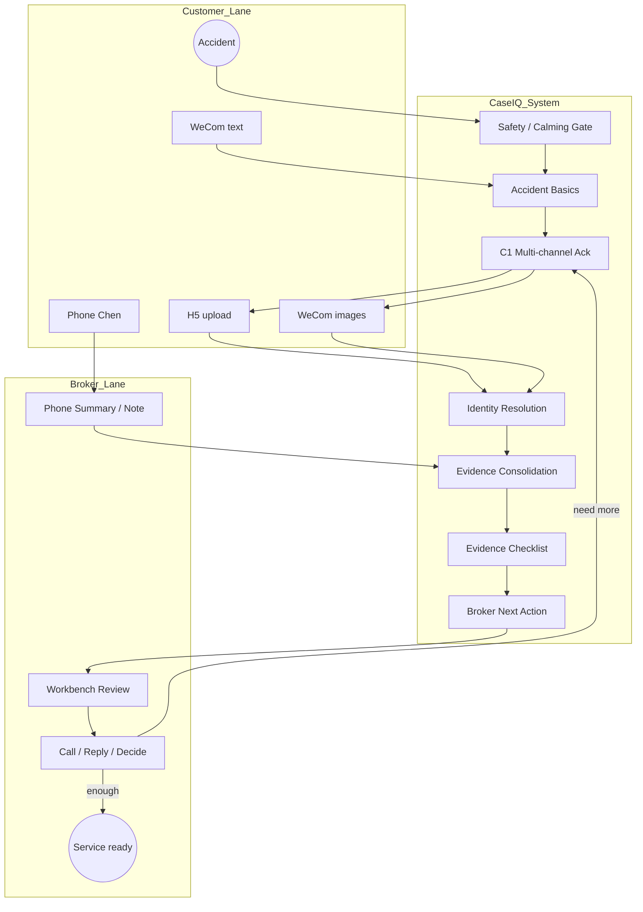

# P19H-3c-R4 — Claim Workflow Business Value Alignment Recon

**Date:** 2026-07-08  
**Branch:** `sprint/p16-trust-layer`  
**Type:** Recon / business-value judgment only — **no production code, no deploy, no schema migration**  
**Prerequisite:** P19H-3c-R1 multi-channel intake · P19H-3c-R2 identity resolution · P19H-3c-2 H5 C1 button deployed · P19H-3a Workbench Claim visibility  
**Related:** `p19h3c_r1_claim_multichannel_intake_best_practice_recon.md` · `p19h3c_r2_claim_identity_resolution_duplicate_prevention_recon.md` · `p19h3b_claim_evidence_pack_recon.md` · `evidence/p19h3c2_claim_c1_h5_button_2026_07_09.md` · `evidence/p19h3a_claim_workbench_visibility_2026_07_09.md` · `p19j0_lightweight_workflow_observability_recon.md`

---

## 1. Executive Summary

P19H-3c shipped a working **linear Claim intake spine**: safety gate → accident basics → C1 → H5 photo upload → Workbench basics visibility. Technically sound, but the **commercial question** is different: what does Chen actually pay for when a customer has an accident?

**Answer:** Chen is not buying document upload software. He is buying **organized accident service** — one case, clear evidence, visible gaps, and a fast path to call the customer back without re-asking or missing a photo.

| Question | Recommendation |
|----------|----------------|
| Biggest business value? | **One organized Claim case with gaps + broker next action** — not more intake forms |
| What Chen is buying? | **Faster, calmer customer service with fewer misses** — CaseIQ as prep, not replacement |
| Optimize for? | **Broker service velocity with human-in-the-loop** — never straight-through claim filing |
| Next coding sprint? | **P19H-3c-3 Workbench Evidence Checklist** (+ slot persistence) |
| Identity before checklist? | **No** — checklist delivers daily Chen value now; identity before WeCom binding |
| Checklist before WeCom binding? | **Yes** — Chen must see H5 evidence before accepting ambiguous chat photos |
| Phone summary before voice ASR? | **Yes** — broker note is MVP; ASR is post-pilot |
| H5 copy patch now? | **Yes** — parallel 1-day patch, not a full sprint |
| Revised North Star | Unchanged — see §5 |

**Verdict:** **GO** on broker-centric priority reorder. **HOLD** on OCR, ASR, carrier filing, workflow engine. **STOP** — no code in this sprint.

---

## 2. Broker Business Context

### 2.1 What happens when a customer has an accident (SoCal Chinese broker office)

Typical sequence for Chen Kui's office:

```text
T+0 min   Customer rear-ended on 605 / parking lot / intersection
          → Panic. May call Chen first, or WeChat「陈总我撞车了」

T+5 min   Chen: 「人没事吧？有没有受伤？在哪？」
          → Emotional reassurance before paperwork

T+15 min  Customer sends 2–5 photos in WeChat while still at scene or from home later
          → May be damage, other car, scene — unlabeled

T+30 min  Chen explains: take more photos if safe, get other party info, when to call carrier
          → Advice, not system automation

T+1–3 hr  Chen files FNOL with carrier OR coaches customer through carrier app
          → Outside CaseIQ scope

T+1–7 d   Adjuster assigned; Chen follows up on supplements, rental, repair shop
          → Relationship maintenance
```

**Key insight:** The accident is a **service event**, not a form submission. Chen's value is **judgment + relationship + carrier navigation** — not data entry speed alone.

### 2.2 What the customer expects from Chen

| Expectation | System implication |
|-------------|-------------------|
| Immediate human concern —「人没事吧？」 | Safety gate + never feel stuck with a bot |
| Clear next steps in plain Chinese | Calm copy; no carrier jargon |
| Chen will handle the complicated parts | No「已报案」; broker confirms everything |
| Can send photos the natural way (WeChat) | H5 optional; chat photos must not be ignored |
| Can call if confused | 联系陈总 always visible; phone channel on case |
| Fast callback | Chen sees organized case before calling back |

### 2.3 What Chen needs to know quickly

| Priority | Information | Today | Gap |
|----------|-------------|-------|-----|
| P0 | Anyone injured? | ✅ Safety gate | — |
| P0 | When / where / what happened | ✅ Basics on Workbench | — |
| P0 | **What's still missing?** | ❌ | No evidence checklist |
| P0 | **What should I do next?** | ❌ | No broker next action |
| P1 | Customer damage photos received? | Partial (H5 only) | No Workbench slot view |
| P1 | Other party photo or skip reason? | Partial | Same |
| P1 | All channels on one case? | Partial | Identity resolver not shipped |
| P2 | Police involved? | ❌ | Risk confirmation deferred |
| P2 | Timeline of events | ❌ | `claim_timeline` not built |

### 2.4 What causes Chen the most operational pain

| Pain | Frequency | Cost |
|------|-----------|------|
| **Scrolling WeChat to reconstruct the story** | Every claim | 5–15 min per case |
| **Re-asking for photos customer already sent** | Common | Customer trust erosion |
| **Not knowing if evidence pack is complete** | Every claim after C1 | Delayed carrier filing |
| **Two Claim rows for same accident** | Occasional, growing | Confusion, wrong filing packet |
| **WeCom photos in quarantine / wrong lane** | When customer skips H5 | Chen manually hunts media |
| **Phone call invisible on case** | Every phone-first claim | Re-explains on Workbench |
| **Customer abandons H5-only flow** | Stressed users | Calls Chen anyway — OK if case organized |

### 2.5 Mistakes / omissions that cost the most time

| Mistake | Downstream cost |
|---------|-----------------|
| Missing customer damage photo | Carrier delays; re-contact customer |
| No other-party info on hit-and-run | Adjuster asks later; second round |
| Photos on wrong case (false merge) | **Highest severity** — corrupts filing |
| Duplicate cases for same accident | Chen reconciles manually |
| Pushing H5 when customer already sent WeChat photos | Customer feels unheard; calls again |
| Promising「已报案」| Compliance / trust failure |

### 2.6 Where CaseIQ creates the most value

| Value zone | Why |
|------------|-----|
| **Organize chaos → one case** | Core paid-pilot promise (BROKER_ONE_PAGER: Collected / Still needed) |
| **Show gaps before Chen calls back** | Saves re-ask; faster service |
| **Accept any channel without losing structure** | Matches real SoCal 华裔客户 behavior |
| **Safe calming first response** | 24/7 acknowledgment when Chen is on another call |
| **Prep for carrier filing** | Chen still files — system collects, never submits |

**Low value zones (defer):** OCR plates, AI damage estimate, auto fault, carrier API, voice ASR.

---

## 3. Customer Journey in Chinese Auto Claim Scenario

### 3.1 Emotional arc

```text
Shock → Fear → Need reassurance → Willing to cooperate IF feels personal
```

A cold bot that says「请点击按钮上传」after a crash feels like bureaucracy. A message that says「基本信息已收到，陈总会跟进；照片可以发微信或点按钮」feels like Chen's office.

### 3.2 What makes the customer feel supported

| Behavior | Example |
|----------|---------|
| Safety first | 「请先确认人身安全」before photo asks |
| Acknowledgment speed | C1 within seconds of basics |
| Multiple paths | H5 **or** WeChat photos **or** call Chen |
| No false promises | 「不代表正式报案」 |
| Chen's name | 「陈总会人工确认」 |
| No penalty for calling | 联系陈总 never framed as failure |

### 3.3 What makes the customer abandon the workflow and call Chen

| Trigger | Fix |
|---------|-----|
| Forced H5-only path | Multi-channel C1 copy (R2b) |
| Bot ignores WeChat photos | WeCom binding (P19H-3d) — after checklist + identity |
| Confusing slot steps | H5 remains optional helper |
| Injury — wants human | `manual_handle` path (shipped) |
| Coverage / fault questions | Safe Q&A; escalate to Chen |
| Long silence after upload | Ack receipt; set expectation on callback |

### 3.4 How system should communicate (Chen's service, not a cold bot)

| Principle | Copy pattern |
|-----------|--------------|
| Chen is central | 「陈总会整理 / 确认 / 跟进」 |
| System is assistant | 「我们已记录」not「您的理赔已受理」 |
| Options, not commands | 「可以…也可以…」 |
| Honest scope | 「资料收集」not「报案」 |
| Warmth without over-promising | ✅ emoji sparingly; safety first |

---

## 4. Chen's Operational Pain Points

### 4.1 Pain priority matrix

| Rank | Pain | Solved by | Sprint |
|------|------|-----------|--------|
| 1 | Can't see what's collected vs missing | Evidence Checklist | **P19H-3c-3** |
| 2 | Doesn't know next action | Broker Next Action Panel | P19H-3c-R5 |
| 3 | WeChat photos not on case | WeCom binding + identity | P19H-3c-R3 → P19H-3d |
| 4 | Phone call not on case | Phone summary | P19H-3c-R2+ |
| 5 | Duplicate / fragmented cases | Identity resolver | P19H-3c-R3 |
| 6 | C1 feels H5-pushy | Copy patch | P19H-3c-R2b |

### 4.2 Why Claim differs from Add Vehicle commercially

| Dimension | Add Vehicle | Claim |
|-----------|-------------|-------|
| **Customer emotion** | Neutral admin | Stressed, possibly injured |
| **Chen's role** | Document reviewer | **Crisis counselor + advisor** |
| **Time sensitivity** | Days | **Minutes to hours** |
| **Channel preference** | H5 OK for structured docs | **Phone + WeChat images first** |
| **Wrong UX cost** | Retry upload | **Customer calls competitor** |
| **What Chen sells** | Convenience of quote/add | **Trust in crisis** |
| **Automation ceiling** | High for VIN/photos | **Low** — broker must confirm |
| **Paid pilot hook** | Stop re-asking for year/model/zip | **Stop re-asking after accident; don't miss evidence** |

Add Vehicle optimizes **document collection efficiency**. Claim optimizes **service quality under stress** — organization and gap visibility matter more than upload wizard polish.

---

## 5. CaseIQ Commercial Value Proposition

### 5.1 Positioning (unchanged, reinforced)

**Broker Claim Service Copilot** — CaseIQ turns chaotic post-accident contact across WeChat, phone, and H5 into one organized Claim case with clear evidence, gaps, and broker next actions — so Chen can serve the customer faster without missing anything.

### 5.2 What Chen is really buying

> **「出险时别漏事、别让客户觉得没人管。」**  
> Peace of mind that the office captured the story, evidence, and gaps — so his callback is informed and fast.

### 5.3 What workflow should optimize for

> **Broker service velocity with human-in-the-loop** — minimize Chen's reconstruction time and customer re-asks, never replace Chen's judgment or carrier filing.

### 5.4 Commercial value hierarchy

```text
Tier 1 (pay driver)     Organized case + gaps + next action
Tier 2 (retention)      Multi-channel acceptance + calm copy
Tier 3 (efficiency)     H5 slot clarity + timeline
Tier 4 (scale)          Identity resolution + dedup
Tier 5 (nice-to-have)   Risk confirmation, voice ASR
Tier 6 (out of scope)   OCR, AI damage, carrier filing
```

---

## 6. Workflow Value Map

Ranked by **business value to Chen** at pilot scale (<20 claims/month). Scores: H/M/L.

| # | Workflow node | Business value | Impl. complexity | Risk | Build |
|---|---------------|----------------|------------------|------|-------|
| 1 | **Safety / calming response** | **H** — trust foundation | L (shipped) | L | ✅ Done |
| 2 | **Accident basics extraction** | **H** — Chen's first questions | L (shipped) | L | ✅ Done |
| 3 | **Workbench Evidence Checklist** | **H** — #1 daily pain | M | L | **Now** |
| 4 | **Broker Next Action** | **H** —「what do I do?」 | M | L | Next after checklist |
| 5 | **H5 guided photo upload** | **M–H** — slot clarity | M (shipped) | L | ✅ Done |
| 6 | **C1 multi-channel copy** | **M** — perception fix | L | L | **Now** (parallel) |
| 7 | **Claim Identity Resolution** | **M** — prevents disasters | M | M (false merge) | Before WeCom bind |
| 8 | **WeCom direct image binding** | **M–H** — natural UX | M–H | M (wrong slot) | After R3 |
| 9 | **Broker phone summary / note** | **M** — phone-first claims | M | L | After checklist |
| 10 | **Risk confirmation** | **L–M** — police/injury buttons | M | M | Later |
| 11 | **Voice transcription** | **L** at pilot volume | H | H | Defer |
| 12 | **OCR / AI damage analysis** | **L** (broker reviews anyway) | H | H | Defer |
| 13 | **Carrier filing automation** | **N/A** — out of scope | H | H | Never MVP |

### 6.1 Nodes that look technical but aren't top priority now

| Node | Why it looks attractive | Why defer |
|------|-------------------------|-----------|
| Voice ASR |「AI intake」story | Chen listens anyway; broker note cheaper |
| OCR plates | Auto other-party ID | Broker sees photo; OCR scope creep |
| AI damage | Demo wow factor | No carrier use; liability risk |
| Full timeline UI | Observability polish | Checklist + next action sufficient for pilot |
| Workflow engine | Clean architecture | P19J-0 rejected; JSONB enough |

### 6.2 Reconciliation: R1 vs R2 priority tension

| Doc | Recommended next | Lens |
|-----|------------------|------|
| P19H-3c-R1 | Evidence Checklist | Multi-channel product design |
| P19H-3c-R2 | Identity Resolver | Technical risk before WeCom binding |
| **P19H-3c-R4** | **Evidence Checklist first** | **Chen's daily business value** |

**Resolution:** Checklist first because (a) Chen opens Workbench today and sees only basics — immediate pain; (b) H5 uploads already produce evidence that checklist can display; (c) identity risk is **latent** until WeCom binding ships; (d) checklist is **prerequisite** for Broker Next Action. Identity resolver is **step 3** — required before P19H-3d, not before checklist.

---

## 7. Highest-Value Minimal Claim Workflow

### 7.1 Design goal

Minimum workflow that delivers **Tier 1 commercial value** (organized case + gaps + next action) without building deferred nodes.

### 7.2 Actors and flow

```text
CUSTOMER                          SYSTEM                           BROKER (Chen)
────────                          ──────                           ─────────────
WeCom text ─────────────────────► Safety gate
                                  Accident basics (3 fields)
                                  C1 ack + options (H5 / WeChat / 联系陈总)
WeCom images ───────────────────► Bind to case (when 1 open claim) ──► Checklist updates
H5 upload ───────────────────────► Slot assign + persist
Phone call (offline) ──────────────────────────────────────────────► Phone summary (later)
                                  │
                                  ▼
                                  Evidence checklist + gaps
                                  Broker next action (computed)
                                  │
                                  ▼
                                  ◄──────── Review Workbench ────────
                                  ◄──────── Call / WeChat reply ─────
                                  ◄──────── Decide: enough / need more
```

### 7.3 Minimal scope boundary

| In MVP workflow | Out |
|-----------------|-----|
| One case per accident (strong binding) | Auto-merge two cases |
| 3 photo slots + skip reasons | OCR, AI damage |
| Checklist + next action text | Full timeline UI |
| H5 + WeCom (after R3+d) | Voice ASR |
| Broker phone note | Carrier filing |
| Calm multi-channel copy | Fault / coverage automation |

### 7.4「Enough for Chen to act」gate

Chen can productively call the customer when:

1. Safety status known (injury → manual path)
2. Accident basics present (time, location, description)
3. Checklist shows: customer damage **received or explicitly pending**
4. Next action text: e.g.「建议回电确认对方信息；尚缺对方车辆照片」

No requirement for full evidence pack complete — broker judgment overrides (DMN R9 from R1).

---

## 8. BPMN / Lane View

### 8.1 Pools

| Pool | Actor |
|------|-------|
| Customer | WeCom text/images, H5, phone |
| CaseIQ System | Intake, identity, consolidation, checklist, next action |
| Broker | Workbench review, phone summary, call/reply |

### 8.2 Business-value-oriented flow



### 8.3 Value annotations on nodes

| Node | Business value delivered |
|------|--------------------------|
| Safety gate | Customer trust; blocks harmful automation |
| Basics | Chen's first 3 questions answered |
| C1 multi-channel | Customer feels options, not forced |
| Identity | One story per accident |
| Checklist | **Chen sees gaps without WeChat scroll** |
| Next action | **Chen knows what to do in 5 seconds** |
| Broker review | Human judgment — the product |

---

## 9. What To Build Now

| Sprint | Deliverable | Business rationale |
|--------|-------------|-------------------|
| **P19H-3c-3** | Workbench Evidence Checklist + `claim_evidence_summary` API | **#1 Chen pain** — gaps visible on every claim |
| **P19H-3c-3+** | Persist `claim_attachment_slots` on H5 upload/skip | Checklist accuracy |
| **P19H-3c-R2b** | C1 multi-channel copy patch | Cheap; fixes「bot pushing H5」perception |
| **P19H-3c-R3** | Identity resolver foundation | Required before WeCom binding scales |
| **P19H-3c-R5** | Broker Next Action Panel (computed) | **#2 Chen pain** — after checklist ships |

**Parallel-friendly:** R2b copy patch can land in same deploy as 3c-3.

---

## 10. What To Defer

| Item | Reason |
|------|--------|
| Voice / ASR transcription | Broker note sufficient; cost/accuracy |
| OCR / AI damage analysis | Out of scope; broker reviews photos |
| Carrier filing automation | Chen's job; compliance boundary |
| Complex workflow engine | P19J-0 rejected |
| Full `claim_timeline` UI | Checklist + next action enough for pilot |
| Workbench duplicate merge UX (R3b) | After identity foundation |
| Risk confirmation buttons | After evidence path stable |
| Mini program | P19E-3 defer |
| Customer-facing workflow diagram | Internal tool first |
| Auto slot classification on WeCom images | Start with single-open-claim + broker confirm |

---

## 11. Recommended Implementation Sequence

Five steps maximum:

```text
1. P19H-3c-3   Workbench Evidence Checklist (+ H5 slot persistence)
2. P19H-3c-R2b C1 multi-channel copy patch (parallel with step 1 if capacity)
3. P19H-3c-R3  Claim Identity Resolver Foundation
4. P19H-3d     WeCom Direct Image Binding (uses R3)
5. P19H-3c-R5  Broker Next Action Panel + phone summary → claim_timeline
```

### 11.1 Explicit answers to priority questions

| Question | Answer | Rationale |
|----------|--------|-----------|
| Identity resolver before checklist? | **No** | Checklist serves daily Chen value; identity latent until WeCom bind |
| Checklist before WeCom binding? | **Yes** | Chen must see H5 evidence first; validates checklist before ambiguous chat photos |
| Phone summary before voice transcription? | **Yes** | Phone summary = high value, low risk; ASR = high cost, defer |
| H5 copy patch now? | **Yes** | ~1 day; big customer perception win; bundle with 3c-3 deploy |

---

## 12. Final Recommendation

### What is the biggest business value?

**Turning chaotic post-accident contact into one organized Claim case where Chen instantly sees what's collected, what's missing, and what to do next — so he serves customers faster without missing evidence.**

### What is Chen really buying?

**Peace of mind and faster crisis service: his office won't drop the ball on an accident, and customers feel Chen is on top of it even when he's on another call.**

### What should Claim workflow optimize for?

**Broker service velocity with human-in-the-loop — minimize reconstruction time and re-asks, never replace Chen's judgment or file with the carrier.**

### What should be next coding sprint?

**P19H-3c-3 Workbench Evidence Checklist** (+ slot persistence on H5 upload/skip)

### What is the recommended sequence?

1. P19H-3c-3 Workbench Evidence Checklist  
2. P19H-3c-R2b C1 multi-channel copy patch  
3. P19H-3c-R3 Claim Identity Resolver Foundation  
4. P19H-3d WeCom Direct Image Binding  
5. P19H-3c-R5 Broker Next Action Panel + phone summary  

### What should we explicitly not build now?

1. Voice / ASR transcription  
2. OCR / AI damage analysis  
3. Carrier filing automation  
4. Complex workflow engine (Camunda/Temporal)  
5. Auto fault / coverage determination  

---

## Appendix A — Expected Conclusion Format

| Question | Answer |
|----------|--------|
| Biggest business value? | Organized case + gaps + next action for faster broker service |
| What Chen is buying? | Peace of mind; no missed evidence; customers feel cared for |
| Optimize for? | Broker service velocity with human-in-the-loop |
| Next coding sprint? | **P19H-3c-3 Workbench Evidence Checklist** |
| Recommended sequence? | 3c-3 → R2b copy → R3 identity → 3d WeCom bind → R5 next action |
| What not to build now? | ASR, OCR/AI damage, carrier filing, workflow engine, fault/coverage |

---

## Appendix B — Acceptance Criteria

| # | Criterion | Status |
|---|-----------|--------|
| 1 | Business value for Chen | ✅ §2, §4, §5 |
| 2 | Customer value after accident | ✅ §3 |
| 3 | Why Claim differs from Add Vehicle commercially | ✅ §2.2, §4.2 |
| 4 | Which workflow nodes create most value | ✅ §6 |
| 5 | Highest-value minimal workflow | ✅ §7 |
| 6 | Next coding sprint recommendation | ✅ §12 |
| 7 | Recommended build sequence | ✅ §11 |
| 8 | What not to build now | ✅ §10, §12 |
| 9 | No production code changed | ✅ |
| 10 | No deploy | ✅ |
| 11 | STOP | ✅ |

---

*P19H-3c-R4 recon complete. Business value aligns with P19H-3c-3 as next coding sprint; identity resolver remains mandatory before WeCom binding (step 3).*
