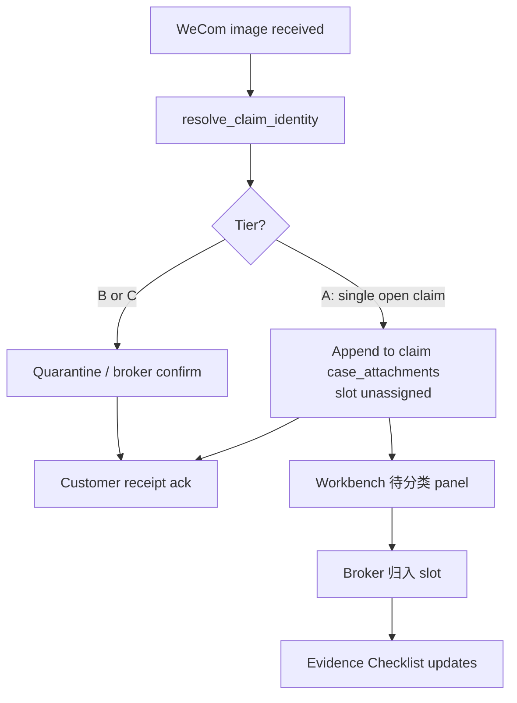
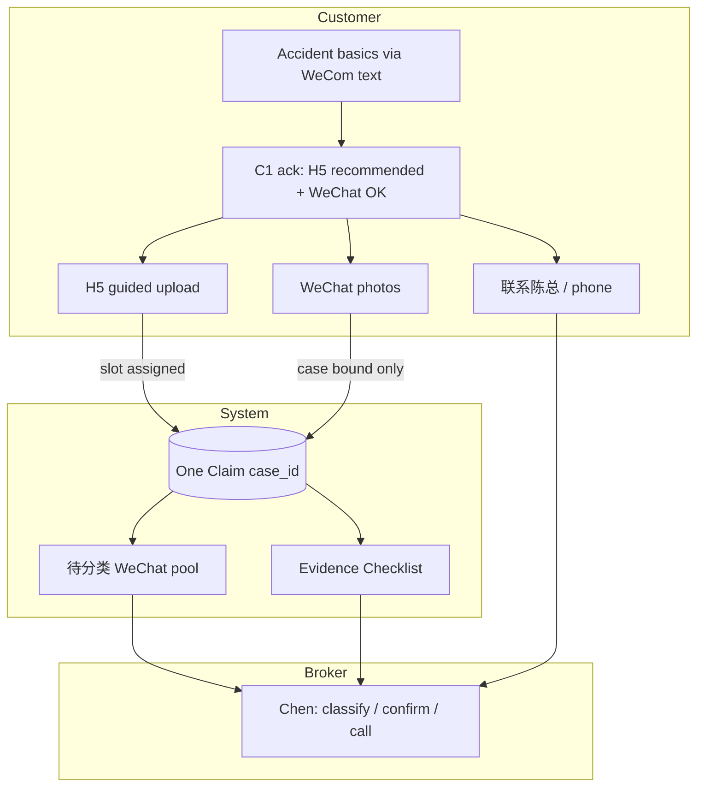

# P19H-3d-R0 — Claim Photo Intake UX Simplicity Recon

**Date:** 2026-07-08  
**Branch:** `sprint/p16-trust-layer`  
**Type:** Recon / product design judgment only — **no production code, no deploy, no schema migration**  
**Prerequisite:** P19H-2 Claim WeCom start · C1 accident basics · P19H-3c H5 Claim Evidence Pack · P19H-3c-3 Workbench Evidence Checklist · P19H-3c-3C H5 slot persistence / skip reason · P19H-3c-R3 Claim Identity Resolver Foundation  
**Related:** `p19h3c_r1_claim_multichannel_intake_best_practice_recon.md` · `p19h3c_r2_claim_identity_resolution_duplicate_prevention_recon.md` · `p19h3c_r4_claim_workflow_business_value_alignment_recon.md` · `p19h3b_claim_evidence_pack_recon.md` · `evidence/p19h3c_r3_claim_identity_resolver_foundation_2026_07_09.md` · `evidence/p19h3c3c_h5_claim_slot_persistence_skip_reason_2026_07_09.md`

---

## 1. Executive Summary

The Claim spine is technically complete through C1 → H5 → Workbench checklist → identity resolver. The **product risk before P19H-3d** is not missing engineering — it is **customer confusion** if we present H5 upload, WeChat direct photos, and「联系陈总」as three equal competing systems.

| Question | Recommendation |
|----------|----------------|
| Will multi-channel confuse customers? | **Yes, if presented as equal paths** — **No, if one clear主线 with ranked options** |
| H5 vs WeChat direct relationship? | **H5 = primary (recommended)** · **WeChat = fallback / convenience** — not equal |
| Simplest customer copy? | One narrative: basics done → upload photos → **button recommended** → WeChat OK → Chen always available |
| Workbench duplicate / mis-op prevention? | `msg_id` idempotency + case-level unassigned pool + broker slot assign — no auto classification |
| WeCom binding MVP scope? | Bind to **case** when identity tier A; **no auto slot**; minimal Workbench「待分类」panel |
| What not to do? | AI slot guess, OCR, nag loops, equal CTAs, image-similarity dedup, auto filing language |
| C1 copy before binding? | **Yes** — ship R2b copy **with or immediately before** P19H-3d (same deploy preferred) |
| Next coding sprint? | **P19H-3d + R2b bundle** (WeCom case binding + C1 copy + Workbench unassigned-photo surface) |

**Verdict:** **GO** on P19H-3d with strict UX hierarchy and narrow MVP. **HOLD** on auto slot assignment and AI. **STOP** — no code in this sprint.

---

## 2. Current Product State (Post P19H-3c-R3)

### 2.1 Shipped

| Layer | Status | Notes |
|-------|--------|-------|
| WeCom Claim start + safety gate | ✅ | Injury → `manual_handle` |
| Accident basics (3 fields) | ✅ | Deterministic extraction |
| C1 + H5 button | ✅ | `上传事故照片` msgmenu — **H5-first copy** |
| H5 Claim Evidence Pack | ✅ | 3 slots, skip reasons, GCS bind |
| Workbench Evidence Checklist | ✅ | Slot status from H5 + `claim_attachment_slots` |
| H5 slot persistence | ✅ | P19H-3c-3C |
| Claim Identity Resolver | ✅ | Tier A/B/C for **text basics** — not wired to media yet |
| `msg_id` media dedup | ✅ | Replay returns same ack, no double attach |

### 2.2 Live customer path today

```text
我要理赔 → 开始理赔 → time/location/description
  → C1「请点击下面按钮上传事故照片」
  → H5 理赔资料（guided 3-slot）
```

### 2.3 Gap that motivates P19H-3d

| Gap | Customer impact | Broker impact |
|-----|-----------------|---------------|
| C1 copy is **H5-only primary** | Stressed customers who naturally WeChat photos feel the bot ignores them | Chen hunts `wecom_media_intake` quarantine |
| `resolve_media_case_binding()` ignores `service_lane=claim` | Claim photos → **unassigned quarantine case**, not guided claim case | Photos disconnected from checklist |
| WeCom images have **no slot** even if on case | Checklist shows missing while photos exist | Chen re-asks for photos customer already sent |
| No「待分类微信照片」on Workbench | — | Cannot see chat photos in claim context |

**Technical note:** `media_intake.py` binds `claim_lite` (minimal lane) but not `claim` (guided workflow). Guided Claim customers sending chat images today land in the wrong place.

### 2.4 Design principles (non-negotiable)

1. Customer sees **one主线** — not two upload systems.
2. **H5 = recommended** clear upload path (slot clarity ~75% vs chat ~15–25%, per P19D-16).
3. **WeChat photos = fallback / convenience** — never framed as「另一个系统」.
4. All channels → **same `case_id`** + same evidence checklist.
5. **No** AI image classification · OCR · auto fault · auto filing.
6. **No** repeated nag to upload the same slot after receipt.
7. **Chen understands** everything on Workbench without scrolling WeChat.

---

## 3. Question 1 — Will Multi-Channel Photo Input Confuse Customers?

### 3.1 Short answer

**Yes — if we present three parallel upload systems.**  
**No — if we present one story with a ranked choice inside it.**

### 3.2 Confusion modes to avoid

| Failure mode | What customer experiences | Root cause |
|--------------|---------------------------|------------|
| **Menu overload** |「按钮？发图？找陈总？我该做哪个？」 | Three options with equal visual weight |
| **Double upload** | Sends 5 photos in WeChat, then taps H5 and uploads again | No ack that WeChat photos count; H5 nag continues |
| **Ignored photos** | Sends WeChat photos, bot keeps saying「点按钮上传」 | Binding + copy mismatch (today's gap) |
| **Wrong system feeling** |「微信里一套，浏览器里一套」 | Different ack copy / different case rows |
| **Anxiety loop** |「是不是没收到？」→ sends more | Weak receipt ack |

### 3.3 Confusion modes that are acceptable

| Behavior | Why OK |
|----------|--------|
| Customer uses **only H5** | Primary path — zero confusion |
| Customer uses **only WeChat** | Fallback — Chen organizes; no H5 required |
| Customer **calls Chen** | Human path — always valid escape hatch |
| Customer uses **H5 for slot 1, WeChat for slot 2** | Same case, broker assigns — common in real accidents |
| Customer uploads **later from gallery** | Timeline event, not a new workflow |

### 3.4 Broker business lens

Chen's customers (SoCal 华裔) often send photos **while on the phone with him** or **from the accident scene in panic**. Forcing a single channel creates abandonment; offering **unranked** channels creates chaos. The paid-pilot promise is **organization without channel policing**.

**Judgment:** Multi-channel is **required** for business value; multi-channel **without hierarchy** is the product risk. Fix is copy + binding behavior, not reducing channels.

---

## 4. Question 2 — What Should the H5 vs WeChat Direct Relationship Be?

### 4.1 Recommended relationship

| Path | Role | Analogy |
|------|------|---------|
| **H5 guided upload** | **Primary / recommended** |「按步骤上传（推荐，最清楚）」 |
| **WeChat direct photos** | **Fallback / convenience** |「也可以直接发微信，陈总会整理」 |
| **联系陈总** | **Human escape hatch** | Not a photo path — service path |

**Not equal paths.** Equal framing is what triggers the「两个系统」feeling.

### 4.2 Why H5 stays primary (not just optional)

| Factor | H5 | WeChat direct |
|--------|-----|---------------|
| Slot clarity | **High** — one photo per step with label | **Low** — ambiguous batch |
| Binding confidence | **High** — signed `case_id` + slot | **Medium** — case only in MVP |
| Customer stress at scene | Medium friction (browser hop) | **Lowest friction** |
| Broker checklist accuracy | **Automatic slot status** | Requires broker classify (MVP) |
| Duplicate risk | Lower (guided flow state) | Higher (photo bursts) |

H5 primary does **not** mean H5 required. It means: **the button is the hero CTA; WeChat is the safety net in copy**, not a second hero button.

### 4.3 System behavior by path

```text
                    ┌─────────────────────────────────────┐
                    │     One Claim case (case_id)        │
                    │  claim_attachment_slots + checklist │
                    └─────────────────────────────────────┘
                           ▲                    ▲
                           │                    │
              H5 upload ───┘                    └─── WeChat image
              (slot assigned)                      (case bound, slot TBD)
```

| Path | Binds to case | Binds to slot | Checklist effect |
|------|---------------|---------------|------------------|
| H5 | ✅ tier A (token) | ✅ immediate | Slot → `received` or `skipped` |
| WeChat (MVP) | ✅ tier A only | ❌ `unassigned` | Case shows「待分类照片」; slots unchanged until broker |
| WeChat (defer) | tier B | broker confirm first | Quarantine |
| 联系陈总 | N/A | N/A | Flag `broker_contact_requested`; no photo action |

### 4.4 DMN rule (from R1, reinforced)

**R7 `h5_not_required_if_wecom`:** When a WeChat image is bound to the claim case, **do not nag H5** for that customer in follow-up messages. Receipt ack replaces push.

---

## 5. Question 3 — What Should Customer Copy Say (Simplest)?

### 5.1 Copy principles

1. **One paragraph narrative** — not a bullet menu of three equal actions.
2. **Verb hierarchy:** 推荐 → 也可以 → 如需协助.
3. **Chen-centric** —「陈总会整理 / 确认」not「系统已分类」.
4. **Honest scope** —资料收集, not 报案.
5. **Photo prep list stays** — customers want to know what to gather.

### 5.2 Today (P19H-3c-2) — problem

From `build_claim_c1_h5_evidence_card_payload()`:

> 请点击下面按钮上传事故照片。

This reads as **command + only path**. Customers who send WeChat photos first feel ignored; customers who read this then also send WeChat photos may **double upload**.

### 5.3 Recommended C1 copy (exact target — P19H-3c-R2b)

**Head (`head_content`):**

```text
【理赔资料 · 第 1 步完成 ✅】

事故基本信息已收到。

已记录：
时间：{accident_datetime}
地点：{accident_location}
描述：{accident_description}

下一步请补充事故照片。
推荐点下面「上传事故照片」按钮，按步骤上传（最清楚）。

您也可以直接把照片发到微信，陈总会整理到同一份理赔资料里。
如需人工协助，请点「联系陈总」。

请准备：
1. 您的车损伤照片
2. 对方车辆 / 车牌照片
3. 现场照片（可选）
```

**Buttons (`list`):**

| Order | Type | Label | Role |
|-------|------|-------|------|
| 1 | `view` | **上传事故照片** | Primary CTA (unchanged label) |
| 2 | `click` | **联系陈总** | Human path |

**Tail (`tail_content`):**

```text
如果按钮打不开，请回复：链接

这只是资料收集，不代表 claim 已正式提交。
陈总会人工确认。
```

### 5.4 WeChat image receipt ack (P19H-3d)

When image binds to open claim case (tier A):

```text
收到照片，已放到您的理赔资料里。
陈总会整理确认，无需重复发送同一张。
```

When tier B / quarantine:

```text
收到照片。为避免和别的事故资料混在一起，请先回复：
1 同一个事故，继续补资料
2 新的事故，重新开始
或直接联系陈总。
```

**Never say:**「已识别为车损照片」·「请继续使用 H5 上传」(if photos already received).

### 5.5 What NOT to say

| Bad copy | Why |
|----------|-----|
|「方式一 H5 / 方式二 微信 / 方式三 电话」 | Menu of equals |
|「请选择上传渠道」 | Sounds like IT ticket system |
|「AI 正在分析您的照片」 | Forbidden scope |
|「请务必完成 H5 上传」 | Blocks natural WeChat behavior |
|「照片已自动分类」 | False — broker classifies in MVP |

---

## 6. Question 4 — How Should Workbench Avoid Duplicate Photos and Mis-operations?

### 6.1 Duplicate types

| Type | Example | MVP handling |
|------|---------|--------------|
| **Transport replay** | Same WeChat `msg_id` delivered twice | ✅ Already idempotent — replay ack, no second attach |
| **Customer resend** | Same photo sent again (new `msg_id`) | Show both thumbnails; broker ignores duplicate visually |
| **H5 + WeChat same slot** | Damage photo via H5, then again via WeChat | Checklist: H5 slot `received`; extra WeChat photo in「待分类」or attached as supplemental |
| **Burst upload** | 8 photos in 30 seconds | All on case; broker batch-classifies — normal accident behavior |
| **Wrong case bind** | Photo on Case B not Case A | **Prevent** via identity tier A/B — never silent newest-wins |
| **False merge** | Two accidents, one case | Identity tier B → broker confirm — **worse than duplicate** |

### 6.2 Workbench surfaces (MVP)

**A. Evidence Checklist (existing — P19H-3c-3)**  
Shows slot status for **classified** evidence (primarily H5).

**B. WeChat photos — pending classification (new — part of P19H-3d)**

```
┌─────────────────────────────────────────────────────────────┐
│ 微信照片 · 待陈总分类 (3)                                      │
│ [thumb] [thumb] [thumb]   received 10:32–10:35 via WeChat   │
│ [归入：车损] [归入：对方车辆] [归入：现场] [保留待确认]            │
└─────────────────────────────────────────────────────────────┘
```

**C. Duplicate / identity banner (R3 — when tier B)**

Existing broker-confirm pattern from identity resolver — separate from photo dedup.

### 6.3 Broker actions (MVP)

| Action | Effect |
|--------|--------|
| **归入 → slot** | Set `slot_assignment` + `record_claim_evidence_slot_received(source=wecom)` |
| **保留待确认** | Stays in pending pool; checklist unchanged |
| **标记需重拍** | Slot → `needs_retake` (existing) |
| **合并到此理赔** (identity B) | Move quarantined attachments to selected case |

### 6.4 Rules that prevent customer-side mis-ops

| Rule | Implementation |
|------|----------------|
| No H5 nag after WeChat receipt | Suppress re-send C1 H5 push when `wecom_photos_received_count > 0` on case (or broker classified ≥1 slot) |
| Ack sets expectation |「无需重复发送同一张」 |
| H5 flow respects existing slots | If `customer_damage_photo` already `received` via WeCom classify, H5 skips or shows「已收到，可补充更清晰照片」 |
| Guardrail bulk pause | Existing upload guardrail for burst — calm copy, still accept |

### 6.5 Explicitly defer

| Approach | Why defer |
|----------|-----------|
| Perceptual hash / image similarity dedup | Complexity; broker eyeball sufficient at pilot volume |
| Auto-merge duplicate attachments | Risk of hiding evidence |
| Customer-facing「您已上传过这张」 | Needs hash; false positives annoy stressed users |
| Full timeline UI | Checklist + pending pool enough for Chen |

---

## 7. Question 5 — WeCom Direct Image Binding V1 Scope

### 7.1 MVP definition

**Bind WeChat images to the correct Claim `case_id` when identity confidence is high. Do not auto-assign evidence slots.**

### 7.2 In scope (P19H-3d)

| # | Behavior |
|---|----------|
| 1 | Route `image`/`file` through `resolve_claim_identity()` when user has open `service_lane=claim` candidate(s) |
| 2 | **Tier A** (single open claim <72h, same user): append attachment to **claim case** with `source=wecom`, `flow=claim_evidence_pack`, `slot_assignment=null` |
| 3 | **Tier B** (2+ open, old claim, ambiguous): quarantine + existing broker-confirm reply — **no silent append** |
| 4 | **Tier C** (no open claim): quarantine only — **never create claim case from image alone** (ID-11) |
| 5 | Customer ack copy (§5.4) |
| 6 | Workbench「待分类微信照片」panel + broker「归入 slot」action |
| 7 | Extend `resolve_media_case_binding` to recognize `service_lane=claim` |
| 8 | Routing log: `identity_tier`, `media_bind_case_id`, `slot_assigned=false` |
| 9 | Claim interrupt: prefer `claim` lane over `add_car` when both open (P19H-2.1) |

### 7.3 Out of scope (V1)

| Item | Defer to |
|------|----------|
| Auto slot assignment from image content | Never MVP (no AI classification) |
| Auto-fill first empty slot | P19H-3d-R1+ — risks wrong slot, customer confusion |
| OCR plate / damage detection | Out of scope permanently for pilot |
| Customer chat「这是车损照片」parsing | Broker classifies |
| Image similarity dedup | Post-pilot if volume warrants |
| Full `claim_timeline[]` UI | R5 next action sprint |
| Voice message binding | Separate track |

### 7.4 MVP flow



### 7.5 Success criteria (pilot)

| # | Criterion |
|---|-----------|
| 1 | Customer sends damage photo in WeChat after C1 → photo visible on **same claim case** in Workbench |
| 2 | Checklist does **not** falsely show slot received until broker classifies OR H5 uploads |
| 3 | Customer receives ack within seconds — no「这是加车还是理赔？」for tier A claim |
| 4 | Second identical `msg_id` → idempotent ack, one attachment |
| 5 | 2 open claims → tier B, no silent bind |
| 6 | C1 copy shows H5 primary + WeChat fallback in same message |

---

## 8. Question 6 — What Should We NOT Do?

### 8.1 Product / UX — do not

| # | Do not | Why |
|---|--------|-----|
| 1 | Present H5 and WeChat as **equal primary CTAs** | Two-system feeling |
| 2 | **Nag H5** after customer sent WeChat photos | Causes double upload |
| 3 | Tell customer「已自动识别为 XX 照片」 | False trust; no AI in scope |
| 4 | Block broker help until H5 complete | Violates crisis-service positioning |
| 5 | Use「已报案」「claim filed」language | Compliance / trust |
| 6 | Ask customer to classify their own photos in chat | Extra cognitive load while stressed |
| 7 | Show raw `wecom_media_intake` quarantine row to customer | Internal lane only |

### 8.2 Engineering — do not

| # | Do not | Why |
|---|--------|-----|
| 1 | AI image classification / auto slot | Scope guardrail; wrong slot worse than unassigned |
| 2 | OCR plates or damage | Scope creep |
| 3 | Auto fault / coverage determination | Broker domain |
| 4 | Auto carrier filing | Out of scope |
| 5 | Create new claim case from image alone | Empty claims; ID-11 violation |
| 6 | Silent newest-wins on multi-case | False merge > duplicate |
| 7 | Auto-merge two claim cases | Broker confirm only |
| 8 | Perceptual-hash dedup in V1 | Over-engineering at pilot volume |
| 9 | Schema migration for photo intake | JSONB sufficient |

### 8.3 Copy — do not

| # | Do not |
|---|--------|
| 1 |「请选择渠道上传」 |
| 2 |「方式一 / 方式二 / 方式三」enumeration as hero structure |
| 3 |「系统正在分析照片」 |
| 4 |「必须完成 H5 才能继续」 |

---

## 9. Question 7 — Should C1 Copy Change Before WeCom Image Binding?

### 9.1 Short answer

**Yes.** Ship **P19H-3c-R2b C1 multi-channel copy** **with or immediately before** P19H-3d. **Same deploy is strongly preferred.**

### 9.2 Scenario analysis

| Order | Result |
|-------|--------|
| **Binding before copy** | Photos work but C1 still says「请点击按钮」→ customer thinks WeChat ignored → **double upload + calls** |
| **Copy before binding** | Customer knows WeChat OK; photos land in quarantine until binding ships → **acceptable** if ack mentions Chen will organize |
| **Same deploy (recommended)** | Copy + binding + Workbench panel align — **one coherent release** |
| **Copy only, defer binding** | Partial win — sets expectation but Chen still hunts quarantine — **not sufficient alone** |

### 9.3 Dependency graph

```text
R2b C1 copy ──────┐
                    ├──► P19H-3d release (customer-coherent)
3d case binding ────┤
3d Workbench panel ─┘

R3 identity resolver ──► required before 3d (✅ shipped)
3c-3 checklist ─────────► required before 3d (✅ shipped)
```

**R3 and checklist are done.** The remaining gate is **copy + binding together**, not copy alone for weeks.

### 9.4 Judgment

C1 copy-only as a **standalone sprint** is valid only as a **≤1 day patch** landing days before 3d. It should **not** be the next full sprint if 3d is ready — bundle them.

---

## 10. Question 8 — Next Step Recommendation

### 10.1 Options evaluated

| Option | Verdict | Rationale |
|--------|---------|-----------|
| **A. P19H-3d WeCom Direct Image Binding** | ✅ **Recommended (bundled)** | Foundation shipped; natural customer behavior unblocked |
| **B. C1 multi-channel copy patch only** | ⚠️ **Subset of A** — not a full sprint alone | Too small; do as part of A |
| **C. Duplicate / unassigned photo Workbench only** | ⚠️ **Subset of A** — not standalone | Useless without case binding |
| **D. Broker Next Action Panel (R5)** | ⏸️ After 3d | Higher value after photos land on case |
| **E. Phone summary channel** | ⏸️ After 3d | Parallel later |

### 10.2 Recommended next coding sprint

**P19H-3d — WeCom Direct Image Binding MVP**, bundled with:

1. **P19H-3c-R2b** — C1 multi-channel copy (§5.3)
2. **P19H-3d-WB** — Workbench「待分类微信照片」+ broker slot assign (minimal)

**Estimated scope:** one focused sprint (not two). Copy-only or Workbench-only alone does not close the loop.

### 10.3 Sequence after 3d

```text
1. P19H-3d + R2b     WeCom case bind + C1 copy + pending-classify panel  ← NEXT
2. P19H-3c-R5        Broker Next Action Panel (computed)
3. P19H-3d-R1        Optional: smart H5 skip when WeChat slot classified
4. P19H-3c-R2+       Phone summary → claim_timeline
5. P19H-3c-R3b       Full duplicate suggestion banner polish (if not done)
```

---

## 11. Customer Journey — Unified View



**Customer mental model (target):**

>「我告诉了陈总公司发生了什么，现在补照片。点按钮最清楚，发微信也行，不懂就找陈总。」

**Not:**

>「我要选一个上传系统。」

---

## 12. BPMN — Photo Intake Lanes

| Pool | Responsibility |
|------|----------------|
| **Customer** | H5 upload (primary) OR WeChat photos (fallback) OR call Chen |
| **CaseIQ** | Identity resolve → case bind → ack → checklist + pending pool |
| **Broker** | Classify unassigned WeChat photos → slot; decide enough / need more |

**Invariant:** One kernel phase derivation (`derive_claim_phase`) — channels are inputs, not parallel state machines.

---

## 13. Final Recommendation

### Should WeCom direct image binding be built now?

**Yes — now that P19H-3c-3 (checklist), P19H-3c-3C (slot persistence), and P19H-3c-R3 (identity resolver) are shipped.** Build **narrow MVP**: case bind only, no auto slot, with Workbench classify UI.

### Should H5 remain primary?

**Yes.** H5 stays the **recommended** path for slot clarity and checklist accuracy. WeChat is **fallback / convenience**, not co-primary.

### What exact customer copy should C1 use?

See **§5.3** — headline structure:

> 推荐点下面「上传事故照片」按钮，按步骤上传（最清楚）。  
> 您也可以直接把照片发到微信，陈总会整理到同一份理赔资料里。  
> 如需人工协助，请点「联系陈总」。

### What is MVP behavior for WeCom images?

| Behavior | MVP |
|----------|-----|
| Identity tier A | Bind to claim `case_id` |
| Slot assignment | **Unassigned** — broker classifies on Workbench |
| Customer ack |「收到照片，已放到您的理赔资料里…」 |
| Tier B / C | Quarantine + broker confirm — no silent append |
| Dedup | `msg_id` idempotency only |

### What should be deferred?

- AI image classification / auto slot
- OCR / damage analysis
- Auto fault / coverage / carrier filing
- Image similarity dedup
- Customer self-classification chat flow
- Full timeline UI
- Voice / ASR binding

### Next coding sprint recommendation

**P19H-3d + P19H-3c-R2b (bundled):** WeCom direct image **case** binding + C1 multi-channel copy + Workbench「待分类微信照片」panel.

---

## Appendix A — Expected Conclusion Format

| Question | Answer |
|----------|--------|
| Should WeCom direct image binding be built now? | **Yes** — MVP case bind with R3 identity; bundle R2b copy + Workbench panel |
| Should H5 remain primary? | **Yes** — recommended path; WeChat is fallback |
| What exact customer copy should C1 use? | §5.3 — H5 推荐 + 微信也可以 + 联系陈总; single narrative |
| What is MVP behavior for WeCom images? | Tier A → case attach, slot unassigned, broker classifies; tier B/C → quarantine |
| What should be deferred? | AI slot, OCR, auto fault, image-hash dedup, timeline UI, voice ASR |
| Next coding sprint recommendation? | **P19H-3d + R2b bundle** |

---

## Appendix B — Acceptance Criteria (This Recon)

| # | Criterion | Status |
|---|-----------|--------|
| 1 | Multi-channel confusion assessed | ✅ §3 |
| 2 | H5 vs WeChat relationship defined | ✅ §4 |
| 3 | Exact C1 copy proposed | ✅ §5.3 |
| 4 | Workbench duplicate / mis-op strategy | ✅ §6 |
| 5 | P19H-3d MVP scope bounded | ✅ §7 |
| 6 | Explicit do-not-build list | ✅ §8 |
| 7 | C1 copy vs binding sequencing | ✅ §9 |
| 8 | Next sprint recommendation | ✅ §10, §13 |
| 9 | Final conclusion block | ✅ §13, Appendix A |

---

*P19H-3d-R0 complete. No production code. No deploy.*
