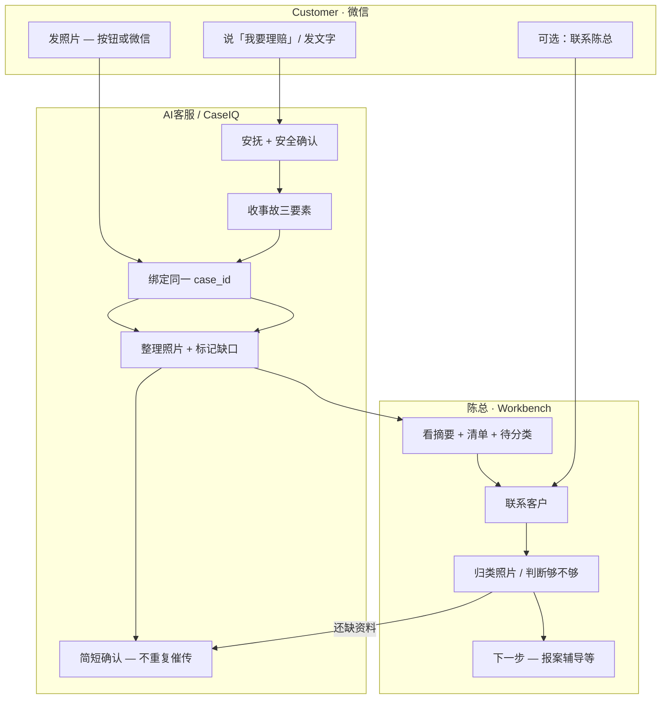

# P19H-3d-R1 — Claim Human Simulation + Workflow Simplification Recon

**Date:** 2026-07-08  
**Branch:** `sprint/p16-trust-layer`  
**Type:** Recon / human simulation + confusion diagnosis — **no production code, no deploy, no schema migration**  
**Prerequisite:** P19H-3d WeCom image binding deployed (`dc711ee`, `fiqa-api-00177-45n`) · P19H-3c-R3 identity resolver · P19H-3c-3 Workbench Evidence Checklist · C1 multi-channel copy (R2b)  
**Related:** `p19h3d_r0_claim_photo_intake_ux_simplicity_recon.md` · `evidence/p19h3d_wecom_claim_image_binding_mvp_2026_07_09.md` · `evidence/p19h3d_deploy_wecom_image_binding_smoke_2026_07_09.md` · `p19h3c_r4_claim_workflow_business_value_alignment_recon.md` · `p19h3c_r1_claim_multichannel_intake_best_practice_recon.md` · `p19h3c_r2_claim_identity_resolution_duplicate_prevention_recon.md`

---

## 1. Executive Summary

Post P19H-3d, the Claim spine is **technically complete** for pilot: basics → C1 → H5 **or** WeChat photos → one `case_id` → Workbench checklist + 待分类微信照片. The remaining risk is **cognitive**, not missing plumbing.

| Question | Answer |
|----------|--------|
| Is the workflow too complex? | **Partially** — backend is right-sized; **customer-facing story still reads like three systems** |
| Simplest customer story | 在微信里告诉陈总公司发生了什么；补照片点按钮最清楚，不方便就直接发微信；陈总会整理并回电 |
| Main CTA | **上传事故照片** (H5 button) |
| Fallback paths | WeChat direct photos · 联系陈总 / phone |
| H5 primary? | **Yes** — recommended, not required |
| WeChat image binding? | **Yes** — as **hidden fallback**, not co-equal hero |
| Broker Manual Slot Assignment next? | **No first** — after **P19H-3d-1 copy / CTA hierarchy** (or bundled second half of same sprint) |
| Next coding sprint | **P19H-3d-1 Copy Simplification / CTA Hierarchy Patch** |

**Verdict:** **GO** on simplification pass before adding broker slot UI. **HOLD** on new intake features, AI classify, OCR. **STOP** — no code in this recon.

---

## 2. Why It Feels Confusing

### 2.1 What shipped (good)

| Layer | Status | Customer/broker effect |
|-------|--------|------------------------|
| C1 multi-channel copy | ✅ Deployed | H5 推荐 + 微信也可以 + 不用重复上传 |
| WeCom → claim case bind (tier A) | ✅ Deployed | Photos land on same case |
| Identity resolver (tier B/C) | ✅ Deployed | No silent wrong-case bind |
| Evidence Checklist | ✅ Deployed | Chen sees H5 slot status |
| 待分类微信照片 panel | ✅ Deployed | Chen sees unassigned WeChat photos |
| `msg_id` dedup | ✅ | No double attach on replay |

### 2.2 Why people still feel lost

```text
Customer mental model today (risky):
  「AI 客服一套」+ 「H5 浏览器一套」+ 「陈总人工一套」

Target mental model:
  「陈总办公室在帮我整理一次事故 — 微信里说话就行，按钮只是帮忙分步传图」
```

**Root causes:**

1. **Two upload surfaces with equal visual weight** — C1 msgmenu has a big **上传事故照片** button *and* copy says「也可以直接发微信」; WeChat ack still says「或点按钮分步补充」→ feels like two products.
2. **AI vs 陈总 role blur** — Bot collects basics and acks photos, but every message says「陈总会…」; customer unsure who is listening *right now*.
3. **Broker loop half-closed** — Chen sees 待分类微信照片 but **cannot assign to slots** (P19H-3d-2 not built); checklist still shows ○ missing while photos exist → Chen may re-ask customer.
4. **No H5 nag suppression** — DMN R7 `h5_not_required_if_wecom` from R1 **not wired**; customer who WeChat-sent may still get C1-style H5 push on re-open → double-upload anxiety.
5. **Internal vocabulary leaks** — Workbench shows「待分类微信照片」「Evidence Checklist」; customer never sees this, but **operators** mirror it back to customers as process jargon.
6. **Three entry paths without ranked story** — WeChat claim start, random photo first, phone Chen first — all valid but **not one narrated spine** in a single sentence.

### 2.3 Complexity type

| Type | Assessment |
|------|------------|
| **Engineering complexity** | Acceptable for pilot — identity tiers, slot persistence, enrichment API |
| **Customer narrative complexity** | **Too high** — fix with copy + CTA hierarchy, not more features |
| **Broker operational complexity** | **Medium-high** — 待分类 without assign buttons adds friction |

---

## 3. Human Simulation A–E

Plain-language walkthrough of **post-P19H-3d deployed behavior** (code: `reply.py`, `media_intake.py`, `claim_workbench_display.py`).

### Scenario A — Calm customer (minor accident, at home)

**Story:** 李女士昨晚轻微刮蹭，今天在家想理赔。

| Step | What happens |
|------|--------------|
| 1 | Types: `我要理赔` |
| 2 | AI: start card — 请先确认人是否安全；请回复时间、地点、描述 |
| 3 | Types one message: `昨晚7点，Costco 停车场，倒车时刮到柱子` |
| 4 | AI: C1 card — 第 1 步完成 ✅；已记录三项；**推荐点按钮分步上传**；也可以直接发微信；不用重复上传；按钮 **上传事故照片** + **联系陈总** |
| 5 | **H5?** Likely **yes** — calm, at home, button is convenient; follows 3-slot flow |
| 6 | **WeChat photos?** Probably **no** unless H5 link fails |
| 7 | **Confused?** **Low** — linear path; copy is long but coherent |
| 8 | **Chen sees** | Workbench: Accident Basics ✅ · Checklist: 车损 ✅ (H5) · 对方 ○ · 现场 optional · broker_next_action from completion level |

**Friction:** Four guidance lines + two buttons — skimmers may only see the button and ignore「发微信也可以」(acceptable).

**Verdict:** ✅ **Happy path works.** Risk is length, not wrong routing.

---

### Scenario B — Stressed customer (at accident scene)

**Story:** 王先生刚被追尾，手抖，还在路边。

| Step | What happens |
|------|--------------|
| 1 | Types: `刚撞了` or sends **photo first** (see Scenario D if photo-first) |
| 2 | AI: safety + basics prompt (if text path) |
| 3 | May send **2–3 photos immediately** in WeChat before finishing basics |
| 4 | **Tier C** if no open claim yet: ack「请回复我要理赔」— **can feel like bot ignored photos** |
| 5 | After basics: C1 pushes **H5 button** — at scene, **browser hop hurts** |
| 6 | **H5 help or hurt?** **Hurt at scene** — friction; **help later** from gallery |
| 7 | **Should AI ask for photos immediately?** **No** before basics + safety — but should **accept** photos anytime with warm ack |
| 8 | **Should AI say「直接发微信就行」?** **Yes** — C1 already does; should be **one line near top**, not line 3 of 4 |
| 9 | **When Chen?** Immediately if injury keywords; else after basics or if customer taps **联系陈总**; Chen should call when checklist + 待分类 show activity |

**Friction:** Photo-before-basics hits tier C quarantine. Stressed user may not read「我要理赔」instruction.

**Verdict:** ⚠️ **Accept photos first with softer ack**, then fold into claim after one short basics ask — copy tweak, not new feature.

---

### Scenario C — Customer already called Chen

**Story:** 赵女士先打陈总电话 20 分钟，然后微信补照片。

| Step | What happens |
|------|--------------|
| 1 | Phone call — **invisible to system** today (no phone summary UI) |
| 2 | WeChat: `我要理赔` + basics (may duplicate what she told Chen) |
| 3 | AI still guides basics → C1 — **can feel redundant** after phone call |
| 4 | Sends 4 photos in WeChat — **tier A bind** → 待分类 on case |
| 5 | **H5 still matter?** **No for customer** — Chen may send H5 link later for one missing slot (future broker action) |
| 6 | **Same case?** **Yes** if single open claim <72h |
| 7 | **Chen manual note?** **Should** — P19H-3c-R5 phone summary deferred; Chen must mentally merge phone + WeChat |

**Chen sees:** Basics + 4 unassigned WeChat photos + checklist all ○ — **looks empty despite photos** until he classifies (blocked: no assign UI).

**Verdict:** ⚠️ **Customer path OK; broker path painful** — phone invisible + 待分类 without assign = Chen re-scrolls WeChat.

---

### Scenario D — Random photos first (no「我要理赔」)

**Story:** Customer sends 2 damage photos, no text.

| Step | What happens |
|------|--------------|
| 1 | Image ingested → `resolve_claim_identity()` tier **C** (no open claim) |
| 2 | **No claim case created** (ID-11 — correct) |
| 3 | Ack: `照片已收到。如果这是理赔相关，请简单回复「我要理赔」…` |
| 4 | **Should system create claim?** **No** — empty claims are worse |
| 5 | **Should ask「理赔相关吗？」** **Yes** — current ack is close; avoid「加车还是理赔」for tier C |
| 6 | **Quarantine?** Yes — media unassigned until claim exists |
| 7 | **Avoid confusing customer?** One short ask + **do not** launch Add Vehicle or coverage paths |

**Verdict:** ✅ **Safe default.** Minor copy polish: lead with「已收到照片」+ single ask, no menu.

---

### Scenario E — Both H5 and WeChat

**Story:** Customer uploads 1 photo in H5 (车损), then sends 3 photos in WeChat.

| Step | What happens |
|------|--------------|
| 1 | H5: `customer_damage_photo` → checklist **✅ 车损 · h5_task** |
| 2 | WeChat: 3 images → tier A → case attach, `slot_assignment=unassigned` |
| 3 | Ack each: `照片已收到…或点按钮分步补充` |
| 4 | **Duplicate upload ask?** System does **not** auto-nag H5 again on same session, but ack **invites** button again → customer may re-upload 车损 in H5 |
| 5 | **Workbench:** Checklist ✅ 车损 · ○ 对方 · ○ 现场 · **待分类微信照片 (3)** · broker_next_action「有 3 张微信照片待陈总人工归类」 |
| 6 | **Customer should see:** Nothing new required — ideal ack: `收到，陈总会整理；不用再传同一张` |

**Verdict:** ⚠️ **Technically correct, narratively risky** — suppress「点按钮补充」when photos already received; broker assign closes checklist gap.

---

## 4. Confusion Table

| Confusion point | Why confusing | Severity | Fix |
|-----------------|---------------|----------|-----|
| **H5 vs WeChat upload** | Two ways to send photos; C1 + ack both mention both | **High** | One narrative: button **推荐**; WeChat one line **不方便就直接发**; never「方式一/二」 |
| **AI客服 vs 陈总** | Every reply says 陈总会… but customer talks to bot | **Medium** | Frame AI as **陈总办公室值班助手**;「我先帮您记录，陈总会回电确认」 |
| **联系陈总 button** | Same card as upload — looks like third equal path | **Medium** | Keep button but tail copy: **紧急或看不懂再点**; not parallel to upload |
| **待分类照片 (broker)** | Photos on case but checklist ○ — looks broken | **High** (broker) | P19H-3d-2 slot assign **or** interim copy「微信照片已收到，归类中」on checklist summary |
| **Repeated upload** | Ack says「或点按钮分步补充」after WeChat | **High** | R7: suppress H5 push; ack **无需重复上传** only |
| **Multiple open claims** | Tier B broker_confirm reply | **Medium** | OK for MVP; shorten customer message; Chen resolves on Workbench |
| **Image-only messages** | Tier C asks「我要理赔」 | **Medium** | Accept photo warmly; one question; no lane menu |
| **Phone-first invisible** | Chen knows; system doesn't | **Medium** (broker) | Defer P19H-3c-R5 phone summary — not blocking customer copy |
| **Evidence Checklist English** | Internal Workbench label | **Low** | Broker-only; optional rename later |
| **C1 message length** | 4 guidance lines + facts + prep list | **Medium** | Collapse to 2 lines + prep list; move detail to tail |
| **Scene photo optional** | Customer unsure if required | **Low** | Keep「可选」in prep list — clear enough |

---

## 5. Simplified Customer Story

### 5.1 One-line customer story (target)

> **您在微信里告诉陈总公司发生了什么就行；想分步传照片就点下面按钮，不方便就直接发微信，不用重复上传，陈总会整理并回电。**

### 5.2 One main CTA

**上传事故照片** — H5 msgmenu `view` button (unchanged label).

WeChat upload is **not** a second button — only prose fallback.

### 5.3 Backup paths

| Path | When | Customer instruction |
|------|------|----------------------|
| **WeChat photos** | At scene, gallery, or H5 fails | 「直接把照片发到这」— ack within seconds |
| **联系陈总** | Injury, coverage question, confusion, emotional need | Button or phone — **no penalty** |
| **Later upload** | Customer busy | No deadline nag; Chen follow-up |

### 5.4 Should customer ever be told to upload twice?

**No.**

Rules:

- Ack: **无需重复发送同一张**
- Do **not** re-send C1 H5 card after WeChat photos on case (wire R7)
- H5 flow: if slot already `received`, show **已收到，可补更清晰** not empty upload

### 5.5 Should H5 remain primary?

**Yes — conditionally.**

| Context | H5 role |
|---------|---------|
| Calm, at home | **Primary CTA** — best slot clarity |
| At scene, stressed | **Optional** — WeChat first is fine |
| After WeChat burst | **De-emphasized** — only for missing slot if Chen sends link |

H5 primary = **recommended in copy**, not **required in behavior**.

---

## 6. Simplified Broker Story

### 6.1 Chen's one-line story

> **客户在微信里说什么、发什么图，都会进同一份理赔记录；我看 Workbench 就知道发生了什么、还缺什么、有没有待分类的微信照片，然后回电。**

### 6.2 Chen's daily loop (target)

```text
1. Notification / Workbench row: Claim · basics complete
2. Open drawer:
   - Accident Basics (时间/地点/描述)
   - Evidence Checklist (H5 slots ✅/○)
   - 待分类微信照片 (if any) → 归入 slot   ← blocked until 3d-2
   - 下一步建议
3. Call or WeChat customer — fill gaps, classify photos
4. Mark sufficient / request retake (later)
5. File with carrier (outside CaseIQ)
```

### 6.3 What makes Chen busier today

| Issue | Effect |
|-------|--------|
| 待分类 without assign UI | Manual WeChat scroll to match photos to slots |
| Checklist ○ while photos exist | False「missing」→ unnecessary customer ping |
| No phone summary | Re-ask what customer already said on phone |
| Duplicate case rows (tier B) | Extra reconcile — rare but high cost |

**Simplification reduces Chen load by:** copy that stops double-upload calls + slot assign that closes checklist without re-ask.

---

## 7. Simplified BPMN View

Three lanes only — no channel-specific subprocesses.



**Invariant:** One `case_id`, one checklist — channels are inputs, not separate workflows.

---

## 8. What To Keep

| Item | Why |
|------|-----|
| Safety gate + injury → manual | Trust foundation |
| Accident basics (3 fields) | Chen's first questions |
| C1 H5 button | Best slot clarity (~75% vs ~15–25% chat) |
| WeCom case binding (tier A/B/C) | Natural photo behavior |
| Identity resolver | Prevents false merge |
| Evidence Checklist | Chen gap visibility |
| 待分类微信照片 panel | Broker sees chat photos in context |
| Skip reasons on H5 | Honest「找不到对方车」 |
| 联系陈总 | Escape hatch — never remove |
| `msg_id` idempotency | Transport safety |
| Multi-channel C1 copy (concept) | H5 推荐 + 微信也可以 — **shorten, don't remove** |

---

## 9. What To Hide / De-emphasize

| Item | Action |
|------|--------|
| WeChat upload as second CTA | **Prose only** — no second button |
|「或点按钮分步补充」after WeChat ack | **Remove** when photos already on case |
| Equal「三种方式」enumeration | Never use 方式一/二/三 |
| H5 re-push after WeChat receipt | Wire R7 suppression |
|「AI 分析照片」language | Forbidden — never |
| 联系陈总 during calm photo phase | Move to tail / injury-only emphasis |
| Workbench jargon to customer | Internal only |
| Auto slot classify | Defer indefinitely |

### 9.1 Proposed C1 copy (simplified — P19H-3d-1 target)

**Head:**

```text
【理赔资料 · 第 1 步完成 ✅】

事故基本信息已收到。

已记录：
时间：{accident_datetime}
地点：{accident_location}
描述：{accident_description}

下一步请补充事故照片。
推荐点下面「上传事故照片」，按步骤上传（最清楚）。
不方便的话，直接把照片发到微信里就行，不用重复上传，陈总会整理。

请准备：
1. 您的车损伤照片
2. 对方车辆 / 车牌照片
3. 现场照片（可选）
```

**WeChat photo ack (tier A, simplified):**

```text
收到照片，已放到这份理赔资料里。
陈总会整理确认，无需重复发送同一张。
```

---

## 10. What To Defer

| Item | Reason |
|------|--------|
| AI image / slot classification | Scope guardrail |
| OCR / plate read | Out of scope |
| Image similarity dedup | Broker eyeball at pilot volume |
| Full claim timeline UI | After next action panel |
| Voice ASR | Phone summary first |
| Customer self-classify「这是车损」chat | Broker classifies |
| Auto-merge duplicate cases | Broker confirm only |
| Carrier filing automation | Chen's job |
| Mini program channel | P19E-3 defer |
| New intake features | **Stop stacking** |

---

## 11. Recommended Next Sprint

### Options evaluated

| Option | Verdict | Rationale |
|--------|---------|-----------|
| **P19H-3d-1 Copy Simplification / CTA Hierarchy** | ✅ **Recommended first** | Low risk, high confusion reduction; implements R0/R1 copy intent fully |
| **P19H-3d-2 Broker Manual Slot Assignment** | ✅ **Immediately after 3d-1** | Closes broker loop; **not** before copy — customer-facing first |
| **P19H-3d-1b Workbench Pending Photo Simplification** | ⚠️ Subset of 3d-2 | Thumbnails + assign buttons together |
| **P19H-3c-R5 Broker Phone Summary** | ⏸️ After photo loop closed | High value but doesn't fix upload confusion |
| **More intake features** | ❌ | Violates scope guardrail |

### 11.1 Recommended sequence

```text
1. P19H-3d-1   Copy + CTA hierarchy + R7 H5 nag suppress + WeChat ack trim   ← NEXT SPRINT
2. P19H-3d-2   Broker manual slot assign for 待分类微信照片                    ← same sprint if ≤3 days left, else sprint+1
3. P19H-3c-R5  Broker next action + phone summary
4. P19H-3d-3   H5 skip-if-slot-received polish (optional)
```

### 11.2 P19H-3d-1 scope (concrete)

| # | Change |
|---|--------|
| 1 | Shorten C1 head — 2 photo lines max before prep list |
| 2 | Tier A WeChat ack — remove「或点按钮分步补充」 |
| 3 | Wire R7 — no C1 re-push when `unassigned_wecom_photos.count > 0` or broker classified |
| 4 | Opening framing —「陈总办公室助手」one line on start card |
| 5 | Tests only — no schema, no new UI panels |

---

## 12. Final Recommendation

| Decision | Answer |
|----------|--------|
| Workflow too complex? | **Partially** — simplify narrative, not architecture |
| Simplest customer story | 微信说事故 → 点按钮或发图 → 陈总整理回电，不重复上传 |
| Main CTA | **上传事故照片** |
| Fallbacks | WeChat photos · 联系陈总 |
| H5 primary? | **Yes** (recommended, optional) |
| WeChat binding? | **Yes** (hidden fallback) |
| P19H-3d-2 next? | **After P19H-3d-1** (or bundle back half) |
| Next coding sprint | **P19H-3d-1 Copy Simplification / CTA Hierarchy Patch** |

**Do not** add features before this copy pass. **Do not** skip P19H-3d-2 for long — broker half-loop creates real Chen busy-work.

---

## Appendix A — Expected Final Answers

| Question | Answer |
|----------|--------|
| Is current Claim workflow too complex? | **Partially** |
| Simplest customer-facing story? | 您在微信里告诉陈总公司发生了什么；点按钮分步传照片最清楚，不方便就直接发微信，陈总会整理并回电。 |
| Main CTA? | **上传事故照片** |
| Fallback paths? | WeChat direct photos · 联系陈总 / phone |
| Should H5 stay primary? | **Yes** (recommended, not required) |
| Should WeChat image binding stay? | **Yes** — hidden fallback, not equal CTA |
| Broker Manual Slot Assignment next? | **No** — after **P19H-3d-1** copy simplification |
| Next coding sprint? | **P19H-3d-1 Copy Simplification / CTA Hierarchy Patch** |

---

## Appendix B — Acceptance Criteria

| # | Criterion | Status |
|---|-----------|--------|
| 1 | Human simulation A–E | ✅ §3 |
| 2 | Confusion table | ✅ §4 |
| 3 | Simplified customer story + CTA | ✅ §5 |
| 4 | Simplified broker story | ✅ §6 |
| 5 | 3-lane BPMN | ✅ §7 |
| 6 | Keep / hide / defer lists | ✅ §8–10 |
| 7 | Product decisions + next sprint | ✅ §11–12 |
| 8 | No production code | ✅ |
| 9 | No deploy | ✅ |

---

*P19H-3d-R1 complete. No production code. No deploy.*
