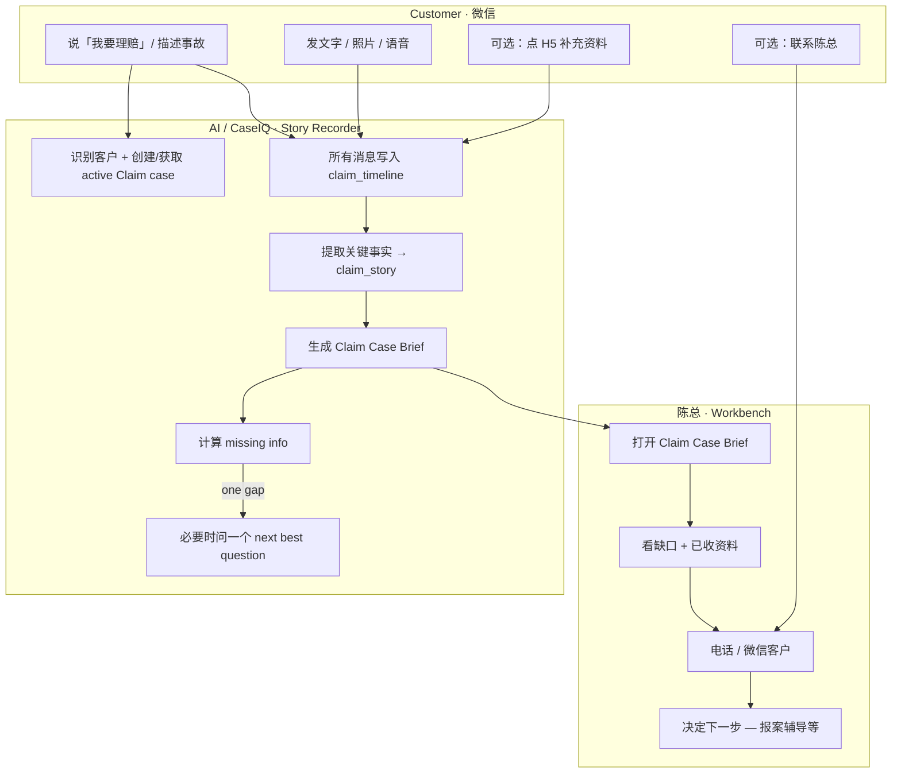

# P19H-3e — Claim Case Builder Category Strategy Recon

**Date:** 2026-07-08  
**Branch:** `sprint/p16-trust-layer`  
**Type:** Strategic recon / product category judgment — **no production code, no deploy, no schema migration**  
**Prerequisite:** P19H-3d WeCom image binding deployed · P19H-3c-3 Evidence Checklist · P19H-3c-R3 Identity Resolver · P19H-3d-R0/R1 photo intake UX recon  
**Related:** `p19h3d_r1_claim_human_simulation_workflow_simplification_recon.md` · `p19h3d_r0_claim_photo_intake_ux_simplicity_recon.md` · `p19h3c_r4_claim_workflow_business_value_alignment_recon.md` · `p19h3c_r1_claim_multichannel_intake_best_practice_recon.md` · `p19h3c_r2_claim_identity_resolution_duplicate_prevention_recon.md` · `evidence/p19h3d_wecom_claim_image_binding_mvp_2026_07_09.md` · `evidence/p19h3c3a_claim_evidence_summary_backend_2026_07_09.md` · `evidence/p19h3c3b_claim_evidence_checklist_ui_2026_07_09.md`

---

## 1. Executive Summary

We have built substantial Claim workflow plumbing: basics collection, H5 photo upload, WeCom image binding, Evidence Checklist, Identity Resolver, and 待分类微信照片. Technically the spine works. **Strategically we drifted toward a photo-upload product** when Chen's real need — and the customer's natural behavior — is **story capture and organization**, not slot completion.

| Question | Answer |
|----------|--------|
| Which product category? | **Claim Story Recorder + Case Builder** (subset of Broker Claim Service Copilot) |
| One-line thesis | 微信里的理赔故事记录器 — 客户照常发微信，系统帮陈总抄下来、整理好，输出 Claim Case Brief |
| Are we FNOL / ClaimCenter / Damage AI? | **No** — we borrow FNOL's *capture* idea, reject its *adjudication* scope |
| Is H5 still primary? | **No** — WeChat is primary; H5 is optional guided 补充资料 |
| What should Chen see first? | **Claim Case Brief** — not Evidence Checklist or 待分类照片 |
| Broker Manual Slot Assignment next? | **No** — deferred; adds Chen work without solving story gap |
| Next coding sprint? | **P19H-3e-1 Claim Story Timeline + Case Brief Foundation** |
| Verdict | **GO** on category pivot and sprint re-prioritization · **HOLD** on slot assignment, OCR, ASR, damage AI · **STOP** — no code in this recon |

**This recon supersedes P19H-3d-R1's sprint recommendation** (P19H-3d-1 copy / P19H-3d-2 slot assignment) for *priority ordering*. Copy simplification remains valid but should be **folded into** the story-recorder narrative, not shipped as a standalone sprint ahead of Case Brief.

---

## 2. Category Comparison

| Category | What it does | Buyer / user | Complexity | Risk | Fit for us |
|----------|--------------|--------------|------------|------|------------|
| **1. Full Claim Management System** (Guidewire ClaimCenter) | End-to-end claim lifecycle: FNOL → tasks → adjuster workflow → reserves → payments → litigation | Insurance carrier IT | Very high — enterprise platform | High — regulatory, adjudication liability | ❌ **Too big** — wrong buyer, wrong scope |
| **2. FNOL / Digital Intake** (carrier mobile FNOL, Snapsheet intake) | First notice of loss: guided accident report, photo capture, policy lookup, carrier routing | Carrier digital / claims ops | High — 15–20 fields, policy integration, STP | Medium — implies filing authority | ⚠️ **Partial fit** — capture patterns yes; filing/adjudication no |
| **3. Damage AI / Estimate** (CCC, Tractable, Snapsheet vision) | Photo → damage detection → repair estimate → total loss scoring | Carrier claims + repair network | Very high — CV models, liability for estimates | **Very high** — wrong estimate = legal exposure | ❌ **Wrong category** — defer indefinitely |
| **4. Broker Claim Service Copilot** (our prior R1/R4 label) | Organize chaotic post-accident contact → one case → gaps + next action for broker | Independent broker (Chen) | Medium — multi-channel normalize, no carrier API | Low — human-in-the-loop, prep not decision | ✅ **Good GTM frame** — warm, broker-centric |
| **5. Claim Story Recorder + Case Builder** (recommended wedge) | WeChat-native story capture: text/photos/voice → timeline → AI summary → broker-ready brief | Broker office staff | **Low–medium** — timeline + extraction, not workflow engine | **Low** — records and organizes; Chen decides | ✅ **Best fit** — smallest valuable ring |

### Per-category evaluation

#### 1. Full Claim Management System

| Criterion | Assessment |
|-----------|------------|
| Too big for us? | **Yes** — years of carrier IT; adjuster tasks, reserves, payments |
| Fits Chen's workflow? | **No** — Chen is broker, not carrier adjuster |
| Reduces or adds Chen work? | Adds — he'd become system admin |
| Liability risk? | High — system implies claim authority |
| Quick demo? | No |
| Walmart Spark Driver simple? | No — enterprise back-office |

#### 2. FNOL / Digital Intake

| Criterion | Assessment |
|-----------|------------|
| Too big for us? | **Partially** — full FNOL includes policy verify + carrier routing |
| Fits Chen's workflow? | **Partially** — customers do report accidents; Chen files separately |
| Reduces or adds Chen work? | Can reduce if scoped to **capture only** |
| Liability risk? | Medium if we say「已报案」 |
| Quick demo? | Medium — needs tight scope |
| Walmart Spark Driver simple? | Only if stripped to guided story + photos |

**Borrow:** safety first, progressive disclosure, omnichannel → one record.  
**Reject:** coverage check, fault, STP, carrier API.

#### 3. Damage AI / Estimate

| Criterion | Assessment |
|-----------|------------|
| Too big for us? | **Yes** |
| Fits Chen's workflow? | Chen looks at photos himself; doesn't need AI estimate |
| Reduces or adds Chen work? | Adds review burden when AI is wrong |
| Liability risk? | **Very high** |
| Quick demo? | Wow factor but wrong product |
| Walmart Spark Driver simple? | No |

#### 4. Broker Claim Service Copilot

| Criterion | Assessment |
|-----------|------------|
| Too big for us? | No — right buyer |
| Fits Chen's workflow? | **Yes** — prep for callback, not replace judgment |
| Reduces or adds Chen work? | **Reduces** when organized; **adds** when checklist/slot work pushed to Chen |
| Liability risk? | Low with human-in-the-loop |
| Quick demo? | Yes |
| Walmart Spark Driver simple? | Yes if UX stays WeChat-native |

#### 5. Claim Story Recorder + Case Builder (chosen wedge)

| Criterion | Assessment |
|-----------|------------|
| Too big for us? | **No** — one case, one timeline, one brief |
| Fits Chen's workflow? | **Yes** —「客户在微信里说什么，我打开就知道」 |
| Reduces or adds Chen work? | **Reduces** — stops WeChat scroll + re-ask |
| Liability risk? | **Lowest** —「已记录」「陈总会确认」，not「已判定」 |
| Quick demo? | **Yes** — natural WeChat simulation |
| Walmart Spark Driver simple? | **Yes** — customer talks normally; system organizes |

### Category decision

```text
We are NOT:     ClaimCenter · Damage AI · Full FNOL · Adjuster system
We ARE:         Claim Story Recorder + Case Builder
GTM label:      Broker Claim Service Copilot (external)
Engineering:    Multi-channel Claim Case Builder (internal)
```

---

## 3. What We Should Not Build

| Item | Why stop |
|------|----------|
| Full claim workflow engine (Camunda/Temporal) | P19J-0 rejected; JSONB + phases sufficient |
| Adjuster task queues / reserves / payments | Carrier domain |
| AI damage estimate / repair cost | Liability + scope; Chen doesn't need it |
| OCR as required path | Nice later; not MVP gate |
| Voice ASR as required path | Broker phone note first |
| Auto fault / coverage determination | Broker judgment only |
| Carrier filing automation | Chen files; we prep |
| Broker Manual Slot Assignment as **primary** broker task | **Adds Chen work** — classifying photos into 3 slots is clerical, not strategic |
| H5 as **primary** mental model | Customers live in WeChat; H5 is supplement |
| More UI buttons / intake features | Stop stacking before Case Brief exists |
|「已报案」「claim filed」language | Compliance / trust |

---

## 4. What We Should Build

The **smallest valuable ring** around Chen's real pain:

```text
Customer (WeChat)  →  Story Recorder  →  Claim Case  →  Case Brief  →  Chen acts
```

| Layer | Responsibility |
|-------|----------------|
| **Story Recorder** | Append every text/photo/voice/file to `claim_timeline[]` on one `case_id` |
| **Identity** | One active claim per accident (Identity Resolver — already shipped) |
| **Fact Extraction** | AI/deterministic pull: time, place, what happened, injury, parties, police, insurance |
| **Case Brief** | Single Workbench view: who, what, when, where, evidence received, gaps, next question |
| **Missing Info** | Computed list — not slot checklist as hero |
| **Next Best Question** | One question for customer when needed — not a form wizard |

**Output artifact:** Broker-ready **Claim Case Brief** — not an insurance decision.

---

## 5. Current Feature Reclassification

| Feature | Verdict | Why |
|---------|---------|-----|
| **Claim start when user says「我要理赔」** | **Keep** | Natural entry; creates case + lane |
| **Safety gate** | **Keep** | Trust foundation; injury → manual |
| **Accident basics collection** | **Keep · simplify** | Core facts; fold into story, don't feel like separate form phase forever |
| **H5 photo upload** | **Keep · de-emphasize** | Useful guided 补充资料; not primary path |
| **WeCom direct image binding** | **Keep** | Core story recorder behavior — photos are story events |
| **Evidence Checklist** | **Simplify · demote** | Useful secondary view; **not** Chen's first screen; photo-slot model is Add Vehicle thinking applied to Claim |
| **待分类微信照片** | **Hide · defer broker action** | Symptom of slot-centric design; timeline + brief should show photos without forcing Chen to classify |
| **Broker Manual Slot Assignment** | **Defer** | Adds Chen clerical work; low value vs Case Brief; wrong priority after this recon |
| **Claim Identity Resolver** | **Keep** | Prevents false merge — essential for story integrity |
| **H5 skip reason** | **Keep** | Honest「找不到对方车」— feeds missing-info, not slot completion |
| **联系陈总 button** | **Keep** | Escape hatch — never remove |
| **Phone summary** | **Keep · prioritize after Case Brief** | Phone-first claims invisible today — high broker value |
| **Voice message transcription** | **Defer** | ASR heavy; store voice on timeline first if needed |
| **OCR** | **Defer** | Out of scope for pilot |
| **AI photo classification** | **Remove from roadmap** | Wrong slot worse than unassigned; conflicts with story recorder |
| **Damage estimate** | **Remove** | Wrong category |
| **Carrier filing** | **Remove** | Chen's job |
| **Coverage/fault judgment** | **Remove** | Broker domain |

### Honest assessments

**Broker Manual Slot Assignment adds Chen work.** It asks Chen to drag photos into `customer_damage_photo` / `other_party_vehicle_photo` / `scene_photo` — clerical taxonomy. At pilot volume, Chen can see photos in the brief and decide verbally. Slot assignment optimizes checklist accuracy, not story understanding.

**H5 is useful but should not be the main mental model.** P19H-3d-R0/R1 correctly fixed multi-channel binding but over-indexed on「H5 primary」because slot clarity metrics (~75% H5 vs ~15% chat) come from **Add Vehicle** evidence packs. Claim customers send photo bursts in WeChat while stressed. The product should feel like「发微信就行」, with H5 as optional structure.

**The real core is the story recorder.** Chen's #1 pain (R4): scrolling WeChat to reconstruct what happened. Checklist answers「which slot is empty」; Case Brief answers「what is this accident about and what should I do».

---

## 6. New Product Thesis

```text
We are not building a full claim system.
We are not building an adjuster workstation.
We are not building an FNOL filing bot.
We are not building a damage estimator.

We are building a WeChat-native Claim Story Recorder + Case Builder.

The first wedge is accident story capture and evidence organization.

The user naturally sends text, photos, and voice in WeChat — no forced wizard.

The AI records, groups, summarizes, extracts key facts, and identifies missing info.
The AI asks only one next best question when needed — not a 20-field form.

Chen reviews a clean Claim Case Brief and decides the actual next action
(call customer, request specific photo, coach carrier filing).

The output is a broker-ready claim brief — not an insurance decision.
```

### Positioning stack

| Layer | Name |
|-------|------|
| **Customer-facing** | 陈总办公室助手 — 帮您记录事故，陈总会确认跟进 |
| **GTM / sales** | Broker Claim Service Copilot |
| **Engineering** | Claim Story Recorder + Case Builder |
| **Anti-positioning** | Not ClaimCenter · Not FNOL bot · Not damage AI |

---

## 7. Simplest Workflow

Three lanes — customer talks normally; system scribes; Chen decides.



### Customer experience target

> **客户照常发微信，系统帮陈总抄下来和整理好。**

Not:

> **客户被迫完成一个复杂表格或三个上传渠道。**

### System behavior rules

1. **WeChat-first** — every inbound message is a timeline event first, classification second.
2. **One active claim** — Identity Resolver (shipped) prevents chaos.
3. **Progressive facts** — extract what you can; don't block on completeness.
4. **One question at a time** — when missing info is critical, ask once; no interrogation.
5. **No repeat upload nag** — photos received = recorded; H5 optional.
6. **Chen is the decision maker** — brief presents facts + gaps; never「已报案」.

---

## 8. MVP v1 Definition

### MVP v1 includes

| # | Capability | Notes |
|---|------------|-------|
| 1 | **Customer identity** | `wecom_external_userid` + display name |
| 2 | **One active Claim case** | Identity Resolver tier A/B/C |
| 3 | **Claim story timeline** | Ordered events: text, photo, voice stub, broker note, phone summary |
| 4 | **Message/media capture** | All channels append to timeline + `case_attachments` |
| 5 | **AI-generated accident summary** | 3–5 sentence narrative from timeline + basics |
| 6 | **Key fact extraction** | Structured `claim_story_facts`: |
| | | · date/time |
| | | · location |
| | | · what happened |
| | | · injury yes/no/unknown |
| | | · own vehicle info (if mentioned) |
| | | · other party info (if mentioned) |
| | | · police report yes/no/unknown |
| | | · photos received (count + types if inferable from context) |
| | | · insurance info received (if mentioned) |
| 7 | **Missing info list** | Computed from fact template — not slot checklist as source of truth |
| 8 | **Broker next best question** | Single suggested question, e.g.「建议确认对方车牌和保险」 |
| 9 | **Claim Case Brief in Workbench** | **Hero panel** — summary + facts + gaps + timeline link |

### MVP v1 does not include

| Item | Reason |
|------|--------|
| Manual photo slot assignment as primary broker task | Adds Chen work; defer |
| AI damage estimate | Wrong category |
| OCR as required path | Defer |
| ASR as required path | Defer; voice on timeline as attachment OK |
| Full carrier filing | Out of scope |
| Fault/coverage decision | Broker only |
| Complex H5 upload journey as primary UX | WeChat is primary |
| Evidence Checklist as **first** Workbench section | Demote to optional subsection |
| 待分类微信照片 as **prominent** broker task | Photos visible in brief/timeline |

### MVP success criteria (Chen)

Chen opens Workbench and within **10 seconds** knows:

1. Who this customer is
2. What happened (one paragraph)
3. When and where
4. Whether anyone was hurt
5. What photos/files arrived
6. What's still missing
7. What he should ask on the callback

**Without scrolling WeChat.**

---

## 9. H5 Reframe

| Question | Answer |
|----------|--------|
| Is H5 still useful? | **Yes** — for customers who want guided step-by-step photo upload |
| When should H5 appear? | After basics captured; when customer needs structure or Chen sends link for one missing item |
| Should H5 be primary? | **No** — WeChat is primary |
| Rename from「上传事故照片」? | **Consider** →「补充事故资料」or「分步补充照片」— signals supplement, not main path |
| H5 as「补充资料」not main upload? | **Yes** |
| WeChat as real primary entry? | **Yes** |

### H5 role matrix

| Context | H5 role |
|---------|---------|
| Customer calm at home, wants structure | Optional guided helper |
| Customer stressed at scene | **Don't push** — WeChat photos enough |
| Customer already sent WeChat photos | **Don't show** H5 nag; offer only if specific gap |
| Chen needs one missing photo type | Chen sends H5 link for that slot — broker-initiated |

### Copy shift (from P19H-3d-R1)

**Old hero narrative (photo-centric):**

> 推荐点下面「上传事故照片」按钮…

**New hero narrative (story-centric):**

> 事故信息已记录 ✅  
> 您可以继续在微信里补充说明或发照片，陈总会整理到同一份记录里。  
> 如果想分步上传，可以点下面「补充事故资料」。

H5 button moves from **primary CTA** to **secondary optional action**.

---

## 10. Workbench Reframe

### Options evaluated

| Option | As first screen? | Verdict |
|--------|------------------|---------|
| A. Evidence Checklist | No | Slot-centric; wrong mental model for Claim |
| B. Pending WeChat Photos | No | Asks Chen to do clerical classification |
| C. **Claim Case Brief** | **Yes** | Answers Chen's real question:「这起事故是什么情况？」 |
| D. Timeline | No (second) | Source of truth for drill-down, not summary |
| E. Next Best Question | Partial | Part of Brief, not standalone hero |

### Recommended top-to-bottom order

```text
1. Claim Case Brief          ← NEW hero (summary + key facts + injury flag)
2. Critical missing info     ← 3–5 bullets, not 3-slot checklist
3. Timeline / source messages ← chronological story; expandable
4. Photos / files received   ← thumbnails grouped, no slot assignment required
5. Evidence checklist        ← OPTIONAL collapsed section for H5 slot status
```

### Why this order

**Claim Case Brief first** because Chen's job is **service under stress**, not document taxonomy. He needs the story before the slots.

**Missing info second** because it drives the callback agenda —「还缺对方车牌」not「对方车辆 slot ○」.

**Timeline third** because it is provenance — when customer said something contradictory, Chen drills down.

**Photos fourth** because seeing thumbnails answers「did they send damage photos」without assigning slots.

**Checklist last / collapsed** because H5 slot status is **implementation detail** useful for power users, not the product hero.

### Migration from today

Today (P19H-3c-3B):

```text
1. Accident Basics
2. Evidence Checklist      ← currently hero
3. Case attachments
4. (待分类微信照片 in summary API, limited UI)
```

Target (P19H-3e-1+):

```text
1. Claim Case Brief        ← new
2. Missing info
3. Timeline
4. Photos received
5. Accident Basics         ← folded into brief; can collapse
6. Evidence Checklist      ← demoted, collapsed
```

---

## 11. Next Sprint Decision

### Options evaluated

| Option | Verdict | Rationale |
|--------|---------|-----------|
| **A. P19H-3d-1 Copy Simplification / CTA Hierarchy** | ⚠️ **Fold in, don't lead** | Still needed but subordinate to story narrative; don't sprint alone |
| **B. P19H-3d-2 Broker Manual Slot Assignment** | ❌ **Defer** | Adds Chen work; wrong priority after category pivot |
| **C. P19H-3e-1 Claim Story Timeline + Case Brief Foundation** | ✅ **Recommended** | Core product; fixes #1 Chen pain (WeChat scroll) |
| **D. P19H-3e-2 AI Fact Extraction / Missing Info Engine** | ⏸️ **Immediately after 3e-1** | Can ship thin deterministic layer in 3e-1; LLM enrichment in 3e-2 |
| **E. P19H-3c-R5 Broker Phone Summary** | ⏸️ **After 3e-1** | High value; needs timeline sink |

### Recommended sequence

```text
1. P19H-3e-1   Claim Story Timeline + Case Brief Foundation     ← NEXT SPRINT
2. P19H-3e-2   AI Fact Extraction / Missing Info Engine           ← sprint+1 or back half of 3e-1
3. P19H-3c-R5  Broker Phone Summary → timeline event
4. P19H-3d-1   Copy simplification (story-centric CTA)           ← bundle with 3e-1 deploy
5. P19H-3d-2   Broker Manual Slot Assignment                     ← defer until brief ships; low priority
```

### P19H-3e-1 scope (concrete)

| # | Deliverable |
|---|-------------|
| 1 | `claim_timeline[]` event model — text, photo, basics_complete, broker_note stubs |
| 2 | Append on every WeCom inbound (text + image) — not just attachments |
| 3 | `build_claim_case_brief()` in `claim_workbench_display.py` |
| 4 | Workbench UI: **Claim Case Brief** panel above checklist |
| 5 | Thin summary from existing `accident_*` + attachment counts (LLM optional stub) |
| 6 | Story-centric C1 copy patch (subset of 3d-1) bundled |
| 7 | Tests — no schema migration (JSONB on case) |

**Out of scope for 3e-1:** slot assignment UI, OCR, ASR, damage AI, schema migration.

---

## 12. Final Recommendation

### Strategic pivot

We over-built the **photo intake spine** (H5 slots, checklist, 待分类) relative to the **story recorder** Chen actually pays for. The next increment is not more photo plumbing — it is **making the accident story visible in one brief**.

### Category

**Claim Story Recorder + Case Builder** — marketed as **Broker Claim Service Copilot**.

### Product thesis

> 微信里的理赔故事记录器：客户照常发微信，系统帮陈总抄下来、整理好，输出一份 Claim Case Brief。

### MVP v1

One case · one timeline · one brief · key facts · missing info · next question. No slot assignment hero. No damage AI.

### H5

Useful **补充资料** tool. **Not primary.** WeChat is the real input surface.

### Workbench

**Claim Case Brief first.** Checklist demoted.

### Broker Manual Slot Assignment

**Not next.** Deferred — adds clerical work; wrong wedge.

### Next coding sprint

**P19H-3e-1 Claim Story Timeline + Case Brief Foundation.**

### What to stop doing

1. Treating H5 photo upload as the product center  
2. Building broker slot-classification UI before Case Brief exists  
3. Adding intake features / UI buttons without brief value  
4. Pursuing AI photo classification, OCR, ASR, damage estimate  
5. Framing product as FNOL filing or evidence-pack completion  
6. Making Evidence Checklist the Workbench hero  

### GO / HOLD / STOP

| Verdict | Scope |
|---------|-------|
| **GO** | P19H-3e-1 timeline + Case Brief; story-centric copy; WeChat-first narrative |
| **HOLD** | Slot assignment, phone summary, H5 rename, LLM fact extraction (until 3e-1 lands) |
| **STOP** | Damage AI, OCR required path, ASR required path, carrier filing, adjuster workflow, more photo-centric sprints |

---

## Appendix A — Expected Final Answers

| # | Question | Answer |
|---|----------|--------|
| 1 | Which category are we? | **Claim Story Recorder + Case Builder** (GTM: Broker Claim Service Copilot) |
| 2 | One-line product thesis? | 微信里的理赔故事记录器 — 客户照常发微信，系统帮陈总抄下来整理好，输出 Claim Case Brief |
| 3 | Is Broker Manual Slot Assignment still next? | **No** — deferred; adds Chen work; brief first |
| 4 | Is H5 still primary? | **No** — WeChat primary; H5 optional 补充资料 |
| 5 | What is the real primary input? | **WeChat** — text, photos, voice naturally in chat |
| 6 | What should Chen see first? | **Claim Case Brief** |
| 7 | What is the next coding sprint? | **P19H-3e-1 Claim Story Timeline + Case Brief Foundation** |
| 8 | What should we stop doing? | Photo-centric product, slot assignment priority, H5-as-hero, AI classify/OCR/estimate, stacking intake UI |

---

## Appendix B — Reconciliation with Prior Recons

| Prior doc | Said | This recon |
|-----------|------|------------|
| P19H-3d-R0 | H5 primary, WeChat fallback | **Superseded** — WeChat primary for Claim; H5 supplement |
| P19H-3d-R1 | Next = 3d-1 copy, then 3d-2 slot assign | **Superseded** — next = 3e-1 brief; copy folded in; slot assign deferred |
| P19H-3c-R4 | Organized case + gaps + next action | **Aligned** — Case Brief is the gaps + next action surface |
| P19H-3c-R1 | Broker Claim Service Copilot | **Aligned** — this recon names the engineering wedge |
| P19H-3c-R2 | Identity before WeCom bind | **Done** — identity remains essential |

**Why the pivot is justified:** R0/R1 optimized **customer photo confusion** (a real problem, now largely solved by P19H-3d binding). The **remaining commercial gap** is Chen cannot see the **story** without scrolling WeChat — checklist shows slots, not narrative.

---

## Appendix C — Acceptance Criteria

| # | Criterion | Status |
|---|-----------|--------|
| 1 | Category comparison (5 types) | ✅ §2 |
| 2 | Feature reclassification table | ✅ §5 |
| 3 | Product thesis | ✅ §6 |
| 4 | Simplest 3-lane workflow | ✅ §7 |
| 5 | MVP v1 definition | ✅ §8 |
| 6 | H5 reframe | ✅ §9 |
| 7 | Workbench reframe | ✅ §10 |
| 8 | Next sprint decision | ✅ §11 |
| 9 | Final answers | ✅ Appendix A |
| 10 | No production code | ✅ |
| 11 | No deploy | ✅ |

---

*P19H-3e complete. Strategic category recon only. No production code. No deploy.*
