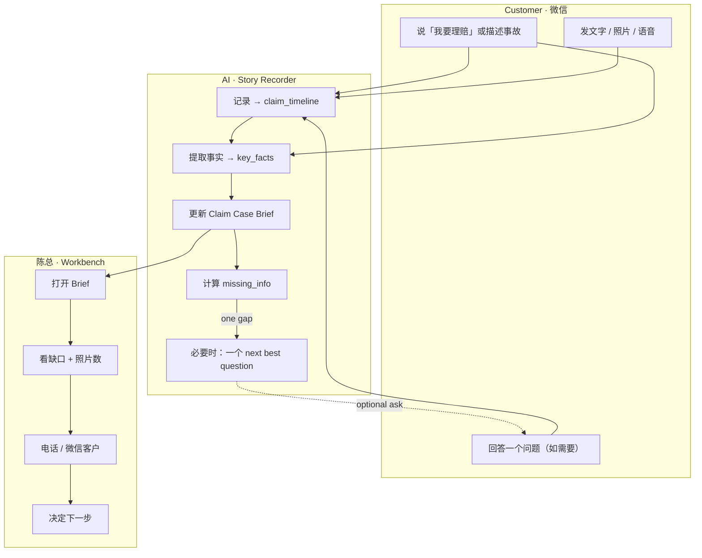

# P19H-3e-R2 — Claim Story Recorder Smooth UX Recon

**Date:** 2026-07-08  
**Branch:** `sprint/p16-trust-layer`  
**Type:** UX / workflow / implementation strategy recon — **no production code, no deploy, no schema migration**  
**Prerequisite:** P19H-3e-R1 best practice recon · P19H-3e category strategy · P19H-3d WeCom image binding deployed · P19H-3c-3 Evidence Checklist  
**Related:** `p19h3e_r1_claim_story_recorder_best_practice_recon.md` · `p19h3e_claim_case_builder_category_strategy_recon.md` · `p19h3d_r1_claim_human_simulation_workflow_simplification_recon.md` · `p19h3c_r4_claim_workflow_business_value_alignment_recon.md` · `evidence/p19h3d_wecom_claim_image_binding_mvp_2026_07_09.md`

---

## 1. Executive Summary

P19H-3e-R1 defined the right **category** (Claim Story Recorder + Case Builder) and the right **data backbone** (`claim_timeline[]` + `claim_case_brief`). This recon answers a different question: **is the experience smooth enough to feel like Walmart Spark Driver — one clear action, complexity hidden, Chen knows the next step in 10 seconds?**

**Answer: Not yet.** The strategic direction is correct; the **deployed UX still reads like a photo-upload product with three systems.**

| Question | Answer |
|----------|--------|
| Is current direction smooth enough? | **Partially** — category pivot is right; shipped UX lags |
| Biggest friction now? | **Chen opens Workbench and sees slot checklist, not accident story** |
| Smoothest customer path? | 微信照常说事故 → 发图/语音 → 最多一个问题 → 陈总会联系 |
| Smoothest Chen path? | 打开 Brief → 10 秒读懂 → 复制建议问题 → 回电 |
| P19H-3e-1 must include? | Timeline + Brief + Workbench hero + story copy + checklist collapse |
| Defer? | Auto-send gap question, slot assign, ASR, LLM brief, full timeline UI |
| Verdict | **GO** on P19H-3e-1 · **HOLD** on slot assignment / auto-ask · **STOP** — no code in this recon |

**One-line thesis:**

> 丝滑 = 客户在微信里只做一件事（说/发），陈总打开只看一件事（Brief），系统在背后做所有整理 — 不让任何人做 clerical work。

---

## 2. What Smooth Means

### 2.1 Spark Driver benchmark (translated)

Walmart Spark Driver hides dispatch routing, batching, and compliance behind **one task card** with **one primary button**. The driver never sees「方式一/二/三」or backend state machines.

Our equivalent:

| Spark Driver | Claim Story Recorder |
|--------------|---------------------|
| One active delivery | One active accident case |
| «Navigate» / «Confirm pickup» | «继续说事故» / send photo — no menu |
| Status at a glance | Chen: Brief answers 7 questions in 10 sec |
| Backend invisible | Timeline, slots, identity tiers — all behind brief |
| No duplicate taps | No「再传一次」after WeChat photo received |

### 2.2 For customer — what they should see

| Moment | Smooth experience |
|--------|-------------------|
| Opens WeChat after crash | One calm voice: **陈总办公室值班助手** |
| Says「我要理赔」 | Safety check → one story prompt — **no H5 button yet** |
| Sends accident story | Warm ack + facts echoed — **not a 4-line photo lecture** |
| Sends photo |「收到，已记到这份记录里」— **no button nag** |
| Sends voice |「语音已收到，陈总会听」— stub OK |
| Missing one fact | **One** short question — never a bullet checklist |
| Enough info | **Silence** — no more prompts until Chen acts |
| Needs human | **联系陈总** — escape hatch, not equal CTA to upload |

**What customer should never need to understand:**

- H5 vs WeChat as「两个系统」
- Evidence slots (`customer_damage_photo`, etc.)
- Claim phases, workflow IDs, identity tiers
- Whether photos are「classified」
- Coverage, fault, or whether claim is「filed」

**How many questions AI asks at once:** **Exactly one.** If two gaps are both critical (injury + location), prefer injury; never list five missing fields.

**When AI should stay quiet:**

- After basics complete + customer sent photos — ack only, no re-push H5
- When customer is actively sending a story burst (multiple messages in 2 min)
- When injury flagged → manual path; no photo nag
- When customer said「不知道」for a field — record unknown, don't re-ask same turn
- After customer tapped **联系陈总** — human handoff, stop interrogation

### 2.3 For Chen — what he should see in first 10 seconds

```text
李女士 · 昨晚 Costco 停车场被追尾
受伤：待确认 · 照片：3 张微信 · 资料完整度：中

还缺：对方车牌、受伤情况
建议问：「请问有人受伤吗？」
```

**What Chen should NOT need to do:**

- Scroll WeChat to reconstruct the story
- Classify photos into 3 slots before understanding the case
- Mentally merge phone call + WeChat (until phone summary ships)
- Parse slot ○/✅ to infer「what happened」
- Re-type customer messages into notes
- Decide which of 3 upload channels customer used

**What should be one-click / glanceable:**

- **事故摘要** — 2–4 sentences, above the fold
- **建议问客户** — copy-ready string
- **照片数 + 缩略图** — not slot taxonomy
- **还缺什么** — 3 bullets max
- **受伤/紧急** flag — if manual_handle

### 2.4 For system — what complexity is hidden

| Hidden from customer | Hidden from Chen |
|---------------------|------------------|
| `claim_timeline[]` append + dedup | Identity resolver tiers A/B/C |
| `claim_case_brief` recompute | Slot assignment state |
| `msg_id` idempotency | Phase machine (`accident_basics_complete`, etc.) |
| Media bind to `case_id` | H5 flow state / skip reasons |
| Gap priority engine | `unassigned_wecom_photos` plumbing |
| Forbidden phrase guardrails | JSONB field names |

**What should happen automatically:**

1. Every inbound text/photo/voice → timeline event (<1s persist)
2. Facts extracted from basics + message text → `key_facts`
3. Brief recomputed on every new event
4. `missing_info[]` + `next_best_question` updated
5. Photo count in brief — **not** slot classification
6. Duplicate `msg_id` → no duplicate event, same ack
7. WeChat photos bind to active case (tier A) without customer action

---

## 3. Current Friction Table

Evaluated against **deployed code** (`reply.py`, `claim_basics.py`, `media_intake.py`, `claim_workbench_display.py`, `DocumentIntakeInboxPage.tsx`, `ClaimEvidenceChecklist.tsx`).

| Friction | Who feels it | Why it hurts | Severity | Fix |
|----------|--------------|--------------|----------|-----|
| **H5 button confusion** | Customer | C1 card pushes **上传事故照片** as primary view button + 3 guidance lines about H5 vs WeChat; feels like「两个系统」 | **High** | Story-centric C1: WeChat first; H5 demoted to「补充事故资料」secondary; bundle in 3e-1 |
| **Evidence checklist as hero** | Chen | Workbench drawer: `ClaimAccidentBasicsCard` → `ClaimEvidenceChecklist` — slots ○/✅ before story | **Critical** | `ClaimCaseBriefPanel` hero above checklist; collapse checklist by default |
| **待分类微信照片** | Chen | Checklist shows「待陈总人工归类」while slots show ○ — looks broken; pushes clerical work | **High** | Brief shows「3 张微信照片」+ thumbnails; hide 待分类 as hero; defer slot assign |
| **AI asks too many fields** | Customer | Start card asks time + location + description in one block; C1 adds 3 photo prep items | **Medium** | Progressive: safety → one story ask → one gap question only |
| **Customer repeats info** | Customer | Phone-first invisible; basics prompt after phone call feels redundant | **Medium** | Timeline + brief merge; phone summary in 3e-2 / P19H-3c-R5 |
| **Chen still scrolls WeChat** | Chen | No `claim_timeline` or narrative brief — only 3 basics fields + slot view | **Critical** | P19H-3e-1 timeline + `build_claim_case_brief()` |
| **Phone story invisible** | Chen | Phone calls not on case; Chen mentally merges | **High** | Defer P19H-3c-R5 phone summary — not 3e-1 blocker |
| **Voice not summarized** | Chen | Voice messages not on timeline; no stub event | **Medium** | `customer_voice_stub` in 3e-1; ASR defer |
| **Multiple active claims** | Customer + Chen | Tier B broker_confirm — customer must disambiguate | **Medium** | OK for MVP; shorten copy; brief shows conflict flag |
| **No single Case Brief yet** | Chen | R4 pain #1 (scroll WeChat) unsolved despite checklist shipping | **Critical** | P19H-3e-1 core deliverable |
| **Too much internal jargon** | Chen (mirrors to customer) |「Evidence Checklist」「待分类」「slot」in Workbench UI | **Medium** | Chinese labels: 事故摘要 / 还缺什么 / 已收照片; collapse English |
| **H5 re-push after WeChat photos** | Customer | `_CLAIM_C1_PHOTO_GUIDANCE_LINES` still recommends button; ack may say「或点按钮」; R7 not wired | **High** | Suppress H5 nag when `unassigned_wecom_photos.count > 0`; trim ack copy |
| **Checklist ○ while photos exist** | Chen | WeChat photos `slot_assignment=unassigned` → checklist shows missing despite attachments on case | **High** | Brief: photo count decoupled from slots; checklist collapsed |
| **C1 length (4+ lines)** | Customer | Skimmers see button, miss「发微信也可以」 | **Medium** | Max 2 lines before prep list; story ack not photo lecture |
| **AI vs 陈总 role blur** | Customer | Bot collects but every line says 陈总会… | **Low–Med** | Frame: **我先帮陈总记录** — consistent scribe voice |
| **Photo-first tier C** | Customer | Photo before「我要理赔」→ ack asks to start claim; can feel ignored | **Medium** | Warm photo ack first; one short ask; no lane menu |
| **No timeline in Workbench** | Chen | Cannot see message chronology without WeChat | **High** | 3e-1: last 3 events in brief; full timeline UI in 3e-2 |
| **Broker next action = slot-centric** | Chen | `_build_broker_next_action()` says「补充自己车损照片」not「确认对方车牌」 | **Medium** | `next_best_question` from story gaps, not slot keys |

### Severity summary

```text
Critical (blocks smooth):  3  — no Case Brief, checklist hero, Chen scrolls WeChat
High:                     7  — H5 confusion, 待分类, photo/slot mismatch, no timeline, etc.
Medium:                   8  — multi-field asks, phone invisible, voice, jargon, etc.
```

**Root cause:** We built the **photo intake spine** (H5 slots, checklist, 待分类) before the **story recorder spine** (timeline, brief). Smooth UX requires flipping the Workbench hero and customer narrative simultaneously in P19H-3e-1.

---

## 4. Smooth Target Workflow

Three lanes only. No channel-specific subprocesses exposed to users.



### Lane detail

#### Customer lane (3 actions max)

| Step | Action | System response |
|------|--------|-----------------|
| 1 | Says accident naturally (or「我要理赔」) | Safety → story prompt |
| 2 | Sends text / photos / voice | Record + warm ack — **no checklist** |
| 3 | Answers **one** question if asked | Record + stay quiet if enough |

**Optional:** H5 **补充事故资料** — only after basics, only if customer wants structure. Never hero at scene.

#### AI lane (5 behaviors)

| # | Behavior | Rule |
|---|----------|------|
| 1 | Record everything to timeline | Append before analyze; idempotent `msg_id` |
| 2 | Extract facts | From basics + text keywords; deterministic in 3e-1 |
| 3 | Update brief | Recompute on every timeline/fact/attachment change |
| 4 | Ask one next best question | Priority: injury > time > location > other party > photos |
| 5 | Avoid repeating questions | Check `known_facts` + timeline before ask |

**AI never:** judges fault/coverage, says「已报案」, shows slot jargon, sends 5-field forms.

#### Chen lane (4 steps)

| Step | Action | Time budget |
|------|--------|-------------|
| 1 | Open Workbench → Claim drawer | — |
| 2 | Read Brief (summary + gaps + next question) | **10 sec** |
| 3 | Glance photos (count + thumbnails) | **10 sec** |
| 4 | Call / WeChat with `next_best_question` | — |

Chen does **not** classify photos, scroll WeChat, or re-type story in 3e-1 MVP.

### Happy-path timing (smooth target)

```text
T+0s    Customer: 「我要理赔」
T+3s    AI: safety + story prompt (no H5)
T+30s   Customer: one message with time/place/what
T+33s   AI: ack + facts echoed; optional one gap question
T+60s   Customer: 2 photos in WeChat
T+63s   AI: 「收到，已记录」— silence
T+5min  Chen opens Brief → understands case → calls back
```

**Customer total active time: <60 seconds** to complete first report.

---

## 5. Customer Microcopy

Tone: short · calm · **我先帮陈总记录** · no legal promise · no fault/coverage · no「已报案」· no big checklist.

### 5.1 Customer says「我要理赔」

```text
您好，我是陈总办公室的值班助手。

请先确认：您和车上的人现在都安全吗？有没有受伤？

如果安全，请用一条消息告诉我：
大概什么时候、在哪里、发生了什么事。

我会先帮您记录下来，陈总会人工确认后联系您。
这不代表已经向保险公司正式报案。
```

**No H5 button on first message.**

### 5.2 Customer sends accident story

```text
好的，已记录 ✅

时间：{accident_datetime}
地点：{accident_location}
经过：{accident_description}

您可以继续补充说明或发照片，都会记到同一份记录里。
陈总会整理确认后联系您。
```

**Not:** 4-line photo upload lecture. H5 only as trailing optional line if calm context.

### 5.3 Customer sends photo

```text
收到照片，已记到这份事故记录里 ✅
陈总会整理确认，不用重复发同一张。
您也可以继续用文字补充说明。
```

**Never after WeChat photos:**「或点下面按钮分步上传」.

### 5.4 Customer sends voice

```text
语音已收到，我先帮您记下。
陈总会听完后再联系您确认。
您也可以打字简单说一下时间和地点。
```

### 5.5 Customer already gave enough info

```text
好的，信息已记录 ✅
陈总会尽快联系您确认。
如果想到其他细节，随时发到这里就行。
```

**AI stays quiet** — no gap question, no H5 push, no prep list.

### 5.6 AI needs one missing fact

```text
好的，已记录。

请问{single_question}？
```

Examples (pick **one** only):

- `事故大概是什么时候？`
- `事故在哪里发生的？`
- `请问有人受伤吗？`
- `对方车牌号您看到了吗？`

### 5.7 Multiple claim ambiguity

```text
您有不止一起进行中的事故记录。
请回复要补充哪一起，或回复「新事故」开始新的记录。
陈总会帮您确认。
```

### 5.8 Chen handoff

```text
好的，您可以点下面「联系陈总」，或直接拨打陈总电话。
紧急情况请先拨打 911。
```

---

## 6. Workbench Smooth Layout

### 6.1 Question: what does Chen need above the fold?

**Answer:** The accident **story** and **callback agenda** — not photo slot status.

| Priority | Field | Why above fold |
|----------|-------|----------------|
| P0 | **事故摘要** (narrative) | Answers「发生了什么」 |
| P0 | **Customer name** | Who to call |
| P0 | **受伤情况** | Safety / urgency |
| P1 | **Key facts row** (时间/地点/警方) | Glanceable facts |
| P1 | **还缺什么** (3 bullets) | Callback agenda |
| P1 | **建议问客户** | Copy-ready question |
| P2 | **照片：N 张** | Evidence without slots |
| P2 | **资料完整度** | Confidence badge |
| P3 | **最近时间线** (last 3) | Provenance preview |

**Not above fold:** slot checklist, 待分类, raw JSON, Accident Basics duplicate card, H5 flow state.

### 6.2 Exact section order and labels

```text
┌─────────────────────────────────────────────────────────┐
│ ⚠️ 紧急提醒 [仅 injury / manual_handle / 联系陈总]        │
├─────────────────────────────────────────────────────────┤
│ 事故摘要                                    [刷新]       │
│ ─────────────────────────────────────────────────────── │
│ 李女士 · 昨晚 Costco 停车场被追尾，后保险杠受损。          │
│ 已收 3 张微信照片。对方车牌和受伤情况尚未确认。            │
│                                                         │
│ 时间：昨晚7点    地点：Costco 停车场                      │
│ 受伤：待确认      警方：待确认                            │
│ 照片：3 张（微信）  资料完整度：中                        │
├─────────────────────────────────────────────────────────┤
│ 还缺什么                                                │
│ · 对方车牌 / 保险信息                                   │
│ · 是否有人受伤                                          │
├─────────────────────────────────────────────────────────┤
│ 建议问客户                                              │
│ 「请问有人受伤吗？」                                      │
├─────────────────────────────────────────────────────────┤
│ 最近记录                               [展开全部 →]      │
│ 19:02  客户 · 我要理赔                                  │
│ 19:03  客户 · 昨晚7点 Costco 被追尾                     │
│ 19:05  客户 · 照片 ×3                                   │
├─────────────────────────────────────────────────────────┤
│ 已收照片                                        3 张    │
│ [thumb] [thumb] [thumb]   微信 · 未分类                 │
├─────────────────────────────────────────────────────────┤
│ ▶ 事故基本信息                              [折叠]      │
├─────────────────────────────────────────────────────────┤
│ ▶ 照片清单（H5 分步状态）                    [折叠]      │
│     ✅ 自己车损 · ○ 对方车辆 · ○ 现场                    │
└─────────────────────────────────────────────────────────┘
```

### 6.3 Label mapping (Chinese, broker-facing)

| Data field | Workbench label |
|------------|-----------------|
| `summary` | 事故摘要 |
| `customer.display_name` | (inline in summary) |
| `key_facts.accident_datetime` | 时间 |
| `key_facts.accident_location` | 地点 |
| `key_facts.injury_status` | 受伤 |
| `key_facts.police_involved` | 警方 |
| `evidence_received.photo_count` | 照片 |
| `confidence` | 资料完整度 |
| `missing_info[]` | 还缺什么 |
| `next_best_question` | 建议问客户 |
| `claim_timeline` (last 3) | 最近记录 |
| `claim_evidence_summary` | 照片清单（折叠） |
| `claim_summary` | 事故基本信息（折叠） |

### 6.4 Migration from today

**Today (`DocumentIntakeInboxPage.tsx`):**

```text
1. Claim · Accident Basics     ← English labels, 3 fields only
2. 理赔照片 / Evidence Checklist  ← HERO, slots + 待分类
3. Case attachments
```

**After P19H-3e-1:**

```text
1. 事故摘要 (ClaimCaseBriefPanel)     ← NEW HERO
2. 还缺什么 + 建议问客户
3. 最近记录 (collapsed)
4. 已收照片 (thumbnails)
5. 事故基本信息 (collapsed)
6. 照片清单 (collapsed)
```

---

## 7. P19H-3e-1 Refined Scope

Based on smooth UX analysis, refined verdicts for upcoming sprint items:

| # | Item | Verdict | Rationale |
|---|------|---------|-----------|
| 1 | `claim_timeline[]` | **must include** | Story backbone; fixes Chen scroll |
| 2 | Text/image/voice timeline events | **must include** | Every inbound = event |
| 3 | `build_claim_case_brief()` | **must include** | Chen's 10-second view |
| 4 | Deterministic brief summary | **must include** | Ship without LLM dependency |
| 5 | `key_facts` + `missing_info` | **must include** | Callback agenda |
| 6 | `next_best_question` | **must include** | One-click Chen action |
| 7 | Workbench hero panel (`ClaimCaseBriefPanel`) | **must include** | Replaces checklist as hero |
| 8 | Story-centric copy patch | **must include** | Customer smoothness; bundle with deploy |
| 9 | Evidence checklist **collapsed by default** | **must include** | Demote slot-centric UX |
| 10 | Photo **count** in brief (not classification) | **must include** | Decouple evidence from slots |
| 11 | Tests (timeline dedup, brief shape, UI smoke) | **must include** | Regression safety |
| 12 | `basics_complete` timeline event | **must include** | Story milestone |
| 13 | Voice stub event | **must include** | Voice visible on timeline |
| 14 | Timeline UI (full expandable list) | **defer** | 3e-1: last 3 in brief; 3e-2 full UI |
| 15 | LLM-enriched narrative | **defer** | Deterministic OK for pilot |
| 16 | Customer proactive gap question **auto-send** | **defer** | Chen-facing first; reduces over-ask risk |
| 17 | R7 H5 nag suppression | **nice to include** | High smoothness impact; wire if ≤1 day |
| 18 | Phone summary timeline | **defer** | P19H-3c-R5 |
| 19 | Broker note timeline | **defer** | 3e-2 |
| 20 | Broker Manual Slot Assignment | **defer** | Adds clerical work |
| 21 | H5 rename to「补充事故资料」 | **nice to include** | Low effort if touching copy |
| 22 | OCR / ASR / damage AI | **never** | Category guardrail |
| 23 | Fault / coverage / carrier filing | **never** | Broker domain |
| 24 | Schema migration | **never** | JSONB only |
| 25 | AI photo classification | **never** | Wrong slot worse than unassigned |
| 26 | Auto-send gap question without Chen review | **never** | Over-ask risk at pilot |

### 3e-1 smoothness acceptance addendum

Beyond R1 AC-1–AC-15, add UX-specific gates:

| # | Criterion | Verification |
|---|-----------|--------------|
| UX-1 | Customer first reply has **no H5 button** | Copy test |
| UX-2 | WeChat photo ack has **no**「点按钮」language | Copy test |
| UX-3 | Brief panel renders **above** Evidence Checklist | UI test |
| UX-4 | Checklist **collapsed** on claim drawer open | UI test |
| UX-5 | Chen can answer「what happened」from brief alone | Human sim |
| UX-6 | `next_best_question` is **one** primary question | Assert |
| UX-7 | Photo count shown without requiring slot assignment | API + UI test |

---

## 8. Success Criteria

### 8.1 Customer success

| # | Criterion | Measure |
|---|-----------|---------|
| CS-1 | Complete first report in **<60 seconds** | Sim: 我要理赔 → story → done |
| CS-2 | Never sees **more than one question** at a time | Copy audit |
| CS-3 | Never has to **upload twice** (same photo) | Idempotency + no H5 re-push |
| CS-4 | Never sees slot/checklist jargon | Copy audit |
| CS-5 | Feels like **one conversation**, not three systems | Human sim A–E |

### 8.2 Chen success

| # | Criterion | Measure |
|---|-----------|---------|
| CH-1 | Understand case in **10 seconds** | Brief summary readable without scroll |
| CH-2 | Does **not** need to scroll WeChat | Timeline + brief sufficient |
| CH-3 | Knows **next question immediately** | `next_best_question` visible above fold |
| CH-4 | Does **not** need to classify photos to act | Photo count + thumbnails enough |
| CH-5 | No false「missing」when photos on case | Brief decoupled from slot ○ |

### 8.3 System success

| # | Criterion | Measure |
|---|-----------|---------|
| SY-1 | All messages captured in timeline | Unit + scenario tests |
| SY-2 | Brief updates on every new event | `brief_updated_at` monotonic |
| SY-3 | No duplicate timeline events | `msg_id` dedup test |
| SY-4 | No forbidden language | Guardrail test |
| SY-5 | Add Vehicle lane unaffected | Lane isolation test |

### 8.4 Smoothness scorecard (pilot demo)

```text
Before 3e-1:  Customer smoothness 4/10 · Chen smoothness 3/10
After  3e-1:  Customer smoothness 7/10 · Chen smoothness 8/10
After  3e-2:  Customer smoothness 8/10 · Chen smoothness 9/10
```

Gap to Spark Driver 10/10: phone summary, auto-gap-ask with guardrails, full timeline search — all post-3e-1.

---

## 9. Final Recommendation

### 9.1 Is current direction smooth enough?

**No — direction is right, execution is not yet smooth.**

- ✅ Category (Story Recorder + Case Builder) — correct
- ✅ Data model (`claim_timeline` + `claim_case_brief`) — correct
- ❌ Deployed customer copy — still photo-centric (C1 H5 hero)
- ❌ Deployed Workbench — checklist hero, no brief
- ❌ Chen pain #1 (scroll WeChat) — **unsolved in production**

### 9.2 Biggest friction now

**Chen opens Workbench and sees Evidence Checklist + 待分类微信照片 instead of the accident story.** Checklist shows ○ missing while WeChat photos sit unassigned — looks broken and forces clerical mental model before comprehension.

### 9.3 Smoothest customer path

```text
微信说事故 → 发图/语音（随意） → 最多回答一个问题 → 等陈总联系
```

No H5 hero. No checklist. No repeat upload. Under 60 seconds active effort.

### 9.4 Smoothest Chen path

```text
打开 Workbench → 读事故摘要（10秒） → 看还缺什么 + 建议问客户 → 回电
```

No WeChat scroll. No slot assignment. No re-typing.

### 9.5 What P19H-3e-1 must include

```text
claim_timeline + claim_case_brief + Workbench hero panel
+ story-centric copy + checklist collapse + photo count
+ next_best_question (deterministic) + tests
```

**Not in 3e-1:** auto-send gap question, slot assign, ASR, LLM brief.

### 9.6 What to defer

| Defer | Sprint |
|-------|--------|
| Full timeline UI | 3e-2 |
| LLM narrative polish | 3e-2 |
| Customer auto gap question | 3e-2 |
| Phone summary | P19H-3c-R5 |
| Broker slot assignment | 3d-2 (low priority) |
| R7 H5 nag suppression | 3e-1 if time, else 3e-2 |

### 9.7 GO / HOLD / STOP

| Verdict | Scope |
|---------|-------|
| **GO** | P19H-3e-1 as defined — timeline + brief + Workbench hero + story copy |
| **HOLD** | Slot assignment, phone summary, auto-gap-ask, LLM brief |
| **STOP** | OCR, ASR required path, damage AI, carrier filing, more photo-centric sprints |

**Strategic alignment:** This recon **does not change** P19H-3e-R1 scope — it **sharpens UX acceptance criteria** and confirms the sprint is the right next move to achieve Spark Driver-level smoothness.

---

## Appendix A — Code Evidence (current friction)

| File | Current behavior | Smooth gap |
|------|------------------|------------|
| `reply.py` | `_CLAIM_C1_PHOTO_GUIDANCE_LINES` — H5 recommended first | Story-first copy |
| `reply.py` | `_CLAIM_C1_H5_BUTTON = "上传事故照片"` | Demote to 补充事故资料 |
| `DocumentIntakeInboxPage.tsx` | `ClaimAccidentBasicsCard` → `ClaimEvidenceChecklist` | Brief panel first |
| `ClaimEvidenceChecklist.tsx` | Title「理赔照片 / Evidence Checklist」hero | Collapse; Chinese only |
| `claim_workbench_display.py` | `build_claim_evidence_summary()` only — no brief | Add `build_claim_case_brief()` |
| `claim_workbench_display.py` | `unassigned_wecom_photos.broker_next_action` = 待归类 | Photo count in brief |
| `claim_basics.py` | Text → `known_facts` only — no timeline | Wire `append_claim_timeline_event` |
| `media_intake.py` | Image bind — no timeline event | Wire after bind |

---

## Appendix B — Expected Final Answers

| # | Question | Answer |
|---|----------|--------|
| 1 | Is current direction smooth enough? | **No** — right category, UX not shipped |
| 2 | Biggest friction now? | **Checklist hero + no Case Brief → Chen scrolls WeChat** |
| 3 | Smoothest customer path? | 微信说事故 → 发图 → 一个问题 → 等陈总 |
| 4 | Smoothest Chen path? | Brief 10秒 → 建议问题 → 回电 |
| 5 | P19H-3e-1 must include? | Timeline + Brief + hero panel + copy + collapse + photo count |
| 6 | Defer? | Auto-ask, slot assign, ASR, LLM, full timeline UI |
| 7 | GO/HOLD/STOP? | **GO** 3e-1 · **HOLD** slot/phone/auto-ask · **STOP** adjuster scope |

---

*P19H-3e-R2 complete. UX recon only. No production code. No deploy.*
