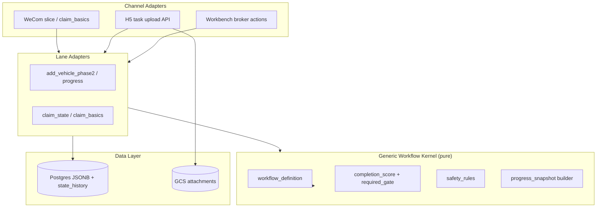
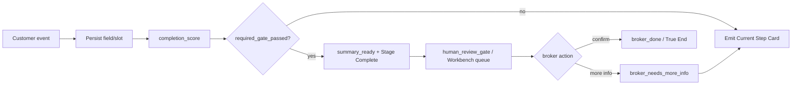

# P19I-0 — Generic Workflow Kernel Recon

**Date:** 2026-07-07  
**Type:** Architecture recon — **documentation only**  
**Audience:** Andy, product, engineering, future Cursor agents  
**Prerequisite:** Add Vehicle lane live ✅ · P19H-0 Claim recon ✅ · P19H-1 `claim_state.py` foundation ✅ · P19H-2 Claim WeCom Start + Basics in progress  
**Related:** `p19e_workflow_case_state_machine_event_pipeline_mermaid.md` · `p19e1_add_vehicle_case_state_machine_event_pipeline.md` · `p19h0_claim_case_builder_state_machine_recon.md` · `p19e0_spark_style_binary_step_model_recon.md` · `p19f0_workbench_performance_scale_survey.md` · `p19d35_guided_workflow_best_practice_recon.md`

**This loop:** No code. No deploy. No schema migration. No cloud config. No workflow framework migration. Recon doc only.

---

## 1. Recommendation

| Question | Answer |
|----------|--------|
| **现在是否换框架？** | **No** — Python helpers + Postgres + WeCom/H5/Workbench 足够支撑 paid pilot 和 Claim MVP |
| **现在是否抽象 kernel？** | **Yes, lightly** — 提取共享 *patterns* 和 *pure helpers*，不引入 workflow engine |
| **如果抽象，第一步最小怎么做？** | P19I-1：一个 `workflow_definition` 数据模型 + 通用 `completion_score` / `required_gate` 引擎 + 共享 broker gate 常量；lane 仍各自 `*_state.py` |
| **P19H-2 是否应该继续？** | **Yes** — 用 Claim lane 验证「复制」路径；kernel 抽象与 lane 实现并行，不阻塞 |
| **P19I-1 最小代码实现应该是什么？** | 见 §11 — 约 200–400 行纯 Python + 测试，零 routing / 零 schema |

**One-line recommendation:**

> **Keep the current stack. Extract a thin Generic Workflow Kernel as shared *semantics* (phases, slots, gates, completion), not as a new runtime. Ship Claim on the same spine Add Vehicle proved. Defer Temporal / Step Functions until you need durable timers, compensation, or >5 lanes with ops team pain.**

---

## 2. Current Architecture Assessment

### 2.1 What exists today (two lanes, one spine)

Both Add Vehicle and Claim already share the same architectural spine documented in P19E and P19H:

```text
Channel event (WeCom / H5 / Workbench)
  → normalize
  → identify user / find active case (Postgres read facade)
  → derive phase (lane-specific pure helper)
  → route (slice.py + lane modules)
  → validate + persist (case_store / service_record_repository)
  → emit reply card (reply.py + lane builders)
  → Workbench reads same Postgres row
```

| Layer | Add Vehicle | Claim | Shared? |
|-------|-----------|-------|---------|
| **Source of truth** | Cloud SQL Postgres `service_records.extra` JSONB | Same | ✅ |
| **Read facade** | `get_case_for_read` / `list_all_cases_for_read` | Same | ✅ |
| **Lane identity** | `service_lane = add_car` | `service_lane = claim` | Pattern shared |
| **Phase field** | `add_vehicle_phase` | `claim_phase` | Naming differs; role same |
| **Cross-lane broker dim** | `guided_workflow_state` | `guided_workflow_state` | ✅ |
| **Collected facts** | `collected_fields` + `known_facts` | Same | ✅ |
| **Attachments** | `case_attachments[]` + `h5_photo_flow_state` | `case_attachments[]` + `claim_attachment_slots` | Pattern shared |
| **Phase derivation** | `add_vehicle_phase2.py`, `add_vehicle_progress.py` | `claim_state.py` | Parallel modules |
| **Completion predicates** | `phase2_text_is_complete`, `h5_photo_flow_is_complete` | `is_claim_summary_ready`, `is_accident_basics_complete`, … | Same idea |
| **Broker gate** | `ready_for_broker_review` → Workbench queue | Same target state | ✅ |
| **True end** | `broker_confirmed_at` / `phase_3_broker_done` | `broker_done` | Same semantics |
| **Safety guardrails** | Implicit (no auto policy change copy) | Explicit `CLAIM_FORBIDDEN_AUTOMATION_CLAIMS` | Claim ahead; should generalize |
| **Event pipeline entry** | `slice.py` routing blocks | `slice.py` + `claim_basics.py` | Same router |
| **Audit** | `state_history` table (PG) + structured logs | Same | ✅ |
| **Dedicated event log table** | No | No | Deferred per P19F-0 |

### 2.2 Is current Python state machine + event pipeline enough for paid pilot?

**Yes — with the caveats already known and mitigated.**

| Criterion | Assessment |
|-----------|------------|
| **Single broker, ~1,000 users, 50–100 cases/day** | Postgres + JSONB + `state_history` sufficient (P19F-0) |
| **Add Vehicle SOW scope** | Full loop live: Start Card → H5 → Phase 2 text → Progress Card → Workbench |
| **Claim extension** | Foundation (`claim_state.py`, 25 tests) + P19H-2 routing started — same spine |
| **Resume / progress inquiry** | Progress Card pattern proven (Add Vehicle); Claim mirrors in recon |
| **Broker human gate** | Workbench queue + confirm / request-more already works for Add Vehicle |
| **Production read path** | Postgres facade hardened (P19E-1.5); legacy JSON-only path forbidden |
| **Known risks** | Router complexity in `slice.py`; lane duplication — address via kernel helpers, not framework swap |

**Verdict:** Paid pilot does **not** need Temporal, Step Functions, Camunda, or Prefect. The current model is the right *weight class* for a single-office insurance broker assistant with 2 guided lanes.

### 2.3 Where complexity actually lives (not in "missing framework")

```text
┌─────────────────────────────────────────────────────────────┐
│  slice.py — ingress routing priority, intent disambiguation │  ← grows with each lane
├─────────────────────────────────────────────────────────────┤
│  Lane modules — phase predicates, extractors, card copy   │  ← should stay lane-specific
├─────────────────────────────────────────────────────────────┤
│  reply.py — card builders (WeCom msgmenu templates)       │  ← channel-specific
├─────────────────────────────────────────────────────────────┤
│  case_store / PG facade — persist + hydrate               │  ← already shared
└─────────────────────────────────────────────────────────────┘
```

The risk Andy senses — "each lane writes its own state machine" — is **real but manageable** at 2–3 lanes. The duplication is in **predicates and copy**, not in Postgres or channel plumbing. A thin kernel targets the predicate layer, not the router rewrite.

---

## 3. Best-Practice Comparison

### 3.1 Three options

| Dimension | **A. Current** (Python + Postgres + channels) | **B. Mid-term** (Generic Workflow Kernel) | **C. Heavy** (Temporal / Step Functions / Camunda / Prefect) |
|-----------|-----------------------------------------------|---------------------------------------------|----------------------------------------------------------------|
| **Runtime** | FastAPI handlers, synchronous event → state update | Same runtime; shared definition objects | Separate orchestrator service / workers |
| **State storage** | Postgres JSONB + `guided_workflow_state` + lane phase field | Same + optional `workflow_definition_id` in JSONB | Orchestrator history + app DB |
| **Human tasks** | Workbench queue (broker opens case drawer) | Explicit `human_review_gate` in definition | Native activity / task APIs |
| **Timers / reminders** | Manual / future cron | Cron or PG `next_contact_by` | Built-in durable timers |
| **Retry / compensation** | Re-send card; broker request-more | Same + idempotent event handlers | Saga / compensation workflows |
| **Observability** | Logs + `state_history` + TAP JSONL | + lightweight `evidence_events` in JSONB | Full workflow trace UI |
| **Team ops burden** | Low — one codebase | Low–medium | High — cluster, workers, versioning |
| **Time to ship Claim** | Weeks (P19H-2..6) | +1 week for kernel extraction | +1–2 months minimum |
| **Copy to industry #2** | Copy lane module + tweak | New `workflow_definition` YAML/JSON | New workflow registration + workers |
| **Paid pilot fit** | ✅ Optimal | ✅ Optimal | ❌ Overkill |

### 3.2 When to introduce heavy orchestration

| Trigger | Temporal / Step Functions | Camunda | Prefect |
|---------|---------------------------|---------|---------|
| **Multi-day waits** (e.g. "remind customer in 48h if no photos") | ✅ Strong fit | ✅ | ⚠️ Batch-oriented |
| **Saga / rollback** across carrier APIs | ✅ | ✅ | ❌ |
| **>10 lanes, multiple engineers** | ✅ | ✅ (BPMN visibility) | ⚠️ |
| **Strict audit for regulated carrier filing** | ✅ | ✅ | ❌ |
| **Current pilot: 2 lanes, human-in-loop, minutes–hours** | ❌ | ❌ | ❌ |

**Prefect** is the wrong shape — it's data/ML pipeline orchestration, not customer conversation state.

**AWS Step Functions** adds AWS lock-in and splits state between SFN and Postgres; you'd still need Postgres for Workbench either way.

**Camunda** shines when non-engineers edit BPMN; broker pilot has no BPMN editor requirement.

**Temporal** is the best future candidate **if** you need durable timers + long-running claim follow-ups + OCR enrichment chains — but not before Claim MVP ships on the current spine.

### 3.3 Industry pattern alignment

P19D-3.5 and P19E-0 established the right product model:

- **Binary steps** (done / not done)
- **Stage Complete ≠ terminal**
- **One current action** per customer message
- **Chat = router + text; H5 = photo shell; Workbench = human gate**

This maps to a **lightweight state machine in application code**, not a BPM engine. Spark Driver, 微保, 平安好车主 all use in-app wizards with push/notify — not Temporal.

---

## 4. Generic Workflow Kernel Proposal

### 4.1 Can Add Vehicle and Claim abstract into one kernel?

**Yes — as a semantic layer, not a replacement runtime.**

Both lanes are instances of the same **Insurance Case Builder** pattern:

```text
WorkflowInstance
  lane: add_car | claim | renewal | ...
  phases: ordered customer-facing stages
  slots: photo / document attachments with status
  fields: text / boolean facts in known_facts
  gates: required_gate → summary_ready → human_review_gate → broker_done
  channels: WeCom cards, H5 task page, Workbench actions
```

### 4.2 Kernel components (mid-term target)

```text
┌──────────────────────────────────────────────────────────────────┐
│                    Generic Workflow Kernel                        │
│  (pure Python — no I/O, no WeCom, no Postgres driver)            │
├──────────────────────────────────────────────────────────────────┤
│  workflow_definition                                              │
│    id, lane, version, display_name_zh                             │
│    phases[]                                                       │
│    required_slots[], optional_slots[]                             │
│    required_fields[], optional_fields[]                           │
│    completion_predicates (per phase + summary)                  │
│    safety_rules[]                                                 │
│    human_review_gate                                              │
│    customer_actions → card template keys                          │
├──────────────────────────────────────────────────────────────────┤
│  workflow_runtime (thin — called from slice / lane modules)       │
│    derive_phase(case, definition) → phase_id                      │
│    completion_score(case, definition) → {required, optional, %}   │
│    missing_items(case, definition) → [{field, label, kind}]       │
│    required_gate_passed(case, definition) → bool                   │
│    suggest_transition(case, definition, event_type) → patch         │
│    apply_safety_rules(copy, definition) → safe | blocked          │
├──────────────────────────────────────────────────────────────────┤
│  Lane adapters (keep separate)                                    │
│    add_vehicle_state.py  ← wraps kernel + add-car specifics       │
│    claim_state.py        ← wraps kernel + claim specifics         │
│    extractors, H5 flows, reply card copy                          │
└──────────────────────────────────────────────────────────────────┘
```

### 4.3 What should be generic?

| Generic (kernel) | Rationale |
|------------------|-----------|
| **Phase ordering model** | Both lanes: customer phases → `summary_ready` → `broker_review` → `broker_done` |
| **`guided_workflow_state` enum** | Already shared: `collecting_text_fields`, `ready_for_broker_review`, `broker_needs_more_info` |
| **Completion score** | `required_complete_count / required_total_count` — Claim already computes this in `get_claim_progress_snapshot` |
| **Required gate** | `all(required_predicates)` → enter broker queue |
| **Optional slots** | Don't block summary; show in Workbench checklist |
| **Slot status model** | `empty | received | skipped | needs_retake` — Claim formalized; Add Vehicle implicit |
| **`collected_fields` + `known_facts` contract** | Universal fact bag |
| **`case_attachments[].slot_assignment`** | Universal attachment binding |
| **Broker actions** | Confirm · Request more · Manual handle · Escalate |
| **Restart semantics** | New case; don't reuse `broker_done` case |
| **Postgres read facade invariant** | `get_case_for_read` — not lane-specific but kernel prerequisite |
| **Safety: forbidden automation claims** | Generalize from `CLAIM_FORBIDDEN_*` to lane-tagged rule sets |
| **Progress snapshot shape** | `{phase, done_labels, current_labels, missing_items, completion_score}` |

### 4.4 What must stay lane-specific?

| Lane-specific | Why |
|---------------|-----|
| **Field keys + labels** | `delivery_date` vs `accident_datetime` |
| **Extractors** | Date/ZIP/phone vs accident basics / injury Y-N |
| **H5 flow definition** | 3 photo slots vs 4 claim slots; different skip rules |
| **Intent routing markers** | 「我要加车」 vs 「我撞车了」 |
| **Safety rules content** | Claim: no fault/coverage/filed language; Add Vehicle: no auto policy change |
| **Card copy / msgmenu templates** | Broker brand, lane tone, legal disclaimers |
| **Phase count & names** | 3 customer phases vs 4 |
| **Urgent / manual_handle triggers** | Claim injury gate; Add Vehicle has none |
| **Workbench drawer sections** | Lane-specific checklist layout |
| **Composite predicates** | Claim `other_party_info` partial-OK; Add Vehicle all-or-nothing Phase 2 |

**Rule of thumb:** If it appears in **customer-facing Chinese copy** or **insurance domain logic**, keep it lane-specific. If it answers **"is this step done?"** or **"can broker review?"**, kernelize.

### 4.5 Side-by-side lane mapping

| Kernel concept | Add Vehicle | Claim |
|----------------|-------------|-------|
| `workflow_definition.id` | `add_vehicle_v1` | `claim_intake_v1` |
| Customer phases | P1 photos · P2 text · (broker) | C1 basics · C2 photos · C3 other party · C4 injury/police |
| `required_slots` | vin, registration (+ insurance optional) | damage, other_vehicle |
| `required_fields` | delivery_date, zip, phone | 8 required (see P19H-0 §6.1) |
| `completion_predicates` | `h5_photo_flow_is_complete` + `phase2_text_is_complete` | `is_accident_basics_complete` → … → `is_claim_summary_ready` |
| `human_review_gate` | `guided_workflow_state = ready_for_broker_review` | Same |
| `broker_done` | `phase_3_broker_done` / `broker_confirmed_at` | `claim_phase = broker_done` |
| Stage Complete cards | S1, S2 | C1, C2, C3 |
| True End card | B0 Done | Claim Done |

---

## 5. Event Log Recommendation

### 5.1 Should we introduce an Event Log?

**Not a dedicated event-sourcing table for paid pilot. Yes to structured append-only events in existing storage.**

| Tier | Mechanism | When |
|------|-----------|------|
| **Now (pilot)** | Structured `logger.info` with stable event names (`claim_phase_transition_v1`, `phase2_text_collected_v1`); PG `state_history` on status transitions; optional `evidence_events[]` in case JSONB | ✅ Sufficient |
| **V1.1** | Append `workflow_events[]` to case JSONB (max ~50 events/case): `{ts, event_type, phase, actor, payload}` | When debugging cross-channel races |
| **V2** | Dedicated `workflow_event_log` table | >500 cases/day, compliance audit, or OCR/async enrichment chains |

### 5.2 What exists already

- **`state_history`** — PG table; `from_status` / `to_status` / `triggered_by` / `reason`; surfaced as `case_activity` in Workbench
- **`tap.py`** — JSONL backend/event logs for demo tracing (`TAP_ENABLED`); not production audit
- **Add Vehicle** — `_log_event()` in `add_vehicle_phase2.py`
- **Case JSONB** — `case_attachments`, `h5_photo_flow_state`, `collected_fields` are implicit event outcomes

### 5.3 Recommendation

```text
DO NOW:
  - Standardize event name constants per lane (mirror analytics pattern)
  - Append workflow transition to state_history on broker confirm / phase gate pass
  - Store last N transition summaries in JSONB for fast Progress Card hydrate

DO NOT NOW:
  - Full event sourcing with replay
  - Separate Kafka / Pub/Sub bus
  - Rebuild state from event log (Postgres case row remains SoT)
```

**Principle:** Event log is for **audit and debug**, not source of truth. Postgres hydrated case JSON remains authoritative (P19E-1.5 invariant).

---

## 6. Human Task Queue Recommendation

### 6.1 Should we introduce a Human Task Queue?

**No separate task queue product. Strengthen the existing Workbench queue pattern.**

| What broker needs | Current implementation | Action |
|-------------------|------------------------|--------|
| See cases awaiting review | Workbench Document Intake queue filtered by `ready_for_broker_review` | ✅ Keep |
| Open case with checklist | Case drawer + attachments panel | ✅ Keep |
| Confirm / request more | Broker action → patch case → customer card | ✅ Keep |
| Priority / urgent | `urgent` flag on case JSONB (Claim injury) | Extend to kernel |
| Assignment to staff | Not needed — single broker (陈总) | Defer |
| SLA / due dates | `next_contact_by` exists in triage model | Wire when reminders needed |

### 6.2 Kernel abstraction for human tasks

```python
# Conceptual — not implemented in P19I-0
human_review_gate = {
    "enter_when": "required_gate_passed",
    "queue_surface": "workbench_document_intake",
    "actions": ["confirm", "request_more_info", "manual_handle", "escalate"],
    "on_confirm": "broker_done",
    "on_request_more": "broker_needs_more_info → resume_phase",
}
```

**When a real task queue is needed:** Multiple brokers, round-robin assignment, or SLA dashboards — likely post-pilot. Could be a `office_tasks` PG table without Temporal.

---

## 7. Safety Guardrail Layer Recommendation

### 7.1 Should we introduce a Policy / Safety Guardrail Layer?

**Yes — as a shared pure module, lane-configured rules. Claim already started this; Add Vehicle should inherit the pattern.**

### 7.2 Guardrail categories

| Category | Add Vehicle | Claim | Kernel action |
|----------|-------------|-------|---------------|
| **Forbidden automation claims** | Don't say policy changed | Don't say claim filed / fault / coverage | `forbidden_phrases[]` per lane |
| **Required safe copy** | "陈总会人工查看" | "这不代表已正式报案" | `safe_copy_invariants[]` |
| **Escalation triggers** | — | `anyone_injured = yes` → manual_handle | `escalation_rules[]` |
| **Intent tier routing** | add_car vs unclear | claim intake vs claim question | Router stays in slice; rules inform |
| **Field validation** | phone/date/ZIP guardrails (P19G-3.2) | description length, yes/no normalize | `field_validators` in definition |
| **Media guardrails** | Quarantine unassigned WeCom images | Lane disambiguation on unassigned media | Channel layer |

### 7.3 Layer placement

```text
Customer message
  → intent classify
  → safety_pre_check (injury keywords, fault questions)     ← NEW shared layer
  → route to lane
  → field validate
  → copy_guardrail (forbidden phrase scan on outbound)      ← generalize claim_state helper
  → emit card
```

`customer_copy_contains_forbidden_phrase()` in `claim_state.py` is the seed for a shared `workflow_safety.py`.

**Do not** run LLM "policy engine" for pilot — deterministic phrase lists + escalation flags are enough.

---

## 8. Completion Score + Required Gate Model

### 8.1 Core simplification

Replace ad-hoc "are we done?" logic with two universal concepts:

```text
Completion Score = satisfied(required_items) / total(required_items)
                 + optional_score for Workbench display only

Required Gate    = ALL required phase predicates true
                 → transition to summary_ready
                 → set guided_workflow_state = ready_for_broker_review
                 → enter Workbench queue

Human Gate       = broker_confirmed_at set
                 → broker_done (True End)
```

### 8.2 How each lane maps today

**Add Vehicle:**

| Stage | Required gate |
|-------|---------------|
| Phase 1 | All H5 slots received or skipped (insurance optional) |
| Phase 2 | `delivery_date` + `zip` + `phone` in `collected_fields` |
| Summary | Phase 1 + Phase 2 gates |
| Broker | `broker_confirmed_at` |

**Claim:**

| Stage | Required gate |
|-------|---------------|
| C1 | `is_accident_basics_complete` (3 text fields) |
| C2 | damage photo + (other vehicle photo OR plate text) |
| C3 | `is_other_party_info_complete` (≥1 artifact, partial OK) |
| C4 | injury + police booleans set |
| Summary | `is_claim_summary_ready` (8 required) |
| Broker | `broker_done` phase |

### 8.3 Progress Card simplification

One builder interface:

```text
progress = kernel.build_progress_snapshot(case, workflow_definition)

→ phase_label_zh
→ completion_score: "5/8 必填项"
→ current_action: single next ask
→ done_labels[] / pending_labels[]
→ missing_items[] with kind (photo | text | boolean)
```

Add Vehicle `derive_add_vehicle_progress()` and Claim `get_claim_progress_snapshot()` are already 80% structurally identical — prime kernel merge targets for P19I-1.

### 8.4 Required vs optional — rules

| Rule | Implementation |
|------|----------------|
| Optional never blocks `required_gate` | Claim optional fields already excluded from `is_claim_summary_ready` |
| Optional shown in Workbench | Checklist ○/✓ for broker upsell ("ask for scene photo") |
| Composite required fields | Claim `other_party_info` = OR-of-signals; kernel supports `any_of[]` predicate |
| Phase complete ≠ workflow complete | Stage Complete cards only on phase gate, not summary gate |

---

## 9. Migration Path

### 9.1 Phased plan (no big bang)

```text
Phase 0 — NOW (P19I-0)                    ← this doc
  Document kernel shape; no code

Phase 1 — P19H-2..H-3 (parallel)          ← ship Claim customer path
  Implement Claim on existing spine
  Do NOT block on kernel extraction

Phase 2 — P19I-1 (minimal kernel)         ← ~1 sprint
  workflow_types.py — dataclasses / TypedDicts
  workflow_completion.py — generic score + missing_items + gate check
  workflow_safety.py — forbidden phrases + escalation interface
  ADD_VEHICLE_DEFINITION / CLAIM_DEFINITION constants
  Refactor claim_state.py to use kernel internally (no routing change)
  Tests: parity with existing 25 claim + add_vehicle progress tests

Phase 3 — P19I-2 (router hygiene)
  Extract slice.py lane blocks into register_lane_handler()
  Shared "find active case for lane" helper
  Still no Temporal

Phase 4 — Post-pilot
  workflow_definitions/*.yaml for lane #3 (renewal / missing doc)
  workflow_events[] in JSONB
  Async OCR enrichment as post-upload activity (could be Celery / Cloud Tasks, not Temporal)

Phase 5 — Scale trigger only
  Evaluate Temporal if: multi-day reminders, carrier API sagas, dedicated ops team
```

### 9.2 How to copy to industry #2 and #3 without rewriting

| Layer | Copy strategy |
|-------|---------------|
| **Channels** | WeCom + H5 + Workbench unchanged |
| **Postgres schema** | Same `service_records`; new `service_lane` value |
| **Workflow** | New `workflow_definition` file — phases, slots, fields, safety rules |
| **Code** | New `*_state.py` adapter (~300 lines) + extractors + card copy |
| **Router** | Register lane in `slice.py` intent table |
| **Tests** | Clone foundation test pattern from `test_p19h1_*` |

**Target:** Lane #3 should be **definition + adapter + copy**, not fork of `slice.py` internals.

Example future lanes (same kernel):

- `renewal_premium` — 2 phases, no H5, text-only
- `missing_document` — 1 phase, photo optional, fast broker gate
- `cancellation_warning` — safety-heavy, manual_handle default

### 9.3 Schema strategy

Per P19H-0 and P19F-0:

- **Extend JSONB first** — `claim_phase`, `claim_attachment_slots`, `workflow_definition_id`
- **Dedicated columns** only when query patterns demand (e.g. index on `claim_phase` for queue)
- **No migration for P19I-1** — kernel is pure functions over existing JSON shape

---

## 10. What NOT to Do Now

| Do NOT | Why |
|--------|-----|
| **Migrate to Temporal / Step Functions / Camunda** | Ops cost >> benefit at 2 lanes / 1 broker |
| **Build visual workflow editor** | No BPMN users in pilot |
| **Event sourcing as SoT** | Postgres case row works; replay adds complexity |
| **Generic router rewrite before Claim ships** | P19H-2 validates copy path; don't stall demo |
| **Single mega `workflow_engine.py` with all lanes** | Becomes second `slice.py` |
| **LLM-driven state transitions** | Deterministic predicates only for pilot |
| **Dedicated task queue service** | Workbench queue sufficient |
| **Schema migration for kernel** | JSONB + pure helpers first |
| **Abstract H5 / WeCom channels into kernel** | Channels are adapters, not workflow semantics |
| **Perfectionist DRY on card copy** | Chinese copy is lane-specific by design |

---

## 11. P19I-1 Minimal Code Scope (preview)

When Andy approves implementation, P19I-1 should be:

| Deliverable | Scope |
|-------------|-------|
| `services/fiqa_api/workflow/kernel_types.py` | `WorkflowDefinition`, `PhaseSpec`, `FieldSpec`, `SlotSpec`, `SafetyRuleSet` |
| `services/fiqa_api/workflow/completion.py` | `completion_score()`, `missing_required_items()`, `required_gate_passed()`, `build_progress_snapshot()` |
| `services/fiqa_api/workflow/safety.py` | `scan_forbidden_phrases()`, `check_escalation_triggers()` |
| `services/fiqa_api/workflow/definitions/add_vehicle_v1.py` | Declarative constants |
| `services/fiqa_api/workflow/definitions/claim_v1.py` | Declarative constants |
| `tests/test_p19i1_workflow_kernel.py` | Parity tests against existing lane helpers |
| **Out of scope** | slice.py changes, deploy, schema, WeCom templates, Workbench UI |

**Acceptance:** `claim_state.get_claim_progress_snapshot(case)` and kernel `build_progress_snapshot(case, CLAIM_V1)` produce equivalent `missing_items` and `required_complete_count` for all P19H-1 fixtures.

---

## 12. P19H-2 Continuation Assessment

**Continue P19H-2.** Rationale:

1. Claim is the **second instance** that proves the architecture copies — delaying it to build kernel first inverts the learning order.
2. `claim_state.py` already follows the right pattern (pure helpers, no I/O) — P19I-1 will refactor internals, not replace P19H-2 work.
3. Chen Kui demo narrative (P19G-2 Story B) benefits from Claim path progress now.
4. Kernel extraction with only one lane (Add Vehicle) risks over-abstraction; two lanes ground the design.

**Sequencing:**

```text
P19H-2 (Claim WeCom Start + Basics + C1)  ──┐
P19I-1 (kernel pure helpers)               ──┼── parallel OK
P19H-3 (Claim H5 photos + C2)             ──┘
        ↓
P19I-2 (refactor claim_state to use kernel)
```

---

## 13. Architecture Diagrams

### 13.1 Three-layer model (recommended end state)



### 13.2 Required Gate flow



---

## STOP Report

| # | Item | Value |
|---|------|-------|
| 1 | **Document path** | `docs/p19i0_generic_workflow_kernel_recon.md` |
| 2 | **Paid pilot sufficient?** | **Yes** — current Python SM + event pipeline + Postgres |
| 3 | **Switch framework now?** | **No** |
| 4 | **Abstract kernel now?** | **Yes, lightly** — P19I-1 pure helpers after P19H-2 starts |
| 5 | **Temporal / Step Functions / Camunda** | **Defer** until durable timers, sagas, or >5 lanes |
| 6 | **Generic components** | phases, slots, completion_score, required_gate, human_review_gate, safety_rules |
| 7 | **Lane-specific** | extractors, copy, H5 flows, intent markers, composite predicates |
| 8 | **Event Log** | **Structured logs + state_history now**; JSONB `workflow_events` V1.1; dedicated table V2 |
| 9 | **Human Task Queue** | **Workbench queue suffices**; no separate queue product |
| 10 | **Safety Guardrail Layer** | **Yes** — generalize `claim_state` forbidden-phrase pattern |
| 11 | **Completion Score + Required Gate** | **Primary simplification model** for all lanes |
| 12 | **Industry copy strategy** | New `workflow_definition` + lane adapter per vertical |
| 13 | **P19H-2 continue?** | **Yes** — parallel with P19I-1 |
| 14 | **P19I-1 scope** | Pure kernel module + definitions + parity tests; no routing/schema |
| 15 | **Code changed?** | **No** |
| 16 | **Deploy happened?** | **No** |
| 17 | **STOP** | ✅ |

---

## For future Cursor agents

1. **Read this doc** before proposing Temporal, Camunda, or a "workflow platform" refactor.
2. **Postgres read facade** is part of the kernel contract — never route on JSON-only `get_case_by_id`.
3. **Kernel = pure semantics**; `slice.py` stays the ingress orchestrator until P19I-2.
4. **Two lanes ground the abstraction** — do not kernelize from Add Vehicle alone.
5. **Event log augments, never replaces** Postgres case JSON as SoT.
6. **P19H-2 is not blocked** by P19I-0/I-1 — ship Claim customer path on current spine.
7. **Paid pilot SOW** remains Add Vehicle; Claim is extension / demo upsell per P19H-0 §18.4.

**STOP**
