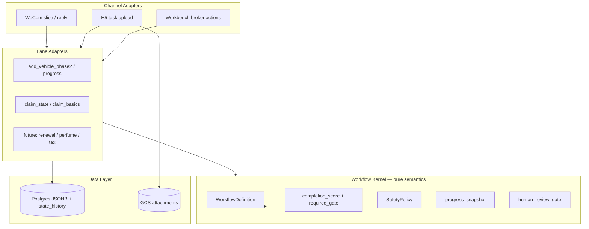
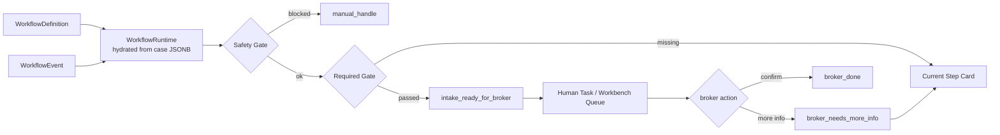
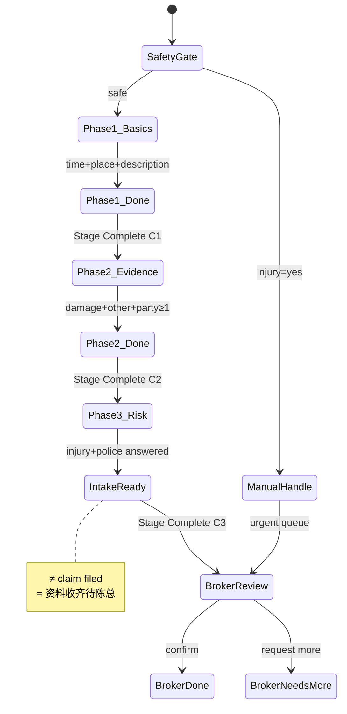
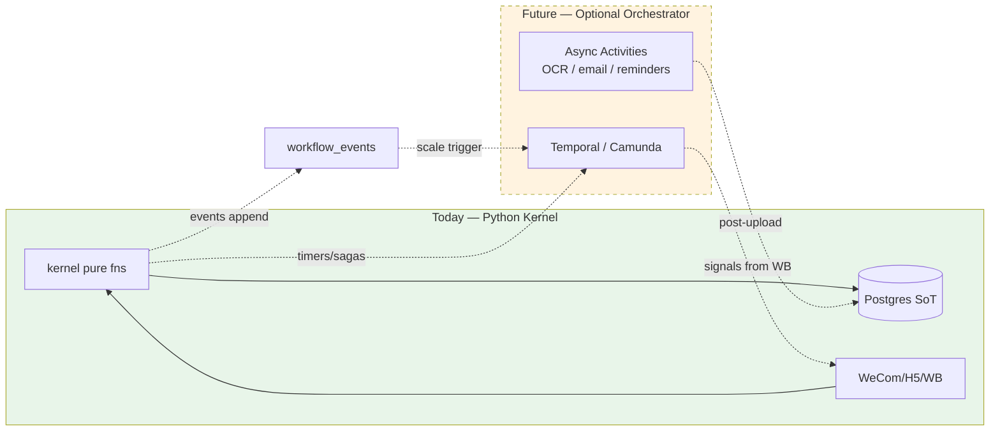

# P19I-1 — Workflow Kernel Breakthrough Recon

**Date:** 2026-07-07  
**Type:** Architecture breakthrough recon — **documentation only**  
**Audience:** Andy, product, engineering, future Cursor agents  
**Prerequisite:** Add Vehicle lane live ✅ · P19H-0 Claim recon ✅ · P19H-1 `claim_state.py` foundation ✅ · P19I-0 Generic Kernel recon ✅  
**Related:** `p19i0_generic_workflow_kernel_recon.md` · `p19h0_claim_case_builder_state_machine_recon.md` · `p19e_workflow_case_state_machine_event_pipeline_mermaid.md` · `p19e1_add_vehicle_case_state_machine_event_pipeline.md` · `p19e0_spark_style_binary_step_model_recon.md` · `p19g3_wecom_copy_button_progress_card_polish_backlog.md` · `evidence/p19h1_claim_state_machine_foundation_2026_07_08.md`

**This loop:** No code. No deploy. No schema migration. No cloud config. No framework migration. Recon doc only.

---

## 1. Executive Summary

Andy 决定 **暂停继续写 Claim 业务代码**，先想清楚 AI Workflow Kernel 的架构突破点。这不是否定 Add Vehicle 已证明的 spine，而是承认：**理赔是商业关键路径，kernel 可能是整个系统未来最核心的组件** — 必须轻巧、可复制、未来可迁移。

| Question | Answer |
|----------|--------|
| **现在是否换 Temporal / Camunda / Step Functions？** | **No** — paid pilot 继续 Python + Postgres + WeCom/H5/Workbench |
| **现在是否抽象 kernel？** | **Yes, lightly** — 语义层（definition + gates + score），不是 runtime engine |
| **是否暂停 P19H-2 Claim 编码？** | **Yes, briefly** — 先完成本 recon + 简化 Claim 模型 + 最小 kernel 设计 |
| **Claim 是否应简化？** | **Yes** — 从 4 customer phase 压缩到 **3 phase + Safety Gate + Broker Gate** |
| **我们到底在做什么产品？** | **微信里的行业任务收集与确认引擎** — WeCom/H5 收集，Workbench 人工确认 |
| **未来迁移会更难吗？** | **Only if we violate migration-ready rules** — 今天的设计可以让未来迁移成本可控 |

**One-line recommendation:**

> **Keep Python + Postgres. Pause Claim feature coding. Simplify Claim to a 3-phase evidence collector. Extract a thin workflow kernel as pure semantics (definition, required gate, completion score, safety, human gate). Defer Temporal/Camunda until durable timers, multi-broker ops, or >5 lanes with ops pain.**

---

## 2. Why We Are Pausing Before More Claim Code

### 2.1 Andy's three reasons (validated)

| # | Reason | Assessment |
|---|--------|------------|
| 1 | Claim 是重要商业流程，不能随便做复杂 | ✅ P19H-0 设计了 4 customer phases + 14 `claim_phase` values — 对 MVP「资料收集器」过重 |
| 2 | AI workflow kernel 可能是未来最核心组件 | ✅ Add Vehicle + Claim 已共享 spine；kernel 抽象时机到了，但应是 **semantic kernel** 不是 engine |
| 3 | 未来要复制到其他行业 + 可能迁移框架 | ✅ 需要 framework-agnostic 概念边界，今天不写死 |

### 2.2 What pausing does NOT mean

| Not pausing | Still true |
|-------------|------------|
| 推翻 Add Vehicle | Add Vehicle 继续 demo / pilot；不改 |
| 删除 `claim_state.py` | P19H-1 foundation 保留；未来按简化模型 refactor |
| 引入 Temporal 现在 | 明确 No — ops cost >> benefit at 2 lanes / 1 broker |
| 无限期设计 paralysis | 目标：1 recon + 1 简化模型 + 1 小 kernel sprint，然后恢复 Claim |

### 2.3 Risk of NOT pausing

```text
继续按 P19H-0 四 phase 写 Claim
  → 14 个 claim_phase 状态
  → slice.py 再膨胀
  → 每个新行业 fork 一套 *_state.py
  → 未来迁移时概念混乱（phase vs gate vs score）
  → 理赔 copy/guardrail 债务在错误模型上固化
```

**Verdict:** 暂停是正确的。P19H-1 的 25 个测试是 **可 refactor 的资产**，不是沉没成本。

---

## 3. Current Architecture Snapshot

### 3.1 Proven spine (Add Vehicle + Claim foundation)

```text
Channel event (WeCom / H5 / Workbench)
  → normalize
  → identify user / find active case (Postgres read facade)
  → derive phase (lane-specific pure helper)
  → route (slice.py + lane modules)
  → validate + persist (case_store / service_record_repository)
  → emit reply card (reply.py + lane builders)
  → Workbench reads same Postgres row
```

### 3.2 What exists in code today

| Layer | Add Vehicle | Claim | Shared? |
|-------|-------------|-------|---------|
| Source of truth | Postgres `service_records.extra` JSONB | Same | ✅ |
| Read facade | `get_case_for_read` | Same | ✅ |
| Lane identity | `service_lane = add_car` | `service_lane = claim` | Pattern |
| Phase field | `add_vehicle_phase` | `claim_phase` (14 values) | Role same, Claim heavier |
| Broker dim | `guided_workflow_state` | Same | ✅ |
| Facts bag | `collected_fields` + `known_facts` | Same | ✅ |
| Attachments | `case_attachments[]` + `h5_photo_flow_state` | `claim_attachment_slots` | Pattern |
| Phase helpers | `add_vehicle_phase2.py`, `add_vehicle_progress.py` | `claim_state.py` (735 lines, 25 tests) | Parallel |
| Completion | `phase2_text_is_complete`, `h5_photo_flow_is_complete` | `is_claim_summary_ready` (8 required) | Same idea |
| Safety | Implicit | `CLAIM_FORBIDDEN_AUTOMATION_CLAIMS` | Claim ahead |
| Audit | `state_history` PG table + structured logs | Same | ✅ |
| Dedicated event log table | No | No | Deferred |

### 3.3 Where complexity actually lives

```text
┌─────────────────────────────────────────────────────────────┐
│  slice.py — ingress routing, intent disambiguation          │  ← grows per lane
├─────────────────────────────────────────────────────────────┤
│  Lane modules — phase predicates, extractors, card copy       │  ← should stay lane-specific
├─────────────────────────────────────────────────────────────┤
│  reply.py — WeCom card builders                             │  ← channel-specific
├─────────────────────────────────────────────────────────────┤
│  case_store / PG facade — persist + hydrate                 │  ← already shared
└─────────────────────────────────────────────────────────────┘
```

**Insight:** 缺的不是 workflow engine，是 **跨 lane 的语义统一**（gates, score, safety, human task）和 **Claim 产品简化**。

---

## 4. Best Practice Research Summary

### 4.1 Long-running workflows

| Platform | How they handle long waits |
|----------|---------------------------|
| **Temporal** | Durable execution; `workflow.wait_condition()` pauses at zero compute cost; event history replay on recovery ([Temporal HITL blog](https://temporal.io/blog/human-in-the-loop-approvals)) |
| **AWS Step Functions** | `.waitForTaskToken` pauses until `SendTaskSuccess`/`SendTaskFailure`; max 1 year ([AWS integration patterns](https://docs.aws.amazon.com/step-functions/latest/dg/connect-to-resource.html)) |
| **Azure Durable Functions** | Event-sourcing + `waitForExternalEvent` + durable timers ([Azure HITL docs](https://docs.azure.cn/en-us/azure-functions/durable/durable-functions-human-interaction)) |
| **Google Workflows** | YAML state machine; `events.await_callback` for external resume ([GCP Workflows](https://cloud.google.com/workflows/docs)) |
| **Camunda / Zeebe** | BPMN process instances live until complete; native user task lifecycle ([Camunda human tasks](https://docs.camunda.io/docs/8.8/components/best-practices/architecture/understanding-human-tasks-management/)) |
| **Prefect / Dagster** | Scheduled/batch DAGs; bounded run lifetime; **not** per-customer case lifecycle ([QuantumBPM comparison](https://quantumbpm.com/blog/bpmn-vs-airflow-prefect)) |
| **LangGraph** | Checkpointer + `interrupt()` for HITL; thread-scoped state ([LangGraph persistence](https://docs.langchain.com/oss/python/langgraph/persistence)) |

**Our case:** Customer flows are **minutes to hours**, not days. Broker review is **query-driven** (Workbench opens case), not "workflow waits on worker." Postgres case row + Workbench queue is the right weight.

### 4.2 Human-in-the-loop

| Pattern | Mechanism | Our mapping |
|---------|-----------|-------------|
| **Task token callback** | Step Functions, GCP Workflows | Overkill — we use `guided_workflow_state = ready_for_broker_review` |
| **Signal + wait** | Temporal signals | Future: broker confirm as signal if we migrate |
| **BPMN User Task** | Camunda Tasklist | Future: Workbench queue → Camunda user task |
| **interrupt + resume** | LangGraph | Wrong abstraction — we're not LLM agent graph |
| **Status field + queue filter** | App-level (our model) | ✅ Workbench Document Intake queue |

**Industry norm for broker pilot:** Human gate = **case appears in queue with checklist**; broker action patches case; customer gets card. No orchestrator thread blocked.

### 4.3 State machine + event log

| Approach | When used |
|----------|-----------|
| **State in DB + append-only history** | Temporal event history, Camunda audit, our `state_history` |
| **Event sourcing as SoT** | Heavy systems; replay rebuilds state — **we reject for pilot** |
| **State + optional event append** | Our target: Postgres case JSON = SoT; events for audit/debug |

**Principle:** Event log **augments**, never replaces Postgres case row (P19E-1.5 invariant).

### 4.4 Workflow definition vs runtime separation

| System | Definition | Runtime |
|--------|------------|---------|
| Temporal | Workflow code (versioned) | Workflow execution + history |
| Step Functions | ASL JSON | Execution ARN + state |
| Camunda | BPMN XML | Process instance + variables |
| LangGraph | Graph builder code | Thread + checkpoints |
| **Our target** | `WorkflowDefinition` Python constants / future YAML | Case JSONB + `derive_phase()` |

**Key:** Definition describes **what**; runtime is **one case instance** hydrated from Postgres.

### 4.5 Avoiding premature heavy engine

Big companies typically:

1. **Start with app-level state machine** in the product database (our model)
2. **Add orchestrator when** multi-day timers, compensation sagas, or ops team needs workflow UI
3. **Keep channel adapters dumb** — WeCom/H5 emit events; they don't own phase logic
4. **Separate copy from state logic** — `reply.py` vs `*_state.py` (we already do this)

Spark Driver, 微保, 平安好车主 use **in-app wizards + push**, not Temporal — aligned with our H5 + WeCom pattern.

### 4.6 AI agent workflow vs traditional workflow

| Dimension | Traditional workflow | AI agent workflow (LangGraph etc.) |
|-----------|---------------------|-----------------------------------|
| **Transition driver** | Deterministic predicates | LLM / tool calls |
| **State** | Explicit fields + phases | Message history + graph state |
| **HITL** | User task / approval gate | `interrupt()` for human edit |
| **Audit** | Event log per transition | Checkpoint per super-step |
| **Our fit** | ✅ **Primary** — binary steps, broker gate | ⚠️ **Adjunct** — RAG Q&A, extractors, copy assist |

**Boundary:** Kernel transitions are **deterministic**. LLM may **extract** fields or **answer** questions, but must **not** drive `claim_phase` transitions. This matches insurance FNOL guardrails ([Lorikeet FNOL guide](https://www.lorikeetcx.ai/articles/how-ai-automates-insurance-fnol-claims-intake)).

### 4.7 Insurance claim workflow guardrails

| Guardrail | Why | Our implementation |
|-----------|-----|-------------------|
| **No coverage advice** | Regulatory / liability | `CLAIM_FORBIDDEN_AUTOMATION_CLAIMS` |
| **No fault determination** | Legal | Same + safe copy invariants |
| **No "claim filed" language** | Customer trust | `claim_summary_ready` ≠ filed |
| **Injury → manual handle** | Safety / urgency | `anyone_injured=yes` → `manual_handle` |
| **Broker gate on all handoffs** | Chen Kui confirms | `broker_done` = handoff only |
| **Audit trail** | Disputes / compliance | `state_history` + structured logs |
| **Confidence-based escalation** | OCR / extraction (V1.1+) | Broker confirms drafts |

---

## 5. Framework Comparison

### 5.1 Master comparison table

| Framework | Best for | Strength | Weakness | Fit: paid pilot | Fit: future scale | Migration cost | Recommendation |
|-----------|----------|----------|----------|-----------------|-------------------|----------------|----------------|
| **Current Python + Postgres** | Chat-native case builder, 1 broker, 2–5 lanes | Fast iteration, Cursor-friendly, zero ops, Postgres SoT proven | `slice.py` grows; no native durable timers; manual reminder logic | ✅ **Optimal** | ⚠️ Medium (5+ lanes) | N/A (baseline) | **Keep now** |
| **Temporal** | Long-running, durable timers, saga compensation | Best HITL signals; event history; replay | Cluster + workers; learning curve; split state with Postgres | ❌ Overkill | ✅ Strong | Medium–High | **Defer** until multi-day waits / carrier API sagas |
| **AWS Step Functions** | AWS-native orchestration | Visual ASL; task token HITL | AWS lock-in; still need Postgres for Workbench; split brain | ❌ | ⚠️ If all-in AWS | High | **No** for pilot |
| **Camunda / Zeebe** | BPMN, multi-team, compliance visibility | Native user tasks; DMN rules; process diagrams | BPMN ops; heavy for 1 broker; non-engineers edit BPMN (we don't need) | ❌ | ✅ Multi-broker / regulated | High | **Defer** until BPMN users exist |
| **Google Workflows** | GCP YAML orchestration | Lightweight; callback HITL | YAML not Python; less ecosystem for our stack | ❌ | ⚠️ If all-in GCP | High | **No** |
| **Azure Durable Functions** | Azure code-first orchestration | async/await; external events | Azure lock-in; cold starts | ❌ | ⚠️ If all-in Azure | High | **No** |
| **Prefect** | Data/ML pipelines, ETL | Python-native; dynamic DAGs | Wrong shape — batch not per-customer case | ❌ | ❌ | N/A | **Wrong tool** |
| **Dagster** | Asset-centric data platform | Lineage, dbt integration | Data-shaped not business-process-shaped | ❌ | ❌ | N/A | **Wrong tool** |
| **LangGraph** | LLM agent graphs, conversational AI | Checkpoint HITL; thread memory | Non-deterministic transitions; not case checklist | ❌ as kernel | ⚠️ For agent subgraph only | Medium | **Adjunct only** — not workflow kernel |

### 5.2 Explicit answers: should we switch NOW?

| Framework | Switch now? | Why |
|-----------|-------------|-----|
| Temporal | **No** | 2 lanes, 1 broker, hours-not-days flows; Postgres works |
| Camunda | **No** | No BPMN editors; ops burden >> demo value |
| AWS Step Functions | **No** | Would duplicate Postgres; Workbench still needs case row |
| Prefect / Dagster | **No** | Data pipelines ≠ customer case lifecycle |
| LangGraph | **No** as kernel | Use for RAG/extraction subgraphs if needed; not phase machine |
| Python + Postgres | **Yes** | Proven Add Vehicle; Claim foundation fits same spine |

### 5.3 When migration becomes worth it

| Trigger | Best candidate |
|---------|----------------|
| Multi-day durable reminders ("48h no photos → nudge") | Temporal |
| Carrier API saga with compensation | Temporal or Camunda |
| >5 lanes, 3+ engineers, ops team | Temporal |
| Non-engineers edit workflow diagrams | Camunda |
| Strict carrier filing audit with process UI | Camunda |
| All-in AWS, minimal custom code | Step Functions (still keep Postgres for UI) |

**Threshold estimate:** ~500+ active cases/day OR dedicated ops engineer OR regulatory mandate for process-level audit UI.

---

## 6. What Big Companies Usually Do

### 6.1 Pattern ladder

```text
Stage 0 — App state machine in product DB          ← WE ARE HERE (correct)
Stage 1 — Shared kernel semantics + event append   ← P19I-2 target
Stage 2 — Async activities (OCR, email) via queue  ← Celery/Cloud Tasks, not Temporal
Stage 3 — Durable orchestrator for timers/sagas    ← Temporal/Camunda when triggered
```

### 6.2 What they avoid early

- Full BPMN before product-market fit
- Event sourcing as sole source of truth
- Blocking orchestrator threads for human review (use queue + status field instead)
- LLM-driven state transitions in regulated flows

### 6.3 What they keep clean from day one

- **Explicit transitions** (named events, not implicit side effects)
- **Business state in database**, not in process memory
- **Human tasks as first-class** (even if just a queue filter today)
- **Safety rules outside routing** (scan copy before send)

---

## 7. What We Should NOT Do Now

| Do NOT | Why |
|--------|-----|
| Migrate to Temporal / Camunda / Step Functions | Ops cost >> benefit at pilot scale |
| Build YAML runtime engine | Premature; Python constants sufficient |
| New database tables for kernel | JSONB + pure helpers first |
| Single mega `workflow_engine.py` | Second `slice.py` |
| LLM-driven phase transitions | Insurance guardrails require determinism |
| Full event sourcing / replay | Postgres case row works |
| Generic router rewrite before simplified Claim | Validate simplified model first |
| Perfectionist DRY on Chinese copy | Copy is lane-specific by design |
| Resume P19H-2 on 4-phase Claim model | Simplify first per §10 |
| Abstract H5/WeCom into kernel | Channels are adapters |

---

## 8. Lightweight Workflow Kernel Proposal

### 8.1 Kernel is NOT an engine

```text
❌ Kernel ≠ Temporal worker
❌ Kernel ≠ YAML interpreter at runtime
❌ Kernel ≠ slice.py replacement

✅ Kernel = shared SEMANTICS layer
   - WorkflowDefinition (declarative constants)
   - completion_score / required_gate / safety_check (pure functions)
   - progress_snapshot builder (unifies Add Vehicle + Claim)
   - Lane adapters call kernel; routing stays in slice
```

### 8.2 Three-layer target architecture

```text
┌──────────────────────────────────────────────────────────────────┐
│  Channel Adapters: WeCom slice · H5 upload · Workbench actions   │
├──────────────────────────────────────────────────────────────────┤
│  Lane Adapters: add_vehicle_* · claim_* · renewal_* · perfume_*  │
│    (extractors, card copy, H5 slot config — lane-specific)       │
├──────────────────────────────────────────────────────────────────┤
│  Workflow Kernel (pure Python, no I/O):                          │
│    WorkflowDefinition · WorkflowRuntime helpers · SafetyPolicy   │
│    completion_score · required_gate_passed · missing_items       │
├──────────────────────────────────────────────────────────────────┤
│  Data: Postgres JSONB (SoT) · GCS attachments · state_history   │
└──────────────────────────────────────────────────────────────────┘
```

### 8.3 P19I-2 minimal code scope (when approved)

| Deliverable | ~Lines | Notes |
|-------------|--------|-------|
| `workflow/kernel_types.py` | ~80 | Dataclasses / TypedDicts |
| `workflow/completion.py` | ~120 | score, gate, missing_items, progress_snapshot |
| `workflow/safety.py` | ~60 | forbidden phrases, escalation |
| `workflow/definitions/add_vehicle_v1.py` | ~80 | Declarative |
| `workflow/definitions/claim_intake_v2_simplified.py` | ~100 | 3-phase model |
| `tests/test_p19i2_workflow_kernel.py` | ~200 | Parity + simplified claim |
| **Out of scope** | — | slice.py, schema, deploy, WeCom templates |

---

## 9. Kernel Core Concepts

### 9.1 WorkflowDefinition

```python
# Conceptual — not implemented in P19I-1
WorkflowDefinition = {
    "workflow_id": "claim_intake_v2",
    "lane": "claim",
    "version": "2.0",
    "display_name_zh": "理赔资料收集",
    "phases": [
        {"id": "safety_gate", "customer_visible": False},
        {"id": "accident_basics", "customer_visible": True, "label_zh": "事故基本信息"},
        {"id": "evidence_pack", "customer_visible": True, "label_zh": "事故照片与证据"},
        {"id": "risk_confirmation", "customer_visible": True, "label_zh": "风险确认"},
        {"id": "broker_review", "customer_visible": True, "label_zh": "陈总确认"},
    ],
    "required_slots": ["customer_damage_photo", "other_party_vehicle_photo"],
    "optional_slots": ["scene_photo", "other_party_insurance_card", "police_report_photo"],
    "required_fields": [
        "accident_datetime", "accident_location", "accident_description",
        "anyone_injured", "police_involved", "other_party_info_min",
    ],
    "optional_fields": ["scene_photo", "tow_repair_info", "witness_info", "existing_claim_number"],
    "completion_predicates": { ... },  # per phase + summary
    "safety_rules": {
        "forbidden_phrases": [...],
        "escalation_triggers": [{"field": "anyone_injured", "value": "yes", "action": "manual_handle"}],
    },
    "human_review_gate": {
        "enter_when": "required_gate_passed",
        "queue_surface": "workbench_document_intake",
        "actions": ["confirm", "request_more_info", "manual_handle"],
    },
    "progress_card_template": "claim_progress_v2",
    "workbench_summary_schema": "claim_drawer_v2",
}
```

### 9.2 WorkflowRuntime (derived from case JSONB)

```python
WorkflowRuntime = {
    "case_id": "case_abc123",
    "workflow_id": "claim_intake_v2",
    "current_phase": "evidence_pack",
    "collected_fields": ["accident_datetime", "accident_location"],
    "attachments": [...],
    "completed_slots": ["customer_damage_photo"],
    "missing_slots": ["other_party_vehicle_photo"],
    "completion_score": {"required": 4, "total": 6, "pct": 67},
    "blocked_by_safety": False,
    "ready_for_human_review": False,  # required_gate not yet passed
    "human_task_status": None,  # or "pending" / "confirmed"
}
```

### 9.3 WorkflowEvent

```python
WorkflowEvent = {
    "event_id": "evt_uuid",
    "case_id": "case_abc123",
    "actor": "customer" | "broker" | "system",
    "channel": "wecom" | "h5" | "workbench",
    "event_type": "field_collected" | "slot_received" | "phase_gate_passed" | "broker_confirmed",
    "payload": {"field": "accident_location", "value": "..."},
    "timestamp": "2026-07-07T19:00:00Z",
    "derived_intent": "claim_basics_text",
    "state_before": {"phase": "accident_basics"},
    "state_after": {"phase": "accident_basics"},  # or next phase if gate passed
}
```

### 9.4 HumanTask

```python
HumanTask = {
    "task_id": "task_uuid",  # future; now implicit via case_id in queue
    "case_id": "case_abc123",
    "assigned_to": None,  # single broker pilot
    "task_type": "broker_review",
    "status": "pending" | "in_progress" | "completed",
    "priority": "urgent" | "normal",
    "due_at": None,
    "reason": "required_gate_passed" | "injury_manual_handle",
}
```

### 9.5 SafetyPolicy

```python
SafetyPolicy = {
    "lane": "claim",
    "forbidden_phrases": ["已经帮您报案", "是对方责任", ...],
    "required_disclaimers": ["陈总会人工查看", "这不代表已正式报案"],
    "escalation_triggers": [
        {"signal": "anyone_injured=yes", "action": "manual_handle", "urgent": True},
        {"signal": "fault_question_detected", "action": "defer_to_broker"},
    ],
    "lane_specific_risks": ["coverage_advice", "fault_determination", "claim_filed_assertion"],
}
```

### 9.6 Storage mapping: now vs later

| Concept | Now | Later |
|---------|-----|-------|
| `WorkflowDefinition` | Python constants per lane | `workflow_definitions/*.yaml` + version field in JSONB |
| `WorkflowRuntime` | Case JSONB fields | Same; optional denormalized columns for queue index |
| `WorkflowEvent` | Structured logs + `state_history` | JSONB `workflow_events[]` → dedicated `workflow_events` table |
| `HumanTask` | `guided_workflow_state` + Workbench queue filter | `office_tasks` PG table |
| `SafetyPolicy` | Lane constants in `claim_state.py` | Shared `workflow/safety.py` + per-lane config |
| `completion_score` | Computed in `get_*_progress_snapshot` | Kernel `completion_score(case, def)` |
| `attachments` | `case_attachments[]` + GCS | Same |
| `collected_fields` | JSONB array + `known_facts` | Same |

### 9.7 Future framework mapping

| Our concept | Temporal | Camunda | Step Functions |
|-------------|----------|---------|----------------|
| `WorkflowDefinition` | Workflow type registration | BPMN process definition | State machine ASL |
| `WorkflowRuntime` | Workflow execution + search attributes | Process instance variables | Execution input/output |
| `WorkflowEvent` | Workflow history events | Audit log / history | Execution history |
| `HumanTask` | Signal + wait OR activity | User Task | `.waitForTaskToken` |
| `SafetyPolicy` | Activity pre-check / interceptor | DMN decision table | Choice state + Lambda |
| `required_gate_passed` | Workflow condition | Gateway (XOR) | Choice state |
| Phase transition | Workflow code branch | Sequence flow | Next state |

---

## 10. Claim Simplification Strategy

### 10.1 Reframe the product

```text
❌ 不是：迷你理赔系统 / FNOL 自动化平台
✅ 是：理赔资料收集器 (Claim Evidence Collector)

客户：分步交资料
系统：整理 checklist + 进度
陈总：Workbench 确认 / 补资料 / 接手
```

### 10.2 Simplified Claim MVP — 3 customer phases

```text
Step 0 — Safety Gate (pre-flow, not a "phase")
  人是否安全？有人受伤 → manual_handle，不走普通 checklist

Phase 1 — Accident Basics (WeCom 文字)
  事故时间 · 事故地点 · 一句话描述

Phase 2 — Evidence Pack (H5 为主 + WeCom 补文字)
  自己车损照片 (required)
  对方车/车牌 (required — photo OR plate text)
  对方信息能拿多少算多少 (≥1 artifact — merged from old C3)
  现场照片 (optional)

Phase 3 — Risk Confirmation (WeCom 按钮，短)
  有人受伤？ (若 Phase 0 未触发)
  报警了吗？
  是否已经报过 claim？ (optional text)

→ IntakeReadyForBroker (renamed from claim_summary_ready)
→ Broker Review → BrokerDone
```

### 10.3 Simplified Claim MVP table

| Item | Phase / Gate | Required? | Gate type | Notes |
|------|--------------|-----------|-----------|-------|
| Safety: people safe | Step 0 | Hard gate | Safety | Injury yes → `manual_handle`, skip checklist |
| `accident_datetime` | Phase 1 | Yes | Required gate | Non-empty; fuzzy parse OK |
| `accident_location` | Phase 1 | Yes | Required gate | Non-empty |
| `accident_description` | Phase 1 | Yes | Required gate | ≤500 chars |
| `customer_damage_photo` | Phase 2 | Yes | Required gate | H5 slot `received` |
| `other_party_vehicle_or_plate` | Phase 2 | Yes | Required gate | Photo OR plate text |
| `other_party_info` (≥1) | Phase 2 | Yes | Required gate | Insurance card / license / phone / name — partial OK |
| `scene_photo` | Phase 2 | No | Completion score only | Optional; broker may ask |
| `anyone_injured` | Phase 3 | Yes | Safety + Required | yes → urgent + manual_handle path |
| `police_involved` | Phase 3 | Yes | Required gate | Y/N boolean |
| `existing_claim_number` | Phase 3 | No | Completion score only | "已报过 carrier" |
| `police_report_photo` | Phase 2/3 | No | Completion score only | Prompt if police=yes |
| All required satisfied | — | — | Required gate | → `intake_ready_for_broker` |
| Broker confirm | Broker | — | Human gate | → `broker_done` |

### 10.4 Design decisions (answers to prompt questions)

| Question | Answer |
|----------|--------|
| Compress 4 → 3 customer phases? | **Yes** — merge Other Party into Evidence Pack; Injury/Police → short Risk Confirmation |
| Other party info in Evidence Pack? | **Yes** — same mental model: "交证据" |
| Injury/police as Risk Gate not long flow? | **Yes** — 2–3 WeCom buttons, not separate phase with Stage Complete C4 |
| Rename `ClaimSummaryReady`? | **Yes → `intake_ready_for_broker`** — clearer: 资料收齐待 broker，≠ 已报案 |
| Hard gate fields? | Basics (3) + damage photo + other vehicle/plate + injury Y/N + police Y/N + ≥1 other-party signal |
| Completion score only? | scene, police report photo, tow, witness, existing claim # |
| % to enter broker review? | **100% of required gate** — not 70%/80% (see §14) |
| Must manual handle? | Injury yes at any point; fault/coverage questions; customer distress keywords |

### 10.5 Phase count reduction

| Model | Customer phases | `claim_phase` values | Stage Complete cards |
|-------|-----------------|----------------------|----------------------|
| P19H-0 (old) | 4 | 14 | C1, C2, C3, (+ C4 implicit) |
| **P19I-1 simplified** | **3** | **~8** | C1, C2, C3 |
| Broker | +1 gate | +3 broker states | Broker waiting, Done, Recovery |

**`claim_state.py` refactor:** Map old predicates to new phases; keep tests as parity fixtures during migration.

---

## 11. Cross-industry Replication Model

### 11.1 Minimum commercial definition

> **CaseIQ Workflow Kernel = 微信里的行业任务收集与确认引擎**
>
> 帮客户在 WeCom/H5 里完成一个明确的资料收集任务；帮 broker 在 Workbench 里确认、补资料、接手。不是聊天机器人，不是 BPM 平台，不是理赔系统。

**Minimum commercial promise:**

```text
1. Customer always sees ONE current task
2. System always knows what's collected and what's missing
3. Broker always gets a structured case — not chat scrollback
4. Nothing touches the business outcome until broker confirms
```

### 11.2 Cross-industry table

| Industry | Workflow goal | Phases | Required slots/fields | Optional | Safety rules | Human gate | Completion score idea |
|----------|---------------|--------|----------------------|----------|--------------|------------|----------------------|
| **Add Vehicle** | 加车资料收集 | Photos → Text → Broker | VIN, reg photos; date, ZIP, phone | Insurance card photo | No auto policy change | Chen confirm | Optional photo skipped |
| **Claim** | 理赔资料收集 | Basics → Evidence → Risk → Broker | Damage photo, other vehicle, basics, injury/police | Scene, witness, claim # | No fault/coverage/filed | Chen confirm; injury→manual | Other-party richness |
| **Renewal** | 续保资料整理 | Notice upload → Confirm prefs → Broker | Renewal notice or premium text | Comparison prefs | No quote guarantee | Chen confirm | Preference detail |
| **Perfume / Cosmetics ecom** | 香水选购确认 | Product choice → Shipping → Payment intent | Product SKU, address, phone | Scent prefs, gift message | No payment capture in chat | Order confirm (human or system) | Preference profile depth |
| **Tax docs** | 报税资料收集 | Doc type select → Upload pack → Broker | W-2 / 1099 photos, SSN last-4 | Prior year return | No tax advice | CPA confirm | Extra deduction docs |
| **Medical intake** | 就诊前信息采集 | Symptoms → History → Insurance card → Staff | Chief complaint, insurance card photo | Med list photo | No diagnosis | Triage nurse confirm | Symptom detail richness |
| **Home service** | 上门服务 intake | Problem describe → Photos → Schedule → Dispatcher | Address, problem photos, time window | Appliance model photo | No price guarantee | Dispatcher confirm | Problem description detail |

### 11.3 Replication recipe (lane #3+)

```text
1. New WorkflowDefinition constants (~100 lines)
2. New *_state.py adapter (~250–350 lines)
3. Lane-specific extractors + WeCom copy (~150 lines)
4. H5 slot config if photos needed (~80 lines)
5. Register intent in slice.py (~30 lines)
6. Clone test pattern from test_p19h1_* (~200 lines)

Target: Lane #3 = definition + adapter + copy, NOT fork of internals
```

---

## 12. Future Migration Strategy

### 12.1 Will deferring framework make migration harder?

**No — if we follow migration-ready rules from day one.**

Migration cost is high when:
- State lives only in Python call stack
- Transitions are implicit side effects
- Events are unstructured logs
- Human review is ad-hoc `if` branches

Migration cost is **low** when:
- Postgres case JSON is authoritative
- Transitions are named and logged
- `WorkflowDefinition` is declarative
- Human gate is explicit `human_review_gate` config

### 12.2 Migration path by component

| Component | Today | Migrate to Temporal | Migrate to Camunda |
|-----------|-------|---------------------|-------------------|
| Case state | Postgres JSONB | Continue as app DB; Temporal holds orchestration only | Process variables + Postgres mirror |
| Phase transitions | `derive_phase()` pure fn | Workflow code branches | BPMN gateways |
| Human review wait | Queue filter | `wait_condition` + signal from Workbench | User Task |
| Timers/reminders | Not implemented | `workflow.sleep()` | Timer boundary event |
| OCR enrichment | Future async job | Activity | Service Task |
| Safety scan | Python constants | Activity pre-check | DMN table |
| WeCom/H5 | Channel adapters | Unchanged | Unchanged |

### 12.3 Phased migration plan

```text
Phase 0 — NOW: Python kernel semantics, Postgres SoT
Phase 1 — Post-pilot: workflow_events[] in JSONB
Phase 2 — Scale: Async activities (OCR) via Cloud Tasks — not full Temporal
Phase 3 — Trigger: Evaluate Temporal for ONE lane (e.g. Claim follow-up reminders)
Phase 4 — If needed: Dual-write — kernel events → Temporal history for ops visibility
```

**Never big-bang:** Migrate one capability (e.g. 48h reminder) as Temporal activity; keep Postgres case row.

---

## 13. Event Log / Task Queue / Safety Layer Decision

### 13.1 Event Log

| Aspect | Direction |
|--------|-----------|
| **Why needed** | Debug cross-channel races; broker audit; future compliance |
| **Minimal now** | Structured `logger.info` with stable event names; PG `state_history` on status transitions |
| **V1.1** | Append `workflow_events[]` to case JSONB (max ~50/case) |
| **Later mature** | Dedicated `workflow_event_log` table; export to analytics |
| **What NOT now** | Kafka, event sourcing as SoT, replay-from-events |
| **Replication help** | Same event shape across lanes |
| **Migration help** | Maps to Temporal history / Camunda audit |

### 13.2 Human Task Queue

| Aspect | Direction |
|--------|-----------|
| **Why needed** | Broker must see "what needs me" — core product value |
| **Minimal now** | Workbench queue filtered by `guided_workflow_state = ready_for_broker_review` |
| **Later mature** | `office_tasks` table with assignee, SLA, priority |
| **What NOT now** | Separate task queue product; round-robin assignment |
| **Replication help** | `human_review_gate.queue_surface` in definition |
| **Migration help** | Maps to Camunda User Task / Temporal signal |

### 13.3 Safety Layer

| Aspect | Direction |
|--------|-----------|
| **Why needed** | Insurance liability; cross-industry trust |
| **Minimal now** | Shared `workflow/safety.py`; lane `forbidden_phrases` + `escalation_triggers` |
| **Later mature** | Policy engine / rules config UI; outbound scan on all cards |
| **What NOT now** | LLM policy engine; runtime YAML rules interpreter |
| **Replication help** | `SafetyPolicy` per lane in definition |
| **Migration help** | Maps to DMN / activity interceptors |

---

## 14. Completion Score + Required Gate Model

### 14.1 Four gate types (every workflow)

```text
Safety Gate     → injury / legal / fraud signals → manual_handle (may bypass checklist)
Required Gate   → ALL mandatory items → enter broker queue (binary: pass/fail)
Completion Score→ richness metric for Workbench display (optional items)
Human Gate      → broker_confirmed_at → terminal handoff
```

### 14.2 Why 70%/80% is NOT enough for broker queue

| Reason | Explanation |
|--------|-------------|
| **Broker trust** | Chen Kui opens case expecting **actionable minimum** — not "mostly done" |
| **Legal** | Missing injury flag or damage photo = liability gap |
| **Customer clarity** | "资料已收齐" must be truthful — partial % confuses |
| **Spark alignment** | Binary steps: done/not done per required item |
| **Recovery cost** | Partial intake → broker chases → defeats product value |

**Completion score is for richness**, not queue entry. Example: Claim with scene photo + witness = 100% optional score, but same broker queue as 0% optional.

### 14.3 Lane examples

**Add Vehicle:**

| Gate | Rule |
|------|------|
| Required gate | H5 photos complete (VIN + reg) + delivery_date + zip + phone |
| Completion score | 3/3 photos (insurance optional) + 3/3 text = display only |
| Safety gate | None (pilot) |
| Human gate | `broker_confirmed_at` set |

**Claim (simplified):**

| Gate | Rule |
|------|------|
| Safety gate | `anyone_injured=yes` → manual_handle |
| Required gate | Basics (3) + damage photo + other vehicle/plate + ≥1 other-party + injury Y/N + police Y/N |
| Completion score | Optional: scene, police report, witness, existing claim # |
| Human gate | `broker_done` |

**Perfume ecommerce:**

| Gate | Rule |
|------|------|
| Required gate | Product SKU + shipping address + phone |
| Completion score | Scent preference quiz answers |
| Safety gate | No payment card in chat |
| Human gate | Order confirm (broker or automated with human override) |

### 14.4 How this reduces state machine complexity

```text
OLD: 14 claim_phase values tracking micro-transitions
NEW: 3 customer phase labels + derived from (collected_fields, slots, gates)

Phase = f(required_gate progress, current_phase_hint)
NOT: phase = f(last event type) with 14 branches
```

**State machine shrinks because:**
- `derive_phase()` reads **gate satisfaction**, not event history
- `_in_progress` / `_complete` pairs collapse to gate checks
- Broker states stay as `guided_workflow_state` (already shared)

### 14.5 Cross-industry reuse

Same kernel functions:

```python
completion_score(case, workflow_definition) → {required_n, required_total, optional_n, optional_total}
required_gate_passed(case, workflow_definition) → bool
missing_required_items(case, workflow_definition) → [{field, label, kind}]
safety_gate_triggered(case, workflow_definition) → {blocked, action, reason}
human_gate_status(case, workflow_definition) → "pending" | "confirmed" | None
```

Lane only supplies `workflow_definition` constants.

---

## 15. Proposed Architecture Diagrams

### A. Lightweight Kernel Architecture



### B. WorkflowDefinition → WorkflowRuntime → HumanReview



### C. Simplified Claim MVP



### D. Future Migration Map



---

## 16. Roadmap

```text
P19I-1 — This recon                           ✅ NOW
  ↓
P19I-1b — Andy approves simplified Claim model
  ↓
P19I-2 — Minimal kernel code (~400 lines + tests)
         Refactor claim_state to simplified 3-phase model
         Parity tests; NO routing change
  ↓
P19H-2' — Claim WeCom Start + Basics (simplified model)
P19H-3' — Claim H5 Evidence Pack + Risk Confirmation
  ↓
P19I-3 — Router hygiene (register_lane_handler pattern)
  ↓
Post-pilot — workflow_events[] JSONB, OCR async, lane #3
  ↓
Scale trigger — Evaluate Temporal for reminders/sagas only
```

| Sprint | Deliverable | Risk |
|--------|-------------|------|
| P19I-1 | This doc | None — docs only |
| P19I-2 | Kernel pure helpers + simplified claim definitions | Low — no routing |
| P19H-2' | Claim customer path on simplified model | Medium — slice.py |
| P19G-3.1 | WeCom copy polish (parallel OK) | Low |

---

## 17. Final Recommendation

| # | Question | Answer |
|---|----------|--------|
| 1 | Pause P19H-2 temporarily? | **Yes** — until simplified model + P19I-2 kernel agreed |
| 2 | Complete P19I-1 before more Claim coding? | **Yes** — this doc is the gate |
| 3 | Build P19I-2 kernel now or after Claim C1? | **P19I-2 first** — kernel + simplified claim_state refactor, then P19H-2' |
| 4 | Simplify Claim before implementation? | **Yes** — 3 customer phases; rename to `intake_ready_for_broker` |
| 5 | Change framework now? | **No** — Python + Postgres |
| 6 | Next safest step? | Andy approves §10 simplified Claim → P19I-2 kernel code |
| 7 | Riskiest thing to avoid? | Building full 4-phase Claim on wrong model + `slice.py` sprawl before kernel |

**Sequencing:**

```text
STOP Claim feature coding (P19H-2)
  → Approve simplified Claim MVP (this doc §10)
  → P19I-2 kernel pure helpers + claim_state refactor
  → Resume P19H-2' on simplified spine
  → Add Vehicle unchanged; continues pilot
```

---

## 18. Migration-Ready Design Rules

1. **Business state never depends on Python call stack** — always persisted in Postgres JSONB before reply sent.
2. **All transitions are explicit** — named `event_type`; no hidden phase bumps in card builders.
3. **State persisted in Postgres** — `get_case_for_read` is the only production read path.
4. **Events are appendable** — structured logs now; JSONB array V1.1; table V2.
5. **Side effects isolated** — WeCom send, GCS upload, PG write are separate from pure `derive_phase()`.
6. **Reply copy separated from state logic** — `reply.py` vs `*_state.py` (already true).
7. **Workflow definitions declarative enough** — Python constants → future YAML without routing rewrite.
8. **Human tasks first-class** — `human_review_gate` in definition; Workbench queue is the surface.
9. **Safety policy first-class** — `SafetyPolicy` per lane; scan outbound copy.
10. **External APIs behind adapters** — H5, WeCom, GCS, future OCR as injectable activities.
11. **Required gate is binary** — no percentage-based queue entry.
12. **Completion score is display-only** — never drives `guided_workflow_state`.
13. **Lane identity is data** — `service_lane` + `workflow_definition_id`, not hardcoded router forks.
14. **Restart = new case** — never reopen `broker_done` case.
15. **Framework-agnostic naming** — `intake_ready_for_broker` not `claim_summary_ready` in kernel layer.

---

## STOP Report

| # | Item | Value |
|---|------|-------|
| 1 | **Document path** | `docs/p19i1_workflow_kernel_breakthrough_recon.md` |
| 2 | **Research sources reviewed** | Temporal HITL blog & tutorials; AWS Step Functions task token docs; Camunda human task best practices; LangGraph persistence & interrupt docs; Azure Durable Functions HITL; QuantumBPM BPMN vs Prefect/Dagster; Lorikeet/KLA FNOL guardrails; project docs P19E/H/I/G |
| 3 | **Framework comparison completed** | ✅ 9 frameworks in §5.1 table |
| 4 | **Current framework recommendation** | **Keep Python + Postgres** — no switch now |
| 5 | **Lightweight kernel recommendation** | **Yes** — pure semantic layer: WorkflowDefinition, gates, score, safety; ~400 lines P19I-2 |
| 6 | **Simplified claim recommendation** | **3 customer phases** + Safety Gate + Broker Gate; rename `intake_ready_for_broker`; merge other-party into Evidence Pack |
| 7 | **Event log recommendation** | **Now:** structured logs + `state_history`; **V1.1:** JSONB `workflow_events[]`; **V2:** dedicated table |
| 8 | **Human task recommendation** | **Now:** Workbench queue filter; **Later:** `office_tasks` table |
| 9 | **Safety layer recommendation** | **Now:** shared `workflow/safety.py` + lane configs; **Later:** policy engine |
| 10 | **Migration strategy** | Migration-ready rules §18; defer Temporal until timers/sagas; Postgres remains SoT |
| 11 | **Pause P19H-2?** | **Yes**, briefly |
| 12 | **Code changed?** | **No** |
| 13 | **Deploy happened?** | **No** |
| 14 | **Commit hash** | *(see git log after commit)* |
| 15 | **Pushed?** | *(see git push result)* |
| 16 | **STOP** | ✅ |

---

## References

- [Temporal — Human-in-the-Loop Approvals](https://temporal.io/blog/human-in-the-loop-approvals)
- [Learn Temporal — Durable HITL for AI Applications](https://learn.temporal.io/tutorials/ai/building-durable-ai-applications/human-in-the-loop/)
- [AWS Step Functions — Service Integration Patterns (waitForTaskToken)](https://docs.aws.amazon.com/step-functions/latest/dg/connect-to-resource.html)
- [Camunda 8 — Understanding Human Task Management](https://docs.camunda.io/docs/8.8/components/best-practices/architecture/understanding-human-tasks-management/)
- [LangGraph — Persistence & Checkpointers](https://docs.langchain.com/oss/python/langgraph/persistence)
- [Azure Durable Functions — Human Interaction](https://docs.azure.cn/en-us/azure-functions/durable/durable-functions-human-interaction)
- [QuantumBPM — BPMN vs Airflow/Prefect/Dagster](https://quantumbpm.com/blog/bpmn-vs-airflow-prefect)
- [Lorikeet — Insurance FNOL Automation](https://www.lorikeetcx.ai/articles/how-ai-automates-insurance-fnol-claims-intake)
- [KLA Digital — FNOL Claims-Intake Triage Governance](https://kla.digital/blueprints/insurance/insurance-fnol-claims-intake-triage)
- Internal: `p19i0_generic_workflow_kernel_recon.md`, `p19h0_claim_case_builder_state_machine_recon.md`, `p19e_workflow_case_state_machine_event_pipeline_mermaid.md`

---

## For future Cursor agents

1. **Read this doc** before resuming P19H-2 or proposing Temporal/Camunda.
2. **Claim is a 3-phase evidence collector**, not a 4-phase mini claims system.
3. **Kernel = pure semantics**; do not build a runtime engine in P19I-2.
4. **Required gate is binary** — completion score does not gate broker queue.
5. **Postgres read facade** invariant unchanged — `get_case_for_read` only.
6. **P19H-1 tests are refactorable** — update for simplified model, don't discard.
7. **Add Vehicle is frozen** for this sprint — kernel extraction must not break it.

**STOP**
