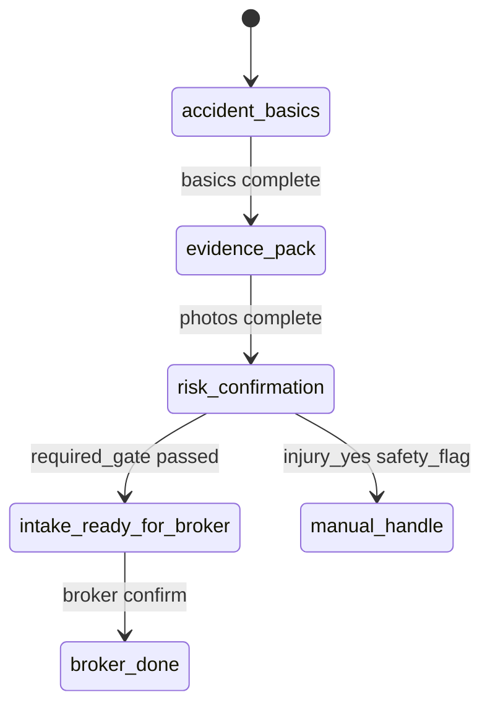
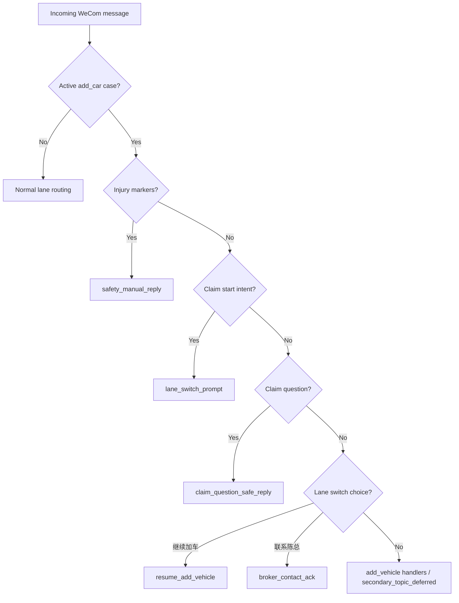

# P19J-0 — Lightweight Workflow Observability Recon

**Date:** 2026-07-07  
**Branch:** `sprint/p16-trust-layer`  
**Type:** Recon only — no production code, no deploy, no schema migration  
**Related:** `p19i0_generic_workflow_kernel_recon.md` · `p19i2_workflow_kernel_core_validation_recon.md` · `p19e_workflow_case_state_machine_event_pipeline_mermaid.md` · `evidence/p19h21_claim_interrupt_lane_switch_2026_07_08.md` · `evidence/p19i2b_thin_workflow_kernel_helpers_2026_07_08.md` · `evidence/p19i2c_claim_state_kernel_parity_refactor_2026_07_08.md`

---

## 1. Executive Summary

- **Problem:** Phone smoke exposed that multi-workflow routing (Add Vehicle active + Claim interrupt) is invisible. P19H-2.1 fixed the bug, but without observability the same class of defect will recur silently.
- **Recommendation:** **GO** on a **lightweight observability layer** — not a workflow engine.
- **Core stack (P19J-1):**
  1. Extend existing `WorkflowDefinition` dataclass as the **definition contract** (Python source of truth).
  2. Add one unified **`wecom_routing_decision_v1`** structured log at the end of `slice.py` routing.
  3. Auto-generate Mermaid state diagrams from definitions + lane phase constants (build-time script → `docs/generated/`).
  4. Add a **collapsible Workbench debug panel** (internal-only) showing current workflow state + last 5 routing decisions.
- **Explicitly not building:** Camunda, Temporal, Step Functions, LangGraph-as-engine, BPMN designer, drag-and-drop builder, event sourcing, dedicated `workflow_events` table (pilot).
- **Verdict:** **GO** — highest ROI is unified routing decision logs + generated diagrams + minimal Workbench debug. **HOLD** on DB persistence and customer-facing “transparent AI” demo until pilot stabilizes.

---

## 2. Problem Observed From Phone Smoke

| What happened | Why it hurt |
|---------------|-------------|
| User in active Add Vehicle flow said「我要理赔」 | System replied `secondary_topic_deferred` —「先完成当前请求」 |
| Root cause (P19H-2.1) | `claim_basics.py` blocked Claim start when Add Vehicle active; `minimal_lanes.py` also defers non-coverage intents when Add Vehicle open |
| Fix shipped | Claim interrupt / lane-switch priority in `slice.py` lines 501–508 |
| Remaining gap | No single place shows: active case, active state, incoming intent, priority rule applied, final decision, reason |

**What we could not answer during debugging:**

- Which router branch won? (`claim_basics` vs `minimal_lanes` vs `add_vehicle_progress`)
- Was `injury_mentioned` true? Did `_active_add_car_blocks_claim_start()` return true?
- What was `active_case_id` / `active_workflow` / `active_state` at decision time?
- Why was `priority_rule` not `claim_interrupt_over_add_vehicle`?

**Evidence:** `docs/evidence/p19h21_claim_interrupt_lane_switch_2026_07_08.md` §2–4.

---

## 3. Why This Matters For Multi-Workflow AI Intake

- We now run **at least two guided workflows** (Add Vehicle, Claim simplified) plus **minimal lanes** (policy review, claim_lite, coverage_risk) on one WeCom identity.
- Routing is **priority-ordered imperative code** in `slice.py` (~500 lines of `if b0_enabled and should_route_*`), not a declarative engine.
- **Interrupt policy** (Claim over Add Vehicle, injury over lane-switch prompt) is business-critical and changes frequently during pilot.
- **Kernel exists** (`workflow_kernel.py`) but routing does not yet emit kernel snapshots on every decision — only `claim_basics.py` logs `kernel_current_step` on some paths.
- Without observability, every new lane or interrupt rule requires **phone smoke + log archaeology** across fragmented `wecom_slice_*` events.

---

## 4. Recommended Approach

**Principle:** Observe the workflow we already have. Do not replace it.

```text
┌─────────────────────────────────────────────────────────────┐
│  WorkflowDefinition (Python dataclass) — source of truth    │
│  + lane phase constants (claim_state, add_vehicle_progress)  │
└──────────────┬──────────────────────────────┬───────────────┘
               │                              │
               ▼                              ▼
   scripts/generate_workflow_mermaid.py    evaluate_workflow_snapshot()
   → docs/generated/*.md (committed)       → routing decision payload
               │                              │
               │                              ▼
               │                    wecom_routing_decision_v1 (structured log)
               │                              │
               ▼                              ▼
   Human-readable state diagrams      Workbench debug panel (read case + tail logs)
```

**Three observability surfaces:**

| Surface | Audience | Cost |
|---------|----------|------|
| Generated Mermaid docs | Engineering, product, future agents | Low — script + CI check |
| Structured routing logs | On-call, post-phone-smoke debug | Low — one log helper in `slice.py` |
| Workbench debug panel | Broker (internal), founder demo prep | Medium — one collapsible UI block |

---

## 5. Workflow Definition Contract

### 5.1 Do we need a lightweight contract?

**Yes.** We already have 80% of it in `workflow_kernel.py`:

```python
@dataclass(frozen=True)
class WorkflowDefinition:
    workflow_id: str
    lane: str
    display_name: str
    phases: tuple[str, ...]
    required_slots: tuple[SlotDefinition, ...]
    optional_slots: tuple[SlotDefinition, ...] = ()
    human_review_phase: str = "intake_ready_for_broker"
    done_phase: str = "broker_done"
    safety_rules: tuple[str, ...] = ()
    current_step_order: tuple[str, ...] = ()
```

**Missing for observability (add in P19J-1, still pure dataclass):**

| Field | Type | Purpose |
|-------|------|---------|
| `terminal_states` | `tuple[str, ...]` | e.g. `("broker_done", "manual_handle")` — for diagram terminal nodes |
| `interrupts` | `tuple[InterruptRule, ...]` | Cross-workflow priority rules (see §5.3) |
| `gates` | `tuple[str, ...]` | Named gates: `("safety", "required", "human")` — documentation + debug labels |
| `version` | `str` | e.g. `"v1"`, `"v2_simplified"` — audit which definition drove a decision |
| `routing_lane_id` | `str` | Maps to `service_lane` / slice router name (`add_car`, `claim`) |

```python
@dataclass(frozen=True)
class InterruptRule:
    rule_id: str                    # e.g. "claim_over_add_vehicle"
    trigger_intent: str | None      # e.g. "claim_intake"
    trigger_markers: tuple[str, ...] = ()  # e.g. injury keywords
    overrides_active_lane: str      # e.g. "add_car"
    priority: int                   # lower = higher priority
    action: str                     # e.g. "lane_switch_prompt" | "safety_manual" | "start_workflow"
    description: str                # human-readable for debug panel
```

### 5.2 Current definitions (actual code)

| Definition | `workflow_id` | `lane` | Wired to routing? |
|------------|---------------|--------|-------------------|
| `ADD_VEHICLE_MINIMAL_DEFINITION` | `add_vehicle_minimal_v1` | `add_car` | Partial — progress via `derive_add_vehicle_progress()`, not kernel |
| `CLAIM_FOUNDATION_DEFINITION` | `claim_intake_v1_foundation` | `claim` | Yes — `claim_state.py` adapter (P19I-2c) |
| `CLAIM_SIMPLIFIED_DEFINITION` | `claim_intake_v2_simplified` | `claim` | Partial — `claim_basics.py` uses for basics step only |

**Gap:** Add Vehicle has no `WorkflowRuntimeSnapshot` adapter yet; Claim has **two** phase models (`derive_claim_phase()` granular vs kernel simplified).

### 5.3 Interrupt rules to encode (from P19H-2.1)

Document as `INTERRUPT_RULES` constant (not in DB):

| `rule_id` | `priority` | Condition | `action` | Code location |
|-----------|------------|-----------|----------|---------------|
| `injury_safety_override` | 1 | `message_mentions_injury(text)` | `safety_manual_reply` | `claim_basics.py` |
| `claim_start_over_add_vehicle` | 2 | active `add_car` + claim start intent | `lane_switch_prompt` | `claim_basics._active_add_car_blocks_claim_start` |
| `claim_lane_switch_confirm` | 3 | user says「开始理赔」/ `1` | `start_claim_workflow` | `is_claim_lane_switch_confirm` |
| `claim_question_safe` | 4 | claim how-to question, no active claim case | `claim_question_safe_reply` | `should_route_claim_question_safe_reply` |
| `lane_switch_continue_add_car` | 5 |「继续加车」/ `2` | `resume_add_vehicle` | `ingest_claim_lane_switch_choice` |
| `lane_switch_broker` | 6 |「联系陈总」/ `3` | `broker_contact_ack` | `ingest_claim_lane_switch_choice` |
| `secondary_topic_defer` | 99 | active `add_car` + non-coverage minimal lane | `secondary_topic_deferred` | `minimal_lanes.py` L443 |

**Known limitation (document, don't hide):** No persistent `lane_switch_pending` in case JSONB — confirm is intent-based on next message (`p19h21` §7).

### 5.4 Where definitions should live

| Format | Role | Verdict |
|--------|------|---------|
| **Python dataclass** | Source of truth, type-checked, importable by kernel + tests | ✅ **Primary** — extend `workflow_definitions.py` |
| **JSON / YAML** | External config for non-engineers | ❌ Defer — 3 workflows, 1 broker; Python is fine |
| **Markdown** | Human docs + generated Mermaid | ✅ **Output** — `docs/generated/workflow_*.md` |
| **Hybrid** | Python defines slots/gates; script emits Mermaid + interrupt table markdown | ✅ **Recommended** |

Do **not** duplicate definitions in Markdown by hand — drift is guaranteed (Claim foundation vs simplified already diverges).

---

## 6. Mermaid Auto-Diagram Plan

### 6.1 What to generate

| Diagram | Source | Output file |
|---------|--------|-------------|
| Add Vehicle state machine | `ADD_VEHICLE_MINIMAL_DEFINITION` + `derive_add_vehicle_progress()` phases | `docs/generated/workflow_add_vehicle_state.md` |
| Claim simplified state machine | `CLAIM_SIMPLIFIED_DEFINITION` + `get_current_step()` actions | `docs/generated/workflow_claim_simplified_state.md` |
| Claim foundation (legacy) | `CLAIM_FOUNDATION_DEFINITION` + `CLAIM_PHASES` | `docs/generated/workflow_claim_foundation_state.md` |
| Cross-workflow interrupt | `INTERRUPT_RULES` constant | `docs/generated/workflow_interrupt_priority.md` |
| Slice routing funnel | Static ordered list from `slice.py` comment block L501–508 | `docs/generated/workflow_slice_routing_funnel.md` |

Existing manual diagrams in `docs/p19e_workflow_case_state_machine_event_pipeline_mermaid.md` remain the **narrative** reference; generated files are **machine-synced** views.

### 6.2 Generation algorithm (minimal)

```text
1. For each WorkflowDefinition:
   a. Emit stateDiagram-v2 nodes from `phases` + `human_review_phase` + `done_phase` + terminal_states
   b. Emit transitions from `current_step_order` (slot collection order)
   c. Add safety branch: any safety_flag → manual_handle (dashed edge)
   d. Add gate annotations on human_review transition (required_gate passed)

2. For INTERRUPT_RULES:
   a. Emit flowchart TD: ActiveLane → IncomingIntent → PriorityCheck → Decision

3. Write markdown with mermaid fenced blocks + "generated at {git_sha}" footer

4. CI: python scripts/generate_workflow_mermaid.py --check (fail if drift)
```

### 6.3 Example: Claim simplified (from `CLAIM_SIMPLIFIED_DEFINITION`)



### 6.4 Example: Cross-workflow interrupt



### 6.5 Implementation size

- **New file:** `scripts/generate_workflow_mermaid.py` (~150–200 lines)
- **New file:** `services/fiqa_api/workflow_diagram.py` — pure string builders testable without filesystem (~100 lines)
- **Tests:** `tests/test_workflow_mermaid_generation.py` — snapshot contains expected phase count per workflow
- **No runtime dependency** — generation is dev/CI only

---

## 7. Routing Decision Log Plan

### 7.1 Unified event shape

Replace fragmented per-branch logs with one **terminal** log per processed message:

**Event name:** `wecom_routing_decision_v1`

**Emit from:** single helper `_log_routing_decision()` called once per `process_kf_msg_or_event` branch exit (including early `continue` paths).

### 7.2 Recommended fields

| Field | Type | Source | Notes |
|-------|------|--------|-------|
| `schema_version` | `"1"` | constant | forward compat |
| `ts` | ISO8601 UTC | `datetime.now(timezone.utc)` | |
| `message_id` | str | `normalized["msg_id"]` | WeCom idempotency key |
| `external_userid` | str | hashed in prod optional | never log full PII in shared logs |
| `open_kf_id` | str | normalized | |
| `incoming_text_hash` | str | `sha256(text)[:16]` | privacy — not raw text |
| `incoming_text_redacted` | str \| null | first 40 chars, phone/VIN masked | dev-only flag |
| `incoming_menu_id` | str \| null | normalized | Start Card clicks |
| `detected_intent` | str | `canonical_intent()` | |
| `internal_intent` | str | `intent_result.intent` | includes click intents |
| `intent_confidence` | str | `high` / `low` | |
| `intent_matched_by` | str | rule name | |
| `active_case_id` | str \| null | resolved at route time | |
| `active_workflow` | str \| null | `service_lane` or `workflow_id` | |
| `active_state` | str \| null | `claim_phase` / `add_vehicle_phase` / progress phase | |
| `active_cases_summary` | list | `{lane, case_id, phase}` for all open cases for user | multi-case debug |
| `safety_flags` | list[str] | injury, manual_handle | |
| `priority_rule` | str | e.g. `claim_start_over_add_vehicle` | **key debug field** |
| `router_branch` | str | e.g. `claim_basics_v1`, `minimal_lane_v1` | maps to `_log_slice` stage |
| `decision` | str | e.g. `lane_switch_prompt`, `claim_start_card_sent` | = `active_case_outcome` |
| `response_type` | str | `text` / `msgmenu` / `none` | |
| `reason` | str | short human string | e.g. `"active add_car blocks claim; injury=false"` |
| `created_case_id` | str \| null | if new case this turn | |
| `switched_workflow` | str \| null | if lane changed | |
| `kernel_snapshot` | object \| null | `evaluate_workflow_snapshot()` when applicable | omit heavy fields in prod |
| `reply_sent` | bool | outcome | |
| `reply_duplicate_skipped` | bool | dedup | |

### 7.3 Mapping from current code

| Current log | Carries today | Gap |
|-------------|---------------|-----|
| `wecom_slice_claim_basics_v1` | outcome, case_id, claim_phase | no `priority_rule`, no active add_car context |
| `wecom_slice_claim_lane_switch_choice_v1` | active_case_outcome | no interrupt rule id |
| `wecom_slice_minimal_lane_v1` | outcome | defers without explaining Claim wasn't checked |
| `wecom_claim_basics_ingest_v1` | kernel_current_step (sometimes) | not at slice level |
| `wecom_minimal_lane_deferred_v1` | reason `active_add_car_flow` | not linked to message routing decision |

### 7.4 Helper placement

```text
services/fiqa_api/wecom/routing_observability.py   # NEW — pure builders + log helper
  build_routing_decision_record(...)
  log_routing_decision(record)  → logger.info("wecom_routing_decision_v1 %s", json.dumps(...))

slice.py — call log_routing_decision() in each branch before results.append()
claim_basics.py — pass priority_rule into return dict for slice to log
```

Keep existing `wecom_slice_*` logs briefly for backward compat; deprecate after 2 weeks.

---

## 8. Workbench Debug View Plan

### 8.1 Minimum viable panel (internal)

**Location:** `BrokerWorkbenchTab` case drawer — collapsible section **「工作流调试」** behind `workbench_test` flag or env `WORKBENCH_WORKFLOW_DEBUG=1`.

**Do not polish.** Raw JSON + bullet list is fine.

### 8.2 Fields to display

| Section | Content | Source |
|---------|---------|--------|
| **Current workflow** | `service_lane` + `workflow_id` (from definition map) | case row |
| **Current state** | `claim_phase` or derived add_vehicle progress phase | `derive_claim_phase()` / `derive_add_vehicle_progress()` |
| **Collected / missing slots** | kernel `collected` / `missing` lists | new API field or client-side `evaluate_workflow_snapshot` via debug endpoint |
| **Gates** | safety / required / human pass-fail | kernel aggregate |
| **Last 5 routing decisions** | tail of `workflow_decisions[]` or log API | see §9 |
| **Interrupt priority table** | static render from `INTERRUPT_RULES` | generated markdown or API |
| **Current next action** | `current_step.action` + `customer_message_hint` | `get_current_step()` / `get_claim_simplified_current_step()` |
| **Active cases for user** | all open cases by `wecom_external_userid` | list endpoint (may exist via case list filter) |

### 8.3 API option (minimal)

**Preferred for P19J-1:** extend existing case read response with optional `?include_workflow_debug=1`:

```json
{
  "workflow_debug": {
    "workflow_id": "claim_intake_v2_simplified",
    "current_phase": "accident_basics_in_progress",
    "kernel": { "collected": [...], "missing": [...], "current_step": {...} },
    "workflow_decisions": [ /* last 5 */ ],
    "interrupt_rules_version": "p19h21"
  }
}
```

Computed server-side in `case_truth_repository` hydrate path — **no new table**.

### 8.4 What not to build in Workbench

- No live Mermaid renderer in UI (link to generated doc instead)
- No edit-in-place phase override
- No routing replay / time-travel
- No customer-visible panel

---

## 9. Build Now / Defer / Never

### 9.1 Build now (P19J-1)

| Item | Effort | Value |
|------|--------|-------|
| `InterruptRule` + `INTERRUPT_RULES` in `workflow_definitions.py` | S | Documents P19H-2.1 policy in code |
| `wecom_routing_decision_v1` unified log | S | Fixes phone-smoke debug pain immediately |
| `routing_observability.py` helper | S | Keeps `slice.py` diff small |
| `scripts/generate_workflow_mermaid.py` | M | Prevents diagram drift |
| Workbench collapsible debug section | M | Founder/broker can see state during trial |
| Tests: routing decision record shape + mermaid generation | S | Regression guard |

### 9.2 Defer (post-pilot / when pain appears)

| Item | Trigger to implement |
|------|---------------------|
| `case_extra.workflow_decisions[]` (last 20, JSONB append) | Need Workbench history without log access |
| Add Vehicle `WorkflowRuntimeSnapshot` adapter | Unify progress card with kernel |
| Migrate `derive_claim_phase()` to simplified kernel-only | P19H-2' full migration |
| `lane_switch_pending` marker in case JSONB | Users confused after lane-switch prompt |
| Log query API / Cloud Logging sink dashboard | >50 cases/week |
| Sanitized broker-facing "why did AI reply this?" card | Broker asks for transparency |

### 9.3 Never (this product phase)

| Item | Why |
|------|-----|
| Camunda / Temporal / Step Functions | Team size, workflow count, ops cost |
| LangGraph as workflow engine | We already rejected for intake |
| BPMN designer / drag-and-drop builder | No builder users |
| Full event sourcing + replay from log | Postgres case JSON is SoT (P19E-1.5) |
| Real-time workflow visualization product | Premature GTM |

---

## 10. Data Model Options

### 10.1 Staged plan

| Stage | Storage | Retention | Query path | When |
|-------|---------|-----------|------------|------|
| **Now** | Structured Cloud Logging / stdout `wecom_routing_decision_v1` | 30d default | `gcloud logging read` / local docker logs | **P19J-1** |
| **Next** | `case_extra.workflow_decisions[]` — append-only, max 20, ring buffer | Life of case | Workbench case drawer | When broker needs per-case history without ops |
| **Later** | `workflow_events` PG table | Compliance / analytics | SQL + Workbench | >500 cases/day or audit requirement |

### 10.2 `workflow_decisions[]` element shape (V1.1)

```json
{
  "ts": "2026-07-08T12:34:56Z",
  "message_id": "wmxxx",
  "priority_rule": "claim_start_over_add_vehicle",
  "decision": "claim_lane_switch_prompt",
  "reason": "active add_car; claim start; injury=false",
  "active_workflow": "add_car",
  "active_state": "phase2_partial",
  "detected_intent": "claim_intake",
  "response_type": "text"
}
```

**No schema migration** — JSONB field on existing case row, same pattern as `h5_photo_flow_state`.

### 10.3 Are logs enough for now?

**Yes**, for pilot with one broker and <100 active cases:

- Phone smoke debugging: grep `wecom_routing_decision_v1` + `message_id`
- Regression tests: assert `priority_rule` in unit tests for P19H-21 scenarios
- Workbench debug can call kernel live on case hydrate (no history needed day 1)

**Move to JSONB append when:**

- Andy/Chen needs "what happened on this case" without Cloud Console access
- Cross-channel race debugging (WeCom + H5 same case) needs ordered timeline on case row

---

## 11. Security / Privacy Notes

| Risk | Mitigation |
|------|------------|
| Raw customer text in logs | Default: `incoming_text_hash` only; `incoming_text_redacted` behind `WECOM_DEBUG_LOG_TEXT=1` |
| `external_userid` in logs | Acceptable for internal ops; hash if logs leave GCP project |
| Kernel snapshot may include phone/VIN from `known_facts` | Strip from `kernel_snapshot` in prod log; full snapshot only in Workbench debug API (auth-gated) |
| Generated docs in git | No customer PII — definitions only |
| Broker debug panel | Gate on `workbench_test` or office auth; never expose on customer portal |
| Routing decision retention | Align with existing case data retention policy |

`customer_copy_contains_forbidden_phrase()` guardrails stay separate — observability does not bypass ADR-003.

---

## 12. Product / Demo Value

### 12.1 Internal use (now)

- **Founder demo prep:** Show Chen that Claim interrupt policy is explicit, not accidental.
- **Post-phone-smoke:** Answer "why did it say 先完成当前请求" in <2 minutes.
- **Engineering:** Onboard new agents with generated Mermaid + interrupt table.

### 12.2 Broker demo (later, sanitized)

- **Do not show raw routing logs** to brokers in paid pilot.
- **Could show:** Progress card + "当前步骤" + "已收集 / 还差" (already customer-facing pattern).
- **Future sell (post-pilot):** "Transparent AI workflow" — broker sees *what the system knew* when it replied, not a black box. Requires sanitized Workbench copy, not developer JSON.

### 12.3 GTM positioning (defer)

| Narrative | Ready? |
|-----------|--------|
| "We collect structured intake, not free chat" | ✅ Today (Progress Cards) |
| "Every AI reply is auditable" | ⏳ After P19J-1 logs + Workbench debug |
| "Customer-visible workflow diagram" | ❌ Not pilot scope |

---

## 13. Recommended Implementation Sequence

| Step | Sprint | Deliverable |
|------|--------|-------------|
| 1 | **P19J-1a** | `InterruptRule`, `INTERRUPT_RULES`, extend `WorkflowDefinition` |
| 2 | **P19J-1a** | `routing_observability.py` + `wecom_routing_decision_v1` in all `slice.py` branches |
| 3 | **P19J-1a** | Unit tests mirroring `test_p19h21_claim_interrupt_lane_switch.py` asserting `priority_rule` |
| 4 | **P19J-1b** | `generate_workflow_mermaid.py` + `docs/generated/*.md` + CI `--check` |
| 5 | **P19J-1b** | Optional `?include_workflow_debug=1` on case read API |
| 6 | **P19J-1c** | Workbench collapsible debug panel (feature-flagged) |
| 7 | **P19J-2** (defer) | `workflow_decisions[]` JSONB append on route |
| 8 | **P19J-3** (defer) | Add Vehicle kernel adapter parity |

**Dependency order:** logs before Workbench (panel can ship with live kernel only, then gain history from JSONB).

---

## 14. Acceptance Criteria For Future P19J-1

- [ ] Every WeCom text message processed by `slice.py` emits exactly one `wecom_routing_decision_v1` log with `priority_rule`, `decision`, `reason`, `active_case_id`, `active_workflow`, `active_state`
- [ ] P19H-21 scenarios assert `priority_rule=claim_start_over_add_vehicle` (not `secondary_topic_defer`) when user says「我要理赔」with active Add Vehicle
- [ ] Injury scenario asserts `priority_rule=injury_safety_override`
- [ ] `scripts/generate_workflow_mermaid.py` produces 4+ markdown files; CI fails on drift
- [ ] Generated Claim simplified diagram phases match `CLAIM_SIMPLIFIED_DEFINITION.phases`
- [ ] Workbench debug panel shows current phase + collected/missing + next action for Claim and Add Vehicle cases
- [ ] No new PG tables, no workflow engine dependencies, no deploy required for doc-only PR
- [ ] Phone smoke checklist updated: "grep routing decision for message_id" step added

---

## 15. Final Recommendation

### GO

Proceed with **P19J-1 lightweight workflow observability**:

1. **Definition contract** — extend existing Python `WorkflowDefinition` + `InterruptRule` (hybrid: code SoT, generated docs).
2. **Routing decision log** — unified `wecom_routing_decision_v1` structured logs first.
3. **Mermaid** — auto-generated from definitions, committed under `docs/generated/`.
4. **Workbench** — minimal feature-flagged debug panel; internal only.

### HOLD

- `workflow_events` table
- Customer-facing transparency UI
- Persistent `lane_switch_pending` (separate sprint if user confusion recurs)
- Full Add Vehicle kernel adapter (P19I-3+)

### Risks

| Risk | Mitigation |
|------|------------|
| Log volume | One JSON line per message — negligible vs existing `wecom_slice_*` |
| `slice.py` touch surface | Central helper; don't inline JSON in each branch |
| Definition drift (foundation vs simplified) | Generated diagrams + single `workflow_id` in routing log |
| Over-building Workbench UI | Collapsible raw JSON; no design sprint |
| False confidence | Logs observe routing; they don't fix bad rules — keep P19H-21 tests |

### Next implementation step

**P19J-1a:** Add `services/fiqa_api/wecom/routing_observability.py` and wire `wecom_routing_decision_v1` through `slice.py` with `priority_rule` for all Claim interrupt branches. Ship with tests before Workbench UI.

---

*Recon complete. No production code in this sprint.*
