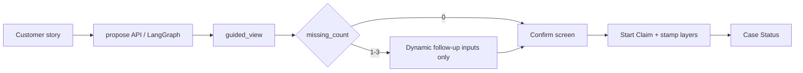

# FDE Case Study — LangGraph Guided Intake UX V1

**Branch:** `stage2/restricted-pilot-canary-release` (from Guided Intake + LangSmith + Pilot Safety)  
**Environment:** Cloud QA only — Production / waterwoods untouched  
**Status:** **QA CANARY PASS — PILOT READY WITH RESTRICTIONS**  
Tags: `guided-intake-ux-v1-founder-pass`, `langsmith-golden-evals-v1`, `accident-story-pilot-safety-v1`

This document is interview/portfolio evidence for the customer-visible LangGraph path **plus** restricted-pilot runtime proof.

---

## Customer problem

After an auto accident, customers struggle to turn a free-form story into the Must Have facts (time, location, injury) without a dead-end form. Brokers need those facts confirmed — not invented — before Claim work continues.

---

## Bounded LangGraph workflow

Propose → normalize → extract → validate → ≤3 follow-ups → customer confirm.  
LangGraph **never** submits/closes claims or mutates Claim lifecycle.

---

## Deterministic fallback

Timeout / invalid JSON / missing credentials / kill switch → deterministic extractor or manual intake. Original story preserved; unknown injury never becomes `no`.

---

## Golden evaluation

Offline suite `accident_story_v1`: **20/20**. Means golden-suite correctness, **not** real-pilot model accuracy alone.

---

## Live synthetic canary (Cloud QA)

Allowlisted office `qa_canary_synth` only. Live LLM canary **20/20**, injury accuracy 100%, p95 ≈ 2.4s, zero unknown→no, zero >3 questions. Evidence: `docs/release/ACCIDENT_STORY_QA_CANARY_REPORT_V1.md`.

---

## PII-safe tracing

Redacted `accident_story.*` traces; LangGraph auto-trace suppressed. Pre-fix historical runs may still need LangSmith UI quarantine.

---

## Kill switches

Server-side: `ACCIDENT_STORY_ASSISTANT_ENABLED`, `ACCIDENT_STORY_LLM`, `ACCIDENT_STORY_LANGSMITH_TRACING`, office allowlist. Visible in support diagnostics without secrets.

---

## Measurable pilot gates

See `docs/release/ACCIDENT_STORY_RESTRICTED_PILOT_GATES_V1.md` and QA canary report. Durable Postgres events power the pilot metrics SSOT.

---

## Why the first UI failed to demonstrate LangGraph value

Backend LangGraph (propose → missing facts → ≤3 follow-up questions → confirm) passed automated and phone tests. The phone UX still rendered the **full static Must Have form** (time / location / injury) and the grey deterministic banner:

`请先填写：事故时间、事故地点`

That message comes from Mini Program form validation (`startClaimValidation.ts`), not from LangGraph `followup_questions`. Follow-up questions were fetched and shown as a weak secondary note under the story — easy to miss. Founders correctly could not tell where LangGraph was used.

**Classification of prior phone evidence:**

| Layer | Status |
|-------|--------|
| LangGraph backend contract | Validated |
| Customer-facing LangGraph value | Not clearly demonstrated |
| UX slice | Incomplete |

---

## How customer feedback changed the design

Customer/founder feedback: “I need to see the AI working — organize what it knows, ask only what’s missing, then let me confirm.”

New customer-visible flow:

1. **Customer description** — voice or text (e.g. `昨天开车的时候被追尾，没有受伤。`)
2. **AI understanding panel** — `AI已帮您整理` with fact rows labeled as AI draft
3. **Missing-information message** — `还需要确认 N 项` + only LangGraph `followup_questions` / `followup_fields`
4. **Customer confirmation** — `请确认这些事故事实` (original + AI draft + structured facts)
5. **Deterministic Claim workflow** — Cap2 CreateClaim continues; LangGraph never mutates lifecycle

Secondary escape: `查看或修改全部信息` → full static form without abandoning intake.

---

## Deterministic vs probabilistic boundaries

| Deterministic (unchanged) | Probabilistic / assistive |
|---------------------------|---------------------------|
| Cap2 CreateClaim / submit | Story normalize + fact proposals |
| Must Have enablement rules | Follow-up drafting (≤3) |
| Request More / office accept | Optional LLM merge (allowlisted pilot) |
| Claim status transitions | Never |

Facts become authoritative only after **customer confirmation** (`customer_confirmed`). Unconfirmed AI drafts stay `ai_proposed`.

---

## Dynamic-question architecture

- `guided_view.followup_fields` drives which inputs render
- Known injury (`没有受伤`) is not re-asked
- Vague day-only time (`昨天`) still asks for clock/period
- Conflicts surface explicitly — never silently picked

---

## Customer confirmation gate

- Confirm screen required before submit when an AI proposal exists
- Actions: `信息正确，提交` / `修改` / `重新描述`
- Start Claim accepts `ai_story_confirmed` + proposal + edits and stamps Broker layers after CreateClaim
- Original customer text retained

---

## Fallback behavior

Invalid JSON / timeout / LLM failure → deterministic extractor path (`used_fallback=true`). Manual full form remains available. Intake never blocks on AI.

---

## Metrics (non-sensitive)

Durable Postgres table `accident_story_pilot_events` is the pilot SSOT (survives Cloud Run cold starts). In-memory counters are convenience only.

Events:

- `ai_story_proposal_created` / `accepted` / `edited` / `rejected`
- `ai_story_fallback_used` / `provider_timeout` / `invalid_output`
- `ai_story_trace_failed` / `ai_story_completion_after_fallback`

Meta allow-list only — **no raw story text in telemetry.**  
Exporter: `scripts/export_accident_story_pilot_metrics.py --since/--until`

---

## Broker Brief — three layers

1. `客户原始描述`
2. `AI整理草稿`
3. `客户已确认事实` (only when confirmed)

Never display an unconfirmed AI proposal as a customer fact. Model/provider stays in technical detail only.

---

## Business value (hypothesis)

Faster Must Have capture with fewer “请先填写” dead-ends and a visible AI assist story for demos and FDE interviews. **Not yet proven with real pilot traffic.**

---

## Three-minute demo path

1. Incomplete story: `昨天开车的时候被追尾，没有受伤。`
2. AI panel shows 追尾 / 昨天待确认 / 地点待确认 / 没有受伤
3. Exactly two questions: 几点？ / 哪里？
4. Customer answers → confirm screen → submit
5. Broker Brief shows confirmed structured facts + three layers

---

## What still requires real-pilot validation

- Live CA claim accuracy
- Reduction in Request More loops
- Broker time saved
- Production reliability under load
- Full LangSmith golden eval gate

**Next task:** `docs/portfolio/LANGSMITH_TRACING_GOLDEN_DATASET_NEXT_TASK.md`
