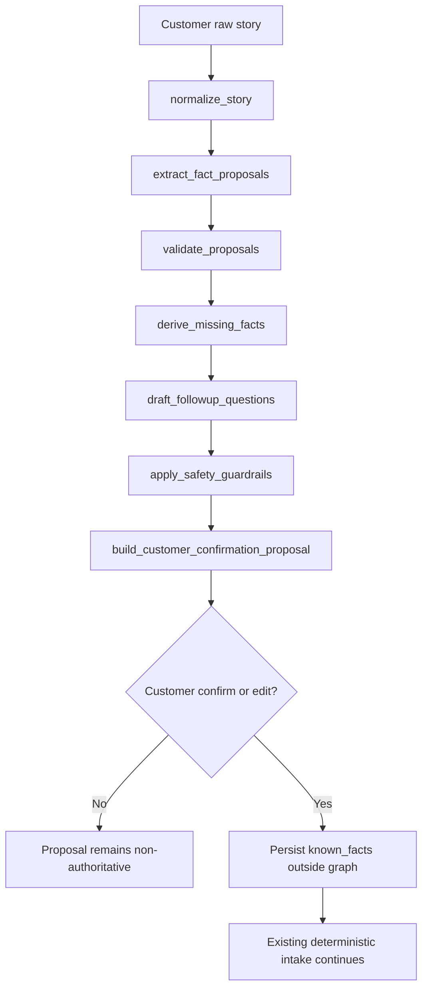

# FDE Case Study — Bounded LangGraph Accident-Story Assistant (V1)

**Branch:** `stage2/langgraph-accident-story-assistant`  
**Baseline:** Real Usage Timing V1 CLOSED (`9051f41`)  
**Environment:** Cloud QA only — Production / waterwoods untouched  

This document is interview/portfolio evidence. It does **not** claim production AI accuracy or customer savings.

---

## Customer problem

Customers describe accidents in messy free text. Brokers need structured Must Haves (story, time, location, injury) without:

- inventing facts,
- silently changing injury from unknown → no,
- or letting an AI submit/close the claim.

---

## Why a bounded graph

A full agent that owns Claim lifecycle is too risky for paid pilot.  
We chose a **bounded LangGraph subworkflow** that only organizes the accident story into a **proposal**, then stops for human confirmation.

Deterministic Cap2 lifecycle, Request More, office accept, and Start Claim remain outside the graph.

---

## Deterministic vs probabilistic boundary

| Deterministic (unchanged) | Probabilistic / assistive (this PR) |
|---------------------------|-------------------------------------|
| Cap2 CreateClaim / submit | Story normalize + fact proposals |
| Request More / supplement | Follow-up question drafting (≤3) |
| Office materials accept | Optional LLM merge (off by default) |
| Claim status transitions | Never |

AI proposals are labeled `ai_proposed` until the customer confirms → `customer_confirmed`. Broker can later mark `broker_reviewed`.

---

## Graph nodes and state

**State (schema_version=1):**  
`raw_story`, `normalized_story`, `incident_summary`, `injury_status`, time/location texts, involved parties/vehicles, `proposed_facts`, `missing_required_facts`, `followup_questions` (max 3), `confidence_by_field`, `warnings`, `conflicts`, model metadata, fallback flags.

---

## Human confirmation gate

- Propose API: `/api/h5/customer/accident-story/propose` — no lifecycle mutation  
- Confirm API: `/api/h5/customer/accident-story/confirm` — writes facts only when `confirm=true`  
- Unconfirmed proposals never become authoritative  
- Customer edits override AI values  
- Broker Brief shows original text + “客户已确认（AI 辅助整理）” vs “AI 提议（未确认）”

---

## Fallback and idempotency

- Invalid JSON / hallucinated fields / timeout → deterministic extractor path; intake continues  
- Original customer text retained  
- Propose/confirm commands idempotent by `idempotency_key`  
- Graph never submits, closes, or changes Claim status

---

## Tests and failure modes

Fixtures under `tests/fixtures/accident_story_langgraph/` (ready for LangSmith golden dataset).  
Matrix covers: complete story, missing location/time/injury, injury no/unknown/conflict, hallucinated fields, invalid JSON, timeout, idempotency, edit override, unconfirmed non-authority, Stage 1/2 regressions.

---

## Business benefit expected (not yet proven)

Faster, cleaner Must Have capture with fewer back-and-forth messages — **hypothesis only**. Requires real pilot traffic + Timing V1 metrics to prove.

---

## What has not been proven with real customers

- Model accuracy on live CA claims  
- Reduction in Request More loops  
- Broker time saved  
- Production reliability under load  

Next PR: LangSmith tracing + golden evaluation dataset + regression gate.
