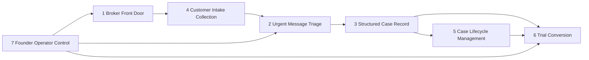

# Capability Map V1 — Unified Intake

**Version:** V1 Ratified (P14-B Constitution Sprint)  
**Date:** 2026-05-31  
**Status:** Locked — exactly 7 capabilities  
**Rule:** Every future feature, bug fix, UI change, prompt change, or broker trial change must map to **one** capability contract.

**Evidence base:** P10, P11, P14-A `PROPOSED_CAPABILITY_MAP.md`. P13 does not exist in repository.

---

## Capability Overview

| # | Capability | Contract | Current Score | Trial-ready? |
|---|------------|----------|---------------|--------------|
| 1 | **Broker Front Door** | `CAPABILITY_01_BROKER_FRONT_DOOR.md` | 35 | No |
| 2 | **Urgent Message Triage** | `CAPABILITY_02_URGENT_TRIAGE.md` | 85 | Yes |
| 3 | **Structured Case Record** | `CAPABILITY_03_CASE_RECORD.md` | 72 | Yes |
| 4 | **Customer Intake Collection** | `CAPABILITY_04_INTAKE_COLLECTION.md` | 62 | Conditional |
| 5 | **Case Lifecycle Management** | `CAPABILITY_05_CASE_LIFECYCLE.md` | 55 | Conditional |
| 6 | **Trial Conversion** | `CAPABILITY_06_TRIAL_CONVERSION.md` | 45 | No |
| 7 | **Founder / Operator Control** | `CAPABILITY_07_FOUNDER_OPERATOR.md` | 68 | Partial |

**Overall product score:** 60 / 100 (current) → 80 / 100 (paid pilot target)

See `CAPABILITY_SCORECARD.md` for full scoring rationale.

---

## Capability 1 — Broker Front Door

| Dimension | Definition |
|-----------|------------|
| **Purpose** | Broker reaches core value (cancellation triage) without founder translation |
| **Primary user** | Broker owner, office assistant |
| **Value delivered** | Correct tab, clean UI, demo queue, first value moment in &lt;5 min |
| **Importance** | **Critical** — P10/P11: "triage engine trial-ready; broker front door is not" |
| **Dependencies** | Customer Intake Collection (paste surface lives on workbench) |
| **Current state** | Wrong default tab (客户报送 vs 办公室工作台); engineer chrome visible; Simulation hidden |
| **Evidence** | P10 discovery #2, #4; P11 Day 1 score 28/100 unsupervised |

---

## Capability 2 — Urgent Message Triage

| Dimension | Definition |
|-----------|------------|
| **Purpose** | Classify intent, urgency, and extract structured facts from unstructured text |
| **Primary user** | Broker (via system output on paste) |
| **Value delivered** | Same-day cancellation surfaced; stop re-reading entire thread |
| **Importance** | **Critical** — core engine; guardrail 13/13 PASS |
| **Dependencies** | Customer Intake Collection (raw text input) |
| **Current state** | Trial-ready — 6-field output, 10+ categories, guardrail regression |
| **Evidence** | `BROKER_INBOX_TRIAGE_STANDARD.md`; P11 "triage engine is trial-ready" |

---

## Capability 3 — Structured Case Record

| Dimension | Definition |
|-----------|------------|
| **Purpose** | Present one office-ready service record: focus, next move, collected, still needed, draft |
| **Primary user** | Broker owner, office assistant |
| **Value delivered** | "What is this about?" answered in one view; editable `client_reply_draft` |
| **Importance** | **Critical** — P11 competitive moat is insurance-specific case structure |
| **Dependencies** | Urgent Message Triage |
| **Current state** | Trial-ready with gaps — PG-backed prod; local JSON demo; draft quality varies |
| **Evidence** | `UNIFIED_INTAKE_MVP_STANDARD.md`; P11 competitive audit #14 |

---

## Capability 4 — Customer Intake Collection

| Dimension | Definition |
|-----------|------------|
| **Purpose** | Accept messy inbound information via broker paste (primary) or customer portal (secondary) |
| **Primary user** | Broker (paste); end customer (Add-Car portal — secondary) |
| **Value delivered** | Single entry point; raw paste without cleanup |
| **Importance** | **High** — without paste, nothing else runs |
| **Dependencies** | None (entry point) |
| **Current state** | Shipped — two surfaces; broker paste path under-promoted vs Add-Car portal |
| **Evidence** | P10 #7 manual paste; P10 #2 doc/UI split |

---

## Capability 5 — Case Lifecycle Management

| Dimension | Definition |
|-----------|------------|
| **Purpose** | Queue, prioritize, reopen, and continue cases across the broker workday |
| **Primary user** | Broker owner, office assistant |
| **Value delivered** | Nothing urgent buried; follow-up without starting over |
| **Importance** | **High** — Monday-morning queue is Day 7 success criterion |
| **Dependencies** | Structured Case Record |
| **Current state** | Partial — Work now / Waiting exists; wayfinding weak; session continuity partial |
| **Evidence** | P9 outcomes; P11 TOP_30_WORKBENCH_IMPROVEMENTS; TRIAL_ONE_PATH |

---

## Capability 6 — Trial Conversion

| Dimension | Definition |
|-----------|------------|
| **Purpose** | Prove time saved during 7-day trial to justify $49–99/month payment |
| **Primary user** | Founder (runs trial); broker (provides evidence) |
| **Value delivered** | "Worked" lines; payment decision; fix-now queue; testimonial for second broker |
| **Importance** | **Critical for revenue** — no payment without proof |
| **Dependencies** | All product capabilities + Founder/Operator Control |
| **Current state** | Partial — trial process defined; ROI template, pricing, terms weak |
| **Evidence** | `TRIAL_ONE_PATH.md`; P11 TOP_20_BLOCKERS; payment score 25/100 |

---

## Capability 7 — Founder / Operator Control

| Dimension | Definition |
|-----------|------------|
| **Purpose** | Guard quality, deploy readiness, trial gates, and founder operational path |
| **Primary user** | Founder, operator |
| **Value delivered** | Script PASS confidence; guardrail regression; deploy validation; observation log |
| **Importance** | **High** — bridges engine quality to broker trust |
| **Dependencies** | Runtime (`CURRENT_PRODUCT_SHAPE.md`) |
| **Current state** | Partial — strong script layer; missing broker UX gate; prod validation incomplete |
| **Evidence** | `FOUNDER_ONE_PATH.md`; P10 #13 script PASS ≠ broker-ready |

---

## Capability Dependency Graph

---

## Mapping from P14-A Proposal (No History Rewrite)

P14-A used different capability names. This ratification **refines names** without changing discovered scope:

| P14-A Proposal | V1 Ratified | Notes |
|----------------|-------------|-------|
| Customer Intake | **Customer Intake Collection** + **Broker Front Door** | Split UX path from paste mechanism |
| Message Understanding | **Urgent Message Triage** | Same scope |
| Case Structuring | **Structured Case Record** | Includes draft output |
| Office Workflow | **Case Lifecycle Management** | Same scope |
| Draft Generation | **Structured Case Record** (§ Outputs) | Merged — draft is case output |
| Customer Identity | **Case Lifecycle Management** (§ session continuity) | Light v1 — no CRM |
| Trial ROI | **Trial Conversion** | Same scope |
| *(new)* | **Founder / Operator Control** | Elevated from founder rules — explicit capability |

---

## Evolution Rules (90 Days)

1. **No new capabilities** until Trial Conversion produces one paid pilot or explicit kill decision  
2. **Broker Front Door** fixes only — no new tabs  
3. **Case Lifecycle Management** — light identity only; no CRM build  
4. **Customer Intake Collection** — align story to broker paste path; defer portal-led GTM  
5. **Urgent Message Triage / Structured Case Record** — fix-now from trial log only, not feature expansion  

**Evolution gate:** No capability promotion without trial ROI evidence or explicit founder kill/continue decision.

---

*End of Capability Map V1*
