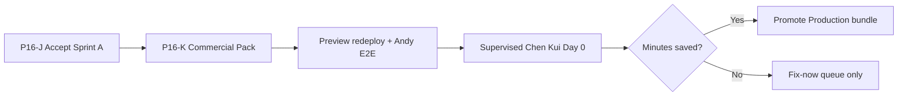

# P16-J Next Step

**Date:** 2026-05-31  
**Condition:** Sprint A accepted (conditional) per `P16J_FINAL_VERDICT.md`  
**Explicit exclusion:** **NOT P17**

---

## Recommended next sprint

### **P16-K — Commercial Pack Sprint**

**Goal:** Unblock Trial Conversion (Cap 6) and North Star §9 payment layers without new product features.

---

## P16-K scope (5–7 days)

| # | Deliverable | Owner | Unblocks |
|---|-------------|-------|----------|
| 1 | **$49 / $99 pricing** on `BROKER_ONE_PAGER.md` (Chinese) | Founder | Cap 6 |
| 2 | **7-day evaluation + 30-day pilot terms** (1-page PDF/MD) | Founder | Cap 6 |
| 3 | **Invoice template** (Zelle/Venmo/WeChat manual) | Founder | First payment |
| 4 | **Preview redeploy** from `901b0df` + persist Vercel env vars | Eng/Founder | Preview URL truth |
| 5 | **Andy authenticated Preview E2E log** (15 min checklist) | Founder | Founder confidence |
| 6 | **Chen Kui Day 0 observation template** linked from `TRIAL_ONE_PATH.md` | Founder | Supervised trial |

**Out of scope for P16-K:** New tabs, Stripe, inbox sync, OCR, platform features, repo cleanup sprints.

---

## Sequence after P16-K

---

## Production promote criteria (post P16-K)

Promote only when **all** true:

1. Andy Preview walkthrough PASS (logged)
2. Commercial pack in broker packet
3. `VITE_UNIFIED_INTAKE_PRODUCT_ONLY=1` on Production build
4. Supervised Day 0 scheduled — not before

---

## What NOT to do

| Action | Why |
|--------|-----|
| Start P17 | Gate not met; Sprint A track incomplete |
| Send Chen Kui unsupervised URL | SSO + no terms |
| Promote `ui-smoky-beta` now | Wrong UX |
| Feature sprint | Constitution 90-day lock |

---

## Expected founder answer

> "Sprint A is accepted. Next is **P16-K Commercial Pack**, not P17."

---

*End of P16-J Next Step*
