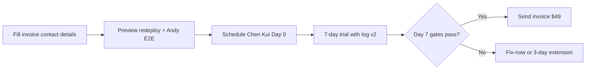

# P16-K Final Verdict

**Date:** 2026-06-01  
**Sprint:** P16-K — Commercial Pack  
**Constraint:** Commercial only. No product features. No deploy. No P17.

---

## Deliverables completed

| # | Artifact | Path |
|---|----------|------|
| 1 | Payment readiness audit | `P16K_PAYMENT_READINESS_AUDIT.md` |
| 2 | Broker one-pager v2 | `BROKER_ONE_PAGER_V2.md` |
| 3 | Pilot terms v1 | `trial/PILOT_TERMS_V1.md` |
| 4 | Invoice $49 | `trial/INVOICE_TEMPLATE_49.md` |
| 5 | Invoice $99 | `trial/INVOICE_TEMPLATE_99.md` |
| 6 | Observation log v2 | `trial/TRIAL_OBSERVATION_LOG_V2.md` |
| 7 | Chen Kui Day 0 script | `trial/CHEN_KUI_DAY0_SCRIPT.md` |
| 8 | Day 7 payment checklist | `trial/DAY7_PAYMENT_CHECKLIST.md` |
| 9 | First payment forecast | `FIRST_PAYMENT_FORECAST.md` |
| 10 | Commercial scorecard | `P16K_COMMERCIAL_SCORECARD.md` |

---

## Four questions

### 1. Can Andy ask for money today?

**No — not confidently.**

He can **describe** $49/$99 with a one-pager, terms, and invoice template. He **cannot** ask with confidence because:
- Zero trial proof (no minutes saved on Chen Kui's real cases)
- Preview URL has SSO; Production not promoted to Sprint A
- Andy has not logged authenticated Preview E2E

**He can ask after Day 7 if behavioral gates pass.**

---

### 2. What is still missing?

| # | Gap | Owner | Blocks |
|---|-----|-------|--------|
| 1 | Supervised Chen Kui 7-day trial | Founder | First payment |
| 2 | Preview redeploy + Andy E2E log | Eng/Founder | Broker-stable URL |
| 3 | ≥1 "worked" line with minutes saved | Broker + founder | $49 ask |
| 4 | Fill invoice payment details (Zelle/Venmo/WeChat IDs) | Andy | Sending invoice |
| 5 | Production promote (post Preview sign-off) | Eng | Long-term URL |

**Not missing (closed by P16-K):** pricing, terms, invoice structure, Day 0/7 scripts, observation log fields.

---

### 3. What is the smallest path to first invoice?

**Minimum steps:**
1. Andy fills `[Andy Zelle/Venmo/WeChat]` in invoice templates  
2. Preview redeploy from Sprint A + Andy 15-min E2E log  
3. Supervised Day 0 per `CHEN_KUI_DAY0_SCRIPT.md`  
4. 7 days with `TRIAL_OBSERVATION_LOG_V2.md`  
5. Day 7 per `DAY7_PAYMENT_CHECKLIST.md` → invoice $49 if gates pass  

**Expected timeline:** 10–14 days from Day 0 scheduling to first invoice.

---

### 4. Should P16-L start?

**Yes — P16-L = Deploy + Trial Execution** (not P17 product work).

| P16-L scope | Rationale |
|-------------|-----------|
| Preview redeploy + env persist | Broker-stable URL |
| Andy authenticated E2E log | Founder confidence gate |
| Schedule + run Chen Kui Day 0 | Proof collection |
| Link v2 docs from `TRIAL_ONE_PATH.md` | Operational wiring |

**Do NOT start P17** (new features). P16-L is the natural next step after P16-K.

---

## Score summary

| Metric | Value |
|--------|-------|
| Commercial score | **75 / 100** |
| Cap 6 (Trial Conversion) | **68 / 100** (was 45) |
| Payment readiness | **58 / 100** |
| $49 probability (today) | **12%** |
| $49 probability (after Day 7, if gates pass) | **45%** |
| $99 probability (today) | **5%** |
| $99 probability (after Day 7, if gates pass) | **20%** |

---

## Top blockers (ranked)

1. No 7-day trial with observation log v2  
2. No broker-stable URL (Preview SSO / Production frozen)  
3. No minutes-saved proof on real cases  
4. Andy Preview E2E not logged  
5. Invoice payment details not filled in  

---

## Recommended next sprint

**P16-L — Deploy + Supervised Trial**

Not P17. Not repo cleanup. Not new features.

---

## One-line verdict

**Can Andy confidently ask Chen Kui for money after a 7-day trial?**

**Not yet today — but yes, conditionally, if Day 0–7 runs with stable URL, ≥3 real cases, ≥2 draft copies, and ≥1 logged "worked" line with minutes saved; lead with $49, not $99.**

---

*End of P16-K Final Verdict*
