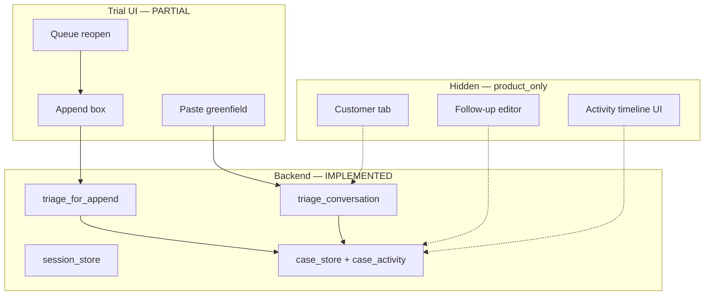

# P16-Z0 Multi-Turn Archaeology

**Date:** 2026-06-01  
**Sprint:** P16-Z0 — Phase 2  
**Search terms:** append, follow_up, followup, reopen, timeline, case history, conversation history  
**Evidence:** `services/fiqa_api/inbox_triage/`, `ui/src/features/intake/`, `scripts/`, `docs/product_constitution/P16X_*`, `P16Y_*`

---

## Executive answers

| # | Question | Answer |
|---|----------|--------|
| 1 | What was previously implemented? | Full backend multi-turn: `conversation_turns`, append API, boundary detection, session store, activity timeline, follow-up PATCH |
| 2 | What still exists? | All backend paths + broker reopen/append UI + customer chat (dev mode) + guardrail batteries |
| 3 | What is hidden by UI simplification? | Customer tab, append discoverability, follow-up editor, notes, activity timeline, `case_messages` rendering |
| 4 | What is broken? | Deployed **continuity UX** (41/100); append summary merge; top-paste duplicate-case risk; trial URL blocks customer path |

---

## 1. What was previously implemented?

### Backend (complete stack)

| Feature | Location | Notes |
|---------|----------|-------|
| Multi-turn triage | `triage.py` — `triage_conversation()` | Accepts `conversation_turns`, merges labeled thread |
| Follow-up typing | `triage.py` — `_derive_follow_up_type()`, `FOLLOW_UP_TYPES` | Classifies follow-up semantics |
| Append re-triage | `triage.py` — `triage_for_append()` | Sets `triage_mode: "append"` |
| Append boundary | `triage.py` — `_classify_append_case_boundary()` | `new_issue`, `requires_new_case` blocks |
| Persist append | `case_store.py` — `append_follow_up_message()` | Stores `case_messages`, updates case |
| Activity timeline | `service_record_repository.py` — `case_activity` | From state history rows |
| Case read/reopen | `case_truth_repository.py` — `get_case_for_read()` | Queue → detail |
| In-progress session | `session_store.py` | Mid-flow restore |
| OCR on append | `triage.py` — `v6_ocr_signals` | Supplemental on follow-up |

**Routes** (`routes/inbox_triage.py`):

- `POST /api/inbox/triage` — greenfield + `conversation_turns`
- `POST /api/inbox/cases/{case_id}/append-message`
- `PATCH /api/inbox/cases/{case_id}/follow-up`
- `GET /api/inbox/cases`, `GET /api/inbox/cases/{case_id}`
- `GET /api/inbox/session/{session_id}`

### UI (full dev mode)

| Feature | Location |
|---------|----------|
| Customer multi-turn chat | `CustomerEntryTab.tsx` — `submitMessage()`, session restore, `appendFollowUpMessage()` |
| Broker reopen + append | `BrokerWorkbenchTab.tsx` — `caseView: 'new' \| 'reopened'`, `handleAppendMessage()` |
| API client | `inboxTriage.ts` — `appendFollowUpMessage()`, `updateSavedCaseFollowUp()`, `getInProgressSession()` |
| My Requests / case list | `MyRequestsTab.tsx`, `UserCaseListProgressPanel.tsx` |

### Test & guardrail harness

| Asset | Purpose |
|-------|---------|
| `scripts/run_multi_turn_simulations.py` | Customer entry multi-turn |
| `configs/customer_entry_multi_turn_simulations.json` | Scenario pack |
| `scripts/run_follow_up_append_simulations.py` | Broker paste into existing case |
| `scripts/run_append_boundary_ab_scenarios.py` | Same vs new issue |
| `configs/case_boundary_append_scenarios.json` | Boundary cases |
| `scripts/run_cross_client_ab_scenarios.py` | `triage_for_append` cross-client |
| `scripts/run_p16y_case_battery.py` | Y41–Y45 `multi_turn: true` |
| `tests/test_case_routing.py`, `test_new_issue_append_enforcement.py` | API enforcement |
| `guardrail_inbox_triage.sh` | Orchestrates batteries (steps incl. `[5]`, `[7c]`) |

### Documented sprints

- **P16-Y:** Multi-turn scoring in 50-case battery; Y44/Y45 gaps documented
- **P16-X:** Conversation continuity audit — backend yes, UI no
- **P16-O/N:** Customer post-handoff append collapse, dual CTAs
- Archive: `BINDING_SESSION_CONTINUITY_PER_OFFICE_SPRINT.md`

---

## 2. What still exists today?

Everything in §1 **backend and scripts** remains in the repo and passes local guardrails. Broker trial path:

```
Paste → triage → copy draft → [exit to WeChat]
                      ↓
Optional: queue → reopen case → append box → updated draft ✅
```

Append **works** when user discovers queue reopen. Default exit does not teach this loop (`P16X_CONVERSATION_AUDIT.md`).

---

## 3. What is hidden by UI simplification?

### `product_only` / `UNIFIED_INTAKE_PRODUCT_ONLY=1`

| Hidden surface | Evidence |
|----------------|----------|
| Entire **Customer** tab | `UnifiedIntakePage.tsx` — `showSimulationTab`, customer routes |
| **Simulation** tab (Role C replay) | Same flag |
| **My Requests** tab | Trial single-tab broker |
| Follow-up **editor** (`waiting_on`, `next_contact_by`) | `BrokerWorkbenchTab.tsx` ~2349 — `!productOnlyUi` |
| Case **notes** + full **activity timeline** | ~2471 — `!productOnlyUi` |
| Debug signals / workbench ops | `hasDebugSignals && !productOnlyUi` |
| Dev-only duplicate append card | ~2318 vs trial card ~1542 |

### Data present but not shown

| Field / feature | Backend | UI trial |
|-----------------|---------|----------|
| `case_messages` thread | Stored on append | UI shows `source_text` mainly |
| `getRecentCustomerMessages()` | Helper in `intakePure.ts` | **Imported unused** in workbench |
| Session ID | API | Invisible — no cross-device resume UX |
| `waiting_on` | In triage result | Not prominent in glance |

### P16-M backlog (not implemented)

- #28: Append follow-up promoted in glance when reopened
- #11: Collapse paste when case open → "整理新消息" link

---

## 4. What is broken?

### Deployed / trial UX (P16-X)

| Break | Severity | Who |
|-------|----------|-----|
| No post-copy "when customer replies…" bridge | **P0** | Broker, assistant |
| Append only when `caseView === 'reopened'` | **P0** | Everyone |
| Top paste after triage → risk **duplicate case** | **P0** | Assistant |
| Customer continuity on trial URL | N/A | Tab hidden |
| Continuity score | **41/100** | Deployed Preview |

### Engine gaps (P16-Y — not UI)

| Gap | Case | Severity |
|-----|------|----------|
| Multi-turn **summary merge** — prior `[客户]` bubbles dropped | Y44 | **P0** |
| Premium thread fields not in `collected` | Y45 | P1 |
| Append architecture explicitly **out of scope** P16-Y | — | Deferred |

### Infra blockers (not multi-turn code)

- Preview SSO (FP-004) — blocks Day 0, not append API itself
- P16-W `getCompactQueuePreview` — fixed in code; needs redeploy

---

## Architecture diagram (current state)



---

## Naming collisions (avoid reinventing)

| Term A | Term B | Relationship |
|--------|--------|--------------|
| `triage_mode: append` | Append summary merge | Backend mode ≠ summary merge feature |
| `underwriting_followup` | `follow_up` flags | Category vs generic |
| Multi-turn battery PASS | Multi-turn deploy UX | Engine tests pass; P16-X UX fails |
| Role C (cold user) | Role C (office assistant in P16-L) | **Same letter, different persona** |

---

## Revival vs rebuild recommendation

| Item | Action |
|------|--------|
| `triage_for_append` + routes | **Do not rebuild** — use existing API |
| Broker append UX | **Revive** — P16-M #28, post-copy CTA (copy-only sprint) |
| Append summary merge | **Extend** `conversation_summary` in `triage.py` — P16-Y #1 |
| Customer tab on trial | **Defer** until Cap 4 deploy score justifies |
| New "conversation service" | **Do not build** — duplicate of case_store + triage |

---

## Evidence index

| Artifact | Path |
|----------|------|
| Conversation audit | `P16X_CONVERSATION_AUDIT.md` |
| P16-Y final verdict | `P16Y_FINAL_VERDICT.md` |
| Customer journey | `P16N_CUSTOMER_JOURNEY_MAP.md` |
| Core triage | `services/fiqa_api/inbox_triage/triage.py` |
| Broker UI | `ui/src/features/intake/components/BrokerWorkbenchTab.tsx` |

---

*End of P16-Z0 Multi-Turn Archaeology*
