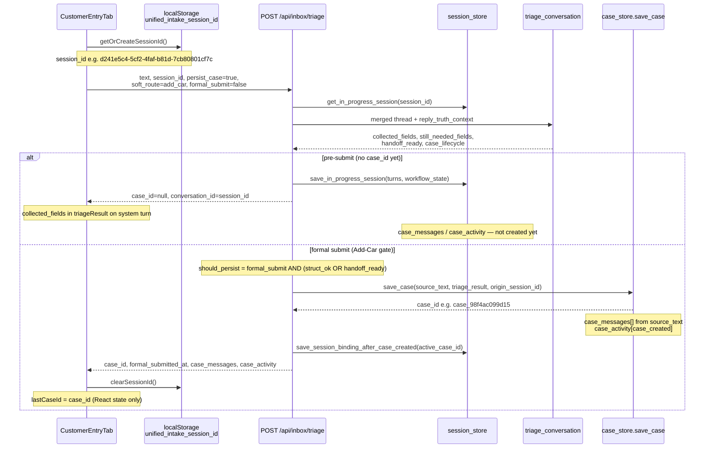

# P16-Z17 Phase 1 — Customer Journey Trace

**Date:** 2026-06-03  
**Sprint:** P16-Z17 Customer Case Builder Reality Sprint  
**Method:** Code trace + live API on `http://127.0.0.1:8001`  
**Constraint:** No redesign — document what exists

---

## North star path

```
CustomerEntryTab → triage → formal_submit → save_case → case_id
```

This path is **real and wired**. Add-Car is the mature lane. Generic intake can persist on `handoff_ready` without `formal_submit`.

---

## Component map

| Layer | Location | Role |
|-------|----------|------|
| UI tab | `ui/src/features/intake/components/CustomerEntryTab.tsx` | Customer-facing case builder (客户报送) |
| API client | `ui/src/api/inboxTriage.ts` | `triageMessage`, `getInProgressSession`, `appendFollowUpMessage` |
| Route | `services/fiqa_api/routes/inbox_triage.py` | `POST /api/inbox/triage`, persist gate |
| Triage engine | `services/fiqa_api/inbox_triage/triage.py` | `triage_conversation()` |
| Case store | `services/fiqa_api/inbox_triage/case_store.py` | `save_case()`, `append_follow_up_message()` |
| Session store | `services/fiqa_api/inbox_triage/session_store.py` | Pre-submit continuity |

---

## Sequence diagram



---

## Turn-by-turn: Tesla Add-Car (live evidence)

### Turn 1 — Customer: "I bought a Tesla."

| Field | Value |
|-------|-------|
| **session_id** | `d241e5c4-5cf2-4faf-b81d-7cb80801cf7c` (client UUID → localStorage) |
| **case_id** | `null` |
| **conversation_id** | Same as session_id (pre-submit alias) |
| **collected_fields** | `['make_model', 'insurance_status_new_customer']` |
| **still_needed_fields** | `['year', 'make_model', 'vin', 'zip', 'delivery_date', 'primary_driver']` |
| **case_messages** | — (not in case store) |
| **case_activity** | — (not in case store) |
| **Persistence** | `save_in_progress_session()` — 2 turns restored on `GET /api/inbox/session/{id}` |

### Turns 2–4 — Fill slots + OK confirmation

Customer must reach `quote_ready` then confirm (`OK`) to get `case_lifecycle: ready_for_handoff`. Live server requires **VIN** in thread before `handoff_ready` becomes true (`add_car_enough_for_handoff` requires vin + zip + delivery + driver).

### Formal submit — `formal_submit: true`

| Field | Value (live run `case_98f4ac099d15`) |
|-------|----------------------------------------|
| **case_id** | `case_98f4ac099d15` (created in `save_case()`) |
| **formal_submitted_at** | `2026-06-03T08:58:13Z` (immutable) |
| **collected_fields** | `year, make_model, vin, zip, delivery_date, primary_driver, insurance_status_add_to_existing` |
| **still_needed_fields** | `[]` |
| **case_messages** | 7 entries (sequences 1–7) |
| **case_activity** | `[{ activity_type: "case_created", ... }]` |
| **lifecycle_status** | `handed_off` |

**Persist gate (Add-Car):**

```python
# routes/inbox_triage.py
should_persist = formal_submit and (struct_ok or handoff_ready)
```

Partial submit without VIN → **blocked** (live: `case_id: null`).

---

## Post-handoff append path

```
CustomerEntryTab.handlePostHandoffAppendSameCase()
  → appendFollowUpMessage(case_id, text)
  → POST /api/inbox/cases/{case_id}/append-message
  → triage_for_append() + append_follow_up_message()
  → case_messages[] extended, case_activity[follow_up_added|conversation_appended]
  → formal_submitted_at unchanged
```

---

## session_id vs case_id

| ID | When | Storage | Cleared when |
|----|------|---------|--------------|
| **session_id** | Pre-submit multi-turn | `localStorage` + Postgres `intake_sessions` | UI calls `clearSessionId()` on case creation |
| **case_id** | After formal persist | JSON + optional Postgres | Never — stable office record |

After formal submit, customer continuity must use **case_id** (My Requests, append API, broker workbench). Session thread is trimmed; `active_case_id` may remain on server session row.

---

## Data structures

### collected_fields

- Type: `string[]` slot IDs (`year`, `make_model`, `vin`, `zip`, `primary_driver`, …)
- Source: `triage_conversation()` extraction
- On case: copied at `save_case`, merged on append

### case_messages

```typescript
{ message_id, role: 'customer' | 'system', text, created_at, sequence }
```

- Created at persist from labeled `source_text`
- Append adds customer + system rows with incrementing `sequence`

### case_activity

```typescript
{ activity_id, activity_type, message, created_at }
```

- Types observed live: `case_created`, `follow_up_added`, `conversation_appended`
- Broker dev UI shows full audit; trial shows latest activity badges

---

## API reference

| Method | Path | Purpose |
|--------|------|---------|
| POST | `/api/inbox/triage` | Multi-turn triage + optional persist |
| GET | `/api/inbox/session/{session_id}` | Restore pre-submit session |
| GET | `/api/inbox/cases` | List cases (My Requests, broker queue) |
| GET | `/api/inbox/cases/{case_id}` | Full case + timeline |
| POST | `/api/inbox/cases/{case_id}/append-message` | Post-handoff customer append |

---

## Verdict (Phase 1)

The journey **CustomerEntryTab → triage → formal_submit → save_case → case_id** is implemented and proven on live server. Pre-submit state lives in **session_id** + session store; post-submit state lives in **case_id** + case store. `case_messages` and `case_activity` begin at persist, not at first customer message.
