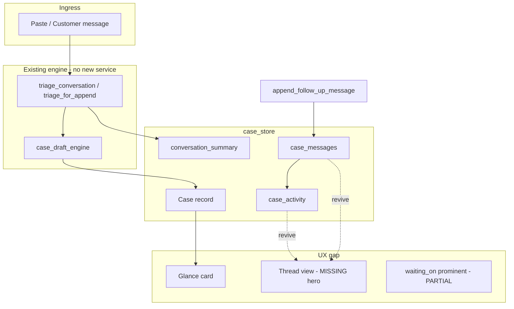

# P16-Z4 Phase 2 — Timeline Architecture Review

**Date:** 2026-06-02  
**Sprint:** P16-Z4 Case Continuity Sprint  
**Rule:** Do NOT invent new services — extend existing `case_store`, `triage.py`, `BrokerWorkbenchTab`

---

## What already exists?

### Data model (authoritative)

```
Case
├── case_id, created_at, updated_at, formal_submitted_at
├── source_text                    # flattened thread (rebuilt on append)
├── case_messages[]                # sequenced {role, text, created_at, sequence}
├── case_activity[]                # {activity_type, message, created_at}
├── conversation_summary           # intent + collected/still hints + latest snip
├── case_notes[]                   # broker freeform
├── waiting_on, next_contact_by    # follow-up timing layer
└── lifecycle_status               # handed_off | office_followup | ...
```

### Write paths

| Event | Timeline mutation |
|-------|-------------------|
| `save_case` | Seeds `case_messages` from source; `case_activity: case_created` |
| `append_follow_up_message` | Appends customer + optional system message; `follow_up_added` activity |
| `update_case_follow_up` | `follow_up_updated` activity |
| `add_case_note` | `note_added` activity |
| `add_attachment_to_case` | Attachment metadata + activity |

### Read paths

| Consumer | What it shows |
|----------|---------------|
| Broker queue | `getCaseTrackingSummary`, preview of `broker_next_step` |
| Broker detail | `case_activity` collapse; append box; partial `follow_up_added` badge |
| Customer progress | `UserCaseListProgressPanel` — chips, not full thread |
| API GET case | Full bundle including `case_messages` |

### Engine support

- `_build_conversation_summary()` — builds intent line + collected/still + latest snippet
- Add-car `timeline_question` intent — lane-specific follow-up copy, not generic office timeline
- P16-X score: **Timeline UX 41/100** — backend strong, product weak

---

## What is missing?

| Missing piece | Layer | Notes |
|---------------|-------|-------|
| **Visual message thread** | UX | `case_messages` stored but not rendered as Zendesk-style timeline |
| **Post-copy “waiting” state** | UX | No default `waiting_on: client` after copy |
| **Deadline widget** | UX | Deadlines in prose/summary, not glance countdown |
| **Activity as primary panel** | UX | Buried in collapse — not “office assistant thread” |
| **Prior-turn summary merge** | Engine | Y44: correction drops prior facts in summary |
| **Return trigger** | Product | No badge/email/“客户 replied” (out of sprint scope) |
| **Monday queue: “updated today”** | UX | Activity exists; sort/filter not promoted product_only |

---

## What can be revived? (no new services)

| Asset | Revival action |
|-------|----------------|
| `case_messages` rendering | Promote existing array to simple vertical thread in glance |
| `case_activity` panel | Default-open after append; move above fold |
| `getLatestUpdateForDisplay()` | Queue row subtitle — already coded |
| `follow_up_added` badge | Already in `BrokerWorkbenchTab` — show on queue card |
| Config-driven activity copy | `config_loader.py` workbench activity strings |
| `run_follow_up_append_simulations.py` | CI gate before deploy |
| P16-M #28 “Append promoted in glance when reopened” | Layout-only |
| P16-X #1 post-copy continuation line | Copy-only |

---

## Architecture diagram (current vs target)



---

## TOP 10 timeline improvements

| # | Improvement | Effort | Service |
|---|-------------|--------|---------|
| 1 | Post-copy line: 客户回复后 → 队列点开 → 追加 | 15 min | Copy |
| 2 | Render `case_messages` as 3–5 line thread in glance | 0.5 day | UI only |
| 3 | Default-open 操作记录 after append | 2 hr | UI |
| 4 | Queue row: `getLatestUpdateForDisplay` subtitle | 2 hr | Wire existing |
| 5 | Auto-set `waiting_on: client` prompt after copy (optional save) | 0.5 day | UI + existing PATCH |
| 6 | P16-Y P0: prior bubble in `conversation_summary` on append | 1–2 days | `triage.py` tune |
| 7 | Show `formal_submitted_at` vs `updated_at` in glance | 2 hr | UI |
| 8 | Highlight `follow_up_added` on queue card | 2 hr | UI |
| 9 | Collapse top paste when case open (P16-M #11) | 0.5 day | UI |
| 10 | Guardrail step: append simulation mandatory pre-trial | 1 hr | Process |

---

*End of P16-Z4 Phase 2*
