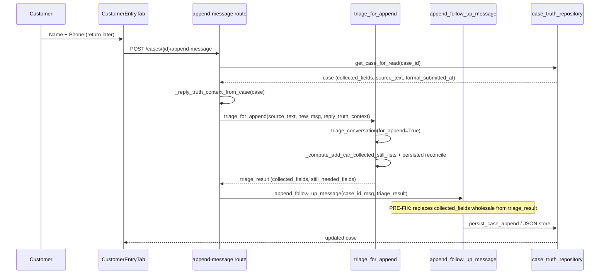

# P16 Append Integrity — Preflight

**Date:** 2026-06-06  
**Sprint:** P16-APPEND-INTEGRITY-SPRINT — Phase 0  
**Purpose:** Preserve repo state before append-integrity fix. No runtime changes in this phase.

---

## Git preservation

| Field | Value |
|-------|-------|
| **HEAD SHA** | `b3c8ec369fa9f9232e3f663be23cd4f093c985d3` |
| **Active branch** | `sprint-a/broker-front-door` |
| **main SHA** | `31572ca50376e514cff9d31272e09da0e10268f4` |
| **Release branch** (`archive/production-pre-p16-demo`) | `85bacc639f174e0680d11d8486aa86b53ffa6986` |
| **Tag** (`p16-demo-ready-v1`) | `5a2ab39df4d0d01256e4a1f8070be4b47f8c0501` |

---

## Affected files (append path)

| Layer | Path | Role |
|-------|------|------|
| API route | `services/fiqa_api/routes/inbox_triage.py` | `POST /api/inbox/cases/{case_id}/append-message`; builds `reply_truth_context` |
| Triage engine | `services/fiqa_api/inbox_triage/triage.py` | `triage_for_append()`, `_compute_add_car_collected_still_lists()`, `_merge_persisted_collected()` |
| Case persistence | `services/fiqa_api/inbox_triage/case_store.py` | `append_follow_up_message()` — **overwrite site** |
| Truth reads | `services/fiqa_api/inbox_triage/case_truth_repository.py` | `get_case_for_read()` hydration |
| DB mirror | `services/fiqa_api/db/service_record_repository.py` | `persist_case_append()`, `load_full_case_from_postgres()` |
| Contact extract | `services/fiqa_api/inbox_triage/triage.py` | `_extract_contact_fields()` |
| UI client | `ui/src/api/inboxTriage.ts` | `appendFollowUpMessage()` |
| UI surface | `ui/src/features/intake/components/CustomerEntryTab.tsx` | Post-handoff append panel |

---

## Current append flow (pre-fix)

---

## Known defect (audit summary)

AC05 formal submit → customer returns later → append name/phone → `delivery_date` can disappear from `collected_fields` and reappear in `still_needed_fields` → `office_broker_next_step` regresses to ask for delivery again.

---

*Phase 0 complete. Proceed to reproduce → root cause → fix.*
