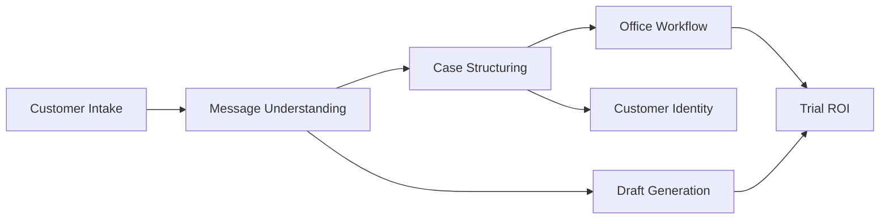

# Proposed Capability Map — P14-A

**Date:** 2026-05-31  
**Model:** 7 capabilities mapped from mission brief to discovered repo evidence.  
**Maturity scale:** Missing → Partial → Defined → Shipped → Trial-ready

---

## Capability Overview

| # | Capability | Maturity | Trial-ready? |
|---|------------|----------|--------------|
| 1 | Customer Intake | **Shipped** (split surfaces) | Conditional |
| 2 | Message Understanding | **Trial-ready** | Yes |
| 3 | Case Structuring | **Trial-ready** | Yes |
| 4 | Office Workflow | **Partial** | Conditional |
| 5 | Draft Generation | **Trial-ready** | Yes |
| 6 | Customer Identity | **Partial** | N/A v1 |
| 7 | Trial ROI | **Partial** | No (measurement gap) |

---

## 1. Customer Intake

**Purpose:** Accept messy inbound information from broker or customer into the system.

| Dimension | Definition |
|-----------|------------|
| **Inputs** | Pasted text (WeChat, email body, notice text, OCR text broker pasted externally); optional short broker context |
| **Outputs** | Triage request → structured case; session/case ID for continuity |
| **Success criteria** | Raw paste without cleanup; case appears in workbench; guardrail scenarios PASS |
| **Business value** | Single entry point; no new inbox tool required |
| **Current maturity** | **Shipped** — two surfaces: Broker Workbench paste (primary GTM) + Customer Entry tab (Add-Car portal) |
| **Current gaps** | Wrong default tab (Customer Entry); Add-Car-first UI vs cancellation-first trial; no WeChat sync (by design) |

**Evidence:** `UNIFIED_INTAKE_MVP_MASTER_GOAL.md` §10; `CURRENT_PRODUCT_TRUTH.md` §1; P10 friction audit #1, #7.

---

## 2. Message Understanding

**Purpose:** Classify intent, urgency, and extract structured facts from unstructured text.

| Dimension | Definition |
|-----------|------------|
| **Inputs** | Raw message text; optional conversation context on reopen |
| **Outputs** | `issue_category`, `urgency`, `manual_followup_needed`, extracted fields for Collected/Still needed |
| **Success criteria** | 6-field output per `BROKER_INBOX_TRIAGE_STANDARD.md`; guardrail 13/13; scenario pack categories match |
| **Business value** | Surfaces cancellation risk; stops broker re-reading entire thread |
| **Current maturity** | **Trial-ready** — `services/fiqa_api/inbox_triage/triage.py`, guardrail scripts |
| **Current gaps** | Mixed-language edge cases; draft quality variance on real messages; engineer category names vs Case focus labels |

**Evidence:** `standards/BROKER_INBOX_TRIAGE_STANDARD.md`; P11 "triage engine is trial-ready"; configs/inbox_triage_scenarios.json.

---

## 3. Case Structuring

**Purpose:** Persist and present one structured service record the office can act on.

| Dimension | Definition |
|-----------|------------|
| **Inputs** | Triage output; broker notes; follow-up messages |
| **Outputs** | Case card: Case focus, Your next move, Collected, Still needed, urgency, queue placement (Work now / Waiting) |
| **Success criteria** | `UNIFIED_INTAKE_MVP_STANDARD.md` workbench standard; case persists in Postgres (prod); reopen retains context |
| **Business value** | "What is this about?" answered in one view; insurance-specific structure vs generic AI |
| **Current maturity** | **Trial-ready** — workbench UI + PG-backed cases when configured |
| **Current gaps** | Local JSON demo loses trust; PG 镜像 engineer labels visible; case count drift in docs |

**Evidence:** `STANDARD_SCENARIO_PACKAGE.md` §6; P11 competitive audit #6 "insurance-specific case structure".

---

## 4. Office Workflow

**Purpose:** Queue, prioritize, and continue cases across the broker office workday.

| Dimension | Definition |
|-----------|------------|
| **Inputs** | Structured cases; broker status updates; follow-up pastes |
| **Outputs** | Prioritized queue; waiting_on / next_contact_by; notes/activity; reopen context |
| **Success criteria** | Same-day action cases surface first; broker names Monday-morning scenario by Day 7 |
| **Business value** | Nothing urgent buried; follow-up continuity |
| **Current maturity** | **Partial** — workbench queue exists; trial UX and wayfinding weak |
| **Current gaps** | Too many tabs; Simulation hidden; no trial-mode single-tab; assistant adoption playbook thin; mobile UX weak |

**Evidence:** P9 outcomes #1–3; P11 TOP_30_WORKBENCH_IMPROVEMENTS; TRIAL_ONE_PATH success criteria.

---

## 5. Draft Generation

**Purpose:** Produce editable client-ready reply text broker copies to WeChat.

| Dimension | Definition |
|-----------|------------|
| **Inputs** | Case context, category, collected fields, client language |
| **Outputs** | `client_reply_draft` — professional, editable, bilingual acceptable |
| **Success criteria** | Draft rules in standards §4; broker trusts as starting point (Day 7 criterion); copied with edits ≥2 times |
| **Business value** | Less re-typing; consistent tone; faster response |
| **Current maturity** | **Trial-ready** — generated per triage; quality varies |
| **Current gaps** | Inconsistent on real messages; ChatGPT comparison; chen_kui client pack not fully loaded in UI |

**Evidence:** `BROKER_INBOX_TRIAGE_STANDARD.md` §4; P11 blocker #4; P10 discovery #12.

---

## 6. Customer Identity

**Purpose:** Know who the customer is and link messages to the same case over time.

| Dimension | Definition |
|-----------|------------|
| **Inputs** | Session ID; optional name/phone; broker-pasted reference |
| **Outputs** | Case continuity; light identity signals for handoff |
| **Success criteria** | Reopen case + paste follow-up updates same record (master outline §2A formal submit model — partial) |
| **Business value** | Follow-up without starting over |
| **Current maturity** | **Partial** — session/case IDs exist; full identity model in master outline only |
| **Current gaps** | MVP goal explicitly defers customer linking v1; master outline describes Stage 1 identity — unresolved in SSOT; no CRM profile |

**Evidence:** `UNIFIED_INTAKE_MVP_MASTER_GOAL.md` §4 "Customer identification: Not in v1"; master outline §2A; CONFLICT C-P1-2.

**Constitution proposal:** v1 = **case/session continuity only**, not CRM identity.

---

## 7. Trial ROI

**Purpose:** Prove time saved during 7-day trial to justify $49–99/month payment.

| Dimension | Definition |
|-----------|------------|
| **Inputs** | Observation log; Day 7 value questions; behavioral signals (opens, draft copies) |
| **Outputs** | "Worked" lines; payment decision; fix-now queue |
| **Success criteria** | TRIAL_ONE_PATH § Success criteria; P11 blockers § "What's missing before payment" |
| **Business value** | Converts trial to paid pilot; feeds second-broker testimonial |
| **Current maturity** | **Partial** — trial process defined; quantitative ROI template weak |
| **Current gaps** | No standard "minutes saved" field; pricing not on one-pager; no invoice/terms template in repo; Day 1 unsupervised fails |

**Evidence:** `trial/TRIAL_OBSERVATION_LOG_TEMPLATE.md`; P11 TOP_20_BLOCKERS #1; P11 payment tier table.

---

## Capability Dependency Graph

---

## 90-Day Capability Evolution Rules (Discovered)

From P11 WHAT_NOT_TO_DO and FOUNDER_REFLECTION:

1. **No new capabilities** until Trial ROI produces one paid pilot or explicit kill decision
2. **Office Workflow** fixes only (tab default, chrome, inline scenarios) — no new tabs
3. **Customer Identity** stays light — no CRM build
4. **Customer Intake** — align story to broker paste path; defer portal-led GTM
5. **Message Understanding / Case Structuring / Draft Generation** — fix-now from trial log only, not feature expansion

---

*End of proposed capability map*
