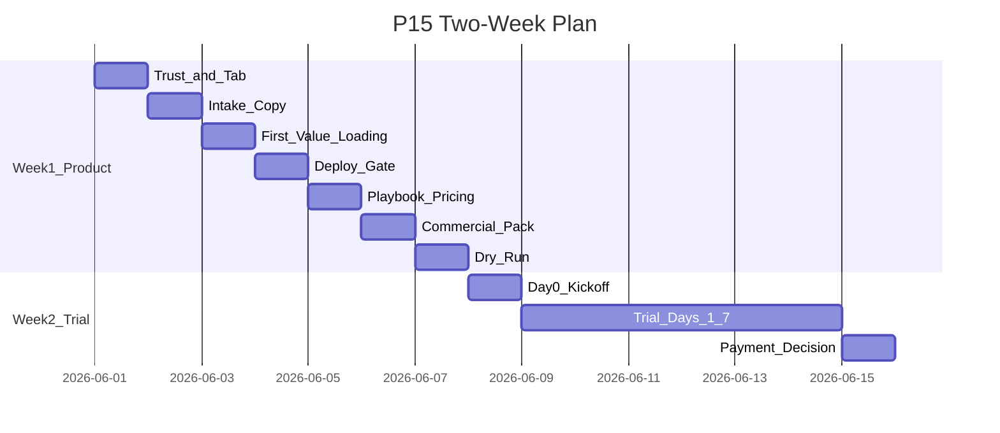

# Two Week Execution Plan — P15

**Version:** P15  
**Date:** 2026-05-31  
**North star:** Move product 60 → 80; Chen Kui supervised trial → first $49–$99 payment decision.  
**Rule:** Constitution execution only — no Stripe, sync, CRM, OAuth, OCR, platform work.

---

## Week 1 — Ship Front Door + Commercial Gates

### Day 1 — Trust + Default Tab

| Deliverable | Capability | Tasks |
|-------------|------------|-------|
| Default 办公室工作台 tab | 1 | A1, A2 |
| Hide engineer chrome (PG, API, 路由/指标) | 1 | A3, A4, A5 |
| Broker wayfinding banner | 1 | A6 |

**Exit:** Founder opens trial URL → lands on workbench → no engineer labels visible.

---

### Day 2 — Intake Expectations

| Deliverable | Capability | Tasks |
|-------------|------------|-------|
| Paste expectation copy | 4 | A10 |
| Manual-paste anti-sync messaging | 4 | (copy in banner + paste area) |
| Begin pilot intro collapse / cancellation-first copy | 1, 4 | A11 (draft) |

**Exit:** Paste area sets workflow expectation without founder explanation.

---

### Day 3 — First Value + Loading

| Deliverable | Capability | Tasks |
|-------------|------------|-------|
| Demo queue progress indicator | 1 | A8 |
| Auto-open cancellation after demo queue | 1 | A7 |
| First-request loading: "首次分析约30秒" | 2, 4 | A9 |
| Graceful warming message (if time) | 2, 7 | D1 partial |

**Exit:** Founder loads demo queue → sees progress → cancellation case open → urgency obvious.

---

### Day 4 — Deploy + Operator Gate

| Deliverable | Capability | Tasks |
|-------------|------------|-------|
| `validate_pilot_deploy_env.py` PASS | 7 | O2 |
| Deploy paid pilot + `/readyz` green | 7, 3 | O3 |
| Formal broker UX launch checklist | 7 | O1 |
| Simplify queue filters (product_only) | 5 | A14 |

**Exit:** Two-gate ready: script PASS + UX checklist draft filled.

---

### Day 5 — Playbook Parity + Pricing

| Deliverable | Capability | Tasks |
|-------------|------------|-------|
| Inline 3 practice scenarios (MVP) | 1 | A12 |
| Update playbook — no Simulation | 6, 7 | B5, O5 |
| $49/$99 on BROKER_ONE_PAGER | 6 | B1 |
| Observation log minutes field | 6 | B4 |

**Exit:** Playbook runnable on prod UI without Simulation tab.

---

### Day 6 — Commercial Pack

| Deliverable | Capability | Tasks |
|-------------|------------|-------|
| 1-page pilot terms (Chinese) | 6 | B2, B8 |
| Invoice template | 6 | B3 |
| L1 support + 24h SLA in terms | 7 | B9 |
| Hide 我的办理 tab (if not Day 5) | 1 | A13 |

**Exit:** Commercial artifacts ready to send with trial URL.

---

### Day 7 — Founder Dry Run

| Deliverable | Capability | Tasks |
|-------------|------------|-------|
| Full founder dry-run | 7 | O4 |
| Broker UX checklist PASS | 7 | O1 sign-off |
| Fix any P0 gaps from dry-run | 1, 7 | Triage from log |

**Exit:** Day 1 score ≥70 simulated; no founder translation required for cancellation value.

---

## Week 2 — Supervised Trial + Payment Decision

### Day 8 — Chen Kui Day 0

| Deliverable | Capability | Tasks |
|-------------|------------|-------|
| 30-min founder kickoff | 6 | B7 kickoff script |
| Send URL + one-pager + terms + playbook | 6 | All commercial |
| 15-min assistant training (if assistant present) | 5, 6 | B6 |
| Start observation log | 6 | B4 |

**Exit:** Broker opens workbench alone after call; loads demo queue; sees cancellation.

---

### Day 9 — Trial Day 1

| Deliverable | Capability | Tasks |
|-------------|------------|-------|
| Broker self-serve paste (1 real case target) | 4 | Monitor only |
| Async founder support | 7 | L1 doc |
| Log friction — no new features | 6 | Observation log |

**Exit:** ≥1 real case attempted; friction noted.

---

### Day 10 — Trial Day 2

| Deliverable | Capability | Tasks |
|-------------|------------|-------|
| 2–3 real cases cumulative target | 4, 3 | Monitor |
| Draft copy with edits ≥1 | 3, 6 | Log behavior |
| Weekly `/readyz` probe | 7 | O7 |

**Exit:** Behavioral signals accumulating.

---

### Day 11 — Trial Day 3

| Deliverable | Capability | Tasks |
|-------------|------------|-------|
| Mid-week check-in (15 min async or call) | 6 | Review log |
| Fix-now triage ONLY if P0 outage | 7 | Max 1 hotfix |

**Exit:** No feature creep; support only.

---

### Day 12 — Trial Days 4–5

| Deliverable | Capability | Tasks |
|-------------|------------|-------|
| Workbench opened ≥4 of 7 days (track) | 6 | Behavioral |
| Draft copied ≥2 cumulative | 3, 6 | Payment criterion |
| Reopen + follow-up paste (if natural) | 5 | C1 if not shipped — note friction |

**Exit:** Payment proof layers filling.

---

### Day 13 — Trial Day 6

| Deliverable | Capability | Tasks |
|-------------|------------|-------|
| Early value questions (Q1–Q3) | 6 | TRIAL_ONE_PATH |
| Prepare Day 7 conversation | 6 | B7 |

**Exit:** Founder knows likely pay / no-pay posture.

---

### Day 14 — Trial Day 7 + Payment

| Deliverable | Capability | Tasks |
|-------------|------------|-------|
| Five value questions answered | 6 | TRIAL_ONE_PATH |
| Invoice at $49 or $99 OR ranked blockers doc | 6 | B3, B7 |
| Capture testimonial quote if positive | 6 | B11 |
| Rescore capabilities from evidence | All | Update scoreboard |

**Exit:** Payment received **OR** written kill reasons with ranked fix-now (max 3).

---

## Parallel Tracks

---

## If Behind Schedule

| Cut | Keep |
|-----|------|
| A12 inline scenarios (full) | Minimal 1-scenario inline OR kickoff-only walkthrough |
| A13 hide 我的办理 | Kickoff avoids tab |
| Sprint C items | Post-trial fix-now only |
| D5 chen_kui ui_copy | Post-trial |
| D7 mobile paste | Never in 14-day minimum |

**Never cut:** A1–A6, A7–A9, O2–O4, B1–B3, Day 0 kickoff, observation log.

---

*End of Two Week Execution Plan — P15*
