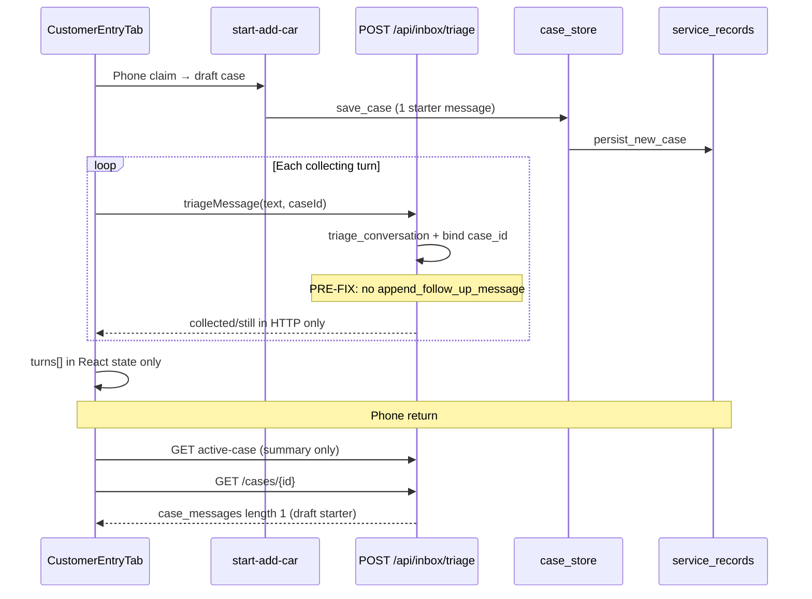

# P16 Case Memory Persistence — Root Cause

**Sprint:** P16-P2-CASE-MEMORY-PERSISTENCE-SPRINT  
**Date:** 2026-06-07

---

## Symptom

Customer First phone lookup correctly finds the active add-car case (vehicle summary, Still Needed, status). After page refresh, new browser tab, or next-day phone return, **conversation history is empty** — customer must repeat BMW / year / ZIP messages.

Status and case binding survive; **timeline does not**.

---

## Intake path traced

| Step | Component | Persistence |
|------|-----------|-------------|
| 1 | `POST /api/inbox/customer/start-add-car` | Draft case + 1 starter message in Postgres |
| 2 | `CustomerEntryTab.submitMessage` → `triageMessage(..., caseId)` | **None** (pre-fix) |
| 3 | `triage_inbox` sets `result["case_id"]` from bound case | Blocks in-progress session save |
| 4 | `save_in_progress_session` | Skipped when `result.get("case_id")` set |
| 5 | `append_follow_up_message` | Only from `POST /cases/{id}/append-message` (post-handoff) |
| 6 | Phone return → `hydrateFromSavedCase` → `customerEntryTurnsFromSavedCase` | Reads `case_messages` — nearly empty |

---

## Source of truth

| Store | Role | Collecting-phase writes (pre-fix) |
|-------|------|-----------------------------------|
| **`case_messages`** on `service_records` | **Case Memory** — customer/system turns, sequence order | Draft starter only |
| **`source_text`** | Denormalized thread from `case_messages` | Draft starter only |
| **`collected_fields` / `still_needed_fields`** | Progress truth | HTTP response only; not merged to PG |
| `in_progress_sessions` | Pre-case session fallback | Blocked when `case_id` present |
| React `turns[]` | Ephemeral UI state | All collecting turns |

**Intended source of truth:** `case_messages` + field lists on `service_records`, via `append_follow_up_message()`.

---

## Root cause (one sentence)

**Collecting-phase `/api/inbox/triage` with bound `case_id` never called `append_follow_up_message`, and in-progress session save was skipped — conversation lived only in React state.**

---

## Evidence

- Prior investigations: `P16_PHONE_RETURN_REHYDRATION_ROOT_CAUSE.md`, `P16_CUSTOMER_FIRST_CASE_REHYDRATION_INVESTIGATION.md`
- Live case after 2 triage turns: `case_messages` contained only `[客户] 开始加车申请（Customer First 入口）`
- Code: `triage_inbox` returned at ~line 1573 without store write when `existing_case` bound; session save guard `if request.session_id and not result.get("case_id")`

---

## Classification

| Layer | Verdict |
|-------|---------|
| Backend persistence | **Primary defect** |
| Frontend hydration | Correct — nothing to restore |
| active-case API | By design — summary card only pre-Continue |
| Phone lookup | Working |
