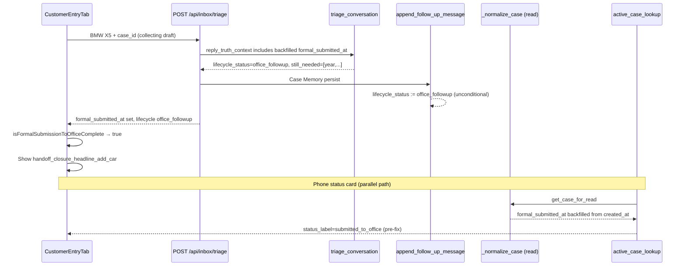

# P16 Status Truth — Root Cause

**Sprint:** P16-P3-STATUS-TRUTH-SPRINT  
**Date:** 2026-06-07  
**Verdict:** Confirmed bug — not intended design

---

## Symptom

Customer says **「我刚买了一台宝马X5」**. System reply asks for year/model (`still_needed_fields` non-empty), but the same screen shows the green post-handoff closure card:

> **本加车报价请求已提交办公室处理**

This violates Constitution alignment:

- **Progress = Missing Fields** — customer is still in collection
- **Customer Must Always Know The Status** — cannot simultaneously be “missing fields” and “submitted to office”
- **Phone Required For Formal Submit** — no formal submit occurred

---

## Trace (UI → persistence)

| Layer | Component | Role in bug |
|-------|-----------|-------------|
| UI | `CustomerEntryTab` `formalSubmissionComplete` | Uses `isFormalSubmissionToOfficeComplete(lastTriage)` → green closure card |
| UI | `handoff_closure_headline_add_car` | Copy: 「本加车报价请求已提交办公室处理」 |
| API | `_attach_case_lifecycle` | Overlays persisted `formal_submitted_at` onto triage view |
| Triage | `triage.py` ~6837–6846 | Promotes lifecycle to `office_followup` when `reply_truth_context.formal_submitted_at` present |
| Persist | `append_follow_up_message` ~1301 | **Always** set `lifecycle_status = office_followup` on collecting append |
| Read | `_normalize_case` ~332–337 | Backfills `formal_submitted_at := created_at` when empty (including collecting drafts) |
| Read | `service_record_repository` PG hydrate | Same backfill on Postgres read path |
| Status | `is_customer_formal_submitted` | Did not gate on `still_needed_fields` |

---

## Root cause (one sentence)

**Collecting-phase Case Memory append was treated as post-handoff office follow-up:** read-path backfill invented `formal_submitted_at`, append overwrote lifecycle to `office_followup`, and triage/UI formal-submit detectors trusted those signals instead of missing-field truth.

---

## Screenshot analysis

The screenshot state is **real**, not a rendering glitch:

1. Chat layer: triage correctly identifies gaps → 「请先发年份和车型」
2. Closure layer: `formalSubmissionComplete === true` because HTTP triage returned `lifecycle_status: office_followup` (and/or `formal_submitted_at`)
3. Status card (phone return): `status_label: submitted_to_office` while `still_needed_fields` listed (pre-fix)

Two UI surfaces read the same underlying lie from persisted + HTTP lifecycle.

---

## Fix applied (minimal)

| File | Change |
|------|--------|
| `case_store.py` `_normalize_case` | Do not backfill `formal_submitted_at` when lifecycle is `collecting` or `handoff_pending` |
| `case_store.py` `append_follow_up_message` | Preserve `collecting` / triage lifecycle; only force `office_followup` after real formal submit |
| `service_record_repository.py` | Same backfill guard on Postgres hydrate |
| `triage.py` | Do not promote to `office_followup` when persisted lifecycle is still collecting |
| `active_case_lookup.py` `is_customer_formal_submitted` | Return false when `still_needed_fields` non-empty |
| `AddCarRecordSummaryRail.tsx` | `isFormalSubmissionToOfficeComplete` returns false when gaps remain |

---

## Classification

| Question | Answer |
|----------|--------|
| Intended design? | **No** — collecting draft ≠ submitted to office |
| Can case be submitted while gaps remain? | **No** (after fix); pre-fix **yes** via lifecycle corruption |
| Screenshot real bug? | **Yes** |
